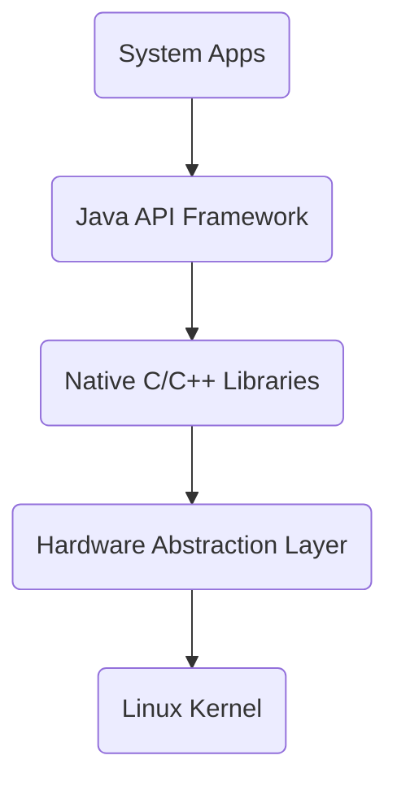

# Android

[TOC]

## 1. Android概述

### 1.1 Android体系架构

**Linux 内核**

`Android`平台的基础是`Linux`内核。例如，`Android Runtime(ART)`依靠`Linux`内核来执行底层功能呢，例如线程和底层内存管理。使用`Linux`内核可让`Android`利用主要安全功能，并且允许设备制造商为注明的内核开发硬件驱动程序

**HAL 硬件抽象层**

`Android`的`HAL`硬件抽象层是以封闭源码形式提供硬件驱动模块。`HAL`的目的是为了把`Android framework`与`Linux Kernel`隔开，让`Android`不至于过度依赖`Linux Kernel`，以达成`Kernel independent`的概念，也让`Android framework`的开发能在不考量驱动程序实现的前提下进行发展

**Android Runtime**

对于运行`Android 5.0`或更高版本的设备，每个应用都在其自己的进程中运行，并且有其自己的`Android Runtime`实例。`ART`编写为通过执行`DEX`文件在低内存设备上运行多个虚拟机，`DEX`文件是一种专为`Android`设计的字节码格式，经过优化，使用的内存很少。编译工具链(例如`Jack`)将`Java`源代码编译为`DEX`字节码，使其可在`Android`平台上运行

**原生C/C++库**

许多核心`Android`系统组件和服务(例如`ART`和`HAL`)构建自原生代码，需要以`C/C++`编写的原生库。`Android`平台提供`Java`框架`API`以向应用显示其中部分原生库的功能。例如，你可以通过`Android`框架的`Java OpenGL API`访问`OpenGL ES`，以支持在应用中绘制和操作`2D`和`3D`图形。如果开发的是需要`C/C++`代码的应用，可以使用`Android NDK`直接从原生代码访问某些原生平台库

**Java API框架**

可以通过以`Java`语言编写的`API`使用`Android OS`的整个功能集。这些`API`形成创建`Android`应用所需的构建块，它们可以简化核心模块系统组件和服务的重复使用

**System App**

包含`Dialer`、`Email`、`Calendar`、`Camera`等等。用户自定义的应用程序可以通过调用这些服务

### 1.2 应用组件

1. 活动`Activity`
   - `Android`中，`Activity`是所有程序的根本，所有程序的流程都运行在`Activity`中，`Activity`可以算是开发者遇到的最频繁，也是`Android`当中最基本的模块之一
   - 一般一个`Android`应用是由多个`Activity`组合才能的。这多个`Activity`之间`Android`的应用可以进行相互跳转
2. 服务`Service`
   - `Service`是`Android`系统中的一种组件，它跟`Activivy`的级别差不多，但是他不能自己运行，只能后台运行，并且可以和其他组件进行交互。`Service`是没有界面的长生命周期的代码
   - 例如：打开一个音乐播放器的程序，这个时候若想上网了，那么，打开`Android`浏览器，这个时候虽然已经进入了浏览器这个程序，但是，歌曲播放并没有停止，而是在后台继续播放。这个播放就是由播放音乐的`Service`进行控制
3. 广播接收器`BroadcastReceiver`
   - 在`Android`中，`Broadcast`是一种广泛运用在应用程序之间传输信息的机制
4. 内容提供者`Content Provider`
   - `Content Provider`是`Android`提供的第三发应用数据的访问方案
   - 在`Android`中，对数据的保护是很严密的，除了放在`SD`卡中的数据，一个应用所持有的的数据库、文件等内容，都是不允许其他应用直接访问的。`Android`当然不会真的把每个应用都当做一座孤岛，它为所有应用都准备了一扇窗，这就是`Content Provider`

### 1.3 平台优势

**开放性**

- 在优势方面，`Android`平台首先就是其开放性，开发的平台允许任何移动终端加入到`Android`联盟中来，显著的开放性可以使其拥有更多的开发者，随着用户和应用的日益丰富，一个崭新的平台也将很快走向成熟。
- 开放性对于`Android`的发展而言，有利于积累人气，这里的人气包含消费者和厂商，而对于消费者来讲，最大的受益正是丰富的软件资源。开放的平台也会带来更大的竞争，如此一来，消费者可以用更低的价位购得心仪的手机

**丰富的硬件**

- 这一点还是与`Android`平台的开放性相关，由于`Android`的开放性，众多的厂商会推出千奇百怪，功能特色各具的多种产品。功能上的差异和特色，却不会影响到数据同步、甚至软件的兼容，如同从诺基亚`Symbian`风格手机一下改用苹果`IPhone`，同时还可将`Symbian`中优秀的软件带到`IPhone`上使用、联系人等资料更是可以方便地转移

**方便开发**

- `Android`平台提供给第三方开发商一个十分宽泛、自由的环境，不会受到各种条条框框的阻扰，可想而知，会有多少新颖别致的软件会诞生。但也有其两面性，血腥、暴力、情色方面的程序和游戏如何控制正是留给`Android`难题之一

**Google应用**

- 在互联网的`Google`已经走过10年历史，从搜索巨人到全面的互联网渗透，`Google`服务如地图、邮件、搜索等已经成为连接用户和互联网的重要纽带，而`Android`平台手机将无缝结合这些优秀的`Google`服务

## 2. HelloWorld