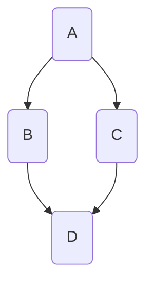
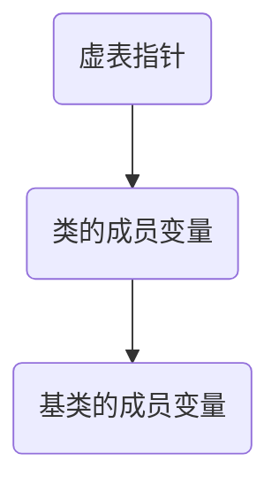
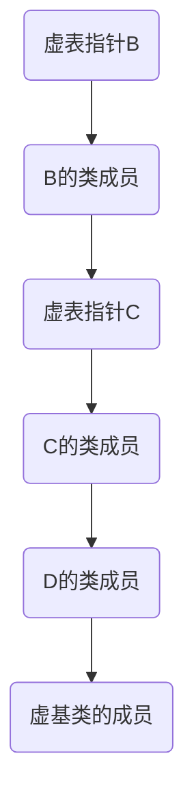

# C++

## 基础语法

将包裹的代码块按照`c语言`的方式编译

```c++
extern "C"{
	// 代码块
}
```

防止重复引入

```c++
#ifndef 宏
#define 宏 //宏的定义一般是__文件名_H

//代码块

#endif
```

第二种防止重复引入

```c++
#pragma once
// 兼容性不好
```

### 内联函数

使用`inline`所修饰的函数声明或者实现,编译器会将内联函数直接转换为函数代码

```c++
inline void func(int v1, int v2){
	//函数体
}
```

内联函数的执行不需要分配栈空间，执行了效率

会增大代码的体积

递归函数不会变成内联

### const

`const`仅仅修饰其右边的值，被修饰的值为常量不可修改

```c++
int age = 10;
const int *p1 = &age;  // p1不是常量，*p1是常量
int const *p2 = &age;  // p2不是常量，*p3是常量
int * const p3 = &age; //p3是常量，*p3不是
const int * const p4 = &age; //p4,*p4都是常量
int const * const p5 = &age; //p5,*p5都是常量
```

### 引用

相当于给变量起别名，对引用做计算就相当于对引用所指向的变量做计算

```c++
int a;
int &b = a; //定义一个引用，
```

指针的引用

```c++
int age = 10;
int *p = &age;
int *&ref = p;
```

数组的引用

```c++
int array[] = {1,2,3};
int (&ref1)[3] = array;

// 两种写法
int * const &ref2 = arr;
```

常引用：引用可以被`const`修饰，这样就无法通过引用修改数据了，可以称为常引用,常引用可以引用常量，也可以引用不同类型的数据，但是不同类型的变量相当于引用指向了一个临时变量

```c++
int age = 10;
const int &ref1 = age;

const int &ref2 = 30;

const double &ref3 = age;
```

对于函数而言：如果形参为引用，则只能接受非const实参，而常引用可以接受任意的实参，常引用与非常引用函数可以构成函数重载

引用定义时必须赋初值

引用一旦定义不可修改其指向

引用的本质就是指针，知识编译器削弱了它的功能，所以引用就是弱化了的指针

### 默认参数

c++允许函数的参数有默认值

默认参数写在声明里，实现不必写

## intel x64汇编

### 内联汇编

```c++
__asm{
	;汇编代码
}
```

### 寄存器

64位通用寄存器：`RAX`、`RBX`、`RCX`、`RDX`，`R`开头的寄存器时64位的，占8个字节。`E`开头的是32位的占四个字节

### 汇编指令

将src的内容赋值给dest，类似于dest=src

```assembly
mov dest, src
```

中括号`[]`里面放的都是内存地址

```assembly
[地址值]
```

`word`两个字节，`dword`是四个字节，`qword`是八字节

```assembly
mov dword ptr [地址], 值
;将值放入指定地址的四个字节中
```

调用函数

```assembly
call 函数地址
```

取地址

```assembly
lea eax, [地址值]
```

函数返回

```assembly
ret
```

异或

```assembly
xor op1, op2
;将op1与op2异或的值赋值给op1
```

加法

```assembly
add op1, op2
;op1=op1+op2
```

减法

```assembly
sub op1, op2
```

自加

```assembly
inc op
;op++
```

自减

```assembly
dec op
;op--
```

跳转

```assembly
jmp 内存地址
```

## 面向对象

### 内存空间的布局

每个应用都有自己独立的内存空间，其内存空间一般有以下几个区域

- 代码段(代码区)：用于存放代码
- 数据段(全局区)：用于存放全局变量等
- 栈空间：没调用一个函数就会给它分配一段连续的占空间,等函数调用完毕后自动回收这些栈空间
- 堆空间：需要主动去申请和释放

### 内存创建与销毁

`malloc/free`

```c++
// 申请
int *p = (int *) malloc(sizeof(int));

// 初始化 将每一个字节都设置为0
memset(p, 0, sizeof(int));

// 释放
free(p);
```

`new/delete`

```c++
// 申请
int *p = new int; // int *p = new int(0); 初始化为0
char *str = new char[4];

// 释放
delete p;
delete[] str;
```

### 类

c++里可以通过`struct`、和`class`来定义类，`struct`的默认成员是`public`，而`class`默认是`private`

### 对象

对象是类的实例

对象的内存布局是连续的，默认的对象是放在栈空间

### 封装

成员变量私有化，提供公共的`getter`和`setter`给外界去访问成员变量

### 构造函数

构造函数也叫构造器，在对象创建的时候自动调用，一般用于完成对象的初始化工作

构造函数的名字和类的名字相同，没有返回值可以有参数，可以重载

一旦定义了构造函数，必须通过其中一个来初始化对象

`malloc`定义的对象不会调用构造函数

在某些特定的情况下，编译器会为类生成空的无参的构造函数

### 成员变量的初始化

默认情况下(无构造函数)：全局区的成员变量初始化为0，栈空间不会初始化，堆空间带`()`的初始化

如果自定义了构造函数，除了全局区都不会初始化

### 析构函数

析构函数在对象销毁之前调用，用于清理内存

析构函数的名字为`~类名`，不能重载

`malloc`创建的对象不会调用析构函数

构造函数与析构函数都需要为`public`才能被对象调用

### 命名空间

c++可以通过命名空间来防止变量，类等命名冲突的问题

```c++
namespace 名字 {
	// 代码块
}
```

命名空间有一个默认的命名空间，没有名字,所有的代码都嵌套在全局命名空间里面

```c++
::
```

### 继承

通过继承可以让子类拥有父类的成员变量和函数

```c++
class 子类名 : [public] 父类名 {
	
}
```

继承默认为私有继承

### 成员访问权限

`public`，成员为公共的成员，即可以任意访问

`private`成员为私有成员，即意味着只能在类中访问

`producted`类以及子类里可以访问该成员

访问权限不影响内存布局

### 初始化列表

一种便捷的初始换成员变量的方式

```c++
构造函数(int age, int height) : m_age(age), m_height(height){
	// 成员变量的初始化顺序只跟定义的顺序有关
}
```

只能用于构造函数中，声明和实现分离初始化列表放在实现里面

对于构造函数的相互调用只能放在初始化列表中

### 父类构造函数

子类的构造函数默认回去调用父类的构造函数

如果子类的构造函数显示地调用了父类的有参构造函数，就不会再去默认调用父类的无参构造函数

如果父类没有构造函数，则不会调用父类的构造函数

### 多态

父类指针可以指向子类对象(通过public继承)但是只能访问父类的属性和方法，子类指针不可以指向父类对象

同一操作作用域不同的对象，可以有不同的解释，产生不同的结果

子类通过重写父类的虚(virtual)方法，来实现多态

如果父类的函数(方法)为虚函数，则子类重写的函数也为虚函数

虚函数的实现原理是虚表，这个虚表里面存储着最终需要调用的虚函数地址，这个虚表也叫虚函数表，一个对象(如果有虚表)最前的4/8个字节存储的是虚表的地址

在子类中可以调用父类的虚函数

```c++
类名::函数名();
```

虚析构函数：如果存在父类指针指向子类对象的情况，应该将析构函数声明为虚函数，否则子类的析构函数不会被调用

纯虚函数：没有函数体且初始化为0的虚函数，用来定义接口规范

```c++
virtual 函数声明 = 0;

virtual void speak() = 0;
```

只要一个类中包含纯虚函数这个类就称为抽象类，抽象类不能创建对象

如果父类是抽象类，子类没有完全重写纯虚函数，那么这个子类依然是抽象类

### 多继承

C++允许一个类可以有多个父类（不建议使用），内存布局跟继承的顺序有关

如果子类继承的多个父类都有虚函数，那么子类对象就会产生对应的多张虚表

如果成员变量或者方法有同名，默认访问对象本身的变量或方法，访问父类的变量或方法应使用其类名

```c++
对象名.父类名::成员
```

### 虚继承

菱形继承：B、C继承A，D继承B、C会导致A被D重复继承



虚继承在`B`、`C`类继承时添加`virtual`关键字修饰，虚继承的后果是BC继承的为同一块`内存`里的东西

B、C的内存布局



虚表指针指向的内存空间里

- 虚表指针与本类起始的偏移量(一般是0)
- 虚基类第一个成员变量与本类起始的偏移量

D的内存布局



### 静态成员

被`static`修饰的成员变量称为静态成员

静态成员变量

- 存储在数据段(全局区，类似于全局变量)，整个程序运行过程中只有一份内存
- 静态成员变量必须放在类的外面初始化，初始化不需要带`static`

静态成员函数

- 静态成员函数内部没有`this`
- 静态成员函数不能用`virtual`修饰
- 静态成员函数内部不能访问非静态成员变量/函数

静态成员也可以通过`类名::静态成员名`来访问

如果继承的父类含有同名的静态成员则，它们属于不同的变量

应用常见：单例模式，保证某个类只创建一个对象

- （拷贝）构造函数私有化
- 定义一个私有的`static`成员变量指向唯一的哪个单例对象
- 提供一个公共的访问单例对象的方法
- 重载赋值运算符私有化

### const成员

只有静态函数成员不能被`const`修饰

`const`成员变量

- `const`成员变量必须在定义时或构造函数的初始化列表中初始化
- `static`可以修饰`const`

`const`成员函数

- `const`关键字写在参数列表后面，函数的声明和实现都必须加`const`

  ```c++
  void test() const{
  	// 函数体
  }
  ```

- 函数内部不能修改非静态成员变量

- 函数内部只能调用`cosnt`、`static`成员函数

- `const`成员函数可以和非`const`构成重载，

- 非`const`对象优先调用非`const`函数

- `const`对象只能调用`const`、`static`函数

### 引用类型成员

引用类型成员变量必须初始化，可以在声明的时候初始化，也可以通过初始化列表初始化

### 拷贝构造函数

拷贝构造函数的语法是固定的，接受一个`const`引用的对象

```c++
类名(const 类名 &变量名){
	// 函数体
}
```

利用已存在的对象创建一个新对象时，就会调用新对象的拷贝构造函数进行初始化

```c++
类名 要创建的对象(已经存在的对象);
```

默认情况下(没有定义拷贝构造函数)

会将已存在的对象的成员变量一一赋值给要创建的对象的成员变量

默认的拷贝为浅拷贝

### 对象型参数和返回值

使用对象类型作为函数的参数或者返回值，可能会产生一些不必要的中间对象

使用对象作为函数参数尽量使用引用

#### 匿名对象

没有变量名，创建之后即销毁

```c++
类名();
```

匿名对象的生命周期仅限于当前行

如果是匿名对象作为函数参数，则仅会调用一次构造函数

c++存在隐式构造，即可以将一个常量赋值给一个对象，默认情况下（必须有单参数的构造函数或者其他参数有默认值）这个常量会隐式生成一个匿名对象将常量值赋值给这个隐式对象，可以通过`explicit`修饰构造函数来禁止隐式构造

### 编译器自动生成构造函数

编译器在某些特定的情况下会自动生成构造函数

- 成员变量在声明的同时进行了初始化
- 有定义虚函数
- 虚继承了其他类
- 包含了对象类型的成员，且这个成员有构造函数  
- 父类有有构造函数

对象创建后，需要做一些额外的操作(内存操作，函数调用)，编译器会自动生成无参的构造函数

### 友元

假设有类`A`、`B`和函数`func`

友元函数：

将一个函数在类中声明为友元函数即可在函数内部访问对象的私有成员，通过`friend`关键字修饰，友元函数不能是成员函数

```c++
// 在类A中声明
friend 函数返回值 func(A& a1, A& a2);

// 将函数func声明为A的友元函数
```

友元类：

```c++
// 在类A中声明
friend class B;

// 将类B声明为类A的友元类
```

### 内部类

将一个类定义到另一个类的内部称为内部类(嵌套类)

内部类可以设置访问权限，如果为`public`需要通过外层类的名字进行访问

```c++
外部类::内部类 对象名;
```

内部类可以访问外部类的成员(包括静态成员)，外部类不能访问内部类的私有成员

内部类不影响外部类的内存布局

内部类可以在外部类中声明，实现放在外面

```c++
class A {
	class B;
};
class A::B {
	
};
```

### 局部类

定义在函数内部的类

局部类声明和实现必须放在内部

局部类不允许定义静态成员变量

局部类不能访问该函数的变量`static`变量除外

局部类不影响函数的内存布局

### 运算符重载

可以为运算符增加一些新的功能

```c++
const 返回值 operator 重载的运算符(参数列表)	const{
	// 参数列表最好加上const
}
```

为了参数列表能够接受常量对象，所以参数列表里的参数应声明为`const`

运算符重载(若有返回值)最好返回一个`const`变量(对象)，因为运算符重载过后运算的结果是一个临时的变量，不应该能被赋值

又因为`const`对象只能调用`const`函数所以函数也应该声明为`const`

对于`++`运算符有`++p`和`p++`之分

```c++
const 类 operator++(int){
	// p++, 参数列表必须是int
    return 类(成员变量++);
}
类& operator++(){
	// ++p，这种方式应该可以被赋值
    // 成员变量++
    return *this
}
```

左移和右移只能重载为全局函数，然后在类中声明友元

```c++
ostream & operator<<(ostream &cout,const 对象) {
	// cout
	return cout;
}
istream & operator<<(istream &cout,对象) {
	// cin
	return cin;
}
```

对于有继承关系的的重载赋值运算符，应在子类里调用父类的赋值运算符

仿函数即重载`()`该函数类似于普通的全局函数但，这种函数可以访问成员变量

不可被重载的运算符：`.`、`::`、`?:`、`sizeof`

只能重载为成员函数：`=`、`[]`、`()`、`->`

## 模板

泛型：是一种将类型参数化以达到代码复用的技术，C++中使用模板来实现泛型

模板语法

```c++
template <typename/calss T, typename/calss A>
函数声明 {
	// 函数体
}

// 调用
函数名字<类型名>(参数列表);
```

模板的声明和实现放在`.h`、`.cpp`则会编译出错

一般模板的声明和实现都会放在一个`.hpp`文件中 

对于声明和实现分离的模板类的实现需要添加修饰

```c++
template<class T>
T 类名<T>::函数名(参数列表){
	// 函数体
}
```

对于分离的友元函数需要额外的`<>`修饰

```c++
返回值 函数名<>(参数列表){
	// 函数体
}
```

## 类型转换

### c语言强制转换

```c++
(type)表达式;

type(表达式);
```

### C++强制转化

`static_cast`：没有运行时检测，不能交叉转换(两个没有任何联系的变量/对象之间的转换)，常用于基本数据类型的转换，非`const`、转换为`const`

`dynamic_cast`：一般用于多态的转换，有运行时安全检测，如果不安全会将指针置空

`reinterpret_cast`：属于比较壁层的强制转换，没有任何类型检查和格式转换，仅仅是简单的二进制数据拷贝，它的类型需要有时引用，可以交叉转换，也可以将指针与变量之间进行转换

`const_cast`：将`const`转换为非`const`

格式

```c++
xx_cast<类型>表达式;
```

## C++11特性

`auto`：可以从初始化表达式中推断出变量的类型，大大简化编程工作

```c++
auto a = 10;
// 自动推断a为整型
```

`decltype`：获取变量的类型

```c++ 
decltype(a) b = 20;
```

`nullptr`：空指针,解决了NULL二义性的问题

```c++
int *p = nullptr;
```

快速遍历

```c++
int array[] = { 1,2,3,4 };
for (int item : array) {
	cout << item << " ";
}
```

`Lambda`表达式，可以定义在函数内部的函数

```c++
// 定义 可以使用auto
void (*p)() = [] {
    cout << "Hello World" << endl;
};
// 调用
p();

// 立即执行
([] {
	cout << "Hello World" << endl;
})();

// 带返回值和参数的表达式，返回值可省略
auto p = [](int a, int b) -> int {
	return a + b;
};
```

捕获

```c++
// 捕获外部的值
int a = 10;
int b = 20;
// 可以传引用，进行地址捕获
auto func = [a, b]{
    return a + b;
};

// 自动捕获，值捕获， 将=换成&地址捕获
auto func = [=] {
    return a + b;
};
```

改变捕获的变量的值

```c++
// 采用地址捕获
int a = 10;
auto func = [&a]{
	a++;
}

// 采用mutable,不会影响表达式外部的值
int a = 10;
auto func = [a]() mutable{
    a++;
}
```

## 异常

### 语法

```c++
try {
	// 可能会抛出异常的代码
    // 抛出异常的代码下面抛出异常之后不会执行
} catch (...) {
    // (异常类型 变量名)异常类型,异常类型不一样catch可以有多个， ...代表所有异常
	// 捕捉到异常需要做的事情
}
```

主动抛出异常

```c++
throw "主动抛出";

// 需要try catch 捕捉
```

`throw`异常之后会在当前函数中查找匹配的`catch`，找不到就终止当前函数代码，去上一层函数中查找，如果到`main`函数中依然没有匹配的`catch`程序会被终止

捕捉异常的类型匹配是严谨的，不存在隐式转换

### 异常抛出声明

为了增强可读性和方便团队协作，如果函数内部可能会抛出异常，建议函数声明异常类型

```c++
// 可能会抛出任意类型的异常
void func() {
    
}

// 不会抛出异常
void func() throw(){
    
}

// 抛出指定类型的异常
void func() throw(异常类型){
	
}
```

### 自定义异常类型

定义所有异常的基类

```c++
// 所有异常均继承自基类
class Exception {
	// 定义一些纯虚函数来规范异常，纯虚函数一般为const
};
```

定义异常

```c++
class 异常函数名Exception : public Exception{
	// 重写父类的虚函数
};
```

### 标准异常

| 异常               | 描述                              |
| ------------------ | --------------------------------- |
| std::exception     | 该异常是所有标准C++异常的父类     |
| std::bad_alloc     | 该异常可以通过new抛出             |
| std::bad_cast      | 该异常可以通过dynamic_cast抛出    |
| std::bad_exception | 这在处理C++程序中无法预期的异常时 |

等等。。，C++标准里定义了许多异常

## 智能指针

智能指针指向内存的生命周期跟随指针变量的生命周期，不需要手动销毁，智能指针不要指向栈空间的对象，否则会多次调用析构函数

### auto_ptr

不能用于数组，不推荐使用

```c++
auto_ptr<类型> 变量名(new 类型);
```

### shared_ptr

支持数组,且多个`shared_ptr`可以指向同一个指针对象

一个`shared_ptr`会对一个对象产生强引用，每个对象都有与之对应的强引用技术，记录着当前多少个`shared_ptr`被墙引用着，可以通过`shared_ptr`的`use_count`函数获得强引用计数

当有一个新的`shared_ptr`指向对象时，对象的强引用计数就会加1，销毁则减一

```c++
shared_ptr<类型[]> 变量名(new 类型[]);
```

对于`shared_ptr`指针而言有循环引用的风险，而`weak_ptr`弱引用智能指针能解决

### unique_ptr

也会对一个对象产生强引用，它可以确保同一时间只有一个指针指向对象

```c++
unique_ptr<类型> 变量名(new 类型);
```

特别情况下可以使用`std::move()`转移智能指针,原指针被销毁

```c++
指针1 = std::move(指针2);
```

