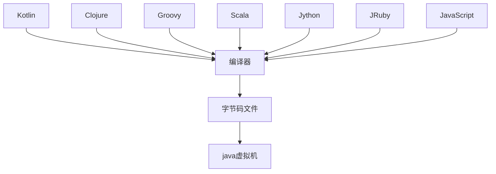

# JVM

[TOC]

## 1. JVM与java体系

`JVM`是一个跨语言的平台，在`java7`的发布之后，`java`虚拟机的设计者们通过`JSR-292`规范基本实现在`java`虚拟机上运行非`java`语言编写的程序

```mermaid
graph TD
Kotlin --> C[编译器]
Clojure --> C
Groovy --> C
Scala --> C
Jython --> C
JRuby --> C
JavaScript --> C
C --> 字节码文件
字节码文件 --> java虚拟机
```