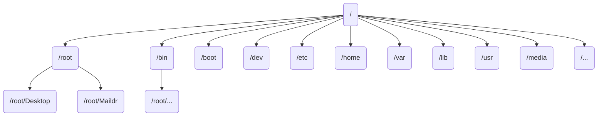

# Linux

### Linux(主要)目录结构



- `bin` （/usr/bin、/usr/local/bin）Binary的缩写，这个目录存放着最经常用的命令
- `sbin` (/usr/sbin、/usr/local/sbin)  s是Super User的意思，这里存放的是系统管理员使用的系统管理程序。
- `home` 存放普通用户的主目录，在linux中每个用户都有一个自己的目录，一般该目录的命名是以用户的账号命名的
- `root`该目录为系统管理员，也称作超级权限者的用户主目录
- `lib` 系统开机所需要最基本的动态连接共享库，其作用类似于Windows里的DLL文件。几乎所有的应用程序都需要用到这些共享库
- `lost`、`found` 这个目录一般是空的，当系统非法关机时，这里就存放了一些文件
- `etc`所有的系统管理所需要的配置文件和子目录
- `usr`这是一个非常重要的目录，用户的很多应用程序和文件都放在这个目录下，类似于windows下的program  files目录
- `boot` 存放的是启动linux时使用的一些核心文件，包括一些连接文件以及镜像文件
- `proc` 这是一个虚拟的目录，它是系统内存的映射，访问这个目录来获取系统信息
- `srv` service的缩写，该目录存放一些服务启动后需要提取的数据
- `sys` 该目录安装了linux2.6内核出现的一个文件系统sysfs
- `dev` 类似于windows的设备管理器，把所有的硬件用文件的形式存储
- `media` linux系统会自动识别一些外部设备，识别过后，linux会把识别的设备挂载到这个目录下
- `mnt` 系统提供改目录是为了让用户临时挂载别的文件系统的，我们可以将外部的存储挂载在/mnt/上，然后进入该目录就可以查看里面的内容了
- `opt` 这是给主机额外安装软件所摆放的目录。如安装ORACLE就可放到该目录下
- `/usr/local` 这是另一个给主机额外安装软件所安装的目录。一般通过编译源码的方式安装程序。
- `var` 这个目录中存放着不断扩充着的东西，习惯将经常被修改的目录放在这个目录下。包括各种日志文件
- `selinux` SELinux是一种安全系统，它能控制程序只能访问特定的文件

### vi和vim的基本使用

所有的linux系统都会内置vi文本编辑器，而vim是vi的增强版，包含代码补全，高亮，编译等功能。

#### vi和vim的三种模式

1. 正常模式：使用vi/vim打开一个文件就进入了正常模式，这个模式中可以使用各种快捷键

   常用命令

   ```
   yy 复制当前行 
   p 粘贴当前剪切板的内容到当前行
   5yy 复制当前行开始的以下5行
   dd 删除当前行
   5dd 删除当前行开始的以下5行
   /hello 查找hello字符 需按回车
   n 查找当前已经被查找的字符的下一个 
   G 去文本末尾
   gg 去文本开头
   u 撤销
   5 + shift + g 去第五行
   ```

2. 插入模式/编辑模式：在这个模式下可以编辑文本文件，使用i、o、a、r(不区分大小写)等任何一个按键均可进入编辑模式

3. 命令行模式：在正常模式下输入`:`即可进入命令行模式，此模式下可以使用各种内置的指令来完成读取，保存，退出、显示行号等。

   常用命令

   ```
   :w 写入
   :q 退出
   :q! 强制退出
   :set nu 设置行号
   :set nonu 取消行号
   ```

4. 在插入模式和命令行模式均可使用`ESC`进入到正常模式

### linux关机，重启

- `shutdown`

  ```
  shutdown -h now 立即关机
  
  shutdown -h 1 一分钟后关机
  
  shutdown -r now 立即重启
  ```

- `halt`

  ```
  halt 立即关机
  ```

- `reboot`

  ```
  reboot 立即重启
  ```

- `sync`

  ```
  sync 把内存的数据同步到磁盘
  ```

- `logout` 

  ```
  logout 注销
  
  图形界面下无效
  ```

### 用户管理

linux是一个多用户多任务的操作系统，任何一个要使用系统资源的用户，都必须首先向系统管理员申请一个账号，然后以这个账号的身份进入系统

linux的用户需要至少要属于一个组

#### 添加用户

```
useradd [options] 用户名

当用户创建成功后，会自动的创建和用户名同名的home目录
也可以通过
useradd -d 指定目录 用户名 
指定home目录

useradd -g 用户组 用户名
```

#### 更改用户密码

```
passwd 用户名
```

#### 删除用户

```
userdel 用户名

保留/home目录

userdel -r 用户名
不保留/home目录
```

#### 查询用户信息

```
id 用户名
```

#### 切换用户

```
su - 用户名

权限低的用户切换到权限高的用户时需要密码
当需要返回原来的用户时可使用exit命令
```

#### 用户组

类似于角色，系统可以对有共性的多个用户进行统一的管理

创建组

```
groupadd 组名
```

删除组

```
groupdel 组名
```

修改用户归属的组

```
usermod -g 用户组 用户名
```

用户信息的配置文件放在`/etc/passwd`文件中

- 用户名:口令:用户标识号:组标识号:注释性描述:主目录:登陆Shell

  ```
  root:x:0:0:root:/root:/bin/bash
  ```

组的配置文件放在`/etc/group`文件中

- 组名:口令:组标识号:组内用户列表

  ```
  root:x:0:
  ```

口令配置文件(密码和登陆信息，加密)`/etc/shadow`

- 登陆名:加密口令:最后一次修改时间:最小时间间隔:最大时间间隔:警告时间:不活动时间:失效时间:标签

  ```
  root:$6$MSxoKOkJeNBEq4WQ$yGQUQv.eSUDgJb4iPu0EOJUFY5VYIe2BDV9ZPIViWxVYjoTFjXl0L/ayhNOVVm2JWx05m7T/gfNBfGgy9Ic/W/::0:99999:7:::
  ```

### linux基础指令

#### 指定运行级别

- `0`关机
- `1`单用户，找回丢失的用户密码
- `2`多用户无网络服务
- `3`多用户有网络服务
- `4`保留
- `5`图形界面
- `6`重启

切换到指定运行级别的指令

```
init 级别
```

查看当前运行级别

```
who -r
```

系统的运行级别配置文件在`/etc/inittab`

找回密码

进入到单用户模式，然后修改用户密码。进入单用户模式不需要密码

#### 帮助指令

- `man`

  ```
  man [命令或配置文件] 
  ```

- `help`

  ```
  help [命令]
  ```

#### 文件目录类

- 显示当前工作目录的绝对路径

  ```
  pwd
  ```

- 查看当前目录的结构

  ```
  ls [options] [目录或是文件]
  
  -a 显示当前目录所有的文件和目录，包括隐藏的
  -l 以列表的形式显示信息
  ```

- 切换目录

  ```
  cd [参数]
  
  cd ~ 或 cd : 回到home目录
  cd.. 回到当前目录的上一级目录 centos8不能使用
  ```

- 创建目录

  ```
  mkdir [options] 要创建的目录
  
  -p 创建多级目录
  ```

- 删除目录

  ```
  rmdir [options] 要删除的空目录
  
  只能删除空目录
  -rf 删除非空目录
  ```

- 创建文件

  ```
  touch 文件名称
  
  可以一次创建多个文件
  ```

- 拷贝

  ```
  cp [options] 源目录 目标目录
  
  -r 递归复制整个目录
  
  \cp [options] 源目录 目标目录
  强制覆盖
  ```

- 删除指令

  ```
  rm [options] 要删除的目录或文件
  
  -r 递归删除整个文件夹
  -f 强制删除不提示
  ```

- 移动或重命名指令

  ```
  mv oldfilename newfilename
  
  mv 源目录 目标目录 
  ```

- 查看文件内容

  ```
  cat [options] 文件名
  
  -n 显示行号
  cat [options] 文件名 | more
  文件分页显示
  cat 只能浏览不能修改
  ```

- 按页显示文章的内容

  ```
  more 文件名
  ```

  | 操作   | 功能说明                   |
  | ------ | -------------------------- |
  | 空格键 | 下一页                     |
  | Enter  | 下一行                     |
  | q      | 离开more，不再显示文件内容 |
  | Ctrl+F | 向下滚动一屏               |
  | Ctrl+B | 返回上一屏                 |
  | =      | 输出当前的行号             |
  | :f     | 输出文件名和当前行的行号   |

  ```
  less 文件名
  功能类似于more，less指令在显示文件时，并不是一次将整个文件加载之后才显示，而是根据显示需要按需加载
  ```

- 输出重定向和追加

  ```
  > 重定向
  >> 追加
  
  ls -l > 文件名 列表内容写入到文件中
  ls -al >> 文件名 列表的内容追加到文件的末尾
  cat 文件1 > 文件2 文件1的内容覆盖文件2的内容
  echo "内容" >> 文件名 
  ```

- 输出内容到控制台

  ```
  echo [options] [输出内容]
  
  echo $PATH 输出当前环境变量
  ```

- 显示文件开头的部分，默认前十行

  ```
  head 文件      查看文件的前十行
  head -n 5 文件 查看文件的前5行
  ```

- 显示文件结尾的部分，默认末尾十行

  ```
  tail 文件         查看文件后十行的内容
  tail -n 5 文件名  查看文件后5行的内容
  tail -f 文件 		实时追踪该文档的所有更新
  ```

- 软链接或者符号链接，类似于windows里的快捷方式，主要存放了链接其他文件的路径

  ```
  ln -s [源文件目录] [软链接名]
  ```

- 删除软链接

  ```
  rm -rf 软链接的名称
  ```

- 查看执行历史指令

  ```
  history    显示所有执行过的指令
  history 10 显示后十条
  !10  		执行历史记录中第十条指令
  ```

#### 时间日期类

- 显示当前日期

  ```
  date 		显示当前时间
  date +%Y    显示当前年份
  date +%m  	显示当前月份
  date +%d    显示当前月份的哪一天
  date +"%Y-%m-%d %H:%M:%S"  日期格式化
  ```

- 设置日期

  ```
  date -s 字符串时间
  ```

- 查看日历

  ```
  cal [options]
  
  cal 	 显示当前月份的日历
  cal 2020 显示2020一整年的日历
  ```

#### 搜索查找类

- `find`

  ```
  find [搜索范围] [options]
  
  -name<查询方式>  按照指定的文件名查找模式查找文件
  find / -name *.txt 查找根目录下所有以.txt结尾的文件
  
  -user<用户名>	  查找属于指定用户名所有文件
  
  
  -size<大小>	   按照指定文件大小查找文件
  -size +20M 大于20M
  -size -20M 小于20M
  -size 20M  等于20M
  ```

- `locate` 基于locate文件数据库查找文件，使用之前如果没有locate文件数据库则需要先创建

  ```
  updatedb	创建或者更新locate文件数据库
  
  lcoate test.txt  查找test.txt文件
  ```

- 过滤查找，通过`grep`和`|`搭配使用

  ```
  |	表示将前一个命令的处理结果输出传递给后面的命令处理
  grep [options] 查找内容 源文件
  
  -n 显示匹配行及行号
  -i 忽略字母大小写
  
  cat test.txt  | grep yes 	查找yes
  cat test.txt  | grep -n yes 显示行号
  cat test.txt  | grep -ni yes 显示行号且不区分大小写
  ```

#### 压缩和解压缩

- `gzip/gunzip`

  ```
  gzip 文件  将文件压缩为*.gz文件且删除源文件
  gunzip *.gz 将文件解压
  ```

- `zip/unzip`

  ```
  zip [options] xxx.zip 源文件	 将源文件压缩成xxx.zip
  -r 对目录下所有文件压缩
  
  unzip [options] xxx.zip        解压
  -d 指定解压目录
  ```

- `tar`

  ```
  tar [options] xxx.tar.gz
  
  ar -zcvf mytest.tar.gz /test/ 	打包压缩test文件下的所有文件
  tar -zxvf mytest.tar.gz -C /test/hello/  解压到指定目录
  ```

  | options | 功能               |
  | ------- | ------------------ |
  | -c      | 产生.tar打包文件   |
  | -v      | 显示详细信息       |
  | -f      | 指定压缩后的文件名 |
  | -z      | 打包同时压缩       |
  | -x      | 解包.tar文件       |

### 组管理和权限管理

#### Linux组的基本介绍

在linux中的每个用户必须属于一个组，不能独立于组外。linux中每个文件有所有者、所在组、其他组的概念

- 所有者
- 所在组
- 其他组

#### 文件/目录

- 所有者：一般为文件的创建者，谁创建了该文件，就自然的成为该文件的所有者。

- 查看文件的所有者

  ```
  ls -ahl
  ```

- 修改文件/目录的所有者

  ```
  chown 用户名 文件名
  
  chown -R 用户名 目录
  改变目录下的所有文件/目录的拥有者
  ```

- 修改文件所在组

  ```
  chgrp 组名 文件名
  
  chgrp -R 用户名 目录
  改变目录下的所有文件/目录的所在组
  ```

#### 文件权限管理

- 文件详情

  ```
  -rw-r--r--. 1 root root 0 5月   2 07:37 test.txt
  
  -
  文件类型
  
  - 普通文件
  d 文件目录
  l 软链接文件
  c 字符设备[键盘，鼠标]
  b 块文件[硬盘]
  
  rw-
  文件所有者的权限
  r 读
  w 写
  
  r--
  文件所在组的用户的权限
  r 读
  
  r--
  文件的其他组的用户的权限
  r 读
  
  1
  文件表示硬链接，目录则表示该目录的子目录的个数
  
  root 文件的所有者
  
  root 文件的所在组
  
  0 文件的大小/目录则是4096
  
  5月   2 07:37
  文件最后的修改时间
  ```

- `rwx` 权限

  作用到文件

  ```
  r 可读
  w 可写，不一定可删除，删除一个文件的前提条件是对该文件所在目录有写的权限
  x 可执行
  ```

  作用到目录

  ```
  r 可以查看目录内容
  w 可修改，目录内创建、删除、重名名
  x 可以进入该目录
  ```

  可用数字来表示

  ```
  r=4，w=2，x=1
  ```

- 修改文件/目录权限

  `+`、`-`、`=`变更权限 `u`所有者、`g`所在组、`o`其他人、`a`所有人

  ```
  chmod u=rwx,g=rx,o=x 文件目录名 
  chmod o+w 文件目录名              其他人添加写的权限
  chmod a-x 文件目录名				 所有人去除可执行/进入的权限
  ```

  通过数字变更权限

  ```
  chmod 751 文件目录名
  ```

### 任务调度

指系统在某个时间:alarm_clock:执行特定的命令或程序

简单的任务可直接在crontab中直接加入即可，复杂的任务需要写`shell`脚本处理

- `crond`

  ```
  crontab [options]  
  ```

  | options | 功能                          |
  | ------- | ----------------------------- |
  | -e      | 编辑crontab定时任务           |
  | -l      | 查询crontab定时任务           |
  | -r      | 删除当前用户所有的crontab任务 |

  案例：

  每小时的每一分钟执行 `ls -l /etc/ >> /tmp/ok.txt`

  调度文件

  ```
  */1 * * * * ls -l /etc >> /tmp/to.txt
  ```

  占位符

  | 项目     | 含义                 | 范围                 |
  | -------- | -------------------- | -------------------- |
  | 第一个 * | 一小时当中的第几分钟 | 0-59                 |
  | 第二个 * | 一天中的第几个小时   | 0-23                 |
  | 第三个 * | 一个月中的第几天     | 1-31                 |
  | 第四个 * | 一年当中的第几个月   | 1-12                 |
  | 第五个 * | 一周当中的星期几     | 0-7(0/7都代表星期日) |

  特殊符号

  | 特殊符号 | 含义                                                         |
  | -------- | ------------------------------------------------------------ |
  | *        | 代表任何时间。比如第一个*就代表一小时每分钟都执行一次        |
  | ,        | 代表不连续的时间。比如“0 8,12,16 * * * 命令” 就代表在每天的8点0分，12点0分，16点0分都执行一次 |
  | -        | 代表连续的时间范围。比如"0 5 * * 1-6 命令"，代表在周一到周六的凌晨5点零分执行命令 |
  | */n      | 代表每隔多久执行一次。比如"*/10 * * * * 命令"，代表每隔十分钟就执行一次命令 |

- 简单`shell`脚本的编写

  新建一个`*.sh`文件

  编写指令`date >> /tmp/mydate`

  `*.sh`赋予可执行的权限

  `crontab -e`

  ```
  */1 * * * * *.sh
  ```

### 磁盘分区、挂载

#### 分区的基础知识

- `mbr`分区

  最多支持四个主分区

  系统只能安装在主分区

  扩展分区要占一个主分区

  `mbr`最大支持2TB，但拥有好的兼容性

- `gtp`分区

  支持无限多个主分区

  最大支持18EB的容量，操作系统会限制分区数量，windows最多128个分区

  win7 64位以后支持gtp

#### Linux分区原理

Linux来说无论有几个分区，分给哪一目录使用，它归根结底就只有一个根目录，一个独立且唯一的文件结构，Linux中每个分区都是用来组成整个文件系统的一部分

Linux采用了一种"载入"的处理方法，它的整个文件系统中包含了一整套的文件和目录，且将一个分区和一个目录联系起来。这是要载入的一个分区使它的存储空间在一个目录下获得

#### Linux硬盘

Linux硬盘分`IDE`硬盘和`SCSI`硬盘，目前基本上都是`SCSI`硬盘

对于IDE硬盘，驱动器标识符位`hdx~`其中`hd`表明分区所在设备的类型，这里是指`IDE`硬盘。`x`为盘号(`a`为基本盘、`b`为基本从属盘、`c`为辅助主盘、`d`为辅助从属盘)，`~`代表分区，前四个分区用数字1到4标识，他们是主分区或扩展分区，从5开始就是逻辑分区。`hda3`标识为第一个`IDE`硬盘上的第三个主分区或扩展分区，`hdb2`表示为第二个`IDE`硬盘上的第二个主分区或扩展分区。

对于`SCSI`硬盘则标识为`sdx~`，`SSCI`硬盘是用`sd`来表示分区所在设备的类型的，其余则和`IDE`硬盘的表示方法一样。

```
lsblk -f 		查看磁盘分区和挂载情况
```

#### 增加一块硬盘

1. 虚拟机添加硬盘

2. 分区 `fdisk /dev/sdb`

3. 格式化 `mkfs -t ext4 /dev/sdb1` 

4. 挂载 `mount /dev/sdb1 /home/newdisk` 设备重启后挂载关系会丢失

5. 设置自动挂载 

   编辑 `etc/fstab `添加

   ```
   /dev/sdb1               /home/newdisk           ext4    defaults        0 0
   ```

   退回终端执行

   ```
   mount -a
   ```

6. 卸载磁盘

   ```
   umount /home/newdisk
   ```

#### 磁盘情况查询

- 查询系统磁盘整体使用情况

  ```
  df -lh
  ```

- 查询指定目录的磁盘占用情况

  ```
  du -h /目录
  
  -s 指定目录占用大小汇总
  -h 带计量单位
  -a 含文件
  --max-depth=1 目录深度
  -c 列出明细的同时，增加汇总值
  ```

#### 实用指令

- 统计 /home文件夹下文件的个数

  ```
  ls -l /home | grep "^-" | wc -l
  ```

- 统计 /home文件夹下目录的个数

  ```
  ls -l /home | grep "^d" | wc -l
  ```

- 统计 /home文件夹下文件的个数，包括子文件夹里的

  ```
  ls -lR /home | grep "^-" | wc -l
  ```

- 统计 /home文件夹下目录的个数，包括子文件夹里的

  ```
  ls -lR /home | grep "^d" | wc -l
  ```

- 树状显示目录结构

  ```
  tree
  
  如果没有此指令使用
  yum install tree 安装即可
  ```

### Linux网络配置

1. 通过界面自动获取ip，缺点是每次获取的ip可能会不一样

2. 指定固定的ip，直接修改配置文件指定固定ip

   ```
   /etc/sysconfig/network-scripts/ifcfg-eth0
   ```

   `centos8`文件名为`ifcfg-配置_1`

   ```
   TYPE=Ethernet
   PROXY_METHOD=none
   BROWSER_ONLY=no
   BOOTPROTO=dhcp   //改为static
   DEFROUTE=yes
   IPV4_FAILURE_FATAL=no
   IPV6INIT=yes
   IPV6_AUTOCONF=yes
   IPV6_DEFROUTE=yes
   IPV6_FAILURE_FATAL=no
   IPV6_ADDR_GEN_MODE=stable-privacy
   NAME=$'\751\605\615\747\675\656 1'
   UUID=1555224a-2a47-4de0-a0fe-4194449092de
   ONBOOT=yes    //yes
   
   // 新增
   IPADDR=192.168.44.33   //ip
   GATEWAY=192.168.44.2   //网关
   DNS1=192.168.44.2		//保持和网关一致
   ```

   修改后重启机器

### Linux进程管理

#### 基本介绍

1. 在Linux中，每个执行的程序(代码)都称为一个进程。每一个进程都分配一个ID号
2. 每一个进程，都会对应一个父进程，而这个父进程可以复制多个子进程。例如www服务器
3. 每个进程都可能以两种方式存在。**前台**与**后台**，所谓前台进程就是用户目前的屏幕上可以进行操作的。后台进程则是实际在操作，但由于屏幕上无法看到的进程，通常使用后台的方式执行，后台进程又叫做**守护进程**
4. 一般系统的服务都是以后台进程的方式存在，而且都会常驻在系统中。直到关机才结束

#### 查看系统进程

```
ps [options]

-a 显示当前终端的所有进程信息
-u 以用户的格式显示进程信息
-x 显示后台进程运行的参数
-ef 显示父进程

pstree 以树状的方式查看进程
```

ps命令显示的信息

| 字段    | 说明                                             |
| ------- | ------------------------------------------------ |
| USER    | 执行进程的用户                                   |
| PID     | 进程识别号                                       |
| PPID    | 当前进程的父进程的进程号                         |
| %CPU    | 当前进程占用CPU的情况                            |
| %MEM    | 当前进程占用内存的情况                           |
| VSZ     | 当前进程占用的虚拟内存情况                       |
| RSS     | 当前进程占用物理内存的情况                       |
| TTY     | 当前进程使用的终端                               |
| STAT    | 当前进程的状态  S 休眠 R运行 D短期等待 Z僵尸进程 |
| START   | 当前进程的启动时间                               |
| TIME    | 此进程所消CPU总时间                              |
| COMMAND | 调用此进程时的命令和参数                         |

#### 终止进程

- 通过进程号杀死进程

  ```
  kill [options] 进程号
  
  -9 强迫进程立即停止
  ```

- 通过进程名称杀死进程，支持通配符

  ```
  killall 进程名称
  ```

#### 服务管理

- systemctl [start|stop|restart|reload|status] 服务名

  开启防火墙

  ```
  systemctl start firewalld
  ```

  查看防火墙状态

  ```
  systemctl status firewalld
  ```

  关闭防火墙

  ```
  systemctl stop firewalld
  ```

  windows下查看哪个端口是否开放

  ```
  telnet ip 端口号
  ```

  列出所有服务

  ```
  systemctl list-unit-files
  ```

- 服务的运行级别和开机的运行级别相同 `centos6`

  `chkconfig`可以给每个服务的各个运行级别设置自启动/关闭

  查看服务

  ```
  chkconfig --list
  ```

  查看某个服务

  ```
  chkconfig 服务名 --list
  ```

  设置运行级别

  ```
  chkconfig --level 5 服务名 on/off
  ```

#### 监控指令

- 动态监控进程

  `top`与`ps`相似，它们都用来显示正在执行的进程。top与ps最大的不同之处，在于top在执行一段时间后可以更新正在运行的进程

  ```
  top [options]
  ```

  | options | 功能                                                         |
  | ------- | ------------------------------------------------------------ |
  | -d 秒数 | 指定top指令每个几秒更新，默认是3秒在top命令的交互模式当中可以执行的命令 |
  | -i      | 使top命令不显示任何闲置或僵死的进程                          |
  | -p      | 通过指定监控进程ID来仅仅监控某个进程的状态                   |

  交互操作

  | 操作 | 功能                 |
  | ---- | -------------------- |
  | P    | 以CPU使用率排序      |
  | M    | 以内存的使用率排序   |
  | N    | 以PID排序            |
  | q    | 退出top              |
  | U    | 指定用户名的进程     |
  | K    | kill指定进程ID的进程 |

- 查看网络情况

  ```
  netstat [options]
  
  -an 按一定顺序排序列出
  -p 显示哪个进程在调用
  ```

### RPM和YUM包管理

- `rpm`一种用于互联网下载包的打包及安装工具，它包含在某些Linux发行版中。它生成具有`.RPM`扩展名的文件。`RPM`是RedHat Package Manager的缩写。

  `rpm` 查询指令

  ```
  rpm -qa | gerp XX
  ```

  查询结果

  ```
  firefox-60.5.1-1.el8.x86_64
  
  firefox 软件名称
  60.5.1-1  软件版本
  el8.x86_64 适用操作系统，表示centos8.X的64位系统
  如果是i686、i386表示32位系统、noarch表示通用
  ```

  查询软件包的具体信息

  ```
  rpm -qi XX
  ```

  查询软件包的安装位置

  ```
  rpm -ql XX
  ```

  查询某一个目录/文件是属于哪个软件包的

  ```
  rpm -qf 文件/目录路径
  ```

  卸载rpm包

  ```
  rpm -e rpm包的名称
  
  如果其他软件包依赖于要删除的软件包则会产生错误信息
  ```

  强制卸载软件包(不推荐)，

  ```
  rpm -e --nodeps 包的名称
  ```

  安装rpm包

  ```
  rpm -ivh RPM包全路径名称
  
  -i 安装
  -v 提示
  -h 进度条
  ```

  安装步骤

  1. 挂载centos的iso镜像，
  2. 然后到`/media/`下去找rpm
  3. 安装

- `yum`包管理

  `yum`是一个Shell前端软件包管理器。基于RPM包管理，能够从指定的服务器自动下载RPM包并且安装，可以自动处理依赖性关系，并且一次安装所有依赖的软件包。

  查询`yum`服务器是否有需要安装的软件

  ```
  yum list | grep 软件包名
  ```

  安装指定的`yum`包

  ```
  yum install 软件包名
  ```

### Shell编程

#### shell是什么

`Shell`是一个命令行解释器，它为用户提供了一个向Linux内核发送请求以便运行程序的界面系统级程序，用户可以用Shell来启动、挂起、停止甚至编写一些程序。

#### Shell脚本的执行方式

- 脚本格式要求

  脚本以`#/bin/bash`开头

  脚本需要有可执行权限

- 执行方式

  方式1(输入脚本的绝对路径或相对路径)

  1. 首先要赋予`XX.sh`脚本的`+x`权限
  2. 执行脚本

  方式2(sh+脚本)

  ​	不用赋予脚本`+x`权限，直接执行即可

- 快速入门(输出Hello World!)

  ```
  #!/bin/bash
  echo "Hello World!"
  ```

- 基本语法

  ```shell
  # 单行注释
  
  :<<!
  	多行注释
  	多行注释
  !
  ```

#### shell变量

1. Linux Shell变量分为，系统变量和用户自定义的变量

2. 系统变量：`$HOME`、`$PWD` 、`$SHELL`、`$USER`等等

   ```shell
   # 输出系统变量
   echo "PATH=$PATH"
   
   # PATH=/usr/local/sbin:/usr/local/bin:/usr/sbin:/usr/bin
   ```

3. 显示当前`shell`中所有的变量：`set`

#### shell变量的定义

1. 定义变量：

   ```shell
   变量=值
   ```

2. 撤销变量

   ```shell
   unset 变量
   ```

3. 声明静态变量

   ```shell
   readonly 变量
   # 不能unset
   ```

4. 案例

   ```shell
   A=100
   echo "A=$A"
   # A=100
   
   unset A
   echo "A=$A"
   # A=
   ```

   ```shell
   readonly A=99
   echo "A=$A"
   # A=99
   
   unset A
   # A: 无法取消设定: 只读 variable
   
   echo "A=$A"
   # A=99
   ```

#### 定义变量的规则

1. 变量名称可以由字母、数字、下划线组成，但不能以数字开头
2. 等号两边不能有空格
3. 变量名称习惯大写

#### 命令的返回值赋给变量

1. 反引号，运行里面的命令，并把结果返回给变量A

   ```shell
   A=`ls -la`
   ```

2. 等价于反引号

   ```shell
   A=$(ls -la)
   ```

#### 设置环境变量

- 基本语法

  将Shell变量输出为环境变量

  ```shell
  export 变量名=变量值
  ```

  让修改后的配置信息立即生效

  ```shell
  source 配置文件
  ```

  查询环境变量的值

  ```shell
  echo $变量名
  ```

- 案例

  在`/etc/profile`文件中

  ```shell
  #定义一个自己的环境变量
  TOMCAT_HOME=/opt/tomcat
  export TOMCAT_HOME
  ```

  让其生效需使用以下指令

  ```
  source /etc/profile
  ```

  之后就可以在其他`shell`脚本中使用了

#### 位置参数变量

- 当我们执行一个shell脚本时，如果希望获取到命令行的参数信息，就可以用到位置参数变量,比如 `./xxx.sh 200 300`，这就是一个执行shell的命令行，可以在`xxx.sh`脚本中获取到参数信息

- 基本语法

  | 参数 | 功能                                                         |
  | ---- | ------------------------------------------------------------ |
  | $n   | n为数字，$0代表命令本身，$1-$9代表1-9参数，十以上的参数用{}包含 ${10} |
  | $*   | 这个变量代表命令行中所有的参数，$*把所有参数看成一个整体     |
  | $@   | 这个变量也代表命令行中所有的参数，不过$@把每个参数区别对待   |
  | $#   | 代表命令行中所有的参数的个数                                 |

- 案例

  ```shell
  #!/bin/bash
  echo "$0 $1 $2"
  echo "$*"
  echo "$@"
  echo "$#"
  
  :<<! 
  ./myshell.sh 1 2
  1 2
  1 2
  2
  !
  ```

#### 预定义变量

- 就是shell设计者事先定义好的变量，可以在shell脚本中直接使用

- 基本语法

  | 语法 | 功能                                                         |
  | ---- | ------------------------------------------------------------ |
  | $$   | 当前进程的进程号(PID)                                        |
  | $!   | 后台运行的最后一个进程的进程号(PID)                          |
  | $?   | 最后一次执行的命令的返回状态。如果这个变量的值为0，则证明上一个命令正确执行，如果这个数非0(由命令指定数字),则证明上一个指令执行不正确 |

- 案例

  `myshell.sh`

  ```shell
  #!bin/bash
  echo "当前的进程号=$$"
  
  #后台的方式运行myshell.h
  
  ./myshell2.sh &
  
  echo "最后的进程号=$!"
  
  echo "返回的状态=$?"
  ```

  `myshell2.sh`

  ```shell
  #!bin/bash
  echo "Hello World!"
  ```

  结果

  ```
  当前的进程号=14233
  最后的进程号=14235
  返回的状态=0
  ```

#### Shell运算符

- `$((运算式))`或`$[运算式]`

- `expr m+n`

  ```
  + - \* / % 
  加减乘除取余
  ```

- 案例

  计算`(2+3)*4`的值

  ```shell
  #!/bin/bash
  
  echo $(((2+3)*4))
  
  echo $[(2+3)*4]
  ```

  ```shell
  #!/bin/bash
  
  TEMP=`expr 2 + 3`
  echo `expr $TEMP \* 4`
  ```

  求出两个位置参数的和

  ```shell
  #!bin/bash
  echo $[$1+$2]
  ```

#### 条件判断

- 基本语法

  ```shell
  # condition是条件前后有空格，非空为true
  [ condition ]   
  ```

- 判断语句

  两个整数的比较

  | 符号 | 功能       |
  | ---- | ---------- |
  | =    | 字符串比较 |
  | -lt  | 小于       |
  | -le  | 小于等于   |
  | -eq  | 等于       |
  | -gt  | 大于       |
  | -ge  | 大于等于   |
  | -ne  | 不等于     |

  按照文件权限进行判断

  | 符号 | 功能         |
  | ---- | ------------ |
  | -r   | 有读的权限   |
  | -w   | 有写的权限   |
  | -x   | 有执行的权限 |

  按照文件类型进行判断

  | 符号 | 功能                         |
  | ---- | ---------------------------- |
  | -f   | 文件存在并且是一个常规的文件 |
  | -e   | 文件存在                     |
  | -d   | 文件存在并且是一个目录       |

  案例

  判断`ok是否等于ok`

  ```shell
  #!/bin/bash
  if [ "ok"="ok" ]
  then
          echo "相等"
  fi
  
  # 结果
  # 相等
  ```

  判断`/shell/test.txt`是否存在

  ```shell
  if [ -e /shell/test.txt ]
  then
          echo "存在"
  fi
  ```

#### 流程控制

- `if`判断

  基本语法

  ```
  if [ 条件判断式 ]
  then 
  	程序
      elif [ 条件判断式 ]
      then
      	程序
  fi 
  ```

  案例，如果参数大于等于60输出及格否则输出不及格

  ```shell
  #!bin/bash
  if [ $1 -ge 60 ]
  then
          echo "及格"
  elif [ $1 -lt 60 ]
  then
          echo "不及格"
  fi
  ```

- `case`语句

  语法

  ```shell
  case $变量名 in
   "值1")
   	程序
   ;;
   "值2")
   	程序
   ;;
   ..........
   *)
   	如果变量的值都不是以上的值执行此程序
   ;;
   esac
  ```

  案例,参数为`1`输出`周一`，参数为`2`输出`周二`，其他输出`other`

  ```shell
  #!bin/bash
  case $1 in
      "1")
          echo "周一"
          ;;
      "2")
          echo "周二"
          ;;
      *)
          echo "other"
          ;;
  esac
  ```

- `for`循环

  基本语法1

  ```shell
  for 变量 in 值1 值2 值3...
  do 
  	程序
  done
  ```

  案例1，打印命令行输入的参数

  ```shell
  #!bin/bash
  for i in "$@"
  do
      echo "the num is $i"
  done
  ```

  基本语法2

  ```shell
  for ((初始值;循环控制条件;变量变化))
  do
  	程序
  done
  ```

  案例2，1+...+100 输出显示

  ```shell
  #!bin/bash
  SUM=0
  for ((i=1; i<=100; i++))
  do
      SUM=$[$SUM+$i]
  done
  echo "$SUM"
  ```

- `while`循环

  语法

  ```shell
  while [ 条件判断式 ]
  do
  	程序
  done
  ```

  案例：从命令行输入一个数n，统计从1+...+n的值是多少

  ```shell
  #!bin/bash
  SUM=0
  i=0
  while [ $i -lt $1 ]
  do
          i=$[$i+1]
          SUM=$[$SUM+$i]
  done
  
  echo "$SUM"
  ```

#### `read`从控制台读取输入

语法

```
read [options] 参数

-p 指定读取值时的提示符
-t 指定读取值时等待的时间(秒)，如果没有在指定的时间内输入，就不等待了
 
 参数
 指定读取值的变量名
```

案例：读取控制台输入的一个num值，10秒内输入

```shell
#!bin/bash
read -t 10 -p "请输入一个数" NUM
echo "输入的值为 $NUM"
```

#### shell函数

shell编程里面有系统函数和自定义函数之分

- 系统函数

  `basename`返回完整路径中的最后`/`的部分，常用于获取文件名

  ```shell
  basename 文件路径 [suffix]  
  
  # suffix为后缀，如果指定后缀，则获取的文件名没有后缀
  ```

  案例

  ```shell
  #!bin/bash
  echo $(basename /shell/test.txt)
  # test.txt
  
  echo $(basename /shell/test.txt .txt)
  # test
  ```

  `dirname`返回路径最后`/`之前的部分，常用于返回路径部分

  ```shell
  dirname 文件绝对路径
  ```

  案例

  ```shell
  #!bin/bash
  echo $(dirname /shell/test.txt)
  
  # /shell
  ```

- 自定义函数

  语法

  ```shell
  [ function ] funname [()]{
      action;
      [return int;]
  }
  ```

  案例：计算输入两个参数的和

  ```shell
  #!bin/bash
  function sum(){
      SUM=$[$n1+$n2]
      echo "和是 $SUM"
  }
  read -p "请输入第一个数n1 " n1
  read -p "请输入第二个数n2 " n2
  sum $n1 $n2
  ```

#### shell编程综合案例

1. 每天凌晨两点十分备份数据库`exampleDB`到`/data/backup/db`

2. 备份开始和备份结束能够给出响应的提示信息

3. 备份后的文件要求以备份时间为文件名，并打包成`.tar.gz`的形式，比如`2020-05-03_230201.tar.gz`

4. 在备份的同时，检查是否有十天前备份的数据库文件，如果有就将其删除

   ```shell
   #!/bin/bash
   #数据库的定时备份
   
   #备份的路径
   BACKUP=/data/backup/db
   #当前的使劲按作为文件名
   DATETIME=$(date +%Y_%m_%d_%H%M%S)
   echo "========开始备份========"
   echo "备份的路径是  $BACKUP/$DATETIME.tar.gz"
   
   #主机
   HOST=localhost
   #用户名
   DB_USER=root
   #密码
   DB_PWD=root
   #数据库的名称
   DATABASE=exampleDB
   
   #判断备份的路径是否存在
   [ ! -d "$BACKUP/$DATETIME" ] && mkdir -p "$BACKUP/$DATETIME"
   
   #进入docker里的mysql容器，本地mysql忽略此步骤docker exec -it 4d6dc427be27
   docker exec -i 4d6dc427be27 mysqldump -u${DB_USER} -p${DB_PWD} --host=${HOST} ${DATABASE} | gzip > $BACKUP/$DATETIME/$DATETIME.sql.gz
   
   #打包
   cd $BACKUP
   tar -zcvf $DATETIME.tar.gz $DATETIME
   
   #删除临时目录
   rm -rf $BACKUP/$DATETIME
   
   #删除10天前的备份文件
   find $BACKUP -mtime +10 -name "*.tar.gz" -exec rm -rf {} \;
   echo "========备份成功========"
   ```

   `crontab -e` 

   ```shell
   10 2 * * * /shell/mysql_db_backup.sh
   ```

   

