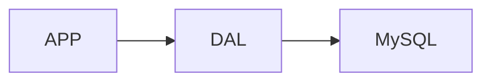
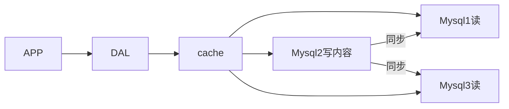
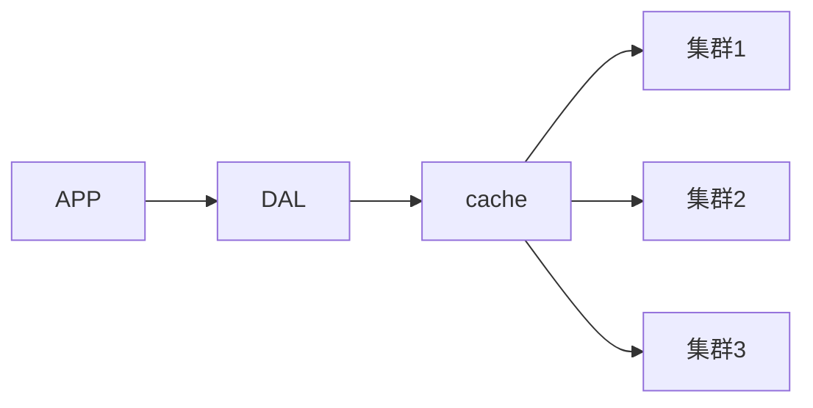

# Redis

[TOC]

## 1. Nosql概述

### 1.1 单机`MySQL`的年代



一个基本的网站访问量不会太大，单个数据库完全够用。那个时候，更多的是使用静态页面，服务器没有太大的压力。

这是的网站瓶颈：

1. 数据量太大，一个机器放不下
2. 数据的索引(B+ Tree)，一个机器内存也放不下
3. 访问量(读写混合),一个服务器承受不了

### 1.2 Memcached(缓存)+MySQL+垂直拆分

网站80%的情况都是在读，每次都要去查询数据库就十分麻烦，为了减轻数据库的压力，使用缓存来保证效率。

发展过程：优化数据结构和索引 --> 文件缓存(IO) --> Memcached



### 1.3 分库分表+水平拆分+MySQL集群



### 1.4 为什么要用NoSQL

用户的个人信息，社交网络，地理位置。用户自己产生的数据，用户日志等等爆发式增长。关系型数据库不足以处理庞大的数据量

### 1.5 什么是NoSQL

**NoSQL的定义**

- `NoSQL = Not Only SQL`
- 泛指非关系型数据库，随着`web2.0`互联网的诞生！传统的关系型数据库很难对付`web2.0`时代，尤其是超大规模的高并发的社区！暴露出很多难以克服的问题。`NoSQL`在当今大数据环境下的发展十分的迅速，`Redis`是发展最快的
- 很多的数据类型用户的个人信息，社交网络，地理位置。这些数据类型的存储不需要一个固定的格式。不需要多余的操作就可以横向扩展，使用键值对来扩展

**NoSQL的特点**

- 方便扩展

- 大数据量高性能(Redis一秒写8万次，读取11万，NoSQL的缓存记录级，是一种细粒度的缓存，性能比较高)

- 数据类型是多样型的(不需要事先设计数据库)

- 传统`RDBMS`和`NoSQL`

  ```
  传统的 RDBMS
  	结构化组织
  	SQL
  	数据和关系都存在单独的表中
  	操作，数据定义语言
  	严格的一致性
  	基础的事物
  ```

  ```
  NoSQL
  	不仅仅是数据
  	没有固定的查询语言
  	键值对存储，列存储，文档存储，图形数据库
  	最终一致性
  	CAP定理和BASE
  	高性能，高可用，高可扩
  ```

**3V加3高**

大数据时代的3V：主要是描述问题的

1. 海量Volume
2. 多样Variety
3. 实时Velocity

大数据时代的3高：主要对程序的要求

1. 高并发
2. 高可拓
3. 高性能

### 1.6 NoSQL的四大分类

**KV键值对**

- 新浪：Redis
- 美团：Redis + Tair
- 阿里、百度：Redis + memecache

**文档型数据库(bson)**

- MongoDB：一个基于分布式文件存储的数据库，`C++`编写，主要用来处理大量的文档；`MongoDB`是一个介于关系型数据库和非关系型数据库中间的产品，`MongoDB`是非关系型数据库中功能最丰富，最像关系型数据库的数据库
- `ConthDB`

**列存储数据库**

- HBase
- 分布式文件系统

**图关系数据库**

- 它存的不是图形，而是关系，比如：朋友圈社交网络，广告推荐
- Neo4j，infoGrid

## 2. Redis 入门

### 2.1 Redis概述

- `Redis`(Remote Dictionary Server),远程字典服务，是一个开源的使用`ANSI C`编写、支持网络、可基于内存亦持久化的日志型、`Key-Value`数据库，并提供多种语言的`API`，也称之为结构化数据库

- `Redis`可以进行内存存储、持久化；效率高，可以用于高速缓存；发布订阅系统；地图信息分析......

- 特性：多样的数据类型、持久化、集群、事物

- [官网](https://redis.io/)

- `Redis`的默认安装路径在

  ```shell
  /usr/local/bin
  ```

### 2.2 基础知识

#### 2.2.1 基本命令

- 启动

  ```
  redis-server
  ```

- 连接

  ```
  redis-cli -p 6379
  ```

- 关闭服务

  ```
  shutdown
  ```

- `redis`默认有16个数据库，默认使用第0个，使用`select`切换数据库

  ```bash
  select index
  ```

- 查看数据库大小

  ```bash
  dbsize
  
  # (integer) 0
  ```

- 插入一条数据

  ```
  set country China
  ```

- 获取

  ```bash
  get country
  
  # "China"
  ```

- 查看数据库的所有`key`

  ```bash
  keys *
  
  # 1) "country"
  ```

- 清空数据库

  ```bash
  flushdb # 清空当前数据库
  
  flushall # 清空所有数据库
  ```

#### 2.2.2 Redis是单线程的

- `Redis`是基于内存操作的，`CPU`不是`Redis`性能瓶颈，`Redis`的瓶颈是根据机器的内存和网络带宽。
- `Redi`是`C`语言写的，官方提供的数据为`100000+`的QPS，完全不比同样使用`key-value`的`Memecache`差
- `redis`是将所有的数据都放在内存中的，所以说使用单线程去操作效率就是最高的，多线程(`CPU`上下文的切换，会消耗过多的资源)

## 3. 五大数据类型

`Redis`是一个开源的，内存中的数据结构存储系统，它可以用作数据库、缓存和消息中间件`MQ`。支持多种数据结构，如字符串`Strings`、散列`hashes`，列表`lists`、集合`sets`、有序集合`sorted sets`与范围查询，`bitmaps`，`hyperloglogs`和地理位置`geospatial`索引半径查询。

### 3.1 redis-key

- 判断某个`key`是否存在

  ```bash
  set name "Hello World"
  EXISTS name
  
  # (integer) 1
  ```

- 移除某个`key`

  ```bash
  # 从1号数据库移出name
  move name 1
  ```

- 设置某个`key`的过期时间

  ```bash
  #　设置name 10s过期
  expire name 10
  ```

- 查看某个`key`的剩余时间

  ```bash
  ttl name
  ```

### 3.2 String类型

- 追加字符串`append`

  ```bash
  SET key1 v1
  APPEND key1 hello # 如果当前key不存在新建
  GET key1
  # "v1hello"
  ```

- 获取字符串的长度

  ```bash
  STRLEN key1
  
  # (integer) 7
  ```

- `value`加1

  ```bash
  SET views 0 # OK
  GET views # "0"
  INCR views # (integer) 1
  GET views # "1"
  ```

- `value`减1

  ```bash
  DECR views # (integer) 0
  GET views # "0"
  ```

- 指定步长

  ```
  INCRBY views 10 # 加10
  
  DECRBY views 10 # 减10
  ```

- 截取字符串`GETRANGE`

  ```bash
  SET key "helloworld"
  GETRANGE key 0 4 # "hello"
  GETRANGE key 0 -1 # 截取全部字符串
  ```

- 替换指定索引位置开始的字符串

  ```bash
  SETRANGE key 1 xx
  GET key # "hxxloworld"
  ```

- 指定过期时间

  ```bash
  setex key3 30 "hello"
  ```

- 不存在则设置,成功返回`1`，失败返回`0`

  ```bash
  setnx key "redis"
  ```

- `mset`批量设置多个值

  ```bash
  mset k1 v1 k2 v2
  ```

- `mget`批量获取多个值

  ```bash
  mget k1 k2
  ```

- `mset`巧妙设置对象

  ```bash
  mset user:1:name zhangsan user:1:age 18
  ```

- `mget`获取对香港

  ```bash
  mget user:1:name user:1:age
  # 1) "zhangsan"
  # 2) "18"
  ```

- `getset`先获取再设置

### 3.3 List

在`redis`中可以用`list`实现，栈、队列、阻塞队列

- 往`list`中放到列表的头部

  ```bash
  lpush key one
  lpush key two
  ```

- 取值,顺序与放入时相反

  ```bash
  lrange key 0 -1
  # 1) "two"
  # 2) "one"
  ```

  