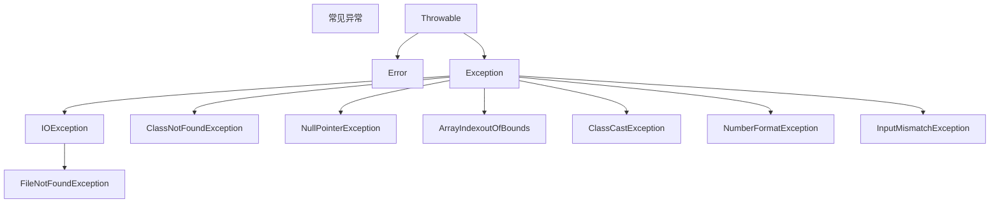

# Java基础

[TOC]

## 1. 类和对象基本概念

### 1.1 设计类就是设计类的成员

1. 属性 = 成员变量 = field = 域、字段
2. 方法 = 成员方法 = 函数 = method
3. 创建类的对象 = 类的实例化 = 实例化类

### 1.2 类和对象的使用

1. 创建类、设计类的成员
2. 创建类的对象
3. 对象实例化之后可以通过`对象.属性`或`对象.方法`进行调用

### 1.3 内存解析

1. 堆（Heap），此内存区域的唯一目的就是存放对象实例。java虚拟机规范中描述：所有的对象实例以及数组都要在堆上分配
2. 栈（Stack），是指虚拟机栈。用于存储局部变量，如编译期可知长度的基本数据类型，以及对象的引用
3. 方法区（Method Area），用于粗出已被虚拟机加载的类信息、常量、静态变量、即时编译器编译器后的代码等数据。

### 1.4 类中属性的使用

成员变量与局部变量

**相同点**

- 定义变量的格式：数据类型 变量名 =  变量值
- 先声明，后使用
- 变量都有其对应的作用域

**不同点**

- 类中声明位置的不同

  属性：直接定义在类的一对`{}`

  局部变量：声明在方法内、方法形参、代码块内、构造器形参、构造器内部的变量

- 权限修饰符不同’

  属性：可以声明属性时，指明其权限，使用权限修饰符

  常用的修饰符：`private`、`public`、缺省、`protected`

- 默认初始化值的情况

  属性：类的属性，有默认初始化值

  局部变量：没有初始化值，在调用局部变量之前，一定要显示赋值

- 内存中加载的位置不同

  属性：加载到堆空间中(非`static`)

  局部变量：加载到栈空间中

### 1.5 类方法

声明

```
权限修饰符 返回值类型 方法名(形参列表){
	方法体
}
```

方法也可以有`static`，`final`、`abstract`关键字修饰

## 2. 面向对象的思想

### 2.1 类和对象

类`class`和对象`Object`是面向对象的核心概念

- 类是一对食物的描述，是抽象的、概念上的定义
- 对象是实际存在的该事物的每个个体，因而也称为实例`instance`

### 2.2 万物皆对象

- 在Java范畴中，我们都将功能、结构等封装到类中，通过类的实例化，来调用具体的功能结构

- 涉及到`Java`语言与前端`html`、后端数据库交互时、前后端的结构在`Java`层面交互时、都体现为类、对象

### 2.3 内存解析

引用类型的变量，只可能存储两类值：`null` 或 地址值（含变量的类型）

## 3. 匿名对象

创建的对象没有显示的赋给一个变量名，即为匿名对象

匿名对象只能调用一次

## 4. 方法

### 4.1 方法的重载(overload)

概念：在同一个类中，允许存在一个以上的同名方法，只要它们的参数个数或者参数类型不同即可

特点：与返回值类型无关，只看参数列表，且参数列表必须不同。（参数个数或参数类型）。调用时，根据方法参数列表的不同来区别

重载与方法的权限修饰符、返回值类型、形参变量名、方法体都没有关系

### 4.2 可变个数的形参

`jdk5.0`之后提供了`variable number of arguments`机制，允许直接定义和多个实参相匹配的形参。从而，可以用一种更简单的方式，来传递个数可变的实参

定义

```java
public void example(int ... args) {
	
}

// 调用
example(1, 2, 3);
```

对于可变形参的方法参数的个数可以是`0~任意`个

可变个数形参的方法与本类中方法名相同，形参不同的方法之间构成重载

可变形参的方法与参数为数组的方法之间不能构成重载，如下

```java
// 这两个方法不能构成重载
public void example(int ... args) {
	
}

public void example(int[] args) {
	
}
```

可变形参的方法的形参本质上是一个数组，参数与数组的使用方法相同

可变形参的方法的可变形参必须在参数列表的最后

```java
public void example(int a, int ... args) {
	
}
```

可变个数形参在方法的形参中，最多只能声明一个可变形参

### 4,.3 参数的值传递机制

变量在赋值时会有以下两种情况

- 如果变量是基本数据类型，此时赋值的是变量所保存的数据值
- 如果变量是引用数据类型，此时赋值的是变量所保存的数据的地址值

## 5. 封装与隐藏

### 5.1 概念

优雅的程序设计追求"高内聚，低耦合"

- 高内聚：类的内部数据操作细节自己完成，不允许外部干涉
- 低耦合：仅对外暴露少量的方法用于使用

隐藏对象内部的复杂性，只对外公开简单的接口。便于外界调用，从而提高系统的可扩展性、可维护性。

封装性的体现：将类的属性私有化`private`，同时，提供公众的`public`方法来获取和设置此属性的值

### 5.2 权限修饰符

|    修饰符     | 类内部 | 同一个包 | 不同包的子类 | 同一个工程 |
| :-----------: | :----: | :------: | :----------: | :--------: |
|    private    |   Y    |          |              |            |
| default(缺省) |   Y    |    Y     |              |            |
|   protected   |   Y    |    Y     |      Y       |            |
|    public     |   Y    |    Y     |      Y       |     Y      |

权限修饰符可以用来修饰类及类的内部结构：属性、方法、构造器、内部类

修饰(外部)类的时候只能声明为：`public`、或者`default(缺省)`

## 6. 构造器

构造器、构造方法、`constructor`

```java
public class Person{
	// 构造器
	public Person(){
		
	}
}
```

构造器与类名相同

### 6.1 作用

- 创建对象
- 初始化成员变量

### 6.2 说明

- 如果没有显示的定义类的构造器，系统默认提供一个无参的构造器
- 定义构造器的格式：权限修饰符 类名(参数列表){}
- 构造器可以重载
- 一旦显示的定义了类的构造器，系统不在默认提供默认的空参构造器

## 7. JavaBean

`javaBean`是一种`java`语言编写的可重用组件

所谓`javaBean`，是指符合如下标准的`java`类

- 类是公共的
- 有一个无参的公共的构造器
- 有属性，且有对应的`get`、`set`方法

用户可以使用`JavaBean`将功能、处理、值、数据库访问和其他任何可以用`java`代码创造的对象进行打包、并且其他的开发者可以通过内部的`JSP`页面、`Servlet`、其他的`JavaBean`、`applet`程序或者应用来使用这些对象。用户可以认为`JavaBean`提供了一种随时随地的复制和粘贴的功能，而不用关心任何改变

## 8. this

`this`是`java`的关键字，可以用来修饰或调用：属性、方法、构造器，可省略不写

`this`指向的是当前的对象或者当前正在创建的对象

在类的构造器中可以通过`this(参数列表)`来显示的调用`构造器`，不能调用自己，而且`this(形参列表)`必须放在当前构造器的首行，只能显示调用一次构造器

`this`调用实例

```java
public class Person{
	private int age;
	public Person(int age){
        // 调用属性
		this.age = age;
	}
    public Person(){
        // 调用构造器
        this(10);
    }
}
```

## 9. package

- 为了更好的实现项目中类的管理，提供了包的概念
- 使用`package`声明类或接口所属的包，声明在源文件的首行
- `.`代表一层文件目录
- 同一个包下不能命名同名的接口类

```java
package com.java.study;
```

常用类包


| 包名      | 功能                                                         |
| --------- | ------------------------------------------------------------ |
| java.lang | 包含一些java语言的核心类，如`String`、`Math`、`Integer`、`System`等 |
| java.net  | 包含执行与网络相关的操作的类和接口                           |
| java.io   | 包含能提供多种输入/输出功能的类                              |
| java.util | 包含一些实用工具类，如定义系统特性、接口的集合框架类、使用与日期日历相关的函数 |
| java.text | 包含了一些java格式化相关的类                                 |
| java.sql  | 包含了java进行JDBC数据库编程的相关类/接口                    |
| java.awt  | 包含了构成抽象窗口工具集`abstract window toolkits`的多个类，这些类被用来构建和管理应用程序的图形用户界面`GUI` |

## 10. MVC设计模式

`MVC`是常用的设计模式之一，将整个程序分为三个层次：视图模型层，控制器层，与数据模型层。这种将程序输入输出、数据处理，以及数据的展示分离开来的设计模式使程序结构变得灵活清晰，同时也描述了程序各个对象间的通信方式，降低了程序的耦合性。

1. 模型层 `model`主要处理数据
   - 数据对象封装  `model.bean/domain`
   - 数据库操作类 `model.dao`
   - 数据库 `model.db`
2. 控制层 `controller`处理业务逻辑
   - 应用界面相关 `controller.activity`
   - 存放 `frgment` `controller.fragment`
   - 显示列表的适配器 `controller.adapter`
   - 服务相关的 `controller.service`
   - 抽取的基类 `controller.base`
3. 视图层 `view`显示数据
   - 相关工具类
   - 自定义`view` `view.ui`

## 11. import

1. `import`关键字的使用在源文件中显式的使用`import`导入指定包下的类、接口

   ```java
   // 导入Arrays
   import java.util.Arrays;
   ```

2. 使用`*`导入某一包下的所有结构

   ```java
   import java.util.*;
   ```

3. 对于`java.lang.*`的结构，默认自动导入所有结构，如果使用`XXX.*`下的子包结构，仍然需要显示导入

4. 如果使用的类或接口是本包下定义的，则可以省略`import`结构

5. 在源文件中使用了不同包下的同名的类，则必须至少有一个类需要以全类名的方式显示

6. 导入指定类或接口中的静态结构

   ```java
   import static java.lang.System.*;
   
   // 导入java.lang.System.* 下的所有静态结构
   out.println("Hello World")
   ```

## 12. 继承

### 12.1 快速入门

父类

```java
class Person{
	int id;
	int age;
	String name;
}
```

子类

```java
class Student extends Person{
	public Student(int id, int age){
		this.id = id;
		this.age = age;
	}
}
```

### 12.2 继承的优点

1. 减少代码的冗余，提高了代码的复用性
2. 便于功能的扩展
3. 为之后的多态性，提供了前提

### 12.3 继承的特点

1. 格式

   ```java
   class A extends B{
   	
   }
   ```

2. `A`：子类、派生类、`subclasss`

3. `B`：父类、超类、基类、`superclass`

4. 体现：子类`A`继承父类`B`以后，子类`A`中就获取了父类`B`中声明的结构：属性、方法

5. 特别的：父类中声明为`private`的属性或方法，子类继承父类以后，仍然认为获取了父类中私有的结构，只是因为封装性的影响，使得子类不能直接调用父类的结构而已

6. 子类在继承父类之后，也可以定义自己特有的属性和方法，实现功能的拓展

7. 一个类可以被多个类继承

8. 一个类只能继承一个类，即只能`单继承`

9. 类可以多层继承

10. 子类直接继承的父类，称为直接父类，间接继承的父类，称为间接父类

## 13. 方法重写

1. 概述：在子类中可以根据需要对从父类中继承而来的方法进行改造，也称为方法的覆盖、重置。在程序执行时，子类的方法将覆盖父类的方法
2. 要求：
   - 子类重写的方法必须和父类被重写的方法具有相同的方法名称，参数列表 
   - 子类重写的方法的返回值类型不能大于父类被重写的方法的返回值类型
   - 子类重写的方法使用的访问权限不能小于父类被重写的方法的访问权限，并且子类不能重写父类中声明为`private`权限的方法
3. 子类方法抛出的异常不能大于父类被重写方法的异常

## 14. super

`super`用于子类中调用父类同名的属性、方法、构造器

属性和方法的调用

```java
super.属性;
super.方法();
```

构造器的调用

```java
super(形参列表);
```

子类的构造器中如果没有显示的调用`super`，`java`默认会调用`super()`，即调用父类的无参构造器

### 14.1 子类实例化对象的过程

子类继承父类以后，就获得了父类中声明的属性或方法

创建子类的对象，在堆空间中，就会加载所有父类中声明的属性

当我们通过子类的构造器创建子列对象时，我们一定会直接或间接的调用其父类的构造器，进而调用父类的父类的构造器，直到调用了`java.lang.Object`类中空参的构造器为止。因为加载过所有的父类的结构，所以才可以看到内存中有父类中的结构，子类对象才可以考虑引用。

## 15. 多态性

### 15.1 概述

理解：一个事物的多种形态

对象的多态性：父类的引用指向子类的对象

### 15.2 实例

父类

```java
public class Person {
    String name;
    int age;

    public void eat(){
        System.out.println("人：吃饭");
    }
}
```

子类一

```java
public class Man extends Person {
    public void eat(){
        System.out.println("男人多吃肉，长肌肉");
    }
    public void earnMoney(){
        System.out.println("男人负责挣钱养家");
    }
}
```

子类二

```java
public class Woman extends Person {、
    public void goShopping(){
        System.out.println("女人喜欢购物");
    }
    public void eat(){
        System.out.println("女人少吃，为了减肥");
    }
}
```

主类

```java
public class Main {
    public static void main(String[] args){
        Person p1 = new Man();
        Person p2 = new Woman();
        
        p1.eat();
        p2.eat();
        
        // 不能调用父类中没有的方法
        // p1.earnMoney();
    }
}
// 男人多吃肉，长肌肉
// 女人少吃，为了减肥
```

### 15.3 多态的使用

当调用子父类中同名参数的方法时，实际执行的是子类重写的方法------虚拟方法调用

在编译期只能调用父类中声明的方法，但在运行期，执行的是子类重写父类的方法

多态的前提：类的继承关系，方法的重写

### 15.4 多态实例

```java
public class AnimalTest {
    public static void main(String[] args){
        func(new Dog());
        func(new Cat());
    }
    public static void func(Animal animal) {
        animal.eat();
        animal.shout();
    }
}

class Animal{
    public void eat(){
        System.out.println("动物：进食");
    }
    public void shout(){
        System.out.println("动物：叫");
    }
}

class Dog extends Animal{
    public void eat(){
        System.out.println("狗吃骨头");
    }
    public void shout(){
        System.out.println("汪汪汪");
    }
}

class Cat extends Animal{
    public void eat(){
        System.out.println("猫吃鱼");
    }
    public void shout(){
        System.out.println("喵喵喵");
    }
}
```

输出

```
狗吃骨头
汪汪汪
猫吃鱼
喵喵喵
```

### 15.5 虚拟方法调用

子类中定义了与父类同名同参数的方法，在多态情况下，将此时父类的方法称为虚拟方法，父类根据赋给它的不同子类对象，动态调用属于子类的该方法。这样的方法调用在编译期是无法确定的

虚拟方法的调用又可以称为`动态绑定`

### 15.6 向下转型

有了对象的多态性以后，内存中实际上是加载了子类特有的属性和方法，但由于变量声明为父类类型，导致编译时只能调用父类中声明的属性和方法，子类特有的属性和方法不能调用

解决办法，使用强制类型转换

```java
子类 对象名 = (子类)要转换的父类对象;
```

对于不能转换失败的对象会抛出`ClassCastException`异常

### 15.7 instanceof

通过`instanceof`可以判断某一对象是否是另外一个类的实例，返回`boolean`类型

```java
object instanceof class;
```

在进行向下转型的时候应该先使用`instanceof`来判断，防止出现`ClassCastException`

`class`可以是当前对象的父类或者间接父类

## 16. Object类

`Object`类是所有`Java`类的根父类

如果没有显示的声明一个类的父类，则此类继承于`java.lang.Object`类，即除`java.lang.Object`所有的类都直接或者间接的继承于`java.lang.Object`

`Object`只有一个空参构造器

`Object`的方法

```java
// 返回当前对象的副本
Object clone()

// 比较两个对象
boolean equals()

// 打印
String toString()

// 对象回收之前会调用此方法
void finalize()

// 等等
```

### 16.1 ==与equals()的区别

> `==`：运算符

1. 可以使用在基本数据类型变量和引用数据类型变量中
2. 如果比较的是基本数据类型变量：比较两个变量保存的数据是否相等（类型不一定相同）
3. 如果比较的是引用数据类型：比较的是两个变量保存的地址是否相等，即比较两个对象是否指向同一个对象实体

> equals()

1. 是一个方法，而非运算符

2. 只适用于引用数据类型

3. `Object`类中`equals()`的定义

   ```java
   public boolean equals(Object obj) {
   	return (this == obj);
   }
   ```

4. 对于`String`、`Date`、`File`、包装类等都重写了`Object`类中的`equals()`方法。重写之后不是比较两个引用的地址是否相同，而是比较的实体内容是否相同

### 16.2 equals重写

通常情况下，我们自定义的类如果使用`equals()`，比较的是两个对象的"实体内容"是否相同，就需要对`equals()`进行重写

```java
package equals;

public class PersonTest {
    public static void main(String[] args){
        Person p1 = new Person(20, "小明");
        Person p2 = new Person(20, "老王");
        
        // 输出false
        System.out.println(p1.equals(p2));
    }
}

class Person{
    int age;
    String name;
    public Person(int age, String name){
        this.age = age;
        this.name = name;
    }

    @Override
    public boolean equals(Object o) {
        if (this == o) return true;
        if (!(o instanceof Person)) return false;
        Person person = (Person) o;
        return age == person.age && this.name.equals(person.name);
    }
}
```

### 16.3 toString

当我们输出一个对象的引用时，实际上就是调用了对象的`toString()`的方法

`Object`中`toString()`的定义

```java
public String toString() {
	return getClass().getName() + "@" + Integer.toHexString(hashCode());
}
```

在`String`、`Date`、`File`、包装类等都重写了`Object`类中的`toString()`方法，使得在调用对象的`toString()`时，返回实体内容信息

```java
package toString;

public class PersonTest {
    public static void main(String[] args){
        Person p1 = new Person(20, "小明");
        
        // 输出
        // Person[name=小明, age=20]
        System.out.println(p1.toString());
    }
}

class Person{
    int age;
    String name;
    public Person(int age, String name){
        this.age = age;
        this.name = name;
    }
    public String toString(){
        return "Person[name=" + this.name + ", age=" + this.age + "]";
    }
}
```

## 17. 单元测试方法

> eclipse

1. 选中当前工程- 右键选择：`build path` -> `add libraries` -> `JUnit 4`  -> `下一步`
2. 创建`java`类，进行单元测试，此时`Java`类要求：此类是`public`，此类提供公共无参的构造器
3. 此类中声明单元测试方法，此时的单元测试方法：方法的权限是`public`，没有返回值，没有形参
4. 此单元测试方法上需要声明注解：`@Test`，并在单元测试类中导入：`import org.junit.Test`
5. 声明好单元测试方法以后，就可以在方法体内测试相关的代码
6. 写完代码以后，左键双击单元测试方法名

> IDEA

右键当前类，选择`Go To` -> `Test` -> `Create  New Test` -> `JUnit4` -> `勾选Methods` -> 书写测试代码 -> 右键运行

## 18. 包装类

### 18.1 概述

针对八种基本数据类型定义相应的引用数据类型-包装类(封装类)

有了类的特点，可以调用类中的方法，`Java`才是真正的面向对象

| 基本数据类型 |  包装类   |
| :----------: | :-------: |
|     byte     |   Byte    |
|    short     |   Short   |
|     int      |  Integer  |
|     long     |   Long    |
|    float     |   Float   |
|    double    |  Double   |
|   boolean    |  Boolean  |
|     char     | Character |

### 18.2 包装类的使用

`Java`提供了8中基本数据类型对应的包装类，使得基本数据类型的变量具有类的特征

基本数据类型转包装类：调用包装类的构造器

```java
int num = 1;
Integer n1 = new Integer(num);
Integer n2 = new Integer("123");
```

包装类转换为基本数据类型：调用包装类的`xxxValue()`

```java
int n = n1.intValue();
```

自动装箱

```java
public static void main(String[] args) {
    int n = 10;
    method(n);
    Integer n2 = num;
}
public static void method(Object obj) {
	System.out.println(obj);
}
```

自动拆箱

```java
public static void main(String[] args) {;
    Integer n = new Integer(10);
    int num = n;
}
```

基本数据类型、包装类 ----> `String`类型

```java
public static void main(String[] args) {
    // 方式1：连接运算
    int num = 10;
    String str = num + "";
    
    // 方式2：
    String str2 = String.valueOf(num);
}
```

`String` ---> 基本数据类型、包装类

调用包装类中的`parseXxx(String s)`：可能会报`NumberFormatException`

```java
int num = Integer.parseInt("123");
```

对于`Integer`：`Integer`内部定义了`IntegerCache`结构，`IntegerCache`中定义了`Integer[]`缓存，保存了`-128~127`的整数，如果使用自动装箱，直接使用数组中的元素，提高效率。

## 19. static

1. `static`：静态的
2. `static`可以用来修饰：属性、方法、代码块、内部类

### 19.1 使用`static`修饰变量

- 属性：按照是否使用`static`修饰，又分为：静态变量(类变量) 和 非静态变量(实例变量)

- 实例变量：创建一个类的多个对象，每个对象都独立的拥有一套类中的非静态属性。当修改其中一个队形的非静态属性时，不会导致其他对象中同样的属性值哦的修改

- 静态变量：创建一个类的多个对象，多个对象共享一个静态变量

- 注意：静态变量随着类的加载而加载，静态变量的加载早于对象的创建，静态变量在内存中仅有一份，存在方法区的静态域中

- 静态变量可以通过类名调用

  ```java
  类名.静态变量;
  ```

### 19.2 使用`static`修饰方法

- 通过类名调用静态方法

  ```
  类名.静态方法(形参列表);
  ```

- 也可以通过对象调用静态方法

  ```
  对象.静态方法(形参列表);
  ```

- 静态方法中只能调用静态方法或属性

- 非静态的方法可以调用静态方法或属性

- 静态方法内部不能使用`this`和`super`

## 20. main方法的使用

1. `main()`方法作为程序的入口
2. `main()`方法也是一个普通的静态方法
3. `main(String[] args)`参数列表获取的是程序启动时附带的参数

## 21 设计模式

设计模式是在大量的实践中总结和理论之后优选的代码结构、编程风格、以及解决问题的思考方式

### 21.1 单例设计模式

采取一定的方法保证整个的软件系统中，对某个类只能存在一个对象实例，并且该类只提供一个取得其对象实例的方法

**创建单例模式的步骤**

1. 私有化类的构造器
2. 内部创建类的对象
3. 提供公共静态的方法，返回类的对象

**实现一**：饿汉式

```java
class Bank{

    // 私有化类的构造器
    private Bank() {

    }

    // 内部创建类的对象
    private Bank instance = new Bank();

    // 提供公共的方法，返回类的对象
    public Bank getInstance(){
        return instance;
    }
}
```

1. 私有化类的构造器
2. 内部创建**静态的类的对象**
3. 提供公共静态的方法，返回类的对象

**实现2**：懒汉式

```java
class Bank{
    // 私有化类的构造器
    private Bank() {

    }
    // 声明当前类对象，没有初始化
    private static Bank instance = null;

    // 声明public,static返回当前类对象的方法
    public static Bank getInstance(){
        instance = instance == null ? new Bank() : instance;
        return instance;
    }
}
```

**两种方式对比**

饿汉式：

- 坏处：对象加载时间过长
- 好处：饿汉式是线程安全的

懒汉式：

- 好处：延迟对象的创建
- 坏处：线程不安全

### 21.2 模板方法设计模式

抽象类体现的就是一种模板模式的设计，抽象类作为子类的通用模板，子类的通用模板，子类在抽象类的基础上进行扩展、改造，但子类总体上会保留抽象类的行为方式

当功能内部一部分实现是确定的，一部分是不确定的。这时可以把不确定的部分暴露出去，让子类实现

### 21.3 代理模式

> **概述**

代理模式是`Java`开发中使用较多的一种设计模式。代理模式就是为其他对象提供一种代理以控制对这个对象的访问

```java
// 代理模式
public class NetWorkTest {
    public static void main(String[] args) {
        ProxyServer proxyServer = new ProxyServer(new Server());
        proxyServer.browse();
    }
}

interface NetWork{
    public void browse();
}
// 代理类
class ProxyServer implements NetWork{
    private  NetWork work;
    public ProxyServer(NetWork work) {
        this.work = work;
    }

    public void check() {
        System.out.println("联网之前的检查工作");
    }
    public void browse() {
        check();
        work.browse();
    }
}
// 被代理类
class Server implements NetWork{
    public void browse(){
        System.out.println("真实的服务器访问网络");
    }

```

> **应用场景**

- 安全代理：屏蔽对真实角色的直接访问
- 远程代理：通过代理类处理远程方法调用`RMI`
- 延迟加载：先加载轻量级的代理对象，真正需要再加载真实对象

> **分类**

- 静态代理(静态定义代理类)
- 动态代理(动态生成代理类)

### 21.4 工厂模式

> **概述**

工厂模式：实现了创建者与调用者的分离，即将创建对象的具体过程屏蔽隔离起来，达到提高灵活性的目的。

> **简单工厂**

```java
public class CarFactoryTest {
    public static void main(String[] args) {
        Car audi = CarFactory.getCar("奥迪");
        Car byd = CarFactory.getCar("比亚迪");
        
    }
}

interface Car{
    void run();
}

class Audi implements Car{
    public void run(){
        System.out.println("奥迪在跑");
    }
}

class BYD implements Car{
    @Override
    public void run() {
        System.out.println("比亚迪在跑");
    }
}

class CarFactory{
    public static Car getCar(String type){
        if("奥迪".equals(type)) return new Audi();
        if("比亚迪".equals(type)) return new BYD();

        return null;
    }
}
```

缺点：对于增加新产品，不修改代码的话，是无法扩展的。违反了开闭原则（对扩展开放，对修改封闭） 

> 工厂方法模式

```java
public class Main {
    public static void main(String[] args) {
        Car audi = new AudiFactory().getCar();
        Car byd = new BYDFactory().getCar();

    }
}

interface Car{
    void run();
}

interface Factory{
    Car getCar();
}

class AudiFactory implements Factory{
    public Audi getCar(){
        return new Audi();
    }
}

class BYDFactory implements Factory{
    public BYD getCar(){
        return new BYD();
    }
}
class Audi implements Car{
    public void run(){
        System.out.println("奥迪在跑");
    }
}

class BYD implements Car{
    public void run() {
        System.out.println("比亚迪在跑"); 
    }
}
```


## 22. 代码块

代码块是指由一对`{}`包括起来的代码

```java
class Person{
	// 代码块
	{
	
	}
	
    // 静态代码块
	static{
		
	}
}
```

作用：用来初始化类，对象，只能被`static`修饰或者没有修饰	

> **静态代码块**

- 内部可以有输出语句
- 随着类的加载而执行，而且只会执行一次
- 如果一个类中定义了多个静态代码块，则按照声明的先后顺序执行
- 静态代码块的执行要优先于非静态代码块的执行
- 只能调用静态结构，不能调用非静态的结构

> **非静态代码块**

- 内部可以有输出语句
- 随着对象的创建而执行，而且每创建一次对象就会执行一次
- 可以在创建对象时，对对象的属性等进行初始化
- 如果一个类中定义了多个代码块，则按照声明的先后顺序执行

## 23. final

`final`：最终的

`final`可以用来修饰的结构：类、方法、变量

被`final`修饰的类不能被继承

```java
final class A{
	
}
```

被`final`修饰的方法不能被重写

```java
class A {
	public final void show(){
		
	}
}
```

被`final`修饰的变量称为常量：值不可修改

成员变量与局部变量只能在声明时使用，

赋值的位置：显示初始化、代码块中初始化、构造器中初始化

```java
class A {
	final int variable = 10;
    final int variable2;
    final int variable3;
    {
        variable2 = 20;
    }
    public A(){
        variable3 = 30;
    }
}
```

`final`修饰局部变量

```java
public void show(){
	final int NUM = 10;
}

// NUM只能在方法内使用，但不能修改
public void show(final int NUM){
    System.out.println(NUM)
}
```

## 24. 抽象类和抽象方法

> **概念**

随着继承层次中一个个新子类的定义，类变得越来越具体，而父类则更一般，更通用。类的设计应该保证父类和子类能够共享特征。有时将一个类设计得非常抽象，以至于它没有具体的实例，这样的类叫做抽象类

> **abstract**

1. `abstract`：抽象的
2. `abstract`可以用来修饰的结构：类、方法
3. `abstract`不能用来修饰私有方法、静态方法、`final`的方法、`final`的类

> **`abstract`修饰类**

1. 被`abstract`修饰的类不能够初始化
2. 抽象类中一定有构造器，便于子类实例化调用

> **abstract修饰方法**

1. 抽象方法只有方法的声明，没有方法体
2. 包含抽象方法的类，一定是一个抽象方法
3. 若子类重写了父类的所有的抽象方法，子类可以实例化
4. 若子类没有重写了父类的所有的抽象方法，子类是一个抽象类

```java
// 抽象类
abstract class Person{
    String name;
    int age;
    public Person(){

    }
    public Person(int age, String name) {
        this.age = age;
        this.name = name;
    }
    // 抽象方法
    public abstract void eat();
}
class Student extends Person {
    public Student(int age, String name) {
        super(age, name);
    }
    public void eat() {
        
    }
}
```

> **匿名子类**

```java
public class Anonymous {
    public static void main(String[] args) {
        
        // 创建了一个匿名类的对象：p
        Person p = new Person() {
            @Override
            public void eat() {
                System.out.println("人能吃饭");
            }
        };
        
        p.eat();
    }
}

abstract class Person{
    public abstract void eat();
}
```

## 25. 接口

 `interface`：在JAVA编程语言中是一个抽象类型，是抽象方法的集合，接口通常以interface来声明。一个类通过继承接口的方式，从而来继承接口的抽象方法。

### 25.1 接口的使用

1. 接口使用`interface`来定义

2. `Java`中，接口和类是并列的两个结构

3. 定义接口的成员

   - 全局常量

     ```java
     public static final var;
     ```

   - 抽象方法

     ```java
     public abstract 返回值 方法名();
     ```

4. 接口不能定义构造器，不能实例化

5. `Java`开发中，接口通过让类去实现`implements`的方式来使用，如果实现类覆盖了接口中的所有方法，则此类就可以实例化，如果实现类没有覆盖接口中所有的抽象方法，则此实现仍为一个抽象类。

   ```java
   interface Flyable{
       // 全局常量
       public static final int MAX_SPEED = 7900;
       // int MAX_SPEED = 7900; 可以省略public static final
   
       // 抽象方法
       public abstract void fly();
       // void fly(); 可以省略public abstract
   
   }
   
   // 可以通过类实现接口
   class Plane implements Flyable{
       public void fly(){
   
       }
   }
   ```

6. `java`类可以实现多接口

   ```java
   class A extends B implements C, D{
   	
   }
   ```

7. 接口之间也可以继承

   ```java
   interface A{
   	
   }
   interface B{
   
   }
   interface c extends A, B{
   	
   }
   ```

8. 接口的具体使用，体现多态性

   ```java
   public class InterfaceUse {
       public static void main(String[] args) {
           
           // 体现多态
           Computer computer = new Computer();
           computer.transferData(new Flash());
           computer.transferData(new Printer());
       }
   }
   
   class Computer{
       public void transferData(USB usb) {
           usb.start();
           System.out.println("正在传输数据");
           usb.stop();
       }
   }
   
   interface USB{
       // 常量：定义了长、宽、最大最小传输速率
   
       void start();
       void stop();
   }
   
   class Flash implements USB{
   
       @Override
       public void start() {
           System.out.println("U盘开始工作");
       }
   
       @Override
       public void stop() {
           System.out.println("U盘结束工作");
       }
   }
   
   class Printer implements USB{
   
       @Override
       public void start() {
           System.out.println("打印机开始工作");
       }
   
       @Override
       public void stop() {
           System.out.println("打印机结束工作");
       }
   }
   ```

9. 接口实际上就是一种规范

10. 创建接口的匿名实现类的非匿名对象

    ```java
    USB phone = new USB() {
        @Override
        public void start() {
        System.out.println("手机开始工作");
        }
    
        @Override
        public void stop() {
        System.out.println("手机停止工作");
        }
    };
    
    computer.transferData(phone);
    ```

11. 同时调用接口和父类的同名变量

    ```java
    interface A {
        int x = 0;
    }
    class B{
        int x = 1;
    }
    class C extends B implements A{
        public void pX(){
            System.out.println(super.x); // 调用父类的x
            System.out.println(A.x); 	// 调用接口的x
        }
        public static void main(String[] args) {
            new C().pX();
        }
    }
    ```

### 25.2 JDK8接口特性

在`JDK8`：接口除了定义全局常量和抽象方法之后，还可以定义静态方法，默认方法

```java
interface Interface{

    // 静态方法
    public static void method1(){
        System.out.println("JDK8可以有方法体");
    }

    // 默认方法
    public default void method2(){
        System.out.println("JDK8默认方法");
    }
}
```

接口中定义的静态方法，只能通过接口来调用

```java
public static void main(String[] args) {
	Interface.method1();
}
```

通过实现类的对象，可以调用接口中的默认方法，如果实现的类重写了接口中的默认方法，调用时，仍然调用的是重写的方法

如果子类或实现类继承的父类和实现的接口中声明了同名同参数的方法，默认调用父类同名同参数的方法

如果实现类实现了多个接口，多个接口中**不能**定义同名同参数的默认方法，或者在实现类中重写这个方法

在实现类中调接口的默认方法

```java
Interface.super.method2();
```

## 26. 内部类

### 26.1 概述

- 当一个事物的内部，还有一个部分需要一个完整的结构进行描述，而这个内部的完整的结构又只为外部事物提供服务，那么整个内部的完整结构最好使用内部类
- 在`java`中，允许一个类的定义位于另一个类的内部，前者成为内部类，后者称为外部类。
- `inner class`一般用在定义它的类或者语句块之内，在外部引用它时必须给出完整的名称
- 分类：1.成员内部类`static`内部类和非`static`成员内部类 2.局部内部类(忽略修饰符)、匿名内部类

### 26.2 定义

```java
class Animal{
	String name;
    // 外部类的结构
    public void eat(){
        System.out.println("动物会吃饭");
    }
    
    // 成员内部类
    class Dog{
        String name;
        public void bark(){
            System.out.println("汪汪汪");
        }
        public void display(String name){
            System.out.println(name); //方法的形参
            System.out.println(this.name); // 内部类的属性
            System.out.println(Animal.this.name); // 外部类的属性
        }
    }

    // 静态成员内部类
    static class Bird{
        String name;
        public void sing(){
            System.out.println("吱吱吱");
        }
    }
}
```

- 成员内部类

  可以定义属性、方法、构造器，可以被`final`修饰，可以被`abstract`修饰，可以被`static`修饰

  可以调用外部的结构

- 创建静态的内部类

  ```java
  public static void main(String[] args) {
  	Animal.Bird bird = new Animal.Bird();
      bird.sing();
  }
  ```

- 创建非静态的内部类

  ```java
  public static void main(String[] args) {
      Animal animal = new Animal();
      Animal.Dog dog = animal.new Dog();
      dog.bark();
  }
  ```


## 27. 异常处理

### 27.1 异常概述与异常体系结构

在`java`语言中，将程序执行中发生的不正常情况成为"异常"

`java`程序在执行过程中所发生的异常事件可分为两类：

- `Error`：java虚拟机无法解决的严重问题。如`JVM`系统内部错误、资源耗尽等严重情况
- `Exception`：其它因编程错误或偶然的外在因素导致的一般性问题，可以使用针对性的代码进行处理，如：空指针访问，试图读取不存在的文件，网络连接中断，数据角标越界

对于这些错误，一般有两种解决办法：

- 遇到错误就终止程序的运行
- 程序员在编写程序时，就考虑到错误的检测、错误消息的提示，以及错误的处理

异常的体系结构

`java.lang.Throwable`其有两个子类

- `java.lang.Error`不需要针对性处理
- `java.lang.Exception`需要处理



常见运行时异常举例

```java
// NullPointerException
public static void test1(){
	int arr[] = null;
	System.out.println(arr[0]);
}

// ArrayIndexOutOfBoundsException
public static void test2(){
	int arr[] = new int[1];
	System.out.println(arr[1]);
}

// ClassCastException
public static void test3(){
	Object obj = new Date();
	String str = (String)obj;
}
```

### 27.2 异常处理

抛：程序在执行的过程中，一旦出现异常，就会在异常代码出生成功一个对应异常类的对象，并将此对象抛出，其后代码不再执行

抓：异常的处理方式`try catch finally`,`throws`

#### 27.2.1 try catch finally

```java
try	{
	// 可能出现的异常代码
} catch(异常类型1 变量1) {
	// 处理异常的方式1
} catch(异常类型2 变量2) {
	// 处理异常的方式2
} finally {
	// 一定会执行的代码
}
```

样例

```java
public class ExceptionTest {
    public static void main(String[] args){
        String str = "abc";
        try {
            int num = Integer.parseInt(str);
        } catch(NumberFormatException e) {
            System.out.println("数值转换异常");
        }
    }
}

/*
* 数值转化异常
*/
```

- 使用`try`将可能会出现异常的代码包裹起来，在程序执行过程中，会生成一个异常对象，根据此对象的类型去`catch`中匹配

- 一旦`try`中的异常对象匹配到某一个`catch`时，就进入`catch`中进行异常的处理，处理完成即跳出`try catch`结构(无finally)

- `finally`是可选的，如果存在`finally`，`finally`中的语句一定会被执行，对于数据库的连接、输入输出流、`socket`的关闭尽量放在`finally`

- `catch`中的异常类型如果没有子父类关系，无声明的先后顺序，如果满足子父类关系，要求子类一定声明在父类的上面

- 常用的异常对象处理方式通过`e`对象调用

  ```java
  String getMessage();
  void printStackTrace();
  ```

- `try catch`结构可以嵌套

#### 27.2.2 throws

- “`throws` + 异常类型” 写在方法的声明处。指明此方法执行时，可能会抛出的异常类型，一旦当方法体执行时，出现异常，仍会在异常代码处生成一个异常类的对象，此对象满足`throws`异常类型时，就会抛出。后续代码不在执行

- `throws`只是将异常抛给了方法的调用者，并没有真正处理异常

  ```java
  import java.io.File;
  import java.io.FileInputStream;
  import java.io.FileNotFoundException;
  import java.io.IOException;
  
  public class ExceptionTest2 {
  
      public static void main(String[] args) {
          try {
              method2();
          } catch(FileNotFoundException e){
              e.printStackTrace();
          } catch (IOException e) {
              e.printStackTrace();
          }
      }
  
      public static void method2() throws FileNotFoundException, IOException{
          method1();
      }
  
      public static void method1() throws FileNotFoundException, IOException {
          File file = new File("hello.txt");
          FileInputStream fis = new FileInputStream(file);
  
          int data = fis.read();
          while(data != -1) {
              System.out.println((char)data);
          }
  
          fis.close();
      }
  }
  ```

- 子类重写的方法抛出的异常类型不大于父类被重写的方法抛出的异常类型

- 如果父类中被重写的方法没有`throws`方式处理异常，则子类重写的方法也不能使用`throws`

### 27.3 主动抛出异常

- 抛出运行时异常(不强制处理)

  ```java
  public class ThrowTest {
      public static void main(String[] args) {
          Student s = new Student();
          s.register(-100);
      }
  }
  class Student{
      private int id;
      public void register(int id) {
          if(id > 0){
              this.id = id;
          } else {
              throw new RuntimeException("输入数据非法");
          }
      }
  }
  ```

- 需要显示处理的方式

  ```java
  public class ThrowTest {
      public static void main(String[] args) {
          Student s = new Student();
          try {
              s.register(-100);
          } catch (Exception e) {
              e.printStackTrace();
          }
      }
  }
  class Student{
      private int id;
      public void register(int id) throws Exception{
          if(id > 0){
              this.id = id;
          } else {
              throw new Exception("输入数据非法");
          }
      }
  }
  ```

### 27.4 自定义异常类

1. 继承于现有的结构：`RuntimeException`、`Exception`

2. 提供全局常量`serialVersionUID`

3. 提供重载构造器

   定义

   ```java
   public class MyException extends RuntimeException{
       static final long serialVersionUID = -70348766939L;
       public MyException(){
       }
       public MyException(String s){
           super(s);
       }
   }
   ```

   使用

   ```java
   public class ThrowTest {
       public static void main(String[] args) {
           Student s = new Student();
           s.register(-100);
       }
   }
   class Student{
       private int id;
       public void register(int id){
           if(id > 0){
               this.id = id;
           } else {
               throw new MyException("不能输入负数");
           }
       }
   }
   ```