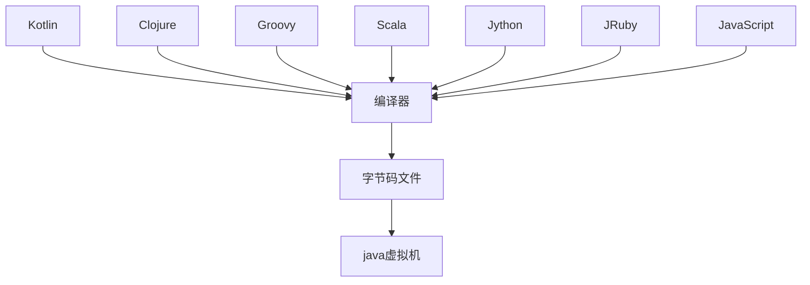

# JVM

[TOC]

## 1. JVM与java体系

`JVM`是一个跨语言的平台，在`java7`的发布之后，`java`虚拟机的设计者们通过`JSR-292`规范基本实现在`java`虚拟机上运行非`java`语言编写的程序



### 1.1 字节码

- 对于字节码的理解，任何能在`jvm`平台上执行的字节码格式都是一样的。所以应该统称为`jvm`字节码
- 不同的编译器，可以编译出相同的字节码文件，字节码文件也可以在不同的`JVM`上运行
- `java`虚拟机与`java`语言没有必然的联系，它只与特定的二进制文件格式——`Class`文件格式所关联，`class`文件中包含了`java`虚拟机指令集(或者称为字节码`Bytecodes`)和符号表，还有一些其它辅助信息

### 1.2 多语言混合编程

- `java`平台上，通过特定领域的语言去解决特定领域的问题是当前软件开发的一个趋势

- 某一个项目

  ```mermaid
  graph TD
  并行处理 --> Clojure
  展示层 --> JRuby/Rails
  中间层 --> Java
  ```

- 各种语言之间的交互不存在任何困难，就像使用自己语言的原生`API`一样，因为它们最终都运行在一个虚拟机上

- 对于运行在`java`虚拟机之上、`java`之外的语言，来自系统级、底层的支持正在迅速曾倩，以`JSR-292`为核心的一系列项目和功能改进

  ```
  Vinci Machine
  Nashorn
  InvokeDynamic
  java.lang.invoke
  ```


### 1.3 虚拟机

#### 1.3.1 虚拟机

- 所谓虚拟机`virtual machine`，就是一台虚拟的计算机，它是一款软件，用来执行一系列虚拟计算机指令。大体上，虚拟机可以分为系统虚拟机和程序虚拟机

  `virtual box`，`VMware`就属于系统虚拟机，它们完全是对物理计算机的仿真，提供了一个可运行完整操作系统的软件平台

  程序虚拟机的典型代表就是`java`虚拟机，它专门执行单个计算机程序而设计，在`java`虚拟机中执行的指令我们称为`java`字节码指令

- 无论是系统虚拟机还是程序虚拟机，在上面运行的软件都被限制于虚拟机提供的资源中

#### 1.3.2 java虚拟机

- `java`虚拟机是一台执行`java`字节码的虚拟计算机，它拥有独立的运行机制，其运行的`java`字节码也未必有`java`语言编译而成

- `JVM`平台的各种语言可以共享`java`虚拟机带来的跨平台性、优秀的垃圾回收器，以及可靠的即时编译器

- `java`技术的核心就是`java`虚拟机，因为所有的`java`程序都运行在`java`虚拟机内部

- `java`虚拟机就是二进制字节码的运行环境，负责装载字节码到其内部，解释/编译为对应平台上的机器指令执行。每一条`java`指令，`java`虚拟机规范都有详细定义

- 特点

  一次编译，到处运行

  自动内存管理

  自动垃圾回收机制

### 1.4 java整体结构

- `HotSpot VM`目前市面上高性能虚拟机的代表作之一
- 它采用解释起与即时编译器并存的架构


