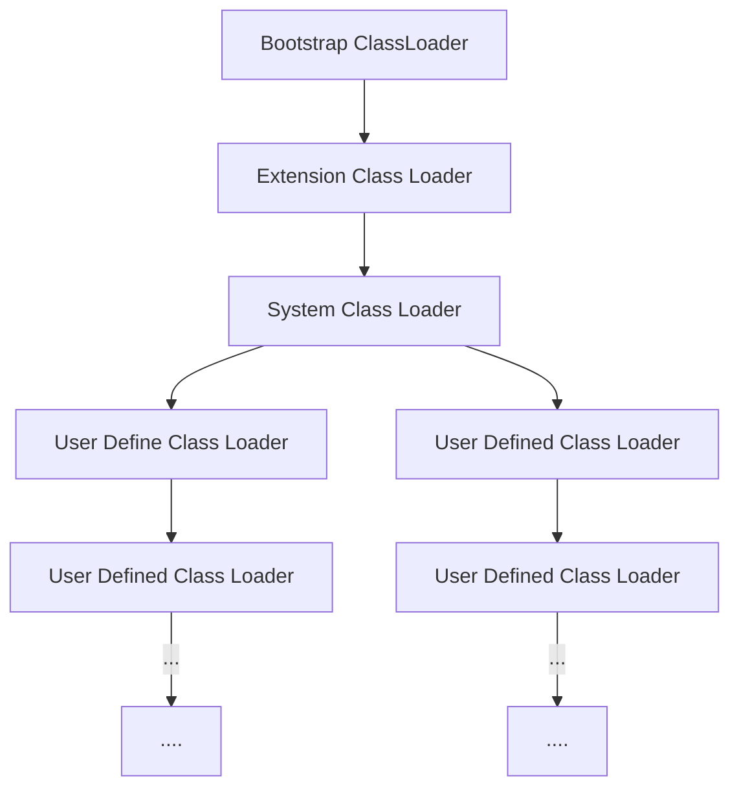

# JVM

[TOC]

## 1. JVM与java体系

`JVM`是一个跨语言的平台，在`java7`的发布之后，`java`虚拟机的设计者们通过`JSR-292`规范基本实现在`java`虚拟机上运行非`java`语言编写的程序


### 1.1 字节码

- 对于字节码的理解，任何能在`jvm`平台上执行的字节码格式都是一样的。所以应该统称为`jvm`字节码
- 不同的编译器，可以编译出相同的字节码文件，字节码文件也可以在不同的`JVM`上运行
- `java`虚拟机与`java`语言没有必然的联系，它只与特定的二进制文件格式——`Class`文件格式所关联，`class`文件中包含了`java`虚拟机指令集(或者称为字节码`Bytecodes`)和符号表，还有一些其它辅助信息

### 1.2 多语言混合编程

- `java`平台上，通过特定领域的语言去解决特定领域的问题是当前软件开发的一个趋势

- 某一个项目

  ```mermaid
  graph TD
  并行处理 --> Clojure
  展示层 --> JRuby/Rails
  中间层 --> Java
  ```

- 各种语言之间的交互不存在任何困难，就像使用自己语言的原生`API`一样，因为它们最终都运行在一个虚拟机上

- 对于运行在`java`虚拟机之上、`java`之外的语言，来自系统级、底层的支持正在迅速曾倩，以`JSR-292`为核心的一系列项目和功能改进

  ```
  Vinci Machine
  Nashorn
  InvokeDynamic
  java.lang.invoke
  ```


### 1.3 虚拟机

#### 1.3.1 虚拟机

- 所谓虚拟机`virtual machine`，就是一台虚拟的计算机，它是一款软件，用来执行一系列虚拟计算机指令。大体上，虚拟机可以分为系统虚拟机和程序虚拟机

  `virtual box`，`VMware`就属于系统虚拟机，它们完全是对物理计算机的仿真，提供了一个可运行完整操作系统的软件平台

  程序虚拟机的典型代表就是`java`虚拟机，它专门执行单个计算机程序而设计，在`java`虚拟机中执行的指令我们称为`java`字节码指令

- 无论是系统虚拟机还是程序虚拟机，在上面运行的软件都被限制于虚拟机提供的资源中

#### 1.3.2 java虚拟机

- `java`虚拟机是一台执行`java`字节码的虚拟计算机，它拥有独立的运行机制，其运行的`java`字节码也未必有`java`语言编译而成

- `JVM`平台的各种语言可以共享`java`虚拟机带来的跨平台性、优秀的垃圾回收器，以及可靠的即时编译器

- `java`技术的核心就是`java`虚拟机，因为所有的`java`程序都运行在`java`虚拟机内部

- `java`虚拟机就是二进制字节码的运行环境，负责装载字节码到其内部，解释/编译为对应平台上的机器指令执行。每一条`java`指令，`java`虚拟机规范都有详细定义

- 特点

  一次编译，到处运行

  自动内存管理

  自动垃圾回收机制

### 1.4 java整体结构

- `HotSpot VM`目前市面上高性能虚拟机的代表作之一
- 它采用解释起与即时编译器并存的架构


### 1.5 java代码执行流程


### 1.6 JVM架构模型

`java`编译器输入的指令流基本上是一种基于栈的指令集架构，另外一种指令集架构则是基于寄存器的指令集架构

具体来说：这两种架构之间的区别

#### 1.6.1 基于栈式架构

- 设计和实现更简单，适用于资源受限的系统
- 避开了寄存器的分配难题：使用零地址指令方式分配
- 指令流中的大部分是零地址指令，其执行过程依赖于操作栈。指令集更小，编译器容易实现
- 不需要硬件支持，可移植性好，更好实现跨平台

#### 1.6.2 基于寄存器架构

- 典型的应用是`x86`的二进制指令集：比如传统的`PC`以及`Android`的`Davlik`虚拟机
- 指令集架构则完全依赖硬件，可移植性差
- 性能优秀和执行高效
- 花费更少的指令完成一项操作
- 在大部分情况下，基于寄存器架构的指令集往往都以一地址指令、二地址指令和三地址指令为主，而基于栈式架构的指令集都是以零地址指令为主

#### 1.6.3 总结

由于跨平台性的设计，`Java`的指令都是根据栈来设计的。

### 1.7 JVM的生命周期

**虚拟机的启动**

`Java`虚拟机的启动是通过引导类加载器`bootstrap class loader`创建一个初始类`initial class` 来完成的，这个类是由虚拟机的具体实现指定的

**虚拟机的运行**

- 一个运行中的`JaVA`虚拟机有着一个清晰的任务：执行`java`程序
- 程序开始执行时它才运行，程序结束时它就停止
- 执行一个所谓的`Java`程序的时候，真真正正在执行的是一个叫做`Java`虚拟机的进程

**虚拟机的退出**

- 程序正常执行结束
- 程序在执行过程中遇到了异常或者错误而异常终止
- 由于操作系统出现错误而导致`Java`虚拟机进程终止
- 某线程调用`Runtime`类或`System`类的`exit`方法，或`Runtime`类的`Halt`方法，并且`Java`安全管理器也允许这次`exit`或`halt`操作
- 除此之外，`JNI(Java Native Interface)`规范描述了用`JNI Invocation API`来加载或卸载`Java`虚拟机时，`Java`虚拟机的退出情况

## 2. 类加载子系统

### 2.1 类加载的过程


- 类加载子系统负责从文件系统或者网络中加载`Class`文件，`class`文件在文件开头有特定的文件标识
- `ClassLoader`只负责`calss`文件的加载，至于它是否可以运行，则由`Execution Engine`决定
- 加载的类信息存放于一块称为方法区的内存空间。除了类的信息外，方法区中还会存放运行时常量池信息，可能还包括字符串字面量和数字常量(这部分常量信息是`Class`文件中常量池部分的内存映射)


#### 2.1.1 加载

1. 通过一个类的全限定名获取定义此类的二进制字节流
2. 将这个字节流所代表的静态存储结构转化为方法区的运行时数据结构
3. 在内存中生成一个代表这个类的`java.lang.Class`对象，作为方法区这个类的各种数据的访问入口

#### 2.1.2 链接

链接包括


- 验证`Verify`

  目的在于确保`Class`文件的字节流中包含信息符合当前虚拟机的要求，保证加载类的正确性，不会危害虚拟机自身安全

  主要包括四种验证，文件格式验证，元数据验证，字节码验证，符号引用验证

- 准备`Prepare`

  为类变量分配内存并且设置该类的默认初始值，即零值

  这里包括含用`final`修饰的`static`，因为`final`在编译的时候就会分配了，准备阶段会显式初始化

  这里不会为实例变量分配初始化，类变量会分配在方法区中，而实例变量会随着对象一起分配到`java`堆中

- 解析`Resolve`

  将常量池内的符号引用转换为直接引用的过程

  事实上，解析操作往往会伴随着`JVM`在执行完初始化之后再执行

  符号引用就是一组符号来描述所引用的目标，符号引用的字面量形式明确定义在`Java`虚拟机规范的`Class`文件格式中，直接引用就是目标的指针、相对偏移量或一个间接定位到目标的句柄

  解析动作主要针对类或接口、字段、类方法、接口方法、方法类型等。对应常量池中的`CONSTANT_Class_info`、`CONSTANT_Fieldref_info`、`CONSTANT_Methodref_info`等

#### 2.1.3 初始化

- 初始化阶段就是执行类构造器方法`<clinit>()`的过程
- 此方法不需定义，是`javac`编译器自动收集类中的所有类变量的赋值动作和静态代码块中的语句合并而来
- 构造器方法中指令按语句在源文件中出现的顺序执行
- `<clinit>()`不同于类的构造器。(关联：构造器是虚拟机视角下的`<init>()`)
- 若该类具有父类，`JVM`会保证子类的`<clinit>()`执行前，父类的`<clinit>()`已执行完毕
- 虚拟机必须保证一个类的`<clinit>()`方法在多线程下被同步加锁

### 2.2 类加载器

- `JVM`支持两种类型的类加载器，分别是引导类加载器`Bootstrap ClassLoader`和自定义类加载器`User-Defined ClassLoader`
- 从概念上来讲，自定义类加载器一般指的是程序中由开发人员自定义的一类类加载器，但是`java`虚拟机规范却没有这么定义，而是将所有派生于抽象类`ClassLoader`的类加载器都划分为自定义类加载器
- 无论类加载器的类型如何划分，在程序中我们最常见的类加载器始终只有3个



四者的关系为包含