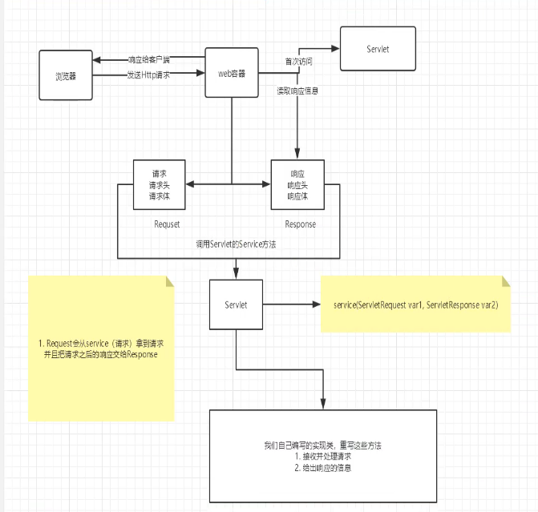

# JavaWeb

[TOC]

## 1. 基本概念

### 1.1 前言

web开发：

- `web`，网页的意思

- 静态`web`

  `html`、`css`

  提供给所有人看的数据始终不会发生变化

- 动态`web`

  提供给所有人看的数据始终会发生变化，每个人在不同的时间，不同的地点看到的信息各不相同

  技术栈：`Servlet/JSP`、`ASP`、`PHP`

- 在`java`中。动态`web`资源开发的技术统称为`javaweb`

### 1.2 web应用程序

`web`应用程序：可以提供浏览器访问的程序

- `a.html`、`b.html`....多个`web`资源，这些`web`资源可以被外界访问，对外界提供服务

- 我们能够访问的任何一个页面或者资源，都存在于这个世界上的某一台服务器上

- 这些统一的`web`资源会被放在同一个文件夹下，会被`Tomcat`服务器所呈现出来

- 一个`web`应用由多部分组成

  `html`、`css`、`js`

  `jsp`、`servelet`

  `java`程序

  `jar`包

  配置文件`Properties`	

### 1.3 静态web

- `*.htm`，`*.html`都是网页的后缀，如果服务器上一直存在这些资源，我们就可以获取
- 静态`web`存在的缺点
  - `web`页面无法动态更新，所有用户看到都是同一个页面
  - 无法与数据库交互(数据无法持久化)

### 1.4 动态`web`

- 页面会动态展示：`web`的页面展示的效果因人而异

- 缺点

  加入服务器的动态`web`资源出现了错误，我们需要重新编写我们的后台程序，停机维护，重新发布

- 优点：

  可以与数据库交互(数据持久化)

## 2. web服务器

### 2.1 技术详解

ASP

- 微软：国内最早流行的`ASP`
- 在`HTML`中嵌入了`VB`的脚本，`ASP`+`COM`
- 在`ASP`开发中，基本一个页面都有几千行的业务代码，页面极其混乱，维护成本很高，开发语言为`C#`

PHP

- `PHP`开发速度很快，功能很强大，跨平台，代码很简单
- 无法承载大访问量的情况

JSP/Servlet

- `sun`公司主推的`B/S`架构
- 基于`java`语言的(所有的大公司，或者一些开源的组件，都是`java`写的)
- 可以承载三高问题带来的影响
- 与`ASP`类似

### 2.2 web服务器

服务器是一种被动的操作，用来处理用户的一些请求和给用户一些响应信息

`java`主要用的`web`服务器是`tomcat`

## 3. Tomcat

### 3.1 配置

- 下载[官网](http://tomcat.apache.org/)

- 解压到某个目录

- 核心配置文件`server.xml`

- 对于`sudo apt install tomcat9`

  ```bash
  # 配置文件
  /etc/tomcat9/
  
  # 启动文件
  /usr/share/tomcat9
  
  # webapps
  /var/lib/tomcat9
  ```

- 默认端口`8080`

### 3.2 发布一个web

```bash
webapps
	- ROOT # 默认网站目录
	- example # 自定义网站目录
		- META-INF # 网站源信息
			- classes # java程序
			- lib # 网站依赖的jar包
			- context.xml # 网站配置文件
		- index.html # 默认首页
```

## 4. IDEA使用Maven

由于`maven`本身的问题，可能之后写的配置文件无法被导出的问题，在`pom.xml`下加入

```xml
<build>
    <resources>
        <resource>
            <directory>src/main/resources</directory>
            <includes>
                <include>**/*.properties</include>
                <include>**/*.xml</include>
            </includes>
            <filtering>true</filtering>
        </resource>
        <resource>
            <directory>src/main/java</directory>
            <includes>
                <include>**/*.properties</include>
                <include>**/*.xml</include>
            </includes>
            <filtering>true</filtering>
        </resource>
    </resources>
</build>
```

修改`web.xml`为最新版

```xml
<?xml version="1.0" encoding="UTF-8"?>

<web-app xmlns="http://xmlns.jcp.org/xml/ns/javaee"
         xmlns:xsi="http://www.w3.org/2001/XMLSchema-instance"
         xsi:schemaLocation="http://xmlns.jcp.org/xml/ns/javaee
                             http://xmlns.jcp.org/xml/ns/javaee/web-app_4_0.xsd"
         version="4.0"
         metadata-complete="true">
</web-app>
```

## 5. Servlet

### 5.1 Servlet简介

- `Servlet`就是`sun`公司开发动态`web`的一门技术

- `sun`在这些`API`中提供一个接口叫做`Servlet`，如果你想开发一个`Servlet`程序，只需要完成两个步骤

  编写一个类，实现`Servlet`接口

  把开发好的`java`类部署到`web`服务器中

- `Servlet`接口`sun`公司有两个默认的实现类`HttpServlet`

把实现了`Servlet`接口的`java`程序叫做`Servlet`

### 5.2 HelloServlet

1. 构建一个普通的`maven`项目，删掉里面的`src`目录，以后我们的学习就在这个项目里面建立`Module`，这个空的工程就是`Maven`主工程，主目录导入`Servlet`依赖

   ```xml
   <dependencies>
       <!-- https://mvnrepository.com/artifact/javax.servlet/javax.servlet-api -->
       <dependency>
           <groupId>javax.servlet</groupId>
           <artifactId>javax.servlet-api</artifactId>
           <version>4.0.1</version>
       </dependency>
       <!-- https://mvnrepository.com/artifact/javax.servlet.jsp/javax.servlet.jsp-api -->
       <dependency>
           <groupId>javax.servlet.jsp</groupId>
           <artifactId>javax.servlet.jsp-api</artifactId>
           <version>2.3.3</version>
       </dependency>
   </dependencies>
   ```

2. 关于`Maven`父子工程的理解

   父项目`pom.xml`中会有

   ```xml
   <modules>
   	<module>servlet-01</module>
   </modules>
   ```

   子项目`pom.xml`中会有

   ```xml
   <groupId>org.example</groupId>
   <artifactId>servlet-01</artifactId>
   <version>1.0-SNAPSHOT</version>
   <packaging>war</packaging>
   
   <name>servlet-01 Maven Webapp</name>
   ```

   父项目中的依赖，子项目可以直接使用

3. `maven`项目优化

   修改`web.xml`为最新的

   将`maven`的结构搭建完整

4. 编写一个`Servlet`程序

   编写一个普通类

   实现`Servlet`接口，即普通类继承于`HttpServlet`

   ```mermaid
   graph TD
   Servlet接口 --> GenericServlet --> HttpServlet --> 自己实现的类
   ```

   重写特定方法

   ```java
   public class HelloServlet extends HttpServlet {
       @Override
       protected void doGet(HttpServletRequest req, HttpServletResponse resp) throws ServletException, IOException {
           PrintWriter writer = resp.getWriter();
           writer.print("Hello Servlet");
       }
   
       @Override
       protected void doPost(HttpServletRequest req, HttpServletResponse resp) throws ServletException, IOException {
           super.doPost(req, resp);
       }
   }
   ```

5. 在`web.xml`编写`Servlet`的映射

   我们编写的是`java`程序，但是通过浏览器访问，而浏览器需要连接`web`服务器，所以我们需要在`web`服务中注册我们写的`Servlet`，还需要给它一个访问路径
   
   ```xml
   <!-- 注册Servlet -->
   <servlet>
       <servlet-name>hello</servlet-name>
       <servlet-class>com.valid.servlet.HelloServlet</servlet-class>
   </servlet>
   <servlet-mapping>
       <servlet-name>hello</servlet-name>
       <url-pattern>/hello</url-pattern>
   </servlet-mapping>
   ```
   
6. 配置`Tomcat`

7. 启动测试

### 5.3 Servlet原理

`Servlet`是有`web`服务器



### 5.4 Mapping

- 一个`Servlet`可以指定一个映射路径

  ```xml
  <servlet-mapping>
      <servlet-name>hello</servlet-name>
      <url-pattern>/hello</url-pattern>
  </servlet-mapping>
  ```

- 一个`Servlet`可以指定多个映射路径

  ```xml
  <servlet-mapping>
      <servlet-name>hello</servlet-name>
      <url-pattern>/hello1</url-pattern>
  </servlet-mapping>
  <servlet-mapping>
      <servlet-name>hello</servlet-name>
      <url-pattern>/hello2</url-pattern>
  </servlet-mapping>
  ```

- 一个`Servlet`可以指定通用映射路径

  ```xml
  <servlet-mapping>
      <servlet-name>hello</servlet-name>
      <url-pattern>/hello/*</url-pattern>
  </servlet-mapping>
  ```

- 默认请求

  ```xml
  <servlet-mapping>
      <servlet-name>hello</servlet-name>
      <url-pattern>/*</url-pattern>
  </servlet-mapping>
  ```

- 自定义后缀实现请求映射，`*`不能加项目映射的路径

  ```xml
  <servlet-mapping>
      <servlet-name>hello</servlet-name>
      <url-pattern>*.do</url-pattern>
  </servlet-mapping>
  ```

- 优先级问题

  指定了固有的映射路径的优先级最高，如果找不到就会走默认的处理请求

### 5.5 ServletContext

`web`容器启动的时候，它会为每个程序都创建一个对应的`ServletContext`对象，它代表了当前的`web`应用

#### 5.5.1 共享数据：不同的`servlet`实现通信

设置需要获取的值

```java
public class HelloServlet extends HttpServlet {
    @Override
    protected void doGet(HttpServletRequest req, HttpServletResponse resp) throws ServletException, IOException {
        // 获取上下文对象
        ServletContext context = this.getServletContext();

        String username = "小狐狸学java";
        // 将数据保存在ServletContext中
        context.setAttribute("username", username);
    }
}
```

获取设置的值

```java
public class GetServlet extends HttpServlet {
    @Override
    protected void doGet(HttpServletRequest req, HttpServletResponse resp) throws ServletException, IOException {
        resp.setContentType("text/html");
        resp.setCharacterEncoding("utf-8");
        PrintWriter writer = resp.getWriter();
        writer.print(this.getServletContext().getAttribute("username"));
    }
}
```

#### 5.5.2 配置初始化参数

`web.xml`

```xml
<context-param>
    <param-name>url</param-name>
    <param-value>jdbc:mysql://localhost:3306/test</param-value>
</context-param>
<servlet>
    <servlet-name>jdbc</servlet-name>
    <servlet-class>com.valid.servlet.Context</servlet-class>
</servlet>
<servlet-mapping>
    <servlet-name>jdbc</servlet-name>
    <url-pattern>/jdbc</url-pattern>
</servlet-mapping>
```

`Context.java`

```java
public class Context extends HttpServlet {
    @Override
    protected void doGet(HttpServletRequest req, HttpServletResponse resp) throws ServletException, IOException {
        ServletContext context = this.getServletContext();
        String url = context.getInitParameter("url");
        resp.getWriter().print(url);
    }
}
```

浏览器访问`http://localhost:8080/s2/jdbc`

```bash
jdbc:mysql://localhost:3306/test
```

#### 5.5.3 请求转发

`web.xml`

```xml
<servlet>
    <servlet-name>dispatcher</servlet-name>
    <servlet-class>com.valid.servlet.Dispatcher</servlet-class>
</servlet>
<servlet-mapping>
    <servlet-name>dispatcher</servlet-name>
    <url-pattern>/dispatcher</url-pattern>
</servlet-mapping>
```

`Dispatcher.java`

```java
public class Dispatcher extends HttpServlet {
    protected void doGet(HttpServletRequest req, HttpServletResponse resp) throws ServletException, IOException {
        ServletContext context = this.getServletContext();
        RequestDispatcher dispatcher = context.getRequestDispatcher("/hello"); // 设置转发的请求路径
        dispatcher.forward(req, resp); // 调用forward实现请求转发
    }
}
```

#### 5.5.4 读取资源文件

Properties

- 在`java`目录下新建`properties`会被打包在`classess`目录下，不一定是根目录
- 在`resources`目录下新建`properties`被打包到`classes`根目录下

两者都会

`web.xml`

```xml
<servlet>
    <servlet-name>prop</servlet-name>
    <servlet-class>com.valid.servlet.PropertiesServlet</servlet-class>
</servlet>
<servlet-mapping>
    <servlet-name>prop</servlet-name>
    <url-pattern>/prop</url-pattern>
</servlet-mapping>
```

`PropertiesServlet.java`

```java
public class PropertiesServlet extends HttpServlet {
    @Override
    protected void doGet(HttpServletRequest req, HttpServletResponse resp) throws ServletException, IOException {
        InputStream is = this.getServletContext().getResourceAsStream("/WEB-INF/classes/db.properties");
        Properties prop = new Properties();
        prop.load(is);
        String username = prop.getProperty("username");
        String password = prop.getProperty("password");

        resp.getWriter().print("username = " + username + "\npassword = " + password);
    }
}
```

### 5.6 HttpServletRequest

`HttpServletRequest`代表客户端的请求，用户通过`Http`协议访问服务器，`HTTP`请求中的所有信息会被封装到`HttpServletRequest`，通过`HttpServletRequest`的方法，获得客户端的所有信息

- 获取客户端的参数的常用方法

`index.jsp`

```jsp
<%@ page contentType="text/html;charset=UTF-8" language="java" %>
<html>
    <head>
        <title>login</title>
    </head>
    <body>
        <div>
            <form action="${pageContext.request.contextPath}/login" method="post">
                用户名：<input type="text" name="username"><br>
                密码：<input type="password" name="password"><br>
                爱好：
                <input type="checkbox" name="hobbys" value="代码">代码
                <input type="checkbox" name="hobbys" value="唱歌">唱歌
                <input type="checkbox" name="hobbys" value="电影">电影
                <input type="submit">
            </form>
        </div>
    </body>
</html>
```

`success.jsp`

```jsp
<%@ page contentType="text/html;charset=UTF-8" language="java" %>
<html>
    <head>
        <title>success</title>
    </head>
    <body>
        <div>登录成功</div>
    </body>
</html>
```

登录

```java
@Override
protected void doGet(HttpServletRequest req, HttpServletResponse resp) throws ServletException, IOException {
    // 设置接受的编码为UTF-8
    req.setCharacterEncoding("UTF-8");
    
    String username = req.getParameter("username");
    String password = req.getParameter("password");
    String[] hobbys = req.getParameterValues("hobbys");
    System.out.println(username);
    System.out.println(password);
    System.out.println(Arrays.toString(hobbys));

    // 通过请求转发 这里的 / 代表当前项目
    req.getRequestDispatcher("/success.jsp").forward(req, resp);
}

@Override
protected void doPost(HttpServletRequest req, HttpServletResponse resp) throws ServletException, IOException {
    doGet(req, resp);
}
```

### 5.7 HttpServletResponse

`web`服务器接受到客户端的`http`请求，分别创建一个代表请求的`HttpServletRequest`对象，代表响应的一个`HttpServletResponse`

- 如果要获取客户端请求过来的参数：`HttpServletRequest`
- 如果要给客户端响应一些信息：`HttpServletResponse`

#### 5.7.1 简单分类

负责向浏览器发送数据的方法

```java
ServletOutputStream getOutputStream() throws IOException;

PrintWriter getWriter() throws IOException;
```

负责向浏览器发送响应头的方法

```java
void setCharacterEncoding(String var1);

void setContentLength(int var1);

void setContentLengthLong(long var1);

void setContentType(String var1);
```

`http`常用状态码

```java
int SC_OK = 200;
int SC_BAD_REQUEST = 400;
int SC_NOT_FOUND = 404;
int SC_INTERNAL_SERVER_ERROR = 500;
```

#### 5.7.2 下载文件

1. 获取下载文件的路径，一定是相当于当前`web`项目的路径

   ```java
   String path = this.getServletContext().getRealPath("/WEB-INF/classes/1.jpg");
   ```

2. 下载的文件名

   ```java
   String fileName = path.substring(path.lastIndexOf("//") + 1);
   ```

3. 让浏览器支持下载我们需要的东西

   ```java
   resp.setHeader("Content-Disposition", "attachment; filename=" + URLEncoder.encode(fileName, "UTF-8"));
   ```

4. 获取下载文件的输入流

   ```java
   FileInputStream in = new FileInputStream(path);
   ```

5. 创建缓冲区

   ```java
   byte[] buffer = new byte[1024];
   int len = 0;
   ```

6. 获取`OutputStream`对象

   ```java
   ServletOutputStream out = resp.getOutputStream();
   ```

7. 将`FileOutputStream`流写入到`buffer`缓冲区，使用`OutputStream`将缓冲区中的数据输出到客户端

   ```java
   while((len = in.read(buffer)) != -1) {
   	out.write(buffer, 0, len);
   }
   in.close();
   out.close();
   ```

#### 5.7.3 验证码功能

1. 创建一张验证码图片

   ```java
   // 在内存中创建一张图片
   BufferedImage image = new BufferedImage(80, 20, BufferedImage.TYPE_INT_RGB);
   // 得到图片
   Graphics2D graphics = (Graphics2D)image.getGraphics();
   // 设置背景图的颜色
   graphics.setColor(Color.WHITE);
   graphics.fillRect(0, 0, 80, 20);
   
   // 设置画笔
   graphics.setColor(Color.BLUE);
   graphics.setFont(new Font(null, Font.BOLD, 20));
   
   // 将随机数画到图片上
   graphics.drawString(makeNum(), 0, 20);
   ```

2. 将验证码输出到浏览器

   ```java
   // 告诉浏览器，这个请求用图片打开
   resp.setContentType("image/jpeg");
   // 设置浏览器不要缓存
   resp.setDateHeader("expires", -1);
   resp.setHeader("Cache-Control", "no-cache");
   resp.setHeader("Pragma", "no-cache");
   
   // 将图片输出到浏览器
   ImageIO.write(image, "jpeg", resp.getOutputStream());
   ```

#### 5.7.4 重定向

一个`web`资源收到客户端请求后，他会通知客户端去访问另外一个`web`资源，这个过程叫做重定向

主要方法

```java
void sendRedirect(String var1) throws IOException;
```

设置访问K

```java
@Override
protected void doGet(HttpServletRequest req, HttpServletResponse resp) throws ServletException, IOException {
    /*  
    resp.setHeader("Location", "/s3/code");
    resp.setStatus(302);
     */
    resp.sendRedirect("/s3/code");
}
```

重定向和转发的区别

相同点

- 页面都会发生跳转

不同点

- 请求转发的时候，`url`不会发生变化；307
- 重定向时候，`url`地址栏会发生变化；302

**重定向实例**：当用户登录成功则会跳转到`success.jsp`

`index.jsp`

```jsp
<html >
    <meta charset="UTF-8">
    <body>
        <h2>Hello World!</h2>

<%--        ${pageContext.request.contextPath()}代表当前项目的路径--%>
        <form action="${pageContext.request.contextPath}/login" method="get">
            用户名：<input type="text" name="username">
            密码：<input type="password" name="password">
            <input type="submit">
        </form>

    </body>
</html>
```

`success.jsp`

```jsp
<%@ page contentType="text/html;charset=UTF-8" language="java" %>
<html>
    <head>
        <title>success</title>
    </head>
    <body>
        <div>登录成功</div>
    </body>
</html>
```

登录

```java
@Override
protected void doGet(HttpServletRequest req, HttpServletResponse resp) throws ServletException, IOException {
    String username = req.getParameter("username");
    String password = req.getParameter("password");
    System.out.println("username: " + username);
    System.out.println("password: " + password);
    resp.sendRedirect("/s3/success.jsp");
}
```

## 6. cookie、session

会话：用户打开一个浏览器，点击了很多超链接，访问多个`web`资源，关闭浏览器，这个过程称之为会话

有状态会话：用户从客户端第一次登录，服务端发放一个`cookie`，第二次访问时客户端带着`cookie`来访问，不用登录

### 6.1 cookie

- 获取`cookie`

  ```java
  Cookie[] cookies = req.getCookies();
  ```

- 获取`cookie`的`key`

  ```java
  cookies[i].getName()
  ```

- 获取`cookie`的`value`

  ```java
  cookies[i].getValue()
  ```

- 响应返回一个`cookie`并设置过期时间，默认关闭浏览器`cookie`失效

  ```java
  Cookie nameCookie = new Cookie("name", "哔哩哔哩");
  nameCookie.setMaxAge(24 * 60 * 60);
  resp.addCookie(nameCookie);
  ```

- 注意事项

  一个`cookie`只能保存一个信息

  一个`web`站点可以给浏览器发送多个`cookie`，最多存放`20`个`cookie`

  `cookie`大小有限制`4kb`

  `300`个`cookie`浏览器上限

  对于中文`cookie`尽量在设置和取值是进行`UTF-8`的编码和解码

  ```java
  Cookie nameCookie = new Cookie("name", URLEncoder.encode("哔哩哔哩", "UTF-8"));
  
  
  URLDecoder.decode(cookies[i].getValue(), "UTF-8");
  ```

- 删除`cookie`

  不设置有效期，关闭浏览器，自动失效

  设置过期时间为`0`

### 6.2 Session

`Session`：服务器会给每一个用户(浏览器)创建一个`Session`对象，一个`Session`对象独占一个浏览器，只要浏览器没有关闭，这个`Session`就可以一直存在

`session`和`cookie`的区别

- `Cookie`是把用户的数据写给用户的浏览器，由浏览器保存
- `Session`把用户的数据写到用户独占`Session`中，由服务端保存
- `Session`对象由服务端创建

使用`Session`

- 创建`Session`对象，并存储属性

  ```java
  HttpSession session = req.getSession();
  session.setAttribute("name", "哔哩哔哩");
  ```

- 获取`Session id`

  ```java
  String id = session.getId();
  ```

- 在其它`Servlet`中获取`Session`并取出存储在里面的数据

  ```java
  HttpSession session = req.getSession();
  String name = (String) session.getAttribute("name");
  ```

- 移除`Session`中的数据，并删除`Session`

  ```java
  session.removeAttribute("name");
  session.invalidate();
  ```

- 或者在`web.xml`中配置注销`session`

  ```xml
  <!--设置session的默认失效时间为1分钟-->
  <session-config>
  	<session-timeout>1</session-timeout>
  </session-config>
  ```

## 7. JSP

`JSP`：`java server pages`，`java`服务器端页面，和`Servlet`一样，属于动态`web`技术

特点：

- 写`JSP`与写`HTML`相似

- 区别：

  `HTML`只给用户提供静态的数据

  `JSP`页面中可以嵌入`JAVA`代码，为用户提供动态数据

### 7.1 JSP原理

服务器内部的工作

- `tomcat`中有一个`work`目录
- `IDEA`中使用`Tomcat`的会在`IDEA`的`tomcat`中产生一个`work`目录，`work`目录中有着`java`程序
- `JSP`最终会被转换成一个`java`类
- `JSP`本质上也是一个`Servlet`

```java
// 初始化
public void _jspInit() {}

// 销毁
public void _jspDestory() {}

// JSPService
public void _jspService(HttpServletRequest request, HttpServletResponse response) {}
```

在`JSP`页面中：

- 只要是`JAVA`代码就会原封不动的输出

- 如果是`HTML`代码，就会被转换为

  ```java
  out.write("<html>\r\n");
  ```

### 7.2 JSP依赖

```xml
<dependencies>
    <!-- servlet的依赖 -->
    <dependency>
        <groupId>javax.servlet</groupId>
        <artifactId>javax.servlet-api</artifactId>
        <version>4.0.1</version>
    </dependency>
    <!-- JSP的依赖 -->
    <dependency>
        <groupId>javax.servlet.jsp</groupId>
        <artifactId>javax.servlet.jsp-api</artifactId>
        <version>2.3.3</version>
    </dependency>
    <!-- JSTL表达式的依赖 -->
    <dependency>
        <groupId>javax.servlet</groupId>
        <artifactId>jstl</artifactId>
        <version>1.2</version>
    </dependency>

	<!-- 标签库 -->
    <dependency>
        <groupId>taglibs</groupId>
        <artifactId>standard</artifactId>
        <version>1.1.2</version>
    </dependency>
</dependencies>
```

### 7.3 JSP语法

#### 7.3.1 表达式

- 将程序的结果，输出到客户端

  ```jsp
  <%= LocalDateTime.now()%>
  
  <%--2020-11-20T21:27:38.530437--%>
  ```

- `jsp`脚本片段

  ```jsp
  <%
      int sum = 0;
      for(int i = 0; i <= 100; i++) {
      	sum+=i;
      }
      out.println("<h1>sum = " + sum + "</h1>");
  %>
  
  <%--sum = 5050--%>
  ```

- 在`java`代码中嵌入`HTML`

  ```jsp
  <%
  	for(int i = 0; i < 5; i++) {
  %>
  		<h3>我是第<%=i%>次循环</h3>
  <%
  	}
  %>
  <%--
  我是第0次循环
  我是第1次循环
  我是第2次循环
  我是第3次循环
  我是第4次循环
  --%>
  ```

  

