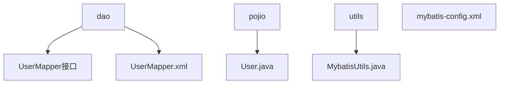
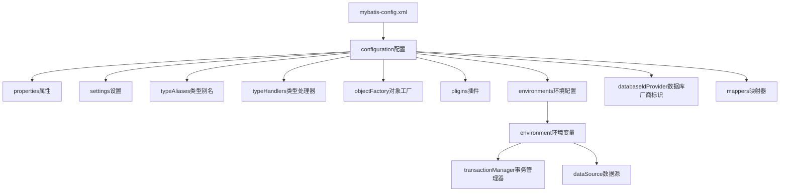
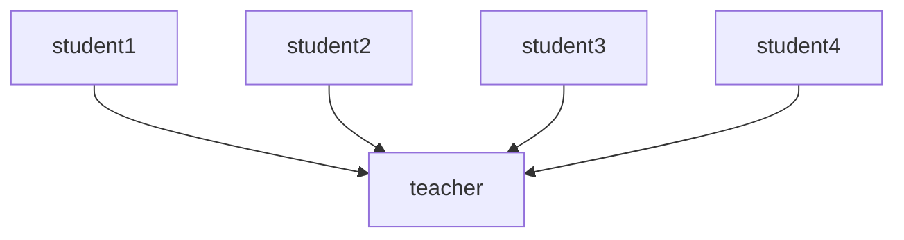
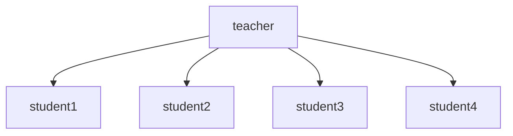

# Mybatis

[TOC]

## 1. 简介

### 1.1 什么是MyBatis

- MyBatis 是一款优秀的**持久层**框架
- 它支持自定义 SQL、存储过程以及高级映射。
- MyBatis 免除了几乎所有的 JDBC 代码以及设置参数和获取结果集的工作。
- MyBatis 可以通过简单的 XML 或注解来配置和映射原始类型、接口和 Java POJO（Plain Old Java Objects，普通老式 Java 对象）为数据库中的记录。

- 获取

  ```xml
  <!-- https://mvnrepository.com/artifact/org.mybatis/mybatis -->
  <dependency>
      <groupId>org.mybatis</groupId>
      <artifactId>mybatis</artifactId>
      <version>3.5.6</version>
  </dependency>
  ```

### 1.2 持久层

数据持久化：持久化就是讲程序的数据在持久状态和瞬时状态装换的过程

持久层：完成持久工作的代码块

## 2. 第一个Mybatis程序

### 2.1 搭建环境

1. 数据库准备

   ```sql
   CREATE DATABASE mybatis;
   USE mybatis;
   
   CREATE TABLE USER ( 
   	id INT NOT NULL PRIMARY KEY, 
   	NAME VARCHAR ( 20 ) NULL, 
   	pwd VARCHAR ( 20 ) NULL 
   );
   
   INSERT INTO `user`(id, `name`, pwd) VALUES
   (1, '石昊', '123456'),
   (2, '叶凡', '140596'),
   (3, '楚风', '109456');
   ```

2. 导入依赖

   ```xml
   <!--mysql驱动-->
   <dependency>
       <groupId>mysql</groupId>
       <artifactId>mysql-connector-java</artifactId>
       <version>8.0.22</version>
   </dependency>
   <!--mybatis-->
   <dependency>
       <groupId>org.mybatis</groupId>
       <artifactId>mybatis</artifactId>
       <version>3.5.6</version>
   </dependency>
   ```

3. 新建`mybatis-config.xml`编写`mybatis`的配置文件

   ```xml
   <?xml version="1.0" encoding="UTF-8" ?>
   <!DOCTYPE configuration
           PUBLIC "-//mybatis.org//DTD Config 3.0//EN"
           "http://mybatis.org/dtd/mybatis-3-config.dtd">
   <configuration>
       <environments default="development">
           <environment id="development">
               <transactionManager type="JDBC"/>
               <dataSource type="POOLED">
                   <property name="driver" value="com.mysql.cj.jdbc.Driver"/>
                   <property name="url" value="jdbc:mysql://localhost:3306/mybatis?useSSL=true&amp;useUnicode=true&amp;characterEncoding=UTF-8"/>
                   <property name="username" value="root"/>
                   <property name="password" value="123456"/>
               </dataSource>
           </environment>
       </environments>
   </configuration>
   ```

4. 编写`Mybatis`工具类

   ```java
   public class MybatisUtils {
       private static SqlSessionFactory sqlSessionFactory;
   
       static {
           String resource = "mybatis-config.xml";
           try {
               InputStream inputStream = Resources.getResourceAsStream(resource);
               sqlSessionFactory = new SqlSessionFactoryBuilder().build(inputStream);
           } catch (IOException e) {
               e.printStackTrace();
           }
       }
   
       // 获取SqlSession
       public static SqlSession getSqlSession() {
           return sqlSessionFactory.openSession();
       }
   }
   ```

### 2.2 编写代码



1. 创建实体类

   `User.java`

   ```java
   public class User {
       private int id;
       private String name;
       private String pwd;
       // get set方法
   }
   ```

2. 接口实现类转换为`UserMapper.xml`文件

   ```xml
   <?xml version="1.0" encoding="UTF-8" ?>
   <!DOCTYPE mapper
           PUBLIC "-//mybatis.org//DTD Mapper 3.0//EN"
           "http://mybatis.org/dtd/mybatis-3-mapper.dtd">
   <!--namespace绑定一个对应的Dao/Mapper接口-->
   <mapper namespace="com.valid.dao.UserMapper">
       <select id="getUserList" resultType="com.valid.pojo.User">
           select * from mybatis.user
       </select>
   </mapper>
   ```

3. 在`mybatis-config.xml`注册配置文件`UserMapper.xml`

   ```xml
   <mappers>
   	<mapper resource="com/valid/dao/UserMapper.xml"></mapper>
   </mappers>
   ```

4. 测试

   ```java
   @Test
   public void test() {
       // 1. 获取sqlSession对象
       SqlSession sqlSession = MybatisUtils.getSqlSession();
   
       // 2. getMapper
       UserMapper userMapper = sqlSession.getMapper(UserMapper.class);
       List<User> list = userMapper.getUserList();
   
       System.out.println(list);
   
       // 3.关闭sqlSession
       sqlSession.close();
   }
   ```

## 3. CRUD

`namespace`绑定一个对应的`Dao/Mapper`接口，必须是全路径

- `id`：对应`namespace`中方法名
- `resultType`：`sql`语句执行的返回值类型
- `parameterType`：参数类型

### 3.1 select

选择，查询语句

1. 根据用户`id`添加用户

   `UserMapper`添加方法

   ```java
   // 根据id查询用户
   User getUserById(int id);
   ```

2. `UserMapper.xml`中添加映射

   ```xml
   <select id="getUserById" resultType="com.valid.pojo.User">
   	select * from mybatis.user where id=#{id}
   </select>
   ```

3. 测试

   ```java
   @Test
   public void test1() {
       // 测试获取指定id的用户
       SqlSession sqlSession = MybatisUtils.getSqlSession();
       UserMapper userMapper = sqlSession.getMapper(UserMapper.class);
   
       User user = userMapper.getUserById(1);
       System.out.println(user);
   
       sqlSession.close();
   }
   ```

### 3.2 insert

添加一个用户

1. `UserMapper`添加方法

   ```java
   int insertUser(User user);
   ```

2. `UserMapper.xml`添加映射，对于提供了`get`、`set`方法的实体类可以直接获取属性

   ```xml
   <insert id="insertUser" parameterType="com.valid.pojo.User">
   	insert into mybatis.user values (#{id}, #{name}, #{pwd})
   </insert>
   ```

3. 测试

   ```java
   @Test
   public void test2() {
   // 测试添加
       SqlSession sqlSession = MybatisUtils.getSqlSession();
   
       UserMapper userMapper = sqlSession.getMapper(UserMapper.class);
       int count = userMapper.insertUser(new User(4, "狠人大帝", "57823495"));
       System.out.println(count);
   
       // 增删改需要提交事务
       sqlSession.commit();
       sqlSession.close();
   }
   ```

### 3.3 update

修改用户信息

1. `userMapper`添加方法

   ```java
   int updateUser(User user);
   ```

2. `UserMapper.xml`添加映射

   ```xml
   <update id="updateUser" parameterType="com.valid.pojo.User">
   	update mybatis.user set name=#{name}, pwd=#{pwd} where id=#{id}
   </update>
   ```

3. 测试

   ```java
   @Test
   public void test3() {
       // 测试修改
       SqlSession sqlSession = MybatisUtils.getSqlSession();
   
       UserMapper userMapper = sqlSession.getMapper(UserMapper.class);
       int res =userMapper.updateUser(new User(1, "完美世界", "234453"));
   
       sqlSession.commit();
       sqlSession.close();
   }
   ```

### 3.4 delete

删除一个用户

1. `userMapper`添加方法

   ```java
   int deleteUser(int id);
   ```

2. `UserMapper.xml`添加映射

   ```xml
   <delete id="deleteUser">
   	delete from mybatis.user where id=#{id}
   </delete>
   ```

3. 测试

   ```java
   @Test
   public void test4() {
       // 测试删除
       SqlSession sqlSession = MybatisUtils.getSqlSession();
   
       UserMapper userMapper = sqlSession.getMapper(UserMapper.class);
       userMapper.deleteUser(1);
   
       sqlSession.commit();
       sqlSession.close();
   }
   ```


### 3.5 map

对于实体类参数过多，可以使用`Map`

#### 3.5.1 map添加用户

1. `UserMapper`添加方法

   ```java
   User addUser(Map<String ,Object> map);
   ```

2. `UserMapper.xml`添加映射

   ```xml
   <insert id="addUser" parameterType="map">
   	insert into mybatis.user(id, name, pwd) values (#{userid}, #{userName}, #{password})
   </insert>
   ```

3. 测试

   ```java
   @Test
   public void test5() {
       // 测试map添加
       SqlSession sqlSession = MybatisUtils.getSqlSession();
   
       UserMapper userMapper = sqlSession.getMapper(UserMapper.class);
   
       Map<String, Object> map = new HashMap<>();
       map.put("userid", 1);
       map.put("userName", "石昊");
       map.put("password", "3456772");
       userMapper.addUser(map);
   
       sqlSession.commit();
       sqlSession.close();
   }
   ```

#### 3.5.2 map获取用户

1. `UserMapper`添加方法

   ```
   User getUserByIdMap(Map<String, Object> map);
   ```

2. `UserMapper.xml`添加映射

   ```java
   <select id="getUserByIdMap" parameterType="map" resultType="com.valid.pojo.User">
   	select * from mybatis.user where id=#{id} and pwd=#{pwd}
   </select>
   ```

3. 测试

   ```java
   @Test
   public void test6() {
       // 测试map查询
       SqlSession sqlSession = MybatisUtils.getSqlSession();
   
       Map<String, Object> map = new HashMap<>();
       map.put("id", 1);
       map.put("pwd", 3456772);
   
       UserMapper userMapper = sqlSession.getMapper(UserMapper.class);
       User user = userMapper.getUserByIdMap(map);
       System.out.println(user);
   
       sqlSession.commit();
       sqlSession.close();
   }
   ```

#### 3.5.3 模糊查询

1. `UserMapper`中添加方法

   ```java
   List<User> getUserLike(String name);
   ```

2. `UserMapper.xml`中添加映射

   ```java
   <select id="getUserLike" resultType="com.valid.pojo.User">
   	select * from mybatis.user where name like #{name}
   </select>
   ```

3. 测试

   ```java
   @Test
   public void test7() {
       SqlSession sqlSession = MybatisUtils.getSqlSession();
   
       UserMapper userMapper = sqlSession.getMapper(UserMapper.class);
       List<User> users = userMapper.getUserLike("%石%");
       System.out.println(users);
   
       sqlSession.close();
   }
   ```

## 4. 配置解析

### 4.1 核心配置文件

`mybatis-config.xml`：MyBatis 的配置文件包含了会深深影响 MyBatis 行为的设置和属性信息。



### 4.2 环境配置(environments)

1. `MyBatis `可以配置成适应多种环境

2. 每个 `SqlSessionFactory `实例只能选择一种环境

3. `mybatis`的多套环境可以通过`environments`的`default`属性进行切换

4. 事务管理器，`mybatis`支持两种事务管理器`JDBC`和`MANAGED`，默认`JDBC`

   ```xml
   <transactionManager type="JDBC"/>
   ```

5. 数据库连接池，默认有连接池`POOLED`

   ```xml
   <dataSource type="POOLED">
   <dataSource />
   ```

### 4.3 属性(properties)

我们可以通过`properties`属性来引用一个配置类

1. 新建`db.properties`

   ```properties
   driver=com.mysql.cj.jdbc.Driver
   url=jdbc:mysql://localhost:3306/mybatis?useSSL=true&useUnicode=true&characterEncoding=UTF-8
   username=root
   password=123456
   ```

2. 在`mybatis-config.xml`文件中引入写好的配置文件

   `properties`标签需要在`environments`标签之前

   ```xml
   <properties resource="db.properties" />
   ```

3. 修改`dataSource`标签的内容

   ```xml
   <dataSource type="POOLED">
       <property name="driver" value="${driver}"/>
       <property name="url" value="${url}"/>
       <property name="username" value="${username}"/>
       <property name="password" value="${password}"/>
   </dataSource>
   ```

### 4.4 类型别名(typeAliases)

- 类型别名可为 Java 类型设置一个缩写名字
- 降低冗余的全限定类名书写

1. 直接为类取别名

   ```xml
   <typeAliases>
   	<typeAlias alias="User" type="com.valid.pojo.User" />
   </typeAliases>
   ```

2. 也可以指定一个包名，`MyBatis `会在包名下面搜索需要的 `Java Bean`

   ```xml
   <typeAliases>
   	<package name="com.valid.pojo"/>
   </typeAliases>
   ```

3. 在没有注解的情况下，会使用 `Bean `的首字母小写的非限定类名来作为它的别名。

   通过注解指定别名

   ```java
   @Alias("People")
   public class User {
      
   }
   ```

### 4.5 设置(settings)

这是 MyBatis 中极为重要的调整设置，它们会改变 MyBatis 的运行时行为

| 设置名                   | 描述                                                         | 有效值      |
| ------------------------ | ------------------------------------------------------------ | ----------- |
| cacheEnable              | 全局性地开启或关闭所有映射器配置文件中已配置的任何缓存       | true\|false |
| lazyLoadingEnabled       | 延迟加载的全局开关。当开启时，所有关联对象都会延迟加载。特定关联关系中可通过设置fetchType属性来覆盖该项的开关状态 | true\|false |
| mapUnderscoreToCamelCase | 是否开启驼峰命名自动映射，即从经典数据库列名A_COLUMN映射到java属性名aColumn | true\|false |

### 4.6 映射器(mappers)

`MapperReistry`：注册绑定我们的`Mapper`文件

1. 类的全路径引用

   ```xml
   <mappers>
   	<mapper resource="com/valid/dao/UserMapper.xml" />
   </mappers>
   ```

2. 通过映射器接口实现完全限定类名

   ```xml
   <mappers>
       <mapper class="com.valid.dao.UserMapper"></mapper>
   </mappers>
   ```

   接口和它的`Mapper`配置文件必须同名

   接口和他的`Mapper`配置文件必须在同一个包中

3. 将包内的映射器接口实现全部注册为映射器

   ```xml
   <mappers>
   	<package name="com.valid.dao"/>
   </mappers>
   ```

   接口和它的`Mapper`配置文件必须同名

   接口和他的`Mapper`配置文件必须在同一个包中

### 4.7 生命周期(scope)

- `SqlSessionFactoryBuilder`一旦`SqlSessionFactory`，就不再需要它了，一般定义为局部变量
- `SqlSessionFactory`类似于一个数据库连接池，一般为全局静态变量
- `SqlSession`连接到连接池的一个请求，需要关闭，`SqlSession`的实例不是线程安全的，因此是不能被共享的，它的最佳作用域是请求或方法作用域

## 5. 属性名和字段名不一致

### 5.1 问题

1. 修改实体类

   ```java
   public class User {
       private int id;
       private String name;
       private String password;
       
       // get set 方法
   }
   ```

2. 对于属性名和字段名不相同，查询结果为`null`
3. 可以通过修改`SQL`语句字段的别名结果

### 5.2 resultMap

结果集映射

```xml
<resultMap id="UserMap" type="User">
    <result property="password" column="pwd" />
</resultMap>
<select id="getUserById" resultMap="UserMap">
	select * from mybatis.user where id=#{id}
</select>
```

1. `property`属性 `column`数据库字段名

2. 只需要映射不同的字段

## 6. 日志

### 6.1 日志工厂

如果数据库操作出现了异常，我们需要排错。日志就是最好的助手

在`Mybatis`框架中提供了许多的日志实现，通过配置文件的`settings`标签的`logImpl`属性指定日志

1. `SLF4J`

2. :star:`LOG4J`

3. `LOG4J2`

4. `JDK_LOGGING`

5. `COMMONS_LOGGING`

6. :star:`STDOUT_LOGGING`：标准日志实现，不需要任何配置，引入即可使用

   ```xml
   <settings>
   	<setting name="logImpl" value="STDOUT_LOGGING"/>
   </settings>
   ```

7. `NO_LOGGING`

### 6.2 Log4j

#### 6.2.1 什么是log4j

- Log4j是[Apache](https://baike.baidu.com/item/Apache/8512995)的一个开源项目，通过使用Log4j，我们可以控制日志信息输送的目的地是[控制台](https://baike.baidu.com/item/控制台/2438626)、文件、[GUI](https://baike.baidu.com/item/GUI)组件
- 可以轻松控制每一条日志的输出格式
- 通过定义每一条日志信息的级别，能够更加细致地控制日志的生成过程
- 通过一个配置文件来灵活地进行配置，而不需要修改应用的代码

#### 6.2.2 使用步骤

1. 导入相关依赖

   ```xml
   <dependency>
       <groupId>log4j</groupId>
       <artifactId>log4j</artifactId>
       <version>1.2.17</version>
   </dependency>
   ```

2. 新建`log4j.properties`

   ```properties
   #将等级为DEBUG的日志信息输出到console和file这两个目的地，console和file的定义在下面的代码
   log4j.rootLogger=DEBUG,console,file
   
   #控制台输出的相关设置
   log4j.appender.console = org.apache.log4j.ConsoleAppender
   log4j.appender.console.Target = System.out
   log4j.appender.console.Threshold=DEBUG
   log4j.appender.console.layout = org.apache.log4j.PatternLayout
   log4j.appender.console.layout.ConversionPattern=【%c】-%m%n
   
   #文件输出的相关设置
   log4j.appender.file = org.apache.log4j.RollingFileAppender
   log4j.appender.file.File=./log/kuang.log
   log4j.appender.file.MaxFileSize=10mb
   log4j.appender.file.Threshold=DEBUG
   log4j.appender.file.layout=org.apache.log4j.PatternLayout
   log4j.appender.file.layout.ConversionPattern=【%p】【%d{yy-MM-dd}】【%c】%m%n
   
   #日志输出级别
   log4j.logger.org.mybatis=DEBUG
   log4j.logger.java.sql=DEBUG
   log4j.logger.java.sql.Statement=DEBUG
   log4j.logger.java.sql.ResultSet=DEBUG
   log4j.logger.java.sql.PreparedStatement=DEBUG
   ```

3. 配置`log4j`为日志的实现

   ```xml
   <settings>
   	<setting name="logImpl" value="LOG4J"/>
   </settings>
   ```

4. 日志级别

   ```java
   @Test
   public void test1() {
       logger.info("info");
       logger.debug("debug");
       logger.error("error");
   }
   ```

## 7. 分页

`SQL`语法：从第二个(下标从零开始)开始查两个

```
SELECT * FROM user LIMIT 2, 2;
```

### 7.1 使用limit分页

1. `UserMapper`添加方法

   ```java
   List<User> getUserByLimit(Map<String, Integer> map);
   ```

2. `UserMapper.xml`添加映射

   ```xml
   <select id="getUserByLimit" resultType="User" parameterType="map">
   	SELECT * FROM mybatis.user limit #{start}, #{sum}
   </select>
   ```

3. 测试

   ```java
   @Test
   public void test2() {
       // 测试分页查询
       SqlSession sqlSession = MybatisUtils.getSqlSession();
   
       UserMapper userMapper = sqlSession.getMapper(UserMapper.class);
   
       Map<String, Integer> map = new HashMap<>();
       map.put("start", 2);
       map.put("sum", 2);
       List<User> list = userMapper.getUserByLimit(map);
       System.out.println(list);
   
       sqlSession.close();
   }
   ```

### 7.2 RowBounds分页

原理是基于`java`代码层面的筛选，不推荐使用

1. `UserMapper`添加方法

   ```java
   List<User> getUserByRowBounds();
   ```

2. `UserMapper.xml`添加映射

   ```xml
   <select id="getUserByRowBounds" resultMap="UserMap">
   	SELECT * FROM mybatis.user
   </select>
   ```

3. 测试

   ```java
   @Test
   public void test3() {
       // RowBounds 不推荐使用
       SqlSession sqlSession = MybatisUtils.getSqlSession();
   
       RowBounds rowBounds = new RowBounds(1, 2);
       List<User> list = sqlSession.selectList("com.valid.dao.UserMapper.getUserByRowBounds", null, rowBounds);
   
       System.out.println(list);
       sqlSession.close();
   }
   ```

## 8 使用注解开发

`mybatis`执行流程

```flow
st=>start: 开始框

A=>operation: Resources获取加载全局配置文件
B=>operation: 实例化SqlSessionFactoryBuilder构造器
C=>operation: 解析配置文件流XMLConfigBuilder
D=>operation: Configuration所有的配置信息
E=>operation: SqlSessionFactory实例化
F=>operation: transactional事务管理
G=>operation: 创建executor执行器
H=>operation: 创建sqlSession
I=>operation: 实现CRUD
J=>operation: 提交事务

cond=>condition: 查看是否执行成功


e=>end: 关闭

st->A->B->C->E->F->G->H->I
I->cond(no)->F

cond(yes)->J->e

```

### 8.1 快速入门

1. 在`UserMapper`中添加方法

   ```java
   public interface UserMapper {
   
       @Select("SELECT * FROM user")
       List<User> getUsers();
   }
   ```

2. `mybatis-config.xml`绑定接口

   ```xml
   <mappers>
   	<mapper class="com.valid.dao.UserMapper" />
   </mappers>
   ```

3. 测试

   ```java
   @Test
   public void test() {
       SqlSession sqlSession = MybatisUtils.getSqlSession();
   
       UserMapper userMapper = sqlSession.getMapper(UserMapper.class);
       List<User> users = userMapper.getUsers();
       System.out.println(users);
   
       sqlSession.close();
   }
   ```

### 8.2 CRUD

#### 8.2.1 查询

1. 在`UserMapper`中添加方法

   对于方法如果有多个参数必须使用`@Param`指定字段，`mybatis`默认是从`@Param`中获取参数

   ```java
   @Select("SELECT * FROM user where id=#{id}")
   User getUserById(@Param("id") int id);
   ```

2. 测试

   ```java
   @Test
   public void test() {
       SqlSession sqlSession = MybatisUtils.getSqlSession();
   
       UserMapper userMapper = sqlSession.getMapper(UserMapper.class);
       User user = userMapper.getUserById(1);
       System.out.println(user);
   
       sqlSession.close();
   }
   ```

#### 8.2.2 插入

1. 在`UserMapper`中添加方法

   ```java
   @Insert("INSERT INTO user(id, name, pwd) VALUES(#{id}, #{name}, #{password})")
   int InsertUser(User user);
   ```

2. 测试

   ```java
   @Test
   public void test() {
       SqlSession sqlSession = MybatisUtils.getSqlSession();
   
       UserMapper userMapper = sqlSession.getMapper(UserMapper.class);
       int i = userMapper.InsertUser(new User(6, "无始", "793453"));
   
       sqlSession.commit();
       sqlSession.close();
   }
   ```

#### 8.2.3 更新

1. 在`UserMapper`中添加方法

   ```java
   @Update("UPDATE user SET name=#{name}, pwd=#{password} WHERE id=#{id}")
   int updateUser(User user);
   ```

2. 测试

   ```java
   @Test
   public void test() {
       SqlSession sqlSession = MybatisUtils.getSqlSession();
   
       UserMapper userMapper = sqlSession.getMapper(UserMapper.class);
       int i = userMapper.updateUser(new User(4, "无终仙王", "99999"));
   
       sqlSession.commit();
       sqlSession.close();
   }
   ```

#### 8.2.4 删除

1. 在`UserMapper`中添加方法

   ```java
   @Delete("DELETE FROM user WHERE id=#{id}")
   int deleteUser(@Param("id") int id);
   ```

2. 测试

   ```java
   @Test
   public void test4() {
       // 测试删除
       SqlSession sqlSession = MybatisUtils.getSqlSession();
   
       UserMapper userMapper = sqlSession.getMapper(UserMapper.class);
       int i = userMapper.deleteUser(6);
   
       sqlSession.commit();
       sqlSession.close();
   }
   ```

## 9. Lombok

1. 在`IDEA`中安装`Lombok`插件

2. 在`Maven`项目中导入`Lombok`的依赖

   ```xml
   <dependency>
       <groupId>org.projectlombok</groupId>
       <artifactId>lombok</artifactId>
       <version>1.18.16</version>
   </dependency>
   ```

3. 在实体类上加注解即可

   ```
   @Getter and @Setter
   @FieldNameConstants
   @ToString
   @EqualsAndHashCode
   @AllArgsConstructor, @RequiredArgsConstructor and @NoArgsConstructor
   @Log, @Log4j, @Log4j2, @Slf4j, @XSlf4j, @CommonsLog, @JBossLog, @Flogger, @CustomLog
   @Data
   @Builder
   @SuperBuilder
   @Singular
   @Delegate
   @Value
   @Accessors
   @Wither
   @With
   @SneakyThrows
   @val
   @var
   experimental @var
   @UtilityClass
   ```

`@Data`：自动生成无参构造、`get`、`set`、`toString`、`hashCode`、`equals`

`@AllArgsConstructor`：有参构造

`@NoArgsConstructor`：无参构造

## 10. 多对一



多个学生对应一个老师。

对于学生而言，多个学生关联一个老师【多对一】，称为关联关系

对于老师而言，一个老师有很多关系【一对多】，称为集合关系

### 10.1 环境搭建

1. 数据库

   ```sql
   CREATE TABLE `teacher` (
      `id` INT(10) NOT NULL,
      `name` VARCHAR(30) DEFAULT NULL,
      PRIMARY KEY (`id`)
   ) ENGINE=INNODB DEFAULT CHARSET=utf8;
   
   INSERT INTO teacher(`id`, `name`) VALUES (1, '秦老师');
   INSERT INTO teacher(`id`, `name`) VALUES (2, '马老师');
   
   CREATE TABLE `student` (
      `id` INT(10) NOT NULL,
      `name` VARCHAR(30) DEFAULT NULL,
      `tid` INT(10) DEFAULT NULL,
      PRIMARY KEY (`id`),
      KEY `fktid` (`tid`),
      CONSTRAINT `fktid` FOREIGN KEY (`tid`) REFERENCES `teacher` (`id`)
   ) ENGINE=INNODB DEFAULT CHARSET=utf8;
   INSERT INTO `student` (`id`, `name`, `tid`) VALUES ('1', '小明', '1');
   INSERT INTO `student` (`id`, `name`, `tid`) VALUES ('2', '小红', '1');
   INSERT INTO `student` (`id`, `name`, `tid`) VALUES ('3', '小张', '1');
   INSERT INTO `student` (`id`, `name`, `tid`) VALUES ('4', '小李', '1');
   INSERT INTO `student` (`id`, `name`, `tid`) VALUES ('5', '小王', '1');
   ```

2. 实体类：此处使用了`Lombok`

   `Teacher.java`

   ```java
   @Data
   public class Teacher {
       private int id;
       private String name;
   }
   ```

   `Student.java`

   ```java
   @Data
   public class Student {
       private int id;
       private String name;
   
       // 学生关联一个老师
       private Teacher teacher;
   }
   ```

3. 新建`TeacherMapper.xml`和`StudentMapper.xml`配置文件，并将两者加入`mybatis-config.xml`配置文件中

   ```xml
   <mappers>
       <mapper resource="com/valid/dao/TeacherMapper.xml" />
       <mapper resource="com/valid/dao/StudentMapper.xml" />
   </mappers>
   ```

### 10.2 具体实例

查询所有的学生信息，以及对应老师的信息

#### 10.2.1 按照查询嵌套处理

1. `StudentMapper`中编写方法

   ```java
   List<Student> getStudent();
   ```

2. `StudentMapper.xml`中配置

   复杂的属性单独处理
   对象：`association`
   集合：`collection`

   ```xml
   <resultMap id="studentTeacher" type="Student">
       <result property="id" column="id"/>
       <result property="name" column="name"/>
       <association property="teacher" column="tid" javaType="Teacher" select="getTeacher"/>
   </resultMap>
   <select id="getStudent" resultMap="studentTeacher">
       SELECT * FROM student
   </select>
   <select id="getTeacher" resultType="Teacher">
       SELECT * FROM teacher WHERE id=#{tid}
   </select>
   ```

   这种类似于子查询的方法

3. 测试

   ```java
   @Test
   public void test1() {
       SqlSession sqlSession = MybatisUtils.getSqlSession();
   
       StudentMapper studentMapper = sqlSession.getMapper(StudentMapper.class);
       List<Student> list = studentMapper.getStudent();
       for(Student student : list) {
       	System.out.println(student);
       }
   
       sqlSession.close();
   }
   ```

#### 10.2.2 按照结果嵌套处理

1. `StudentMapper`中编写方法

   ```java
   List<Student> getStudent();
   ```

2. `StudentMapper.xml`中配置

   ```xml
   <select id="getStudent" resultMap="studentTeacher">
       SELECT s.id sid, s.name sname, t.name tname
       FROM student s
       INNER JOIN teacher t
       ON s.tid = t.id
   </select>
   <resultMap id="studentTeacher" type="Student">
       <result property="id" column="sid"/>
       <result property="name" column="sname" />
       <association property="teacher" javaType="Teacher">
       	<result property="name" column="tname"/>
       </association>
   </resultMap>
   ```

3. 测试

   ```java
   @Test
   public void test() {
       SqlSession sqlSession = MybatisUtils.getSqlSession();
   
       StudentMapper studentMapper = sqlSession.getMapper(StudentMapper.class);
       List<Student> list = studentMapper.getStudent();
       for(Student student : list) {
       System.out.println(student);
       }
   
       sqlSession.close();
   }
   ```

## 11. 一对多



一个老师拥有多个学生

### 11.1 环境搭建

修改实体类

`Student.java`

```java
@Data
public class Student {
    private int id;
    private String name;
    private int tid;
}
```

`Teacher.java`

```java
@Data
public class Teacher {
    private int id;
    private String name;

    // 一个老师拥有多个学生
    private List<Student> students;
}
```

### 11.2 具体实例

获取指定老师下的所有学生及老师的信息

#### 11.2.1 按照查询嵌套处理

1. `TeacherMapper`中编写方法

   ```java
   List<Teacher> getTeacher(@Param("tid") int id);
   ```

2. `TeacherMapper.xml`中编写配置

   ```xml
   <select id="getTeacher" resultMap="TeacherStudent">
       SELECT * FROM teacher WHERE id=#{tid}
   </select>
   
   <resultMap id="TeacherStudent" type="Teacher">
       <result property="id" column="id" />
       <result property="name" column="name" />
       <collection property="students" javaType="ArrayList" ofType="Student" select="getStudentByTeacherId" column="id"/>
   </resultMap>
   
   <select id="getStudentByTeacherId" resultType="Student">
       SELECT * FROM student WHERE tid=#{id}
   </select>
   ```

3. 测试

   ```java
   @Test
   public void test() {
       SqlSession sqlSession = MybatisUtils.getSqlSession();
   
       TeacherMapper teacherMapper = sqlSession.getMapper(TeacherMapper.class);
       Teacher teacher = teacherMapper.getTeacher(1);
       System.out.println(teacher);
   
       sqlSession.close();
   }
   ```

#### 11.2.2 按照结果嵌套处理

1. `TeacherMapper`中编写方法

   ```java
   List<Teacher> getTeacher(@Param("tid") int id);
   ```

2. `TeacherMapper.xml`中编写配置

   集合中泛型使用`ofType`属性获取

   ```xml
   <select id="getTeacher" resultMap="TeacherStudent">
       SELECT
       s.id sid, s.name sname, t.name tname, t.id tid
       FROM student s
       INNER JOIN teacher t
       ON t.id = #{tid} and s.tid = t.id;
   </select>
   <resultMap id="TeacherStudent" type="Teacher">
       <result property="id" column="tid" />
       <result property="name" column="tname" />
       <collection property="students" ofType="Student">
           <result property="id" column="sid" />
           <result property="name" column="sname" />
           <result property="tid" column="tid" />
       </collection>
   </resultMap>
   ```

3. 测试

   ```java
   @Test
   public void test() {
       SqlSession sqlSession = MybatisUtils.getSqlSession();
   
       TeacherMapper teacherMapper = sqlSession.getMapper(TeacherMapper.class);
       Teacher teacher = teacherMapper.getTeacher(1);
       System.out.println(teacher);
   
       sqlSession.close();
   }
   ```

`javaType`用来指定实体类中属性的类型

`ofType`用来指定映射到`List`或者集合重点的实体类型，泛型中的约束类型

## 12. 动态SQL

动态`SQL`：根据不同的条件生成不同的`SQL`语句

### 12.1 搭建环境

1. sql

   ```sql
   CREATE TABLE `blog`(
      `id` VARCHAR(50) NOT NULL COMMENT '博客id',
      `title` VARCHAR(100) NOT NULL COMMENT '博客标题',
      `author` VARCHAR(30) NOT NULL COMMENT '博客作者',
      `create_time` DATETIME NOT NULL COMMENT '创建时间',
      `views` INT(30) NOT NULL COMMENT '浏览量'
   )ENGINE=INNODB DEFAULT CHARSET=utf8;
   ```

2. 编写实体类

   ```java
   @Data
   public class Blog {
       private int id;
       private String title;
       private String author;
       private Date createTime;
       private int views;
   }
   ```

3. 编写`BlogMapper.java`接口和`BlogMapper.xml`配置文件

4. `mybatis-config.xml`中添加

   ```xml
   <!--开启驼峰命名转换-->
   <setting name="mapUnderscoreToCamelCase" value="true"/>
   ```

5. 添加数据

   `BlogMapper`添加方法`int addBlog(Blog blog)`

   `BlogMapper.xml`中添加映射

   ```xml
   <insert id="addBlog" parameterType="Blog">
       INSERT INTO blog(id, title, author, create_time, views)
       VALUES(#{id}, #{title}, #{author}, #{createTime}, #{views})
   </insert>
   ```

   添加

   ```java
   @Test
   public void test() {
       SqlSession sqlSession = MybatisUtils.getSqlSession();
       BlogMapper mapper = sqlSession.getMapper(BlogMapper.class);
       Blog blog = new Blog();
       blog.setId(IDutils.getId());
       blog.setTitle("Mybatis");
       blog.setAuthor("狂神说");
       blog.setCreateTime(new Date());
       blog.setViews(9999);
   
       mapper.addBlog(blog);
   
       blog.setId(IDutils.getId());
       blog.setTitle("Java");
       mapper.addBlog(blog);
   
       blog.setId(IDutils.getId());
       blog.setTitle("Spring");
       mapper.addBlog(blog);
   
       blog.setId(IDutils.getId());
       blog.setTitle("微服务");
       mapper.addBlog(blog);
   
       sqlSession.commit();
       sqlSession.close();
   }
   ```

### 12.2 常用标签

四大标签

`if`、`choose(when, otherwise)`、`trim(where, set)`、`foreach`

#### 12.2.1 IF

1. `BlogMapper`添加方法

   ```java
   List<Blog> queryBlogIF(Map<String, Object> map);
   ```

2. `BlogMapper.xml`添加

   ```xml
   <select id="queryBlogIF" parameterType="map" resultType="Blog">
       SELECT * FROM blog
       <where>
           <if test="title != null">
               and title=#{title}
           </if>
           <if test="author != null">
               and author=#{author}
           </if>
       </where>
   </select>
   ```

3. 测试

   ```java
   @Test
   public void test1() {
       SqlSession sqlSession = MybatisUtils.getSqlSession();
   
       BlogMapper blogMapper = sqlSession.getMapper(BlogMapper.class);
       Map<String, Object> map = new HashMap<>();
       List<Blog> list = blogMapper.queryBlogIF(map);
   
       System.out.println(list);
       sqlSession.close();
   }
   ```

#### 12.2.2 choose(when, otherwise)

类似`java`的`switch`只要满足其中一项就会跳出

```xml
<select id="queryBlogChoose" parameterType="map" resultType="Blog">
    SELECT * FROM blog
    <where>
        <choose>
            <when test="title != null">
            	title=#{title}
            </when>
            <when test="author != null">
            	author=#{author}
            </when>
            <otherwise>
            	views=#{views}
            </otherwise>
        </choose>
    </where>
</select>
```

#### 12.2.3 trim(where, set)

`set`会去除多余的`,`

```xml
<update id="updateBlog" parameterType="map">
    UPDATE blog
    <set>
        <if test="title != null">
        	title=#{title},
        </if>
        <if test="author != null">
        	author=#{author},
        </if>
    </set>
    WHERE id=#{id}
</update>
```

#### 12.2.4 SQL片段

有时会将一些重复可用的`SQL`片段抽取出来

```xml
<sql id="if-title-author">
    <if test="title != null">
    	title=#{title}
    </if>
    <if test="author != null">
    	author=#{author}
    </if>
</sql>
```

通过`include`来进行引用

```xml
<update id="updateBlog" parameterType="map">
    UPDATE blog
    <set>
    	<include refid="if-title-author" />
    </set>
    WHERE id=#{id}
</update>
```

#### 12.2.5 Foreach

查询`1-2-3`号博客

1. `BlogMapper`添加方法

   ```java
   List<Blog> queryBlogForeach(Map<String, Object> map);
   ```

2. `BlogMapper.xml`添加映射

   ```xml
   <select id="queryBlogForeach" parameterType="map" resultType="Blog">
       SELECT * FROM blog
       <where>
       	<foreach collection="ids" item="id" open="and (" close=")" separator="or">
       		id=#{id}
       	</foreach>
       </where>
   </select>
   ```

3. 测试

   ```java
   @Test
   public void test4() {
       SqlSession sqlSession = MybatisUtils.getSqlSession();
   
   
       Map<String, Object> map = new HashMap<>();
       ArrayList<Integer> arrayList = new ArrayList<>();
       arrayList.add(1);
       map.put("ids", arrayList);
   
       BlogMapper blogMapper = sqlSession.getMapper(BlogMapper.class);
       List<Blog> list = blogMapper.queryBlogForeach(map);
       System.out.println(list);
   
       sqlSession.close();
   }
   ```

## 13. 缓存

### 13.1 概述

1. 什么是缓存

   存在内存中的临时数据

   将用户经常查询的数据放在缓存中，用户去查询数据就不用从磁盘上(关系型数据库数据文件)查询，从缓存中查询，提高查询效率，解决高并发系统的性能问题

2. 为什么使用缓存

   减少和数据库的交互次数，减少系统开销，提高系统效率

3. 什么样的数据能使用缓存

   经常查询且不经常改变的数据

### 13.2 Mybatis缓存

- `Mybatis`包含一个非常强大的查询缓存特性，它可以非常方便地定制和配置缓存。缓存可以极大的提升查询效率
- `Mybatis`系统中默认定义了两级缓存：一级缓存和二级缓存
- 默认情况下，只有一级缓存开启。(`SqlSession`级别的缓存，也称为本地缓存)从获取`SqlSession`到关闭`SqlSession`
- 二级缓存需要手动开启和配置，他是基于`namespace`级别的缓存。
- 为了提高扩展性，`Mybatis`定义了缓存接口`Cache`。我们可以通过实现`Cache`接口来定义二级缓存

### 13.3 一级缓存

一级缓存默认开启，生命周期从获取`SqlSession`到关闭`SqlSession`为止

如果存在**增删改**的情况可能会改变原有的情况，缓存必定会刷新

缓存也可以手动清空缓存

```java
sqlSession.clearCache();
```

### 13.4 二级缓存

- 二级缓存也叫全局缓存，一级缓存的作用域太低了，所以诞生了二级缓存

- 基于`namesapce`级别的缓存，一个名称空间，对应一个二级缓存

- 工作机制

  一个会话查询一条数据，这个数据就会被放在当前会话的一级缓存中

  如果当前会话关闭了，这个会话对应的一级缓存就没了；但是我们想要的是，会话关闭了，一级缓存中的数据就会被保存在二级缓存中

  新的会话查询信息，就可以从二级缓存中获取内容

  不同的`mapper`查出的数据会放在自己对应的缓存中

**使用步骤**

1. `mybatis-config.xml`开启全局缓存

   ```xml
   <setting name="cacheEnabled" value="true"/>
   ```

2. 在对应的`Mapper.xml`文件中开启缓存

   ```xml
   <cache
       eviction="FIFO"
       flushInterval="60000"
       size="512"
       readOnly="true"/>
   ```

### 13.5 自定义缓存-ehcache

`Ehcache`是一种广泛使用的开源`Java`分布式缓存。主要面向通用缓存

使用步骤

1. 导入依赖

   ```xml
   <!-- https://mvnrepository.com/artifact/org.mybatis.caches/mybatis-ehcache -->
   <dependency>
       <groupId>org.mybatis.caches</groupId>
       <artifactId>mybatis-ehcache</artifactId>
       <version>1.2.1</version>
   </dependency>
   ```

2. 修改`Mapper.xml`

   ```xml
   <cache type="org.mybatis.caches.ehcache.EhcacheCache"/>
   ```

3. 新建`ehcache.xml`

   ```xml
   <?xml version="1.0" encoding="UTF-8"?>
   <ehcache xmlns:xsi="http://www.w3.org/2001/XMLSchema-instance"
            xsi:noNamespaceSchemaLocation="http://ehcache.org/ehcache.xsd"
            updateCheck="false">
   
       <diskStore path="./tmpdir/Tmp_EhCache"/>
   
       <defaultCache
           eternal="false"
           maxElementsInMemory="10000"
           overflowToDisk="false"
           diskPersistent="false"
           timeToIdleSeconds="1800"
           timeToLiveSeconds="259200"
           memoryStoreEvictionPolicy="LRU"/>
   
       <cache
           name="cloud_user"
           eternal="false"
           maxElementsInMemory="5000"
           overflowToDisk="false"
           diskPersistent="false"
           timeToIdleSeconds="1800"
           timeToLiveSeconds="1800"
           memoryStoreEvictionPolicy="LRU"/>
   </ehcache>
   ```

   