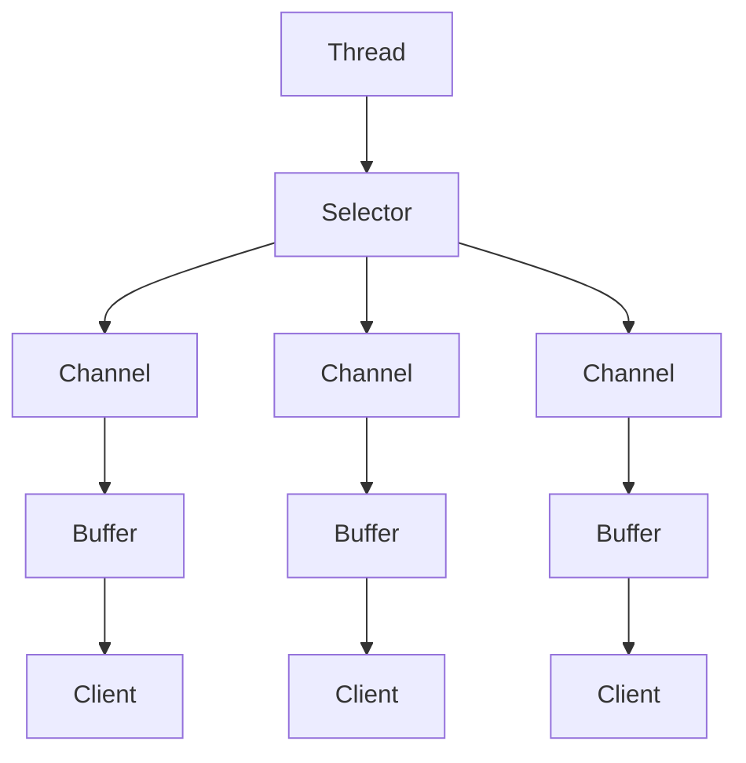
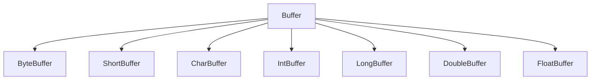

# Netty

[TOC]

## 1. Netty介绍

### 1.1 Netty简介

1. `Netty`是由`JBOSS`提供的一个`Java`开源框架，现为`Github`上的独立项目
2. `Netty`是一个异步的、基于事件驱动的网络应用框架，用以快速开发高性能、高可靠性的网络`IO`程序
3. `Netty`主要针对在`TCP`协议下，面向`Clients`端的高并发应用，或者`Peer-to-Peer`场景下的大量数据持续传输的应用
4. `Netty`本质是一个`NIO`框架，适用于服务器通讯相关的多种应用场景

### 1.2 Netty应用场景

#### 1.2.1 互联网行业

1. 互联网行业：在分布式系统中，各个节点之间需要远程服务调用，高性能的`RPC`框架必不可少，`Netty`作为异步高性能的通信框架，往往作为基础通信组件被这些`RPC`框架使用
2. 典型的应用有：阿里分布式服务框架`Dubbo`的`RPC`框架使用`Dubbo`协议进行节点间通信，`Dubbo`协议默认使用`Netty`作为基础通信组件，用于实现各进程节点之间的内部通信

#### 1.2.2 游戏行业

1. 无论是手游服务器还是大型的网络游戏，`java`语言得到了越来越广泛的应用
2. `Netty`作为高性能的基础通信组件，提供了`TCP/UDP`和`HTTP`协议栈，方便定制和开发私有协议栈
3. 地图服务器之间可以方便的通过`Netty`进行高性能的通信

#### 1.2.3 大数据领域

1. 经典的`Hadoop`的高性能通信和序列化组建(`AVRO`实现数据文件共享)的`RPC`框架，默认采用`Netty`进行跨界点通信
2. 它的`Netty Service`基于`Netty`框架二次封装实现

## 2. BIO

### 2.1 I/O模型

1. `I/O`模型简单的理解：就是用什么样的通道进行数据的发送和接受，很大程度上决定了程序通信的性能

2. `Java`共支持3种网络编程模型`I/O`模式：`BIO`、`NIO`、`AIO`

3. `Java BIO`：同步并阻塞（传统阻塞型），服务器实现模式为一个连接一个线程，即客户端有连接请求时服务端就需要启动一个线程进行处理，如果这个连接不做任何事情会造成不必要的线程开销

   ```mermaid
   graph TD
   A[Server] --> B[Thread] --> E[Client]
   A --> C[Thread] --> F[Client]
   A --> D[Thread] --> G[Client]
   ```

   

4. `Java NIO`：同步非阻塞，服务器实现模式为一个线程处理多个请求（连接），即客户端发送的连接请求都会注册到多路复用器上，多路复用器轮询连接由`I/O`请求就进行处理

   ```mermaid
   graph TD
   A[Server] --> B[Thread] --> C[Selector] -->D[Client]
   C --> F[Client]
   C --> G[Client]
   A[Server] --> H[Thread] --> I[Selector] -->J[Client]
   I --> K[Client]
   I --> L[Client]
   ```

5. `Java AIO`：异步非阻塞，`AIO`引入异步通道的概念，采用了`Proactor`模式，简化了程序编写，有效的请求才启动线程，它的特点是先由操作系统完成后才通知服务端车给你需祁东启动线程去处理，一般用于连接数较多且连接时间较长的应用 

 **适用场景**

1. `BIO`方式适用于连接数目比较小且固定的架构，这种方式对服务器资源要求比较高，并发局限于应用中，`JDK1.4`以前的唯一选择，但程序简单易理解
2. `NIO`方式适用于连接数目多且连接比较短的架构，比如聊天服务器，弹幕系统，服务间通讯等。变成比较复杂，`JDK1.4`开始支持
3. `AIO`方式适用于连接数目多且连接比较长的架构，比如相册服务器，重复调用`OS`参与并发操作，编程比较复杂，`JDK7`开始支持

### 2.2 BIO基本介绍

1. `java BIO`就是传统的`java io`编程，其相关的类和接口在`java.io`
2. `BIO`：同步阻塞，服务器实现模式为一个连接一个线程，即客户端由连接请求时就需要启动一个线程进行处理，如果这个连接不做任何事情会造成不必要的线程开销，可以通过线程池改善

```java
public class BIOServer {
    public static void main(String[] args) throws IOException {
        // 1.创建一个线程池
        ExecutorService threadPool = Executors.newCachedThreadPool();

        // 2.如果有客户端连接，就创建一个线程，与之通信
        ServerSocket serverSocket = new ServerSocket(6666);
        while(true) {
            // 监听客户端
            final Socket client = serverSocket.accept();

            // 创建线程与之通信
            threadPool.execute(new Runnable() {
                @Override
                public void run() {
                    handler(client);
                }
            });
        }
    }

    // 处理请求
    public static void handler(Socket client) {
        byte[] bytes = new byte[1024];
        InputStream inputStream = null;

        // 获取输入流
        try {
            inputStream = client.getInputStream();
            int read = -1;
            System.out.println("线程信息 id = " + Thread.currentThread().getId() + " 名字 = " + Thread.currentThread().getName());
            // 循环读取客户端发送的数据
            while(true) {
                read = inputStream.read(bytes);
                if(read != -1) {
                    System.out.println(new String(bytes, 0, read));
                }
            }
        } catch (IOException e) {
            e.printStackTrace();
        } finally {
            if(inputStream != null) {
                try {
                    inputStream.close();
                } catch (IOException e) {
                    e.printStackTrace();
                }
            }
        }
    }
}
```

### 2.3 BIO的问题

- 每个请求都需要创建独立的线程，与对应的客户端进行数据`Read`，业务处理，数据`Write`
- 当并发数较大时，需要创建大量线程来处理连接，系统资源占用较大
- 连接建立后，如果当前线程暂时没有数据可读，则线程就会阻塞在`Read`操作上，造成线程资源浪费

## 3. NIO

### 3.1 NIO基本介绍

1. `Java NIO`全称`Java non-blocking IO`，是指`JDK`提供的新`API`。从`JDK1,4`开始，`Java`提供了一系列改进的输入/输出的新特性，被统称为`NIO`，是同步非阻塞的
2. `NIO`相关的类都被放在`java.nio`包及子包下，并对原`java.io`包中的很多类进行改写
3. `NIO`有三大核心部分：`Channel`通信、`Buffer`缓冲区、`Selector`选择器
4. `NIO`是面向缓冲区，或者面向块编程的。数据读取到一个它稍后处理的缓冲区，需要时可在缓冲区中前后移动，这就增加了处理过程中的灵活性，使用它可以提供非阻塞式的高伸缩性网络
5. `Java NIO`的非阻塞式模式，使一个线程从某通道发送请求或者读取数据，但是它仅能得到目前可用的数据，如果目前没有数据可用时，就什么都不会获取，而不是保持线程阻塞，所以直至数据变的可以读取之前，该线程可以继续做其他的事情。非阻塞式也是如此，一个线程请求写入一些数据到某通道，但不需要等待它完全写入，这个线程同时也可以去做别的事情
6. `NIO`可以做到同一个线程来处理多个操作



`Selector`、`Channel`、`Buffer`

- 每个`Channel`都会对应一个`Buffer`
- `Selector`都对应一个线程，多个`Chnnel`可以注册到一个`Selector`上
- 程序切换到哪个`Channel`是由`Event`事件决定的，`Event`就是一个重要的概念
- `Selector`会根据不同的事件，在各个通道上切换
- `Buffer`就是一个内存块，底层是一个数组。数据的读取和写入是通过`Buffer`，`Buffer`既可以读取又可以写入，但需要`flip`方法来切换

### 3.2 缓冲区Buffer

**基本介绍**

缓冲区`Buffer`：缓冲区本质上是一个可以读写数据的内存块，可以理解成是一个容器对象，该对象提供了一组方法，可以更轻松地使用内存块，缓冲区对象内置了一些机制，能够跟踪和记录缓冲区的状态变化情况。`Channel`提供从文件、网络读取数据的渠道，但是读取或写入的数据都必须经由`Buffer`

在`NIO`中，`Buffer`是一个顶层父类，它是一个抽象类，类的层级关系



不同的数据类型对应不同类型`Buffer`

**Buffer的四个重要属性**

```java
private int mark = -1; // 标记

private int position = 0; // 位置，下一个要被读或写的元素索引，每次读写缓冲区数据时都会改变改值

private int limit; // 表示缓冲区的当前终点，不能对缓冲区超过极限的位置进行读写操作。且极限是可以修改的

private int capacity; // 容量，即可以容纳的最大数据量，在缓冲区创建时被设定并且不能更改
```

**常用方法**

```java
public final int capacity(); // 返回此缓冲区的容量
public final int position(); // 返回此缓冲区的位置
public final Buffer position(); // 设置此缓冲区的位置
public final int limit(); // 返回此缓冲区的限制
public final Buffer limit(int newLimit); // 设置此缓冲区的限制
public final Buffer clear(); // 清除此缓冲区，即将各个标记恢复至初始状态，但是数据并没有真正擦除
public final Buffer flip(); // 反转此缓冲区
public final boolean hasRemaining(); // 告知在当前位置和限制之间是否有元素
public abstract boolean isReadOnly(); // 告知此缓冲区是否为只读缓冲区
public abstract boolean hsaArray(); // 告知缓冲区是否具有可访问的底层实现数组
public abstract Object array(); // 返回此缓冲区的底层实现数组
```

**ByteBuffer**

对于`Buffer`子类而言，`ByteBuffer`是使用的最多的

`ByteBuffer`常用方法

```java
public static ByteBuffer allocateDirect(int capacity); // 创建直接缓冲区
public static ByteBuffer allocate(int capacity); // 设置缓冲区的初始容量
public abstract byte get(); // 从当前位置position上get，get之后，position会自动加1
public abstract byte get(int index); // 从index位置上获取元素
public abstract ByteBuffer put(byte b); // 从当前位置上put，put之后，position会自动加1
public abstract ByteBuffer put(int index, byte b); // 从绝对位置上put
```

**注意事项**

1. `ByteBuffer`支持类型化的`put`和`get`，`put`放入的是什么数据类型，`get`就应该使用相应的数据类型来取出，否则可能有`BufferUnderflowException`异常

2. 可以将一个普通的`Buffer`转换为只读的`Buffer`

   ```java
   ByteBuffer buffer = ByteBuffer.allocate(64);
   ByteBuffer readOnlyBuffer = buffer.asReadOnlyBuffer();
   ```

3. `NIO`还提供了`MappedByteBuffer`，可以让文件直接在内存（堆外的内存）中进行修改

   ```java
   public class MappedByteBufferTest {
       public static void main(String[] args) throws Exception {
           RandomAccessFile randomAccessFile = new RandomAccessFile("file01.txt", "rw");
           FileChannel channel = randomAccessFile.getChannel();
   
           /*
           * 参数1：使用读写模式
           * 参数2：可以直接修改的起始位置
           * 参数3：映射到内存的大小，即将1.txt的多少个字节映射到内存，可以修改的范围是0-4
           * */
           MappedByteBuffer mappedByteBuffer = channel.map(FileChannel.MapMode.READ_WRITE, 0, 5);
   
           // 修改
           mappedByteBuffer.put(0, (byte) 'P');
           mappedByteBuffer.put(3, (byte) '9');
   
           randomAccessFile.close();
       }
   }
   ```

   

### 3.3 通道Channel

**基本介绍**

1. `NIO`的通道类似于流

   - 通道可以同时进行读写，而流只读或者只写
   - 通道可以实现异步读写数据
   - 通道可以实现异步读写数据
   - 通道可以从缓冲区读数据，也可以写数据到缓冲区

2. `BIO`中的`stream`是单向的，例如`FileInputStream`对象只能进行读取数据的操作，而`NIO`中的通道`Channel`是双向的，可以读操作，也可以写操作

3. `Channel`在`NIO`中是一个接口

   ```java
   public interface Channel extends Closeable{}
   ```

4. 常用的`Channel`类有：`FileChannel`、`DatagramChannel`、`ServerSocketChannel`和`SocketChannel`

5. `FileChannel`用于文件的数据读写，`DatagramChannel`用于`UDP`的数据读写，`ServerSocketChannel`和`SocketChannel`用于`TCP`的数据读写

**FileChannel类**

`FileChannel`主要用来对本地文件进行`IO`操作，常见的方法有

```java
public int read(ByteBuffer dst); // 从通道读取数据并放到缓冲区中
public int write(ByteBuffer src); // 把缓冲区的数据写到通道中
public long tranferFrom(ReadableByteChannel src, long position, long count); // 从目标通道中复制数据到当前通道
public long tranferTO(long position, long count, WritableByteChannel target); // 把数据从当前通道复制给目标通道
```

文件写入

```java
public class NIOFileChannelWrite {
    public static void main(String[] args) throws IOException {
        String str = "Hello 中国";

        // 创建一个输出流
        FileOutputStream fileOutputStream = new FileOutputStream("file01.txt");

        // 通过输出流获取Channel
        FileChannel channel = fileOutputStream.getChannel();

        // 创建一个缓冲区，并将待写入的数据放入缓冲区
        ByteBuffer buffer = ByteBuffer.allocate(1024);
        buffer.put(str.getBytes(StandardCharsets.UTF_8));

        // 对buffer进行反转
        buffer.flip();

        // 将数据写入Channel
        channel.write(buffer);

        // 关闭流
        fileOutputStream.close();
    }
}
```

文件读取

```java
public class NIOFileChannelRead {
    public static void main(String[] args) throws IOException {
        // 创建一个输出流
        FileInputStream fileInputStream = new FileInputStream("file01.txt");

        // 通过输出流获取Channel
        FileChannel channel = fileInputStream.getChannel();

        // 创建一个缓冲区，并文件中的数据放入缓冲区
        ByteBuffer buffer = ByteBuffer.allocate(1024);
        channel.read(buffer);

        System.out.println(new String(buffer.array()));
        // 关闭流
        fileInputStream.close();
    }
}
```

文件拷贝

```java
public class NIOFileChannel {
    public static void main(String[] args) throws IOException {
        FileInputStream fileInputStream = new FileInputStream("file01.txt");
        FileChannel readChannel = fileInputStream.getChannel();

        FileOutputStream fileOutputStream = new FileOutputStream("file02.txt");
        FileChannel writeChannel = fileOutputStream.getChannel();

        ByteBuffer buffer = ByteBuffer.allocate(512);
        while(true) {
            // 从channel中读取数据到buffer
            buffer.clear(); // 清空buffer
            int len = readChannel.read(buffer);
            if(len == -1) {
                break;
            }

            // 从buffer中写出数据到channel
            buffer.flip();
            writeChannel.write(buffer);
        }

        fileInputStream.close();
        fileOutputStream.close();
    }
}
```

不使用`Buffer`进行拷贝

```java
public class NIOFileChannel2 {
    public static void main(String[] args) throws Exception{

        FileInputStream fileInputStream = new FileInputStream("file01.txt");
        FileChannel readChannel = fileInputStream.getChannel();


        FileOutputStream fileOutputStream = new FileOutputStream("file02.txt");
        FileChannel writeChannel = fileOutputStream.getChannel();

        writeChannel.transferFrom(readChannel, 0, readChannel.size()); // 将readChannel的内容拷贝到当前Channel
        
        fileInputStream.close();
        fileOutputStream.close();
    }
}
```

`Buffer`数组的使用

```java
/*
* Scattering: 将数据写入到buffer时，可以采用buffer数据，依次写入分散
* Gathering: 从buffer读取数据时，可以采用buffer数组，依次读
* */
public class ScatteringAndGatheringTest {
    public static void main(String[] args) throws Exception{

        // 使用ServerSocketChannel和SocketChannel网络
        ServerSocketChannel serverSocketChannel = ServerSocketChannel.open();
        InetSocketAddress inetSocketAddress = new InetSocketAddress(7000);

        // 绑定端口到Socket，并启动
        serverSocketChannel.socket().bind(inetSocketAddress);

        // 创建buffer数组
        ByteBuffer[] byteBuffers = new ByteBuffer[2];
        byteBuffers[0] = ByteBuffer.allocate(5);
        byteBuffers[1] = ByteBuffer.allocate(3);

        // 等待客户端连接(telnet)
        SocketChannel socketChannel = serverSocketChannel.accept();
        int messageLength = 8; //假定客户端接受8个字节
        // 循环读取
        while(true) {
            int byteRead = 0;

            while(byteRead < messageLength) {
                long len = socketChannel.read(byteBuffers);
                byteRead += len; // 累计读取的字节数
                System.out.println("byteRead = " + byteRead);

                Arrays.asList(byteBuffers).stream().map(buffer -> "position="+ buffer.position() + ", limit=" + buffer.limit()).forEach(System.out::println);
            }

            // 将所有的buffer进行flip
            Arrays.asList(byteBuffers).forEach(buffer -> buffer.flip());

            // 将数据读出显示到客户端
            long byteWrite = 0;
            while(byteWrite < messageLength) {
                long len = socketChannel.write(byteBuffers);
                byteWrite += len;
            }

            // 将所有的buffer进行clear
            Arrays.asList(byteBuffers).forEach(ByteBuffer::clear);
            System.out.println("byteRead=" + byteRead + ", byteWrite=" + byteWrite + ", messageLength=" + messageLength);
        }
    }
}
```

### 3.4 选择器Selector

**基本介绍**

1. `Java`的`NIO`，用非阻塞的`IO`方式。可以用一个线程，处理多个的客户端连接，就会使用到选择器`Selector`
2. `Selector`能够检测多个注册的通道上是否有事件发生（多个`Channel`以事件的方式可以注册到同一个`Selector`），如果有事件发生，便获取时间然后针对每个事件进行相应的处理。这样就可以只用一个单线程去管理多个通道，也就是管理多个连接和请求
3. 只有在连接真正读写事件发生时，才会进行读写，就大大地减少了系统开销，并且不必为每个连接都创建一个线程，不用去维护多个线程。避免了多线程之间的上下文切换导致的开销

**Selector类相关方法**

`Selector`类是一个抽象类，常用方法如下

``` java
public static Selector open(); // 得到一个选择器对象

// 监控所有注册的通道，当其中有IO操作可以进行时，将对应的SelectionKey加入到内部集合中并返回，参数用来设置超时时间
public int select(long timeout);
public Set<SelectionKey> selectedKeys(); // 从内部集合中得到所有的SelectionKey
```

`NIO`中的`ServerSocketChannel`功能类似`ServerSocket`，`SocketChannel`功能类似`Socket`

**网络编程**

1. 当客户端连接时，会通过`ServerSocketChannel`得到`SocketChannel`
2. 将`SocketChannel`注册到`Selector`上，`register(Selector sel, int ops)`，一个`Selector`上可以注册多个`SocketChannel`
3. 注册后返回一个`SelectionKey`，会和该`Selector`关联(集合)
4. `Selector`进行监听`select`方法，返回有事件发生的通道个数
5. 进一步得到各个`SelectionKey`(有事件发生的)
6. 再通过`SelectionKey`反向获取`SocketChannel`

#### 3.4.1 示例

server

```java
public class NIOServer {
    public static void main(String[] args) throws Exception{
        // 创建ServerSocketChannel
        ServerSocketChannel serverSocketChannel = ServerSocketChannel.open();

        // 得到一个Selector对象
        Selector selector = Selector.open();

        // 绑定端口，在服务器监听
        serverSocketChannel.socket().bind(new InetSocketAddress(6666));

        // 设置为非阻塞式
        serverSocketChannel.configureBlocking(false);

        // 把serverSocketChannel注册到selector关心事件为OP_ACCEPT
        serverSocketChannel.register(selector, SelectionKey.OP_ACCEPT);

        // 循环等待客户端连接
        while(true) {

            // 等待1秒连接
            if(selector.select(1000) == 0) {
                // 没有事件发生
                System.out.println("服务器等待了1秒，无连接");
                continue;
            }

            // 如果返回的>0，表明已经获取到关注的事件，获取相关的selectionKey集合
            // selector.selectedKeys() 返回关注事件的集合，通过selectionKeys 反向获取Channel
            Set<SelectionKey> selectionKeys = selector.selectedKeys();

            // 遍历
            Iterator<SelectionKey> iterator = selectionKeys.iterator();
            while(iterator.hasNext()) {
                // 获取SelectionKey
                SelectionKey key = iterator.next();
                // 根据key 对应的通道发生的事件做相应处理
                if(key.isAcceptable()) {
                    // 如果是OP_ACCEPT，表明有新的连接
                    // 给该客户端生成一个SocketChannel
                    SocketChannel socketChannel = serverSocketChannel.accept();
                    socketChannel.configureBlocking(false); // 设置为非阻塞

                    System.out.println("客户端连接成功");
                    // 将socketChannel注册到selector, 关注事件为OP_READ, 同时给socketChannel关联一个Buffer
                    socketChannel.register(selector, SelectionKey.OP_READ, ByteBuffer.allocate(1024));
                }

                if(key.isReadable()) {
                    // 发生OP_READ
                    // 通过key反向获取socketChannel
                    SocketChannel channel = (SocketChannel)key.channel();

                    // 获取到该channel关联的buffer
                    ByteBuffer buffer = (ByteBuffer)key.attachment();

                    channel.read(buffer);
                    System.out.println("客户端：" + new String(buffer.array()));
                }

                // 手动从集合中移除当前的selectionKey，防止重复操作
                iterator.remove();
            }
        }
    }
}
```

client

```java
public class NIOClient {
    public static void main(String[] args) throws Exception{
        // 得到一个网络通道
        SocketChannel socketChannel = SocketChannel.open();

        // 设置非阻塞模式
        socketChannel.configureBlocking(false);

        // 提供服务端的ip和端口
        InetSocketAddress inetSocketAddress = new InetSocketAddress("127.0.0.1", 6666);

        // 连接服务器
        if(!socketChannel.connect(inetSocketAddress)) {
            while(!socketChannel.finishConnect()) {
                System.out.println("因为连接需要时间，客户端不会阻塞，可以做其他工作");
            }
        }

        // 连接成功，就发送数据
        // ByteBuffer.wrap()，将字节数据写入到Buffer中
        ByteBuffer buffer = ByteBuffer.wrap("Hello 中国".getBytes());

        // 发送数据，将Buffer数据写入Channel
        socketChannel.write(buffer);

        // 暂停程序
        System.in.read();
    }
}
```

#### 3.4.2 SelectionKey

`SelectionKey`，表示`Selector`和网络通道的注册关系，共四种

- `int OP_ACCEPT`：有新的网络连接可以`accept`，值为16
- `int OP_CONNECT`：代表连接已经建立，值为8
- `int OP_READ`：代表读操作，值为1
- `int OP_WRITE`：代表写操作，值为4

**相关方法**

```java
public abstract Selector selector(); // 得到与之关联的Selector对象
public abstract SelectableChannel channel(); // 得到与之关联的通道
public final Object attachment(); // 得到与之关联的共享数据
public abstract SelectionKey interestOps(int ops); // 设置或改变监听事件
public final boolean isAcceptable(); // 是否可以accept
public final boolean isReadable(); // 是否可以读
public final boolean isWritable(); // 是否可以写
```

### 3.5 ServerSocketChannel和SocketChannel

#### 3.5.1 ServerSocketChannel

1. `ServerSocketChannel`在服务器端监听新的客户端`Socket`连接

2. 相关方法

   ```java
   public static ServerSocketChannel open(); // 得到一个ServerSocketChannel通道
   public final ServerSocketChannel bind(SocketAddress local); // 设置服务器端端口号
   public final SelectableChannel configureBlocking(boolean block); // 设置阻塞或非阻塞模式，取值false表示采用非阻塞模式
   public SocketChannel accept(); // 接受一个连接，返回代表这个连接的通道对象
   public final SelectionKey register(Selector sel, int ops); // 注册一个选择器并设置监听事件
   ```

#### 3.5.2 SocketChannel

1. `SocketChannel`，网络`IO`通道，具体负责进行读写操作。`NIO`把缓冲区的数据写入通道，或者把通道里的数据读到缓冲区

2. 相关方法

   ```java
   public static SocketChannel open(); // 得到一个SocketChannel通道
   public final SelectableChannel configureBlocking(boolean block); // 设置阻塞或非阻塞模式，取值false表示采用非阻塞模式
   public boolean connect(SocketAddress remote); // 连接服务器
   public boolean finishConnect(); // 如果上面的方法连接失败，接下来就要通过该方法完成连接操作
   public int write(ByteBuffer src); // 往通道中写数据
   public int read(ByteBuffer dst); // 从通道里读数据
   public final SelectionKey register(Selector sel, int ops, Object att); // 注册一个选择器并设置监听事件
   public final void close(); // 关闭通道
   ```

   