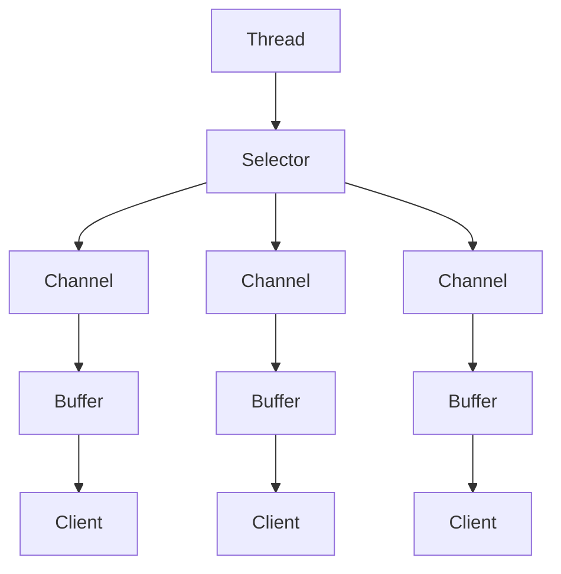
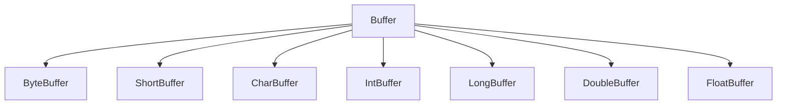
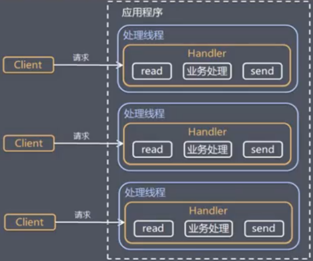
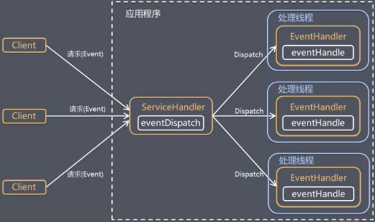
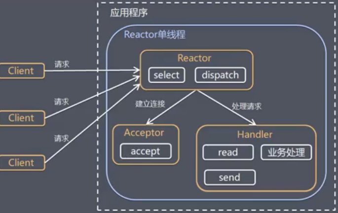
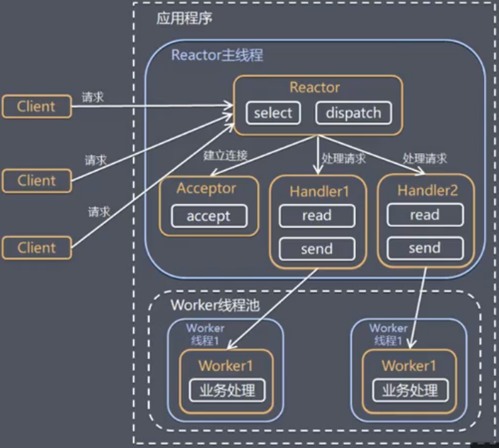
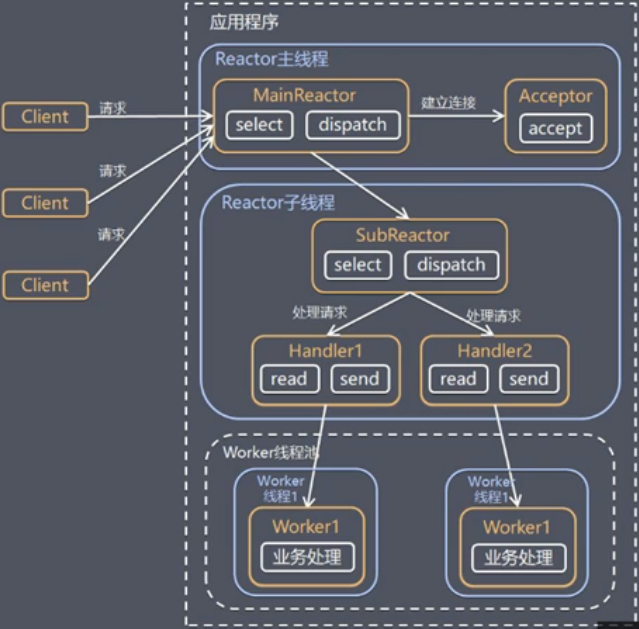
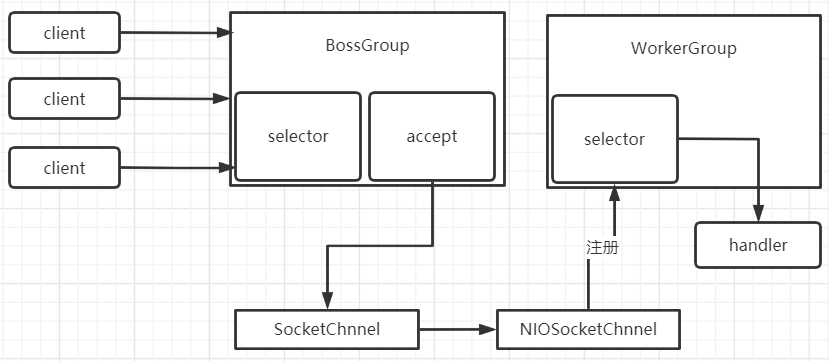

# Netty

[TOC]

## 1. Netty介绍

### 1.1 Netty简介

1. `Netty`是由`JBOSS`提供的一个`Java`开源框架，现为`Github`上的独立项目
2. `Netty`是一个异步的、基于事件驱动的网络应用框架，用以快速开发高性能、高可靠性的网络`IO`程序
3. `Netty`主要针对在`TCP`协议下，面向`Clients`端的高并发应用，或者`Peer-to-Peer`场景下的大量数据持续传输的应用
4. `Netty`本质是一个`NIO`框架，适用于服务器通讯相关的多种应用场景

### 1.2 Netty应用场景

#### 1.2.1 互联网行业

1. 互联网行业：在分布式系统中，各个节点之间需要远程服务调用，高性能的`RPC`框架必不可少，`Netty`作为异步高性能的通信框架，往往作为基础通信组件被这些`RPC`框架使用
2. 典型的应用有：阿里分布式服务框架`Dubbo`的`RPC`框架使用`Dubbo`协议进行节点间通信，`Dubbo`协议默认使用`Netty`作为基础通信组件，用于实现各进程节点之间的内部通信

#### 1.2.2 游戏行业

1. 无论是手游服务器还是大型的网络游戏，`java`语言得到了越来越广泛的应用
2. `Netty`作为高性能的基础通信组件，提供了`TCP/UDP`和`HTTP`协议栈，方便定制和开发私有协议栈
3. 地图服务器之间可以方便的通过`Netty`进行高性能的通信

#### 1.2.3 大数据领域

1. 经典的`Hadoop`的高性能通信和序列化组建(`AVRO`实现数据文件共享)的`RPC`框架，默认采用`Netty`进行跨界点通信
2. 它的`Netty Service`基于`Netty`框架二次封装实现

## 2. BIO

### 2.1 I/O模型

1. `I/O`模型简单的理解：就是用什么样的通道进行数据的发送和接受，很大程度上决定了程序通信的性能

2. `Java`共支持3种网络编程模型`I/O`模式：`BIO`、`NIO`、`AIO`

3. `Java BIO`：同步并阻塞（传统阻塞型），服务器实现模式为一个连接一个线程，即客户端有连接请求时服务端就需要启动一个线程进行处理，如果这个连接不做任何事情会造成不必要的线程开销

   ```mermaid
   graph TD
   A[Server] --> B[Thread] --> E[Client]
   A --> C[Thread] --> F[Client]
   A --> D[Thread] --> G[Client]
   ```

   

4. `Java NIO`：同步非阻塞，服务器实现模式为一个线程处理多个请求（连接），即客户端发送的连接请求都会注册到多路复用器上，多路复用器轮询连接由`I/O`请求就进行处理

   ```mermaid
   graph TD
   A[Server] --> B[Thread] --> C[Selector] -->D[Client]
   C --> F[Client]
   C --> G[Client]
   A[Server] --> H[Thread] --> I[Selector] -->J[Client]
   I --> K[Client]
   I --> L[Client]
   ```

5. `Java AIO`：异步非阻塞，`AIO`引入异步通道的概念，采用了`Proactor`模式，简化了程序编写，有效的请求才启动线程，它的特点是先由操作系统完成后才通知服务端车给你需祁东启动线程去处理，一般用于连接数较多且连接时间较长的应用 

 **适用场景**

1. `BIO`方式适用于连接数目比较小且固定的架构，这种方式对服务器资源要求比较高，并发局限于应用中，`JDK1.4`以前的唯一选择，但程序简单易理解
2. `NIO`方式适用于连接数目多且连接比较短的架构，比如聊天服务器，弹幕系统，服务间通讯等。变成比较复杂，`JDK1.4`开始支持
3. `AIO`方式适用于连接数目多且连接比较长的架构，比如相册服务器，重复调用`OS`参与并发操作，编程比较复杂，`JDK7`开始支持

### 2.2 BIO基本介绍

1. `java BIO`就是传统的`java io`编程，其相关的类和接口在`java.io`
2. `BIO`：同步阻塞，服务器实现模式为一个连接一个线程，即客户端由连接请求时就需要启动一个线程进行处理，如果这个连接不做任何事情会造成不必要的线程开销，可以通过线程池改善

```java
public class BIOServer {
    public static void main(String[] args) throws IOException {
        // 1.创建一个线程池
        ExecutorService threadPool = Executors.newCachedThreadPool();

        // 2.如果有客户端连接，就创建一个线程，与之通信
        ServerSocket serverSocket = new ServerSocket(6666);
        while(true) {
            // 监听客户端
            final Socket client = serverSocket.accept();

            // 创建线程与之通信
            threadPool.execute(new Runnable() {
                @Override
                public void run() {
                    handler(client);
                }
            });
        }
    }

    // 处理请求
    public static void handler(Socket client) {
        byte[] bytes = new byte[1024];
        InputStream inputStream = null;

        // 获取输入流
        try {
            inputStream = client.getInputStream();
            int read = -1;
            System.out.println("线程信息 id = " + Thread.currentThread().getId() + " 名字 = " + Thread.currentThread().getName());
            // 循环读取客户端发送的数据
            while(true) {
                read = inputStream.read(bytes);
                if(read != -1) {
                    System.out.println(new String(bytes, 0, read));
                }
            }
        } catch (IOException e) {
            e.printStackTrace();
        } finally {
            if(inputStream != null) {
                try {
                    inputStream.close();
                } catch (IOException e) {
                    e.printStackTrace();
                }
            }
        }
    }
}
```

### 2.3 BIO的问题

- 每个请求都需要创建独立的线程，与对应的客户端进行数据`Read`，业务处理，数据`Write`
- 当并发数较大时，需要创建大量线程来处理连接，系统资源占用较大
- 连接建立后，如果当前线程暂时没有数据可读，则线程就会阻塞在`Read`操作上，造成线程资源浪费

## 3. NIO

### 3.1 NIO基本介绍

1. `Java NIO`全称`Java non-blocking IO`，是指`JDK`提供的新`API`。从`JDK1,4`开始，`Java`提供了一系列改进的输入/输出的新特性，被统称为`NIO`，是同步非阻塞的
2. `NIO`相关的类都被放在`java.nio`包及子包下，并对原`java.io`包中的很多类进行改写
3. `NIO`有三大核心部分：`Channel`通信、`Buffer`缓冲区、`Selector`选择器
4. `NIO`是面向缓冲区，或者面向块编程的。数据读取到一个它稍后处理的缓冲区，需要时可在缓冲区中前后移动，这就增加了处理过程中的灵活性，使用它可以提供非阻塞式的高伸缩性网络
5. `Java NIO`的非阻塞式模式，使一个线程从某通道发送请求或者读取数据，但是它仅能得到目前可用的数据，如果目前没有数据可用时，就什么都不会获取，而不是保持线程阻塞，所以直至数据变的可以读取之前，该线程可以继续做其他的事情。非阻塞式也是如此，一个线程请求写入一些数据到某通道，但不需要等待它完全写入，这个线程同时也可以去做别的事情
6. `NIO`可以做到同一个线程来处理多个操作



`Selector`、`Channel`、`Buffer`

- 每个`Channel`都会对应一个`Buffer`
- `Selector`都对应一个线程，多个`Chnnel`可以注册到一个`Selector`上
- 程序切换到哪个`Channel`是由`Event`事件决定的，`Event`就是一个重要的概念
- `Selector`会根据不同的事件，在各个通道上切换
- `Buffer`就是一个内存块，底层是一个数组。数据的读取和写入是通过`Buffer`，`Buffer`既可以读取又可以写入，但需要`flip`方法来切换

### 3.2 缓冲区Buffer

**基本介绍**

缓冲区`Buffer`：缓冲区本质上是一个可以读写数据的内存块，可以理解成是一个容器对象，该对象提供了一组方法，可以更轻松地使用内存块，缓冲区对象内置了一些机制，能够跟踪和记录缓冲区的状态变化情况。`Channel`提供从文件、网络读取数据的渠道，但是读取或写入的数据都必须经由`Buffer`

在`NIO`中，`Buffer`是一个顶层父类，它是一个抽象类，类的层级关系



不同的数据类型对应不同类型`Buffer`

**Buffer的四个重要属性**

```java
private int mark = -1; // 标记

private int position = 0; // 位置，下一个要被读或写的元素索引，每次读写缓冲区数据时都会改变改值

private int limit; // 表示缓冲区的当前终点，不能对缓冲区超过极限的位置进行读写操作。且极限是可以修改的

private int capacity; // 容量，即可以容纳的最大数据量，在缓冲区创建时被设定并且不能更改
```

**常用方法**

```java
public final int capacity(); // 返回此缓冲区的容量
public final int position(); // 返回此缓冲区的位置
public final Buffer position(); // 设置此缓冲区的位置
public final int limit(); // 返回此缓冲区的限制
public final Buffer limit(int newLimit); // 设置此缓冲区的限制
public final Buffer clear(); // 清除此缓冲区，即将各个标记恢复至初始状态，但是数据并没有真正擦除
public final Buffer flip(); // 反转此缓冲区
public final boolean hasRemaining(); // 告知在当前位置和限制之间是否有元素
public abstract boolean isReadOnly(); // 告知此缓冲区是否为只读缓冲区
public abstract boolean hsaArray(); // 告知缓冲区是否具有可访问的底层实现数组
public abstract Object array(); // 返回此缓冲区的底层实现数组
```

**ByteBuffer**

对于`Buffer`子类而言，`ByteBuffer`是使用的最多的

`ByteBuffer`常用方法

```java
public static ByteBuffer allocateDirect(int capacity); // 创建直接缓冲区
public static ByteBuffer allocate(int capacity); // 设置缓冲区的初始容量
public abstract byte get(); // 从当前位置position上get，get之后，position会自动加1
public abstract byte get(int index); // 从index位置上获取元素
public abstract ByteBuffer put(byte b); // 从当前位置上put，put之后，position会自动加1
public abstract ByteBuffer put(int index, byte b); // 从绝对位置上put
```

**注意事项**

1. `ByteBuffer`支持类型化的`put`和`get`，`put`放入的是什么数据类型，`get`就应该使用相应的数据类型来取出，否则可能有`BufferUnderflowException`异常

2. 可以将一个普通的`Buffer`转换为只读的`Buffer`

   ```java
   ByteBuffer buffer = ByteBuffer.allocate(64);
   ByteBuffer readOnlyBuffer = buffer.asReadOnlyBuffer();
   ```

3. `NIO`还提供了`MappedByteBuffer`，可以让文件直接在内存（堆外的内存）中进行修改

   ```java
   public class MappedByteBufferTest {
       public static void main(String[] args) throws Exception {
           RandomAccessFile randomAccessFile = new RandomAccessFile("file01.txt", "rw");
           FileChannel channel = randomAccessFile.getChannel();
   
           /*
           * 参数1：使用读写模式
           * 参数2：可以直接修改的起始位置
           * 参数3：映射到内存的大小，即将1.txt的多少个字节映射到内存，可以修改的范围是0-4
           * */
           MappedByteBuffer mappedByteBuffer = channel.map(FileChannel.MapMode.READ_WRITE, 0, 5);
   
           // 修改
           mappedByteBuffer.put(0, (byte) 'P');
           mappedByteBuffer.put(3, (byte) '9');
   
           randomAccessFile.close();
       }
   }
   ```

   

### 3.3 通道Channel

**基本介绍**

1. `NIO`的通道类似于流

   - 通道可以同时进行读写，而流只读或者只写
   - 通道可以实现异步读写数据
   - 通道可以实现异步读写数据
   - 通道可以从缓冲区读数据，也可以写数据到缓冲区

2. `BIO`中的`stream`是单向的，例如`FileInputStream`对象只能进行读取数据的操作，而`NIO`中的通道`Channel`是双向的，可以读操作，也可以写操作

3. `Channel`在`NIO`中是一个接口

   ```java
   public interface Channel extends Closeable{}
   ```

4. 常用的`Channel`类有：`FileChannel`、`DatagramChannel`、`ServerSocketChannel`和`SocketChannel`

5. `FileChannel`用于文件的数据读写，`DatagramChannel`用于`UDP`的数据读写，`ServerSocketChannel`和`SocketChannel`用于`TCP`的数据读写

**FileChannel类**

`FileChannel`主要用来对本地文件进行`IO`操作，常见的方法有

```java
public int read(ByteBuffer dst); // 从通道读取数据并放到缓冲区中
public int write(ByteBuffer src); // 把缓冲区的数据写到通道中
public long tranferFrom(ReadableByteChannel src, long position, long count); // 从目标通道中复制数据到当前通道
public long tranferTO(long position, long count, WritableByteChannel target); // 把数据从当前通道复制给目标通道
```

文件写入

```java
public class NIOFileChannelWrite {
    public static void main(String[] args) throws IOException {
        String str = "Hello 中国";

        // 创建一个输出流
        FileOutputStream fileOutputStream = new FileOutputStream("file01.txt");

        // 通过输出流获取Channel
        FileChannel channel = fileOutputStream.getChannel();

        // 创建一个缓冲区，并将待写入的数据放入缓冲区
        ByteBuffer buffer = ByteBuffer.allocate(1024);
        buffer.put(str.getBytes(StandardCharsets.UTF_8));

        // 对buffer进行反转
        buffer.flip();

        // 将数据写入Channel
        channel.write(buffer);

        // 关闭流
        fileOutputStream.close();
    }
}
```

文件读取

```java
public class NIOFileChannelRead {
    public static void main(String[] args) throws IOException {
        // 创建一个输出流
        FileInputStream fileInputStream = new FileInputStream("file01.txt");

        // 通过输出流获取Channel
        FileChannel channel = fileInputStream.getChannel();

        // 创建一个缓冲区，并文件中的数据放入缓冲区
        ByteBuffer buffer = ByteBuffer.allocate(1024);
        channel.read(buffer);

        System.out.println(new String(buffer.array()));
        // 关闭流
        fileInputStream.close();
    }
}
```

文件拷贝

```java
public class NIOFileChannel {
    public static void main(String[] args) throws IOException {
        FileInputStream fileInputStream = new FileInputStream("file01.txt");
        FileChannel readChannel = fileInputStream.getChannel();

        FileOutputStream fileOutputStream = new FileOutputStream("file02.txt");
        FileChannel writeChannel = fileOutputStream.getChannel();

        ByteBuffer buffer = ByteBuffer.allocate(512);
        while(true) {
            // 从channel中读取数据到buffer
            buffer.clear(); // 清空buffer
            int len = readChannel.read(buffer);
            if(len == -1) {
                break;
            }

            // 从buffer中写出数据到channel
            buffer.flip();
            writeChannel.write(buffer);
        }

        fileInputStream.close();
        fileOutputStream.close();
    }
}
```

不使用`Buffer`进行拷贝

```java
public class NIOFileChannel2 {
    public static void main(String[] args) throws Exception{

        FileInputStream fileInputStream = new FileInputStream("file01.txt");
        FileChannel readChannel = fileInputStream.getChannel();


        FileOutputStream fileOutputStream = new FileOutputStream("file02.txt");
        FileChannel writeChannel = fileOutputStream.getChannel();

        writeChannel.transferFrom(readChannel, 0, readChannel.size()); // 将readChannel的内容拷贝到当前Channel
        
        fileInputStream.close();
        fileOutputStream.close();
    }
}
```

`Buffer`数组的使用

```java
/*
* Scattering: 将数据写入到buffer时，可以采用buffer数据，依次写入分散
* Gathering: 从buffer读取数据时，可以采用buffer数组，依次读
* */
public class ScatteringAndGatheringTest {
    public static void main(String[] args) throws Exception{

        // 使用ServerSocketChannel和SocketChannel网络
        ServerSocketChannel serverSocketChannel = ServerSocketChannel.open();
        InetSocketAddress inetSocketAddress = new InetSocketAddress(7000);

        // 绑定端口到Socket，并启动
        serverSocketChannel.socket().bind(inetSocketAddress);

        // 创建buffer数组
        ByteBuffer[] byteBuffers = new ByteBuffer[2];
        byteBuffers[0] = ByteBuffer.allocate(5);
        byteBuffers[1] = ByteBuffer.allocate(3);

        // 等待客户端连接(telnet)
        SocketChannel socketChannel = serverSocketChannel.accept();
        int messageLength = 8; //假定客户端接受8个字节
        // 循环读取
        while(true) {
            int byteRead = 0;

            while(byteRead < messageLength) {
                long len = socketChannel.read(byteBuffers);
                byteRead += len; // 累计读取的字节数
                System.out.println("byteRead = " + byteRead);

                Arrays.asList(byteBuffers).stream().map(buffer -> "position="+ buffer.position() + ", limit=" + buffer.limit()).forEach(System.out::println);
            }

            // 将所有的buffer进行flip
            Arrays.asList(byteBuffers).forEach(buffer -> buffer.flip());

            // 将数据读出显示到客户端
            long byteWrite = 0;
            while(byteWrite < messageLength) {
                long len = socketChannel.write(byteBuffers);
                byteWrite += len;
            }

            // 将所有的buffer进行clear
            Arrays.asList(byteBuffers).forEach(ByteBuffer::clear);
            System.out.println("byteRead=" + byteRead + ", byteWrite=" + byteWrite + ", messageLength=" + messageLength);
        }
    }
}
```

### 3.4 选择器Selector

**基本介绍**

1. `Java`的`NIO`，用非阻塞的`IO`方式。可以用一个线程，处理多个的客户端连接，就会使用到选择器`Selector`
2. `Selector`能够检测多个注册的通道上是否有事件发生（多个`Channel`以事件的方式可以注册到同一个`Selector`），如果有事件发生，便获取时间然后针对每个事件进行相应的处理。这样就可以只用一个单线程去管理多个通道，也就是管理多个连接和请求
3. 只有在连接真正读写事件发生时，才会进行读写，就大大地减少了系统开销，并且不必为每个连接都创建一个线程，不用去维护多个线程。避免了多线程之间的上下文切换导致的开销

**Selector类相关方法**

`Selector`类是一个抽象类，常用方法如下

``` java
public static Selector open(); // 得到一个选择器对象

// 监控所有注册的通道，当其中有IO操作可以进行时，将对应的SelectionKey加入到内部集合中并返回，参数用来设置超时时间
public int select(long timeout);
public Set<SelectionKey> selectedKeys(); // 从内部集合中得到所有的SelectionKey
```

`NIO`中的`ServerSocketChannel`功能类似`ServerSocket`，`SocketChannel`功能类似`Socket`

**网络编程**

1. 当客户端连接时，会通过`ServerSocketChannel`得到`SocketChannel`
2. 将`SocketChannel`注册到`Selector`上，`register(Selector sel, int ops)`，一个`Selector`上可以注册多个`SocketChannel`
3. 注册后返回一个`SelectionKey`，会和该`Selector`关联(集合)
4. `Selector`进行监听`select`方法，返回有事件发生的通道个数
5. 进一步得到各个`SelectionKey`(有事件发生的)
6. 再通过`SelectionKey`反向获取`SocketChannel`

#### 3.4.1 示例

server

```java
public class NIOServer {
    public static void main(String[] args) throws Exception{
        // 创建ServerSocketChannel
        ServerSocketChannel serverSocketChannel = ServerSocketChannel.open();

        // 得到一个Selector对象
        Selector selector = Selector.open();

        // 绑定端口，在服务器监听
        serverSocketChannel.socket().bind(new InetSocketAddress(6666));

        // 设置为非阻塞式
        serverSocketChannel.configureBlocking(false);

        // 把serverSocketChannel注册到selector关心事件为OP_ACCEPT
        serverSocketChannel.register(selector, SelectionKey.OP_ACCEPT);

        // 循环等待客户端连接
        while(true) {

            // 等待1秒连接
            if(selector.select(1000) == 0) {
                // 没有事件发生
                System.out.println("服务器等待了1秒，无连接");
                continue;
            }

            // 如果返回的>0，表明已经获取到关注的事件，获取相关的selectionKey集合
            // selector.selectedKeys() 返回关注事件的集合，通过selectionKeys 反向获取Channel
            Set<SelectionKey> selectionKeys = selector.selectedKeys();

            // 遍历
            Iterator<SelectionKey> iterator = selectionKeys.iterator();
            while(iterator.hasNext()) {
                // 获取SelectionKey
                SelectionKey key = iterator.next();
                // 根据key 对应的通道发生的事件做相应处理
                if(key.isAcceptable()) {
                    // 如果是OP_ACCEPT，表明有新的连接
                    // 给该客户端生成一个SocketChannel
                    SocketChannel socketChannel = serverSocketChannel.accept();
                    socketChannel.configureBlocking(false); // 设置为非阻塞

                    System.out.println("客户端连接成功");
                    // 将socketChannel注册到selector, 关注事件为OP_READ, 同时给socketChannel关联一个Buffer
                    socketChannel.register(selector, SelectionKey.OP_READ, ByteBuffer.allocate(1024));
                }

                if(key.isReadable()) {
                    // 发生OP_READ
                    // 通过key反向获取socketChannel
                    SocketChannel channel = (SocketChannel)key.channel();

                    // 获取到该channel关联的buffer
                    ByteBuffer buffer = (ByteBuffer)key.attachment();

                    channel.read(buffer);
                    System.out.println("客户端：" + new String(buffer.array()));
                }

                // 手动从集合中移除当前的selectionKey，防止重复操作
                iterator.remove();
            }
        }
    }
}
```

client

```java
public class NIOClient {
    public static void main(String[] args) throws Exception{
        // 得到一个网络通道
        SocketChannel socketChannel = SocketChannel.open();

        // 设置非阻塞模式
        socketChannel.configureBlocking(false);

        // 提供服务端的ip和端口
        InetSocketAddress inetSocketAddress = new InetSocketAddress("127.0.0.1", 6666);

        // 连接服务器
        if(!socketChannel.connect(inetSocketAddress)) {
            while(!socketChannel.finishConnect()) {
                System.out.println("因为连接需要时间，客户端不会阻塞，可以做其他工作");
            }
        }

        // 连接成功，就发送数据
        // ByteBuffer.wrap()，将字节数据写入到Buffer中
        ByteBuffer buffer = ByteBuffer.wrap("Hello 中国".getBytes());

        // 发送数据，将Buffer数据写入Channel
        socketChannel.write(buffer);

        // 暂停程序
        System.in.read();
    }
}
```

#### 3.4.2 SelectionKey

`SelectionKey`，表示`Selector`和网络通道的注册关系，共四种

- `int OP_ACCEPT`：有新的网络连接可以`accept`，值为16
- `int OP_CONNECT`：代表连接已经建立，值为8
- `int OP_READ`：代表读操作，值为1
- `int OP_WRITE`：代表写操作，值为4

**相关方法**

```java
public abstract Selector selector(); // 得到与之关联的Selector对象
public abstract SelectableChannel channel(); // 得到与之关联的通道
public final Object attachment(); // 得到与之关联的共享数据
public abstract SelectionKey interestOps(int ops); // 设置或改变监听事件
public final boolean isAcceptable(); // 是否可以accept
public final boolean isReadable(); // 是否可以读
public final boolean isWritable(); // 是否可以写
```

### 3.5 ServerSocketChannel和SocketChannel

#### 3.5.1 ServerSocketChannel

1. `ServerSocketChannel`在服务器端监听新的客户端`Socket`连接

2. 相关方法

   ```java
   public static ServerSocketChannel open(); // 得到一个ServerSocketChannel通道
   public final ServerSocketChannel bind(SocketAddress local); // 设置服务器端端口号
   public final SelectableChannel configureBlocking(boolean block); // 设置阻塞或非阻塞模式，取值false表示采用非阻塞模式
   public SocketChannel accept(); // 接受一个连接，返回代表这个连接的通道对象
   public final SelectionKey register(Selector sel, int ops); // 注册一个选择器并设置监听事件
   ```

#### 3.5.2 SocketChannel

1. `SocketChannel`，网络`IO`通道，具体负责进行读写操作。`NIO`把缓冲区的数据写入通道，或者把通道里的数据读到缓冲区

2. 相关方法

   ```java
   public static SocketChannel open(); // 得到一个SocketChannel通道
   public final SelectableChannel configureBlocking(boolean block); // 设置阻塞或非阻塞模式，取值false表示采用非阻塞模式
   public boolean connect(SocketAddress remote); // 连接服务器
   public boolean finishConnect(); // 如果上面的方法连接失败，接下来就要通过该方法完成连接操作
   public int write(ByteBuffer src); // 往通道中写数据
   public int read(ByteBuffer dst); // 从通道里读数据
   public final SelectionKey register(Selector sel, int ops, Object att); // 注册一个选择器并设置监听事件
   public final void close(); // 关闭通道
   ```

### 3.6 NIO与零拷贝

零拷贝是从操作系统角度，没有`CPU`拷贝

**mmap优化**

`mmap`通过内存映射，将文件映射到内核缓冲区，同时用户空间可以共享内核空间的数据。这样在进行网络传输时，就可以减少内核空间到用户空间的拷贝次数。适合小数据量读写

**sendFile优化**

`Linux2.1`版本提供了`sendFile`函数，其基本原理是：数据根本不经过用户态，直接从内核缓冲区进入到`SocketBuffer`，同时，由于和用户态完全无关，就减少了一次上下文切换

`Linux2.4`版本中，做了一些修改，避免了从内核缓冲区拷贝到`SocketBuffer`的操作，直接（有少量描述信息例外，可以忽略不计）拷贝到协议栈，从而再一次减少了数据拷贝

`sendFile`适合大文件拷贝

### 3.7 AIO

1. `JDK7`引入了`Asynchronous I/O`，即`AIO`。在进行`I/O`的编程中，常用到两种模式：`Reactor`和`PLroactor`。`Java`的`NIO`就是`Reactor`，当有事件触发时，服务端得到通知，进行相应的处理
2. `AIO`即`NIO2.0`，叫做异步不阻塞的`IO`。`AIO`引入异步通道的概念，采用了`Proactor`模式，简化了程序编写，有效的请求才启动线程，它的特点是先由操作系统完成后才通知服务端程序启动线程去处理，一般适用于连接数较多且连接时间较长的应用
3. 目前尚未广泛运用

### 3.8 几种IO对比

|        | BIO      | NIO                  | AIO        |
| ------ | -------- | -------------------- | ---------- |
| IO模型 | 同步阻塞 | 同步非阻塞(多路复用) | 异步非阻塞 |
| 可靠性 | 差       | 好                   | 好         |
| 吞吐量 | 低       | 高                   | 更高       |

## 4. Netty

**原生NIO的问题**

1. `NIO`的类库和`API`繁杂，使用麻烦：需要熟练掌握`Selector`、`ServerSocketChannel`、`SocketChannel`、`ByteBuffer`等
2. 需要具备其他的额外技能：要熟悉`Java`多线程编程，因为`NIO`编程涉及到`Reactor`模式，你必须对多线程和网络编程非常熟悉，才能编写出高质量的`NIO`程序
3. 开发工作量和难度都非常大：例如客户端面临断线重连、网络闪断、半包赌侠，失败缓存、网络拥塞和异常流的处理等等
4. `JDK NIO`的`BUG`：例如`Epoll BUG`，它会导致`Selector`空轮询，最终导致`CPU 100%`

**Netty简介**

1. `Netty`是由`JBOSS`提供的一个`java`开源框架。`Netty`提供异步的、基于事件驱动的网络应用程序框架，用以快速开发高性能、高可靠性的网络`IO`程序
2. `Netty`可以帮助你快速、简单的开发出一个网络应用，相当于简化和流程化了`NIO`的开发过程
3. `Netty`是目前最流行的`NIO`框架，`Netty`在互联网领域、大数据分布式计算领域、游戏行业、通信行业等获得了广泛的应用，之谜鞥的`Elasticsearch`、`Dubbo`框架内部都采用了`Netty`

**Netty的优点**

1. 设计优雅：适用于各种传输类型的同一`API`阻塞和非阻塞`Socket`；基于灵活且可扩展的事件模型，可以清晰地分离关注点；高度可定制的线程模型 - 单线程，一个或多个线程池
2. 使用方便：详细记录的`Javadoc`，用户指南和示例；没有其他的依赖项，`JDK5(Netty 3.x)`、`JDK6(Netty4.x)`就足够了
3. 高性能、吞吐量更高：延迟更低；减少资源消耗；最小化不必要的内存复制
4. 安全：完整的`SSL/TLS`和`StartTLS`支持

**依赖**

```xml
<dependency>
    <groupId>io.netty</groupId>
    <artifactId>netty-all</artifactId>
    <version>4.1.59.Final</version>
</dependency>
```

### 4.1 Netty架构设计

不同的线程模型，对程序的性能有很大影响。

1. 目前的线程模型

   传统阻塞`I/O`服务模型

   `Reactor`模式

2. 根据`Reactor`的数量和处理资源池线程的数量不同，有三种典型的实现

   单`Reactor`单线程

   单`Reactor`多线程

   主从`Reactor`多线程

3. `Netty`线程模型

   `Netty`线程模式主要基于主从`Reactor`多线程模型做了一定的改进，其中主从`Reactor`多线程模型有多个`Reactor`

#### 4.1.1 传统阻塞模型



**模型特点**

1. 采用阻塞`IO`模式获取输入的数据
2. 每个连接都需要独立的线程完成数据的输入，业务柴里，数据返回

**问题分析**

1. 当并发数很大，就会创建大量的线程，占用很大的系统资
2. 连接创建后，如果当前想成暂时没有数据可读，该线程会阻塞在`read`操作，造成线程资源浪费

#### 4.1.2 Reactor模式

针对传统阻塞`I/O`服务模型的2个缺点，解决方案

1. 基于`I/O`复用模型：多个连接共用一个阻塞对象，应用程序只需要在一个阻塞对象等待，无需阻塞等待所有连接。当某个连接有新的数据可以处理时，操作系统通知应用程序，线程从阻塞状态返回，开始进行业务处理
2. 基于线程池复用线程资源：不必再为每个连接创建线程，将连接完成后的业务出来任务分配给线程进行处理，一个线程可以处理多个连接的业务



**处理步骤**

1. `Reactor`模式，通过一个或多个输入同时传递给服务处理器的模式（基于事件驱动）
2. 服务器端程序处理多个传入的请求，并将它们同步分派到响应的处理线程，因此`Reactor`模式也叫`Dispatcher`模式
3. `Reactor`模式使用`IO`复用监听事件，收到事件后，分发给某个线程（进程）

**核心组成部分**

1. `Reactor`：`Reactor`在一个单独的线程中运行，负责监听和分发事件，分发给适当的处理程序来对`IO`事件做出反应
2. `Handlers`：处理程序执行`I/O`事件要完成的实际事件，`Reactor`通过调度适当的处理程序来响应`I/O`事件，处理程序执行非阻塞操作

#### 4.1.3 单Reactor单线程



**方案说明**

1. `Select`是前面`I/O`复用模型介绍的标准网络编程`API`，可以实现应用程序通过一个阻塞对象监听多路连接请求
2. `Reactor`对象通过`Select`监控客户端请求事件，收到事件后通过`Dispatch`进行分发
3. 如果是建立连接请求事件，则由`Acceptor`通过`Accept`处理连接请求，然后创建一个`Handler`队形啊处理连接完成的后续业务处理
4. 如果不是建立连接事件，啧`Reactor`会分发调用连接对应的`Handler`来响应
5. `Handler`会完成`Read`->业务处理->`Send`的完整业务流程

服务端用一个线程通过多路复用搞定所有的`IO`操作（包括连接，读、写等），编码简单，清晰明了，但是如果客户端连接数量较多，将无法支撑

**缺点优点分析**

1. 优点：模型简单，没有多线程、进程通信、资源竞争的问题，全部都在一个线程中完成
2. 缺点：性能问题，只有一个线程，无法完全发挥多核`CPU`的性能。`Handler`在处理某个连接上的业务时，整个进程无法处理其他连接事件，很容易导致性能瓶颈
3. 缺点：可靠性问题，线程意外终止，或者进入死循环，会导致整个系统通信模块不可用，不能接收和处理外部消息，造成节点故障

客户端数量有限，业务处理非常迅速，比如`Readis`在业务处理的事件复杂度O(1)的情况

#### 4.1.4 单Reactor多线程



**方案说明**

1. `Reactor`对象通过`select`监控客户端请求事件，收到事件后，通过`dispatch`进行分发
2. 如果是建立连接的请求，通过`Acceptor`通过`accept`处理连接请求，然后创建一个`Handler`对象处理完成连接后的各种事件
3. 如果不是连接请求，则由`reactor`分发调用连接对应的`handler`来处理
4. `handler`只负责响应事件，不做具体的业务处理，通过`read`读取数据后，会分发给后面的`worker`线程池的某个线程处理业务
5. `worker`线程池会分配独立线程完成真正的业务，并将结果返回给`handler`
6. `handler`收到响应后，通过`send`将结果返回给`client`

**缺点优点分析**

1. 优点：可以充分利用多核`CPU`的优势
2. 多线程数据共享和访问比较复杂，`reactor`处理所有的事件的监听和响应，在单线程运行，在高并发场景容易出现瓶颈

#### 4.1.5 主从Reactor多线程



**方案说明**

1. `Reactor`主线程`MainReactor`对象通过`select`监听连接事件，收到事件后，通过`Acceptor`处理连接事件
2. 当`Acceptor`处理连接事件后，`MainReactor`将连接分配给`SubReactor`(可以有多个)
3. `SubReactor`将连接加入到连接队里进行监听，并创建`handler`进行各种事件处理
4. 当有新事件发生时，`SubReactor`就会调用对应的`handler`处理
5. `handler`通过`read`读取数据，分发给后面的`worker`线程处理
6. `worker`线程池分配独立的`worker`线程进行业务处理，并返回结果
7. `handler`收到响应后，再通过`send`结果返回给`client`

**优点和缺点**

1. 优点：父线程与子线程的数据交互简单职责明确，父线程只需要接受新连接，子线程完成后续的业务处理
2. 优点：父线程与子线程的数据交互简单，`Reactor`主线程只需要把新链接传给子线程，子线程无需返回数据
3. 缺点：编程复杂度较高

### 4.2 快速入门

#### 4.2.1 Netty模型



1. `Bossgroup`线程维护`Selector`,只关注`Accept`事件
2. 当接收到`Accept`事件，获取对应的`SocketChnnel`，封装成`NIOSocketChnnel`并注册到`Worker`线程(事件循环)，并进行维护
3. 当`Worker`线程监听到`selector`中通道发生自己感兴趣的事件后，就由`handler`进行处理

#### 4.2.2 案例

**NettyServer**

```java
public class NettyServer {
    public static void main(String[] args) throws InterruptedException {

        // 创建BossGroup和workerGroup
        /*
        * 1. 创建两个线程组 bossGroup和workerGroup
        * 2. bossGroup只是处理连接请求，真正和客户端的业务处理，会交给workerGroup
        * 3. 两个都是无限循环
        * 4. bossGroup和workerGroup默认子线程(NioEventLoop)的个数是CPU核心个数的2倍
        * */
        EventLoopGroup bossGroup = new NioEventLoopGroup();
        EventLoopGroup workerGroup = new NioEventLoopGroup();

        try{
            // 创建服务端的启动对象，配置参数
            ServerBootstrap bootstrap = new ServerBootstrap();

            // 使用链式编程进行设置
            bootstrap.group(bossGroup, workerGroup) // 设置两个线程组
                    .channel(NioServerSocketChannel.class) // 使用NioServerSocketChannel的通道实现
                    .option(ChannelOption.SO_BACKLOG, 128) // 设置线程队列得到的连接个数
                    .childOption(ChannelOption.SO_KEEPALIVE, true) // 设置保持活动连接状态
                    .childHandler(new ChannelInitializer<SocketChannel>() { // 创建一个通道测试对象
                        // 给pipeline设置处理器
                        @Override
                        protected void initChannel(SocketChannel channel) throws Exception {
                            channel.pipeline().addLast(new NettyServerHandler());
                        }
                    }); // 给我们的WorkerGroup的EventLoop对应的管道设置处理器

            System.out.println("服务器准备好了");

            // 绑定一个端口并且同步，生成了一个ChannelFuture对象
            // 启动服务器
            ChannelFuture cf = bootstrap.bind(6668).sync();

            // 对关闭通道进行监听
            cf.channel().closeFuture().sync();
        } finally {
            bossGroup.shutdownGracefully();
            workerGroup.shutdownGracefully();
        }
    }
}
```

**NettyServerHandler**

```java
public class NettyServerHandler extends ChannelInboundHandlerAdapter {

    // 读取数据的事件
    /*
    * ChannelHandlerContext 上下文对象，含有管道pipeline、通道channel和地址
    * Object 就是客户端发送的数据
    * */
    @Override
    public void channelRead(ChannelHandlerContext ctx, Object msg) throws Exception {
        System.out.println("server ctx = " + ctx);

        // 将msg转成一个ByteBuffer
        // ByteBuf 是 Netty提供的
        ByteBuf buf = (ByteBuf) msg;
        System.out.println("客户端发送消息是：" + buf.toString(CharsetUtil.UTF_8));
        System.out.println("客户端的地址是：" + ctx.channel().remoteAddress());
    }

    // 数据读取完毕
    @Override
    public void channelReadComplete(ChannelHandlerContext ctx) throws Exception {

        // 将数据写入到缓冲，并刷新
        // 一般讲，我们对这个发送的数据进行编码
        ctx.writeAndFlush(Unpooled.copiedBuffer("Hello, 客户端", CharsetUtil.UTF_8));
    }

    // 处理异常
    // 一般需要关闭通道
    @Override
    public void exceptionCaught(ChannelHandlerContext ctx, Throwable cause) throws Exception {
        ctx.close();
    }
}
```

**NettyClient**

```java
public class NettyClient {
    public static void main(String[] args) throws InterruptedException {

        // 客户端需要一个事件循环组
        EventLoopGroup group = new NioEventLoopGroup();

        try{
            // 创建客户端的启动对象
            // 客户端使用的不是ServerBootstrap
            Bootstrap bootstrap = new Bootstrap();

            // 设置相关参数
            bootstrap.group(group) // 设置线程组
                    .channel(NioSocketChannel.class) // 设置客户端通道的实现
                    .handler(new ChannelInitializer<SocketChannel>() {
                        @Override
                        protected void initChannel(SocketChannel ch) throws Exception {
                            ch.pipeline().addLast(new NettyClientHandler()); // 加入自己的处理器
                        }
                    });

            System.out.println("客户端准备好了");

            // 启动客户端去链接服务端
            ChannelFuture channelFuture = bootstrap.connect("127.0.0.1", 6668).sync();

            // 监听通道关闭
            channelFuture.channel().closeFuture().sync();
        }finally {
            group.shutdownGracefully();
        }
    }
}
```

**NettyClientServer**

```java
public class NettyClientHandler extends ChannelInboundHandlerAdapter {

    // 当通道就绪就会触发该方法
    @Override
    public void channelActive(ChannelHandlerContext ctx) throws Exception {
        System.out.println("client " + ctx);

        ctx.writeAndFlush(Unpooled.copiedBuffer("Hello, 服务端", CharsetUtil.UTF_8));
    }

    // 当通道有读取事件时，会触发该方法
    @Override
    public void channelRead(ChannelHandlerContext ctx, Object msg) throws Exception {
        ByteBuf buf = (ByteBuf) msg;

        System.out.println("服务器回复的消息：" + buf.toString(CharsetUtil.UTF_8));
        System.out.println("服务器的地址：" + ctx.channel().remoteAddress());
    }

    // 处理异常
    @Override
    public void exceptionCaught(ChannelHandlerContext ctx, Throwable cause) throws Exception {
        cause.printStackTrace();
        ctx.close();
    }
}
```

**NettyClientServerHandler**

```java
public class NettyClientHandler extends ChannelInboundHandlerAdapter {

    // 当通道就绪就会触发该方法
    @Override
    public void channelActive(ChannelHandlerContext ctx) throws Exception {
        System.out.println("client " + ctx);

        ctx.writeAndFlush(Unpooled.copiedBuffer("Hello, 服务端", CharsetUtil.UTF_8));
    }

    // 当通道有读取事件时，会触发该方法
    @Override
    public void channelRead(ChannelHandlerContext ctx, Object msg) throws Exception {
        ByteBuf buf = (ByteBuf) msg;

        System.out.println("服务器回复的消息：" + buf.toString(CharsetUtil.UTF_8));
        System.out.println("服务器的地址：" + ctx.channel().remoteAddress());
    }

    // 处理异常
    @Override
    public void exceptionCaught(ChannelHandlerContext ctx, Throwable cause) throws Exception {
        cause.printStackTrace();
        ctx.close();
    }
}
```

#### 4.2.3 taskQueue

`taskQueue`异步任务：将`pipeline`中的某些`handler`提交到`taskQueue`进行异步处理

任务队列中的`Task`的用法

- 用户程序自定义的普通任务

  在`ServerHander`中

  ```java
  public void channelRead(ChannelHandlerContext ctx, Object msg) throws Exception {
      // 解决用户自定义的异步任务
      // 该任务提交到channel对应的NioEventLoop的taskQueue中
      ctx.channel().eventLoop().execute(new Runnable() {
          @Override
          public void run() {
              try {
                  Thread.sleep(10 * 1000);
                  ctx.writeAndFlush(Unpooled.copiedBuffer("Hello, 客户端", CharsetUtil.UTF_8));
  
              } catch (InterruptedException e) {
                  e.printStackTrace();
              }
      	}
      });
  }
  ```

- 用户自定义定时任务

  ```java
  public void channelRead(ChannelHandlerContext ctx, Object msg) throws Exception {
      // 用户自定义的定时任务 
      // 该任务提交到scheduleTaskQueue中
      ctx.channel().eventLoop().schedule(new Runnable() {
          @Override
          public void run() {
              try {
              	Thread.sleep(5 * 1000);
              	ctx.writeAndFlush(Unpooled.copiedBuffer("Hello, 客户端3", CharsetUtil.UTF_8));
              } catch (InterruptedException e) {
              	e.printStackTrace();
              }
          }
      }, 5000, TimeUnit.SECONDS);
  }
  ```

#### 4.2.4 异步模型

**基本介绍**

1. 异步概念和同步相对。当一个异步过程调用发出后，调用者不能立刻得到结果。实际处理这个调用的组件在完成后，通知和回调来通知调用者
2. `Netty`中的`I/O`操作是异步的，包括`Bind`、`Write`、`Connect`等操作会简单的返回一个`ChannelFuture`
3. 调用者并不能立刻获得结果，而是通过`Future-Listener`机制，用户可以方便的主动获取或者通过通知机制获得`IO`操作结果
4. `Netty`的异步模型是建立在`future`和`callback`之上的。`callback`就是回调。`Future`，它的核心思想是：假设一个方法`fun`，计算过程可能非常耗时，等待`fun`返回显然不合适。那么可以在调用`fun`的时候，立马返回一个`Future`机制，后续可以通过`funture`去监控方法`fun`的处理过程（即：`future-Listener`）

**Future说明**

1. 表示异步的执行结果，可以通过它提供的方法来检测执行是否完成，比如检索计算等

2. `ChannelFunture`是一个接口

   ```java
   public interface ChannelFuture exends Future<Void>{
   	
   }
   ```

   我们可以添加监听器，当监听的事件发生时，就会通知监听器

**Funture-Listener**

1. 当`Funture`对象刚刚创建时，处于非完成状态，调用者可以通过返回的`ChannelFuture`来获取操作执行的状态，注册监听函数来执行完成后的操作

2. 常见有如下操作

   通过`isDone`方法来判断操作是否完成

   通过`isSuccess`方法来判断已完成的当前操作是否成功

   通过`getCause`方法来获取已完成的当前操作失败的原因

   通过`isCancelled`方法来注册监听器，当操作已完成（`isDone`方法返回完成），将会通知指定的监听器；如果`Future`对象已完成，则通知指定的监听器

在`NettyServer`中给`ChannelFuture`添加监听事件

```java
// 给cf注册监听器，监控我们关心的事件
cf.addListener(new ChannelFutureListener() {
    @Override
    public void operationComplete(ChannelFuture future) throws Exception {
        if (cf.isSuccess()) {
        	System.out.println("监听端口 6688 成功");
        } else {
        	System.out.println("监听端口 6688 失败");
        }
    }
});
```

异步处理的好处是不会造成线程阻塞，线程在`I/O`操作期间可以执行别的程序，在高并发情形下会更稳定和更高的吞吐量

### 4.3 HTTP服务