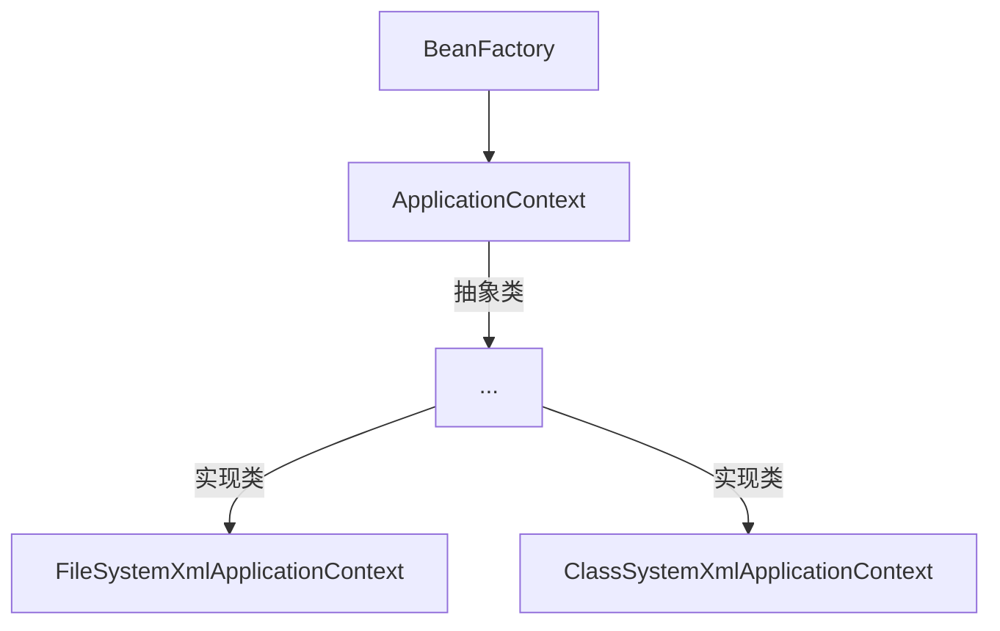
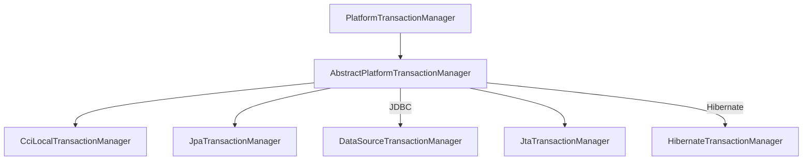

# Spring

[TOC]

## 1. Spring框架概述

### 1.1 Spring基础知识

- `Spring`是一个轻量级的开源的`JavaEE`框架

- `Spring`可以解决企业应用开发的复杂性

- `Spring`的核心部分`IOC`和`AOP`

  `IOC`：控制反转，把创建对象的过程交给`Spring`进行管理

  `AOP`：面向切面，在不修改源代码的情况下进行功能增强

### 1.1 Spring特点

1. 方便解耦，简化开发
2. `AOP`编程支持
3. 方便程序的测试
4. 方便和其他框架进行集合
5. 方便进行事务操作
6. 降低开发`API`的开发难度

## 2. IOC容器

- `IOC`控制反转：将对象的创建和创建对象之间的调用过程，交给`Spring`进行管理
- 使用`IOC`的目的：为了降低耦合度

### 2.1 IOC底层原理

- `xml`解析、工厂模式、反射

### 2.2 IOC过程

1. `xml`配置文件、配置创建的对象

   ```xml
   <bean id="别名" class="类的全路径"></bean>
   ```

2. 假设有`service`类和`dao`类，创建工厂类

   ```java
   class UserFactory{
   	public static UserDao getDao() {
   		String classValue = class属性值; // xml解析
           Class clazz = Class.forName(classValue); // 通过反射创建对象
           return (UserDao) clazz.newInstance();
   	}
   }
   ```

### 2.3 IOC接口

1. `IOC`思想基于`IOC`容器完成，`IOC`容器底层就是对象工厂

2. `Spring`提供了`IOC`容器实现的两种方式(两个接口)

   `BeanFactory`：`IOC`容器基本实现，是`Spring`内部的使用接口，不提供开发人员进行使用，加载配置文件时不会创建对象；在获取对象(使用)在获取对象(使用)才去创建对象

   `ApplicationContext`：`BeanFactory`接口的子接口，提供更多更强大的功能，一般供开发人员使用；加载配置文件时就会把在配置文件对象进行创建

3. 主要实现类



`FileSystemXmlApplicationContext`：绝对路径

`ClassSystemXmlApplicationContext`：类路径

## 3. Bean管理(xml方式)

什么是`Bean`管理
- `Spring`创建对象
- `Spring`注入属性

### 3.1 创建对象

1. 实现

   `bean.xml`

   ```xml
   <?xml version="1.0" encoding="UTF-8"?>
   <beans xmlns="http://www.springframework.org/schema/beans"
          xmlns:xsi="http://www.w3.org/2001/XMLSchema-instance"
          xsi:schemaLocation="http://www.springframework.org/schema/beans http://www.springframework.org/schema/beans/spring-beans.xsd">
       <bean id="user" class="User"/>
   </beans>
   ```

   `User.java`

   ```java
   public class User {
       public void show() {
           System.out.println("********************************************");
       }
   }
   ```

   `ServiceTest.java`

   ```java
   import org.junit.jupiter.api.Test;
   import org.springframework.context.ApplicationContext;
   import org.springframework.context.support.ClassPathXmlApplicationContext;
   
   public class ServiceTest {
       @Test
       public void test() {
           // 加载Spring的配置文件
           ApplicationContext context = new ClassPathXmlApplicationContext("bean.xml");
   
           // 获取配置文件创建的对象
           User user = context.getBean("user", User.class);
           user.show();
       }
   
   }
   ```

2. `bean`标签的常用属性

   `id`：唯一标识

   `class`：类的全路径(包路径)

   `name`：与`id`类似，可以有特殊符号

3. 创建对象时默认使用无参的构造函数

基于`xml`方式注入属性

1. `DI`：依赖注入，就是注入属性

   **使用`set`方法注入**

   ```java
   package dependency.injection;
   
   import org.springframework.context.ApplicationContext;
   import org.springframework.context.support.ClassPathXmlApplicationContext;
   
   public class DependencyInjectionTest {
       public static void main(String[] args) {
           ApplicationContext context = new ClassPathXmlApplicationContext("bean.xml");
           Book book = context.getBean("book", Book.class);
           System.out.println(book);
       }
   }
   
   class Book{
       private String bookName;
       private String bookAuthor;
   
       public void setBookName(String bookName) {
           this.bookName = bookName;
       }
   
       public void setBookAuthor(String bookAuthor) {
           this.bookAuthor = bookAuthor;
       }
   
       @Override
       public String toString() {
           return "Book{" +
                   "bookName='" + bookName + '\'' +
                   ", bookAuthor='" + bookAuthor + '\'' +
                   '}';
       }
   }
   ```

   配置

   ```xml
   <bean id="book" class="dependency.injection.Book">
       <!--使用property完成属性注入-->
       <property name="bookName" value="狂人日记"></property>
       <property name="bookAuthor" value="鲁迅"></property>
   </bean>
   ```

   **使用有参构造注入**

   ```java
   class Order{
       private String name;
       private String address;
       public Order(String name, String address) {
           this.name = name;
           this.address = address;
       }
   
       @Override
       public String toString() {
           return "Order{" +
                   "name='" + name + '\'' +
                   ", address='" + address + '\'' +
                   '}';
       }
   }
   ```

   `bean.xml`

   ```java
   <!--constructor-arg 中可以使用index属性来指定究竟是第几个构造函数被调用-->
   <bean id="order" class="dependency.injection.Order">
       <constructor-arg name="name" value="小米手机"></constructor-arg>
       <constructor-arg name="address" value="China"></constructor-arg>
   </bean>
   ```

   测试

   ```java
   @Test
   public void test() {
       ApplicationContext context = new ClassPathXmlApplicationContext("bean.xml");
       Order order = context.getBean("order", Order.class);
       System.out.println(order); // Order{name='小米手机', address='China'}
   }
   ```

**p名称空间注入**

`bean.xml`在根标签`beans`中加入如下属性

```xml
xmlns:p="http://www.springframework.org/schema/p"
```

p名称空间的本质是调用`set`方法

```xml
<bean id="book2" class="dependency.injection.Book" p:bookName=""></bean>
```

**`xml`注入其他类型属性**

1. `null`值

   ```xml
   <bean id="book" class="dependency.injection.Book">
       <property name="bookName" value="狂人日记"></property>
       <property name="bookAuthor" value="鲁迅"></property>
       <!--设置null值-->
       <property name="address">
       	<null></null>
       </property>
   </bean>
   ```

2. 包含特殊符号

   使用`<![CDATA[<<南京>>]]>`

   ```xml
   <property name="address">
       <value><![CDATA[<<南京>>]]></value>
   </property>
   ```

   转义

   ```xml
   <property name="address" value="&lt;&lt;南京&gt;&gt;"></property>
   ```


### 3.2 属性注入

#### 3.2.1 外部bean

创建两个类`service`类和`dao`类

在`service`调用`dao`里面的方法

`dao`包

```java
package dao;

public interface UserDao {
    void update();
}
```

```java
package dao;

public class UserDaoImpl implements UserDao{
    @Override
    public void update() {
        System.out.println("update....");
    }
}
```

`service`

```java
package service;

import dao.UserDao;

public class UserService {
    // 创建UserDao类型的属性，生成set方法
    private UserDao userDao;
    public void setUserDao(UserDao userDao) {
        this.userDao = userDao;
    }

    public void show() {
        System.out.println("service.....");
        userDao.update();
    }
}
```

配置`xml`

```xml
<!--service和dao对象的创建-->
<bean id="userService" class="service.UserService">
    <!--
        注入userDao类型属性
        name：类里面属性名称
        ref：创建userDao对象bean标签id值
    -->
    <property name="userDao" ref="userDaoImpl"></property>
</bean>
<bean id="userDaoImpl" class="dao.UserDaoImpl"></bean>
```

测试

```java
@Test
public void test() {
    // 测试外部bean
    ApplicationContext context = new ClassPathXmlApplicationContext("service/bean.xml");
    UserService userService = context.getBean("userService", UserService.class);
    userService.show();
}
// service.....
// update....
```

#### 3.2.2 内部bean和级联赋值

一对多关系：一个部门对应多个员工

创建部门类

```java
package bean;

// 部门类
public class Dept {
    private String deptName;

    public void setDeptName(String deptName) {
        this.deptName = deptName;
    }

    @Override
    public String toString() {
        return "Dept{" +
                "deptName='" + deptName + '\'' +
                '}';
    }
}
```

创建员工类

```java
package bean;

// 员工类
public class Emp {
    private String empName;
    private String gender;
    // 员工的部门
    private Dept dept;
    
    public Dept getDept() {
        return dept;
    }
    public void setEmpName(String empName) {
        this.empName = empName;
    }

    public void setGender(String gender) {
        this.gender = gender;
    }

    public void setDept(Dept dept) {
        this.dept = dept;
    }

    @Override
    public String toString() {
        return "Emp{" +
                "empName='" + empName + '\'' +
                ", gender='" + gender + '\'' +
                ", dept=" + dept +
                '}';
    }
}

```

#### 3.2.3 内部bean

配置`xml`

```xml
<!--内部bean-->
<bean id="emp" class="bean.Emp">
    <!--设置两个普通的属性-->
    <property name="empName" value="lucy"></property>
    <property name="gender" value="women"></property>

    <!--设置对象属性-->
    <property name="dept">
        <bean id="dept" class="bean.Dept">
        	<property name="deptName" value="保安部"></property>
        </bean>
    </property>
</bean>
```

测试

```java
@Test
public void test() {
    // 测试内部bean
    ApplicationContext context = new ClassPathXmlApplicationContext("bean/bean.xml");
    Emp emp = context.getBean("emp", Emp.class);
    System.out.println(emp);
}
// Emp{empName='lucy', gender='women', dept=Dept{deptName='保安部'}}
```

#### 3.2.4 级联赋值

**第一种写法**

配置`xml`

```java
<!--级联赋值-->
<bean id="emp" class="bean.Emp">
    <!--设置两个普通的属性-->
    <property name="empName" value="lucy"></property>
    <property name="gender" value="women"></property>

    <!--设置对象属性-->
    <property name="dept" ref="dept"></property>
</bean>
<bean id="dept" class="bean.Dept">
	<property name="deptName" value="财务部"></property>
</bean>
```

测试

```java
@Test
public void test() {
    // 测试级联
    ApplicationContext context = new ClassPathXmlApplicationContext("bean/bean1.xml");
    Emp emp = context.getBean("emp", Emp.class);
    System.out.println(emp);
}
```

**第二种写法**

配置`xml`

```xml
<bean id="emp" class="bean.Emp">
    <property name="empName" value="lucy"></property>
    <property name="gender" value="women"></property>

    <property name="dept" ref="dept"></property>
    <property name="dept.deptName" value="技术部"></property>
    <!--需要有get方法-->
</bean>
<bean id="dept" class="bean.Dept"></bean>
```

测试

```java
@Test
public void test() {
    ApplicationContext context = new ClassPathXmlApplicationContext("bean/bean2.xml");
    Emp emp = context.getBean("emp", Emp.class);
    System.out.println(emp);
}
// Emp{empName='lucy', gender='women', dept=Dept{deptName='技术部'}}
```

#### 3.2.5 集合属性注入

**普通注入**

```java
import java.util.List;
import java.util.Map;
import java.util.Set;

public class Student {
    // 数组类型
    private String[] courses;

    // list集合类型
    private List<String> list;

    // Map类型
    private Map<String, String> map;

    // Set类型
    private Set<String> set;

    public void setCourses(String[] courses) {
        this.courses = courses;
    }

    public void setList(List<String> list) {
        this.list = list;
    }

    public void setMap(Map<String, String> map) {
        this.map = map;
    }

    public void setSet(Set<String> set) {
        this.set = set;
    }
    
    @Override
    public String toString() {
        return "Student{" +
                "courses=" + Arrays.toString(courses) +
                ", name=" + name +
                ", map=" + map +
                ", set=" + set +
                '}';
    }
}
```

配置`xml`

```xml
<?xml version="1.0" encoding="UTF-8"?>
<beans xmlns="http://www.springframework.org/schema/beans"
       xmlns:xsi="http://www.w3.org/2001/XMLSchema-instance"
       xsi:schemaLocation="http://www.springframework.org/schema/beans http://www.springframework.org/schema/beans/spring-beans.xsd">
	<!--集合类型的注入-->
    <bean id="student" class="Student">
		<!--数组类型注入-->
        <property name="courses">
            <array>
                <value>java课程</value>
                <value>数据库课程</value>
            </array>
        </property>

		<!--list类型注入-->
        <property name="name">
            <list>
                <value>张三</value>
                <value>小三</value>
            </list>
        </property>

		<!--map类型注入-->
        <property name="map">
            <map>
                <entry key="JAVA" value="java"></entry>
                <entry key="PHP" value="php"></entry>
            </map>
        </property>

		<!--set集合注入-->
        <property name="set">
            <set>
                <value>SQL</value>
                <value>Redis</value>
            </set>
        </property>
    </bean>
</beans>
```

测试

```java
@Test
public void test() {
    ApplicationContext context = new ClassPathXmlApplicationContext("bean.xml");
    Student student = context.getBean("student", Student.class);
    System.out.println(student);
}
// Student{courses=[java课程, 数据库课程], name=[张三, 小三], map={JAVA=java, PHP=php}, set=[SQL, Redis]}
```

 **集合里设置对象值**

`Course.java`

```java
package classtype;

public class Course {
    private String name;

    public void setName(String name) {
        this.name = name;
    }

    @Override
    public String toString() {
        return "Course{" +
                "name='" + name + '\'' +
                '}';
    }
}
```

`Teacher.java`

```java
package classtype;


import java.util.List;

public class Teacher {
    private List<Course> courses;

    public void setCourses(List<Course> courses) {
        this.courses = courses;
    }

    @Override
    public String toString() {
        return "Teacher{" +
                "courses=" + courses +
                '}';
    }
}
```

配置`xml`

```xml
<!--    集合类型注入对象值-->
<bean id="teacher" class="classtype.Teacher">
    <property name="courses">
        <list>
            <ref bean="course1"></ref>
            <ref bean="course2"></ref>
            <ref bean="course3"></ref>
        </list>
    </property>
</bean>

<!--    创建多个course对象-->
<bean id="course1" class="classtype.Course">
	<property name="name" value="java"></property>
</bean>
<bean id="course2" class="classtype.Course">
    <property name="name" value="php"></property>
</bean>
<bean id="course3" class="classtype.Course">
	<property name="name" value="c++"></property>
</bean>
```

测试

```java
@Test
public void test() {
    ApplicationContext context = new ClassPathXmlApplicationContext("bean.xml");
    Teacher teacher = context.getBean("teacher", Teacher.class);
    System.out.println(teacher);
}
// Teacher{courses=[Course{name='java'}, Course{name='php'}, Course{name='c++'}]}
```

**提取重复的配置**

- 创建`book.java`

  ```java
  package common;
  
  import java.util.List;
  
  public class Book {
      private List<String> list;
  
      public void setList(List<String> list) {
          this.list = list;
      }
  
      @Override
      public String toString() {
          return "Book{" +
                  "list=" + list +
                  '}';
      }
  }
  ```

- 在`spring`配置文件中引入名称空间`util`

  ```xml
  <?xml version="1.0" encoding="UTF-8"?>
  <beans xmlns="http://www.springframework.org/schema/beans"
         xmlns:xsi="http://www.w3.org/2001/XMLSchema-instance"
         xmlns:util="http://www.springframework.org/schema/util"
         xsi:schemaLocation="http://www.springframework.org/schema/beans http://www.springframework.org/schema/beans/spring-beans.xsd
                             http://www.springframework.org/schema/util http://www.springframework.org/schema/util/spring-util.xsd">
  
  </beans>
  ```

- 使用`util`标签完成`list`结合注入提取

  ```xml
  <!--提取list集合类型注入-->
  <util:list id="bookList">
      <value>遮天</value>
      <value>完美世界</value>
      <value>圣墟</value>
  </util:list>
  
  <!--提取list集合类型属性注入使用-->
  <bean id="book" class="common.Book">
  	<property name="list" ref="bookList"></property>
  </bean>
  ```

- 测试

  ```java
  @Test
  public void test() {
      ApplicationContext context = new ClassPathXmlApplicationContext("bean2.xml");
      Book book = context.getBean("book", Book.class);
      System.out.println(book);
  }
  // Book{list=[遮天, 完美世界, 圣墟]}
  ```

### 3.3 FactoryBean

- `Spring`中有两种类型`bean`，一种是普通`bean`,另外一种是工厂`bean`
- 普通`bean`：在配置文件中定义`bean`类型就是返回类型
- 工厂`bean`：在配置文件中定义`bean`类型可以和返回的类型不一致

1. 创建类，让这个类实现接口`FactoryBean`

2. 实现接口里面的方法，在实现的方法中定义返回的`bean`类型

   ```java
   package factorybean;
   
   import org.springframework.beans.factory.FactoryBean;
   
   public class MyBean implements FactoryBean<Course> {
   
       @Override
       public Course getObject() throws Exception {
           // 定义返回bean
           Course course = new Course();
           course.setName("敢问上天是否有仙");
           return course;
       }
   
       @Override
       public Class<?> getObjectType() {
           return null;
       }
   
       @Override
       public boolean isSingleton() {
           return false;
       }
   }
   ```

3. 配置`xml`

   ```xml
   <bean id="myBean" class="factorybean.MyBean"></bean>
   ```

4. 测试

   ```java
   @Test
   public void test(){
       ApplicationContext context = new ClassPathXmlApplicationContext("bean.xml");
       Course course = context.getBean("myBean", Course.class);
       System.out.println(course);
   }
   // Course{name='敢问上天是否有仙'}
   ```

### 3.4 Bean作用域与生命周期

#### 3.4.1 作用域

1. `Spring`中默认的`bean`是单例模式，即使用`ApplicationContext`获取的对象永远是同一个；可以通过`<bean>`标签中的`scope`属性设置多例模式
2. `scope`的取值：`singleton`单例模式，默认。`prototype`多例模式
3. 对于`singleton`默认是在加载配置文件时创建实例，`prototype`是在调用`getBean`时创建多实例对象

#### 3.4.2 生命周期

生命周期：从对象创建到对象销毁的过程

`bean`的生命周期

- 用过构造器创建`bean`实例(无参构造)

  ```java
  public Order(){
  	System.out.println("1.调用的无参构造");
  }
  ```

- 为`bean`的属性设置值和对其他`bean`引用(调用`set`方法)

  ```java
  public void setName(String name) {
      this.name = name;
      System.out.println("2.调用set方法");
  }
  ```

- 调用`bean`的初始化的方法(需要进行配置)

  ```java
  public void init(){
  	System.out.println("3.调用初始化方法");
  }
  // xml配置文件的bean标签中需要添加init-method="init"属性
  ```

- `bean`已经获取(对象获取到了)

  ```java
  @Test
  public void test() {
      ApplicationContext context = new ClassPathXmlApplicationContext("bean.xml");
      Order order = context.getBean("order", Order.class);
      System.out.println("4.获取对象：" + order);
  
      // 销毁对象
      ((ClassPathXmlApplicationContext)context).close();
  }
  ```

- 容器关闭时，调用`bean`的销毁的方法(需要进行配置销毁的方法)，需要手动销毁对象

  ```java
  public void destroy(){
  	System.out.println("5.执行销毁的方法");
  }
  // xml配置文件中添加destroy-method="destroy"
  ```

- 完整代码

  `Order.java`

  ```java
  package bean;
  
  public class Order {
      private String name;
  
      public Order(){
          System.out.println("1.调用的无参构造");
      }
  
      public void setName(String name) {
          this.name = name;
          System.out.println("2.调用set方法");
      }
  
      // 创建执行初始化的方法
      public void init(){
          System.out.println("3.调用初始化方法");
      }
  
      // 创建销毁时执行的方法
      public void destroy(){
          System.out.println("5.执行销毁的方法");
      }
  }
  ```

  `xml`

  ```xml
  <?xml version="1.0" encoding="UTF-8"?>
  <beans xmlns="http://www.springframework.org/schema/beans"
         xmlns:xsi="http://www.w3.org/2001/XMLSchema-instance"
         xsi:schemaLocation="http://www.springframework.org/schema/beans http://www.springframework.org/schema/beans/spring-beans.xsd">
      <bean id="order" class="bean.Order" init-method="init" destroy-method="destroy">
          <property name="name" value="手机"></property>
      </bean>
  </beans>
  ```

  测试

  ```
  @Test
  public void test() {
      ApplicationContext context = new ClassPathXmlApplicationContext("bean.xml");
      Order order = context.getBean("order", Order.class);
      System.out.println("4.获取对象：" + order);
  
      // 销毁对象
      ((ClassPathXmlApplicationContext)context).close();
  }
  // 1.调用的无参构造
  // 2.调用set方法
  // 3.调用初始化方法
  // 4.获取对象：bean.Order@3899782c
  // 5.执行销毁的方法
  ```

#### 3.4.3 bean的后置处理器

1. 调用初始化方法之前：把`bean`的实例传递`bean`后置处理器的方法`postProcessBeforeInitialization`
2. 对象获取之前：把`bean`的实例传递`bean`后置处理器的方法`postProcessAfterInitialization`

**具体实现**

1. 创建类，类实现`BeanPostProcessor`接口，作为后置处理器

   ```java
   package post;
   
   import org.springframework.beans.BeansException;
   import org.springframework.beans.factory.config.BeanPostProcessor;
   
   public class Bean implements BeanPostProcessor {
       @Override
       public Object postProcessBeforeInitialization(Object bean, String beanName) throws BeansException {
           System.out.println("初始化之前执行");
           return bean;
       }
   
       @Override
       public Object postProcessAfterInitialization(Object bean, String beanName) throws BeansException {
           System.out.println("初始化之后执行");
           return bean;
       }
   }
   ```

2. 配置`xml`，即配置后置处理器

   ```xml
   <bean id="MyBean" class="post.Bean"></bean>
   ```

   配置的后置处理器会对当前`xml`文件，配置的所有`bean`生效

3. 测试

   ```java
   @Test
   public void test() {
       ApplicationContext context = new ClassPathXmlApplicationContext("bean.xml");
       Order order = context.getBean("order", Order.class);
       System.out.println("4.获取对象：" + order);
   
       // 销毁对象
       ((ClassPathXmlApplicationContext)context).close();
   }
   // 1.调用的无参构造
   // 2.调用set方法
   // 初始化之前执行
   // 3.调用初始化方法
   // 初始化之后执行
   // 4.获取对象：bean.Order@332796d3
   // 5.执行销毁的方法
   ```

### 3.5 自动装配

```java
package autowire;

public class Dept {
}
```

```java
package autowire;

public class Emp {
    private Dept dept;

    public void setDept(Dept dept) {
        this.dept = dept;
    }
}
```

根据指定装配规则(属性名称或者属性类型)，`Spring`自动将匹配的属性值进行注入

自动装配的原则有两条

1. 根据名称注入，注入值bean的id值和类属性的名称相同

   ```xml
   <bean id="emp" class="autowire.Emp" autowire="byName"></bean>
   <bean id="dept" class="autowire.Dept"></bean>
   ```

2. 根据类型注入，相同类型的`bean`只能有一个

   ```xml
   <bean id="emp" class="autowire.Emp" autowire="byType"></bean>
   <bean id="dept" class="autowire.Dept"></bean>
   ```

### 3.6 引入外部属性文件

实例：配置德鲁伊连接池

正常配置：

```xml
<bean id="dataSorce" class="com.alibaba.druid.pool.DruidDataSource">
    <property name="driverClassName" value="com.mysql.jdbc.Driver"></property>
    <property name="url" value="jdbc:mysql://localhost:3306/test"></property>
    <property name="username" value="root"></property>
    <property name="password" value="123456"></property>
</bean>
```

引入外部属性文件：

1. 创建外部属性文件，`properties`格式文件，写数据库信息。`jdbc.properties`

   ```properties
   prop.driverClass=com.mysql.jdbc.Driver
   prop.url=jdbc:mysql://localhost:3306/test
   prop.userName=root
   prop.password=123456
   ```

2. 把外部`properties`属性文件引入到`spring`配置文件中

   引入`context`名称空间

   ```xml
   <?xml version="1.0" encoding="UTF-8"?>
   <beans xmlns="http://www.springframework.org/schema/beans"
          xmlns:context="http://www.springframework.org/schema/context"
          xmlns:xsi="http://www.w3.org/2001/XMLSchema-instance"
          xsi:schemaLocation="http://www.springframework.org/schema/beans http://www.springframework.org/schema/beans/spring-beans.xsd
                              http://www.springframework.org/schema/context http://www.springframework.org/schema/context/spring-context.xsd">
   </beans>
   ```

   引入属性文件，并配置

   ```xml
   <context:property-placeholder location="classpath:jdbc.properties"></context:property-placeholder>
   <bean id="dataSorce" class="com.alibaba.druid.pool.DruidDataSource">
    <property name="driverClassName" value="${prop.driverClass}"></property>
       <property name="url" value="${prop.url}"></property>
       <property name="username" value="${prop.userName}"></property>
       <property name="password" value="${prop.password}"></property>
   </bean>
   ```
   

## 4. Bean管理(注解方式)

1. 引入`aop`依赖`spring-aop-5.2.6.RELEASE.jar`

2. 开启组件扫描在`xml`中配置，多个包中使用`,`隔开或者直接扫描包的上层目录

   ```xml
   <?xml version="1.0" encoding="UTF-8"?>
   <beans xmlns="http://www.springframework.org/schema/beans"
          xmlns:context="http://www.springframework.org/schema/context"
          xmlns:xsi="http://www.w3.org/2001/XMLSchema-instance"
          xsi:schemaLocation="http://www.springframework.org/schema/beans http://www.springframework.org/schema/beans/spring-beans.xsd
                              http://www.springframework.org/schema/context http://www.springframework.org/schema/context/spring-context.xsd">
   
       <context:component-scan base-package="instance, dao"></context:component-scan>
   </beans>
   ```

3. 创建类，在类的上面添加创建对象注解

### 4.1 创建对象

四种注解的功能相同，但是可以用来创建`bean`实例

1. `@Component`
2. `@Service`
3. `@Controller`
4. `@Repository`

**实例**

```java
package instance;
import org.springframework.stereotype.Component;

@Component(value = "userService")
public class UserService {
    public void show() {
        System.out.println("service show.....");
    }
}
```

- 在注解里面value属性值可以省略不写
-  默认值是类名称，首字母小写

**测试**

```java
@Test
public void test() {
    ApplicationContext context = new ClassPathXmlApplicationContext("instance/bean.xml");
    UserService userService = context.getBean("userService", UserService.class);
    userService.show();
}
```

### 4.2 自定义组件扫描

- 只扫描带`Controller`的类

  ```xml
  <context:component-scan base-package="instance" use-default-filters="false">
          <context:include-filter type="annotation" expression="org.springframework.stereotype.Controller"/>
  </context:component-scan>
  ```

- 设置哪些内容不被扫描

  ```xml
  <context:component-scan base-package="instance">
  	<context:exclude-filter type="annotation" expression="org.springframework.stereotype.Controller"/>
  </context:component-scan>
  ```

### 4.3 属性注入

#### 4.3.1 Autowired

`@Autowired`：根据属性类型进行自动装配

1. 把`service`和`dao`对象创建，在`service`和`dao`类天剑创建对象注解

   `UserService.java`

   ```java
   @Service
   public class UserService {
       public void show() {
           System.out.println("service show.....");
       }
   }
   ```

   `UserDao.java`

   ```java
   public interface UserDao {
       void show();
   }
   ```

   `UserDaoImpl.java`

   ```java
   @Repository
   public class UserDaoImpl implements UserDao {
       @Override
       public void show() {
           System.out.println("dao show");
       }
   }
   ```

2. 在`service`中注入`dao`对象，在`service`类中添加`dao`类型属性，在属性上面使用注解，不需要添加`set`方法

   ```java
   @Autowired
   private UserDao userDao;
   ```

#### 4.3.2 Qualifier

`@Qualifier`：根据属性名称进行注入，需要和`@Autowire`搭配使用

```java
@Autowired
@Qualifier(value = "userDaoImpl")
private UserDao userDao;
```

当一个接口的实现类有多个时就可以使用`Qualifier`

#### 4.3.3 Resource

`@Resource`：可以根据类型注入，也可以根据名称注入

类型注入

```java
@Resource
private UserDao userDao;
```

名称注入

```java
@Resource(name = "userDaoImpl")
private UserDao userDao;
```

#### 4.3.4 value

`@Value`：注入普通类型

```java
@Value(value = "10")
private int a;
```

### 4.4 完全注解开发

1. 创建配置类，替代`xml`配置文件

   ```java
   @Configuration
   @ComponentScan(basePackages = {"instance", "dao"})
   public class Config {
   
   }
   ```

2. 测试

   ```java
   @Test
   public void test4() {
       ApplicationContext context = new AnnotationConfigApplicationContext(Config.class);
       UserService userService = context.getBean("userService", UserService.class);
       System.out.println(userService);
   }
   ```

## 5. AOP

### 5.1 基本概念

面向切面编程：利用AOP可以对业务逻辑的各个部分进行隔离，从而使得业务逻辑各部分之间的[耦合度](https://baike.baidu.com/item/耦合度/2603938)降低，提高程序的可重用性，同时提高了开发的效率。

```flow
st=>start: 登录

form=>inputoutput: 用户名密码
database=>operation: 数据库查询
home=>operation: 主页

cond=>condition: 判断框(是或否?)

st->form
form->database->cond
cond(yes)->home
cond(no)->form
```

如果要在登录功能基础之上添加功能(权限控制)

- 原始方式：直接修改源代码
- `Spring`不修改源代码的方式添加新的功能：添加权限判断模块

### 5.2 底层原理

#### 5.2.1 基本原理

`AOP`底层使用动态代理

动态代理的不同情况

- 有接口情况，使用`JDK`动态代理，创建接口实现类的代理对象来增强接口的功能

  ```mermaid
  graph TD
  接口 --> 实现类
  接口 --> 代理对象
  ```

- 没有接口情况，使用`CGLIB`,创建子类的代理对象增强功能

  ```mermaid
  graph TD
  父类 --> 子类
  父类 --> 代理对象
  ```

#### 5.2.2 具体实现

使用`JDK`的动态代理，使用`Proxy`类里面的方法创建代理对象

```java
// 类加载器 接口 接口实现类
static Object newProxyInstance(ClassLoader loader, Class<?>[] interfaces, InvocationHandler h)
```

1. 创建接口，定义方法

   ```java
   public interface User {
       int add(int a, int b);
       String update(String id);
   }
   ```

2. 创建接口的实现类，实现方法

   ```java
   public class UserImpl implements User{
       @Override
       public int add(int a, int b) {
           return a + b;
       }
   
       @Override
       public String update(String id) {
           return id;
       }
   }
   ```

3. 使用`Proxy`创建代理类`UserDaoProxy`

   ```java
   public class UserDaoProxy implements InvocationHandler {
       // 增强的逻辑
       @Override
       public Object invoke(Object proxy, Method method, Object[] args) throws Throwable {
           return null;
       }
   }
   ```

4. 传递被代理类的对象到代理的内部(有参构造)

   ```java
   private Object obj;
   public UserDaoProxy(Object obj) {
   	this.obj = obj;
   }
   ```

5. 重写代理类`UserDaoProxy`的`invoke`方法

   ```java
   @Override
   public Object invoke(Object proxy, Method method, Object[] args) throws Throwable {
       // 方法之前
       System.out.println("方法之前执行：" + method.getName() + " :传递的参数：" + Arrays.toString(args));
   
       // 被增强的方法执行
       Object res = method.invoke(obj, args);
   
       // 方法之后
       System.out.println("方法之后执行");
       return res;
   }
   ```

6. 创建代理对象测试

   ```java
   public class ProxyTest {
       public static void main(String[] args) {
           Class[] interfaces = {User.class};
           UserImpl user = new UserImpl();
   
           User u = (User)Proxy.newProxyInstance(ProxyTest.class.getClassLoader(), interfaces, new UserDaoProxy(user));
           System.out.println(u.add(1, 2));
   	}
   }
   
   // 方法之前执行：add :传递的参数：[1, 2]
   // 方法之后执行
   // 方法之后执行
   // 3
   ```

### 5.3 AOP术语

连接点：类里面可以被增强的方法

切入点：实际被真正增强的方法

通知(增强)：方法中实际增强的部分
- 前置通知：方法之前执行
- 后置通知：方法之后执行
- 环绕通知：方法前后执行
- 异常通知：异常时执行
- 最终通知：类似`finally`

切面：将通知应用到切入点的过程

### 5.4 AOP操作准备

`Spring`框架一般基于`AspectJ`实现`AOP`操作，`AspectJ`不属于`Spring`的组成部分，独立于`AOP`框架，一般把`AspectJ`和`Spring`一起使用，进行`AOP`操作

#### 5.4.1 相关依赖

```xml
<!-- https://mvnrepository.com/artifact/org.springframework/spring-aspects -->
<dependency>
    <groupId>org.springframework</groupId>
    <artifactId>spring-aspects</artifactId>
    <version>5.3.1</version>
</dependency>
<!-- https://mvnrepository.com/artifact/org.aspectj/aspectjweaver -->
<dependency>
    <groupId>org.aspectj</groupId>
    <artifactId>aspectjweaver</artifactId>
    <version>1.9.6</version>
    <scope>runtime</scope>
</dependency>
<!-- https://mvnrepository.com/artifact/aopalliance/aopalliance -->
<dependency>
    <groupId>aopalliance</groupId>
    <artifactId>aopalliance</artifactId>
    <version>1.0</version>
</dependency>
<!-- https://mvnrepository.com/artifact/cglib/cglib -->
<dependency>
    <groupId>cglib</groupId>
    <artifactId>cglib</artifactId>
    <version>3.3.0</version>
</dependency>
```

#### 5.4.2 切入点表达式

切入点表达式作用：知道对哪个类里面的哪个方法进行增强

语法结构

```
execution([权限修饰符][返回类型][类全路径][方法名称]([参数列表]))
```

示例1：对`com.valid.dao.Book`类里面的`add`进行增强

```
execution(* com.valid.dao.Book.add(..))
```

示例2：对`com.valid.dao.Book`类里面的所有方法进行增强

```
execution(* com.valid.dao.Book.*(..))
```

示例3：对`com.valid.dao`包里面的所有类所有方法进行增强

```
execution(* com.valid.dao.*.*(..))
```

### 5.5 AOP操作(AspectJ注解):star:

#### 5.5.1 具体实现

1. 创建原始类，增强该类的方法

   ```java
   package aopanno;
   
   @Component
   public class User {
       public void add() {
           System.out.println("add....");
       }
   }
   ```

2. 创建增强类(编写增强的逻辑)

   在增强类里，创建不同的方法，不同的方法代表不同的通知类型

   ```java
   package aopanno;
   
   @Component
   @Aspect // 生成代理对象
   public class UserProxy {
       public void before() {
           System.out.println("before.....");
       }
   }
   ```

3. 进行通知的配置

   在`spring`配置文件中，开启注解扫描

   ```xml
   <?xml version="1.0" encoding="UTF-8"?>
   <beans xmlns="http://www.springframework.org/schema/beans"
          xmlns:context="http://www.springframework.org/schema/context"
          xmlns:aop="http://www.springframework.org/schema/aop"
          xmlns:xsi="http://www.w3.org/2001/XMLSchema-instance"
          xsi:schemaLocation="
          http://www.springframework.org/schema/beans http://www.springframework.org/schema/beans/spring-beans.xsd
          http://www.springframework.org/schema/context http://www.springframework.org/schema/context/spring-context.xsd
          http://www.springframework.org/schema/aop http://www.springframework.org/schema/aop/spring-aop.xsd">
   </beans>
   ```

   使用注解创建`User`和`UserProxy`对象

   在增强类上面添加注解`@Aspect`

   在`spring`配置文件中开启生成代理对象

   ```xml
   <aop:aspectj-autoproxy></aop:aspectj-autoproxy>
   ```

4. 配置不同类型的通知

   在增强类的里面，在作为通知方法上面添加通知类型注解，使用切入点表达式配置

   ```java
   @Before(value = "execution(* aopanno.User.add(..))")
   public void before() {
   	System.out.println("before.....");
   }
   ```

5. 测试

   ```java
   @Test
   public void test() {
       ApplicationContext context = new ClassPathXmlApplicationContext("bean.xml");
       User user = context.getBean("user", User.class);
       user.add();
   }
   // before.....
   // add....
   ```

不同类型的通知

```java
@Component
@Aspect
public class UserProxy {

    // 前置通知
    // @before注解表示作为前置通知
    @Before(value = "execution(* aopanno.User.add(..))")
    public void before() {
        System.out.println("before....");
    }

    // 最终通知，有没有异常都会执行
    @After(value = "execution(* aopanno.User.add(..))")
    public void after() {
        System.out.println("after...");
    }

    // 方法返回之后执行
    @AfterReturning(value = "execution(* aopanno.User.add(..))")
    public void afterReturn() {
        System.out.println("AfterReturning...");
    }

    // 异常通知
    @AfterThrowing(value = "execution(* aopanno.User.add(..))")
    public void afterThrowing() {
        System.out.println("AfterThrowing...");
    }

    // 环绕通知
    @Around(value = "execution(* aopanno.User.add(..))")
    public void around(ProceedingJoinPoint proceedingJoinPoint) throws Throwable {
        System.out.println("环绕之前...");

        // 被增强的方法执行
        proceedingJoinPoint.proceed();

        System.out.println("环绕之后...");
    }
}
```

#### 5.5.2 其他操作

- 公共切入点抽取

  ```java
  @Pointcut(value = "execution(* aopanno.User.add(..))")
  public void point() {
  
  }
  
  // 使用提取切入点
  @Before(value = "point()")
  public void before() {
  	System.out.println("before....");
  }
  ```

- 有多个增强类对同一个方法进行增强，可以设置增强类的优先级

  在增强类上面添加`@Order(数字类型)`，数字**越小**优先级越高

  ```java
  @Component
  @Aspect
  @Order(0)
  public class PersonProxy {
      @Before(value = "execution(* aopanno.User.add(..))")
      public void Before() {
          System.out.println("Person before...");
      }
  }
  ```

#### 5.2.3 完全注解

1. 创建配置类

   ```java
   @Configuration
   @ComponentScan(value = {"aopanno"})
   @EnableAspectJAutoProxy(proxyTargetClass = true)
   public class Config {
   }
   ```

2. 测试

   ```java
   @Test
   public void test() {
       ApplicationContext context = new AnnotationConfigApplicationContext(Config.class);
       User user = context.getBean("user", User.class);
       user.add();
   }
   ```

### 5.6 AOP操作(AspectJ配置文件)

1. 创建两个类，增强类和被增强类，创建方法

   `Book.java`

   ```java
   package aopxml;
   
   public class Book {
       public void buy() {
           System.out.println("buy...");
       }
   }
   ```

   `BookProxy.java`

   ```java
   package aopxml;
   
   public class BookProxy {
       public void before() {
           System.out.println("before...");
       }
   }
   ```

2. 在`spring`配置文件中创建两个类对象

   ```xml
   <bean id="book" class="aopxml.Book"></bean>
   <bean id="bookProxy" class="aopxml.BookProxy"></bean>
   ```

3. 在`spring`配置文件中配置切入点

   ```xml
   <!--配置增强方法-->
   <aop:config expose-proxy="false">
       <!--配置切入点-->
       <aop:pointcut id="buy" expression="execution(* aopxml.Book.buy())"/>
   
       <!--配置切面-->
       <aop:aspect ref="bookProxy">
       <!--增强作用在具体的方法上-->
       	<aop:before method="before" pointcut-ref="buy"/>
       </aop:aspect>
   </aop:config>
   ```

4. 测试

   ```java
   @Test
   public void test1() {
       ApplicationContext context = new ClassPathXmlApplicationContext("bean1.xml");
       Book book = context.getBean("book", Book.class);
       book.buy();
   }
   ```

## 6. data

### 6.1 JdbcTemplate

`Spring`框架对`JDBC`进行的封装，使用`JdbcTemplate`方便实现对数据库的操作

#### 6.1.1 准备工作

- 依赖

  ```xml
  <dependency>
      <groupId>com.alibaba</groupId>
      <artifactId>druid</artifactId>
      <version>1.2.3</version>
  </dependency>
  <dependency>
  	<groupId>mysql</groupId>
      <artifactId>mysql-connector-java</artifactId>
      <version>8.0.22</version>
  </dependency>
  
  <dependency>
      <groupId>org.springframework</groupId>
      <artifactId>spring-jdbc</artifactId>
      <version>5.2.11.RELEASE</version>
  </dependency>
  <dependency>
      <groupId>org.springframework</groupId>
      <artifactId>spring-tx</artifactId>
      <version>5.2.11.RELEASE</version>
  </dependency>
  <dependency>
      <groupId>org.springframework</groupId>
      <artifactId>spring-orm</artifactId>
      <version>5.2.11.RELEASE</version>
  </dependency>
  ```

- 配置数据库连接池

  ```xml
  <bean id="dataSorce" class="com.alibaba.druid.pool.DruidDataSource">
      <property name="driverClassName" value="com.mysql.jdbc.Driver" />
      <property name="url" value="jdbc:mysql://localhost:3306/test"/>
      <property name="username" value="root" />
      <property name="password" value="123456" />
  </bean>
  ```

- 配置`JdbcTemplate`对象，注入`DataSource`

  ```xml
  <bean id="jdbcTemplate" class="org.springframework.jdbc.core.JdbcTemplate">
  	<property name="dataSource" ref="dataSorce" />
  </bean>
  ```

- 创建`service`类，创建`dao`类，在`dao`注入`jdbcTemplate`对象

  配置文件中开启组件扫描

  ```xml
  <context:component-scan base-package="service dao" />
  ```

  `dao`中注入`jdbcTemplate`

  ```java
  @Autowired
  private JdbcTemplate jdbcTemplate;
  ```

  `service`中注入`dao`

  ```java
  @Autowired
  private BookDao bookDao;
  ```

- 创建数据库`test`并创建以下表

  ```sql
  create table book(
      user_id bigint(20) NOT NULL AUTO_INCREMENT primary key ,
      username varchar(100) NOT NULL ,
      status varchar(50) NOT NULL
  )
  ```

#### 6.1.2 增加

1. 创建实体类`Book`

   ```java
   package entity;
   
   public class Book {
       private String userId;
       private String username;
       private String status;
   
       public String getUserId() {
           return userId;
       }
   
       public String getUsername() {
           return username;
       }
   
       public String getStatus() {
           return status;
       }
   
       public void setUserId(String userId) {
           this.userId = userId;
       }
   
       public void setUsername(String username) {
           this.username = username;
       }
   
       public void setStatus(String status) {
           this.status = status;
       }
   
       @Override
       public String toString() {
           return "Book{" +
                   "userId='" + userId + '\'' +
                   ", username='" + username + '\'' +
                   ", status='" + status + '\'' +
                   '}';
       }
   }
   ```

2. 编写`service`和`dao`

   在`dao`进行数据库添加操作

   调用`JdbcTemplate`对象里的`update`方法实现添加操作

   ```java
   @Repository
   public class BookDaoImpl implements BookDao{
       // 注入jdbcTemplate
       @Autowired
       private JdbcTemplate jdbcTemplate;
   
   
       @Override
       public void add(Book book) {
           // 创建sql语句
           String sql = "INSERT INTO book(username, ustatus) VALUES (?,?)";
   
           // 调用方法实现
           int update = jdbcTemplate.update(sql, book.getUsername(), book.getUstatus());
           System.out.println("受影响的行数: " + update);
       }
   }
   ```

3. 测试

   ```java
   @Test
   public void test() {
       // 测试JDBCTemplate
       ApplicationContext context = new ClassPathXmlApplicationContext("jdbc.xml");
   
       BookService bookService = context.getBean("bookService", BookService.class);
   
       Book book = new Book();
       book.setUsername("叶凡");
       book.setStatus("失踪");
       bookService.addBook(book);
   }
   /* 
   Loading class `com.mysql.jdbc.Driver'. This is deprecated. The new driver class is `com.mysql.cj.jdbc.Driver'. The driver is automatically registered via the SPI and manual loading of the driver class is generally unnecessary.
   12月 01, 2020 9:54:28 下午 com.alibaba.druid.support.logging.JakartaCommonsLoggingImpl info
   信息: {dataSource-1} inited
   受影响的行数: 1 
   */
   ```

#### 6.1.3 修改和删除

`dao`添加方法`update`和`delete`

```java
@Override
public void update(Book book) {
    // 修改操作
    String sql = "UPDATE book set username=?, ustatus=? WHERE user_id=?";
    int update = jdbcTemplate.update(sql, book.getUsername(), book.getStatus(), book.getUserId());
    System.out.println("受影响的行数：" + update);
}

@Override
public void delete(String id) {
    // 删除操作
    String sql = "DELETE FROM book WHERE user_id=?";
    int update = jdbcTemplate.update(sql, id);
    System.out.println("受影响的行数：" + update);
}
```

`service`中添加

```java
// 修改的方法
public void updateBook(Book book) {
	bookDao.update(book);
}

// 删除
public void deleteBook(String id) {
	bookDao.delete(id);
}
```

测试

```java
@Test
public void test1() {
    // 测试修改
    ApplicationContext context = new ClassPathXmlApplicationContext("jdbc.xml");

    BookService bookService = context.getBean("bookService", BookService.class);

    Book book = new Book();
    book.setUserId("1");
    book.setUsername("石昊");
    book.setStatus("上苍");
    bookService.updateBook(book);
}

@Test
public void test2() {
    // 测试删除
    ApplicationContext context = new ClassPathXmlApplicationContext("jdbc.xml");

    BookService bookService = context.getBean("bookService", BookService.class);
    bookService.deleteBook("1");
}
```

#### 6.1.4 查询

- 返回某个值

  查询表里面有多少条记录

  `dao`层添加方法

  ```java
  @Override
  public int count() {
      // 查询总数
      String sql = "SELECT COUNT(*) FROM book";
      return jdbcTemplate.queryForObject(sql, Integer.class); // 第二参数为需要返回的类型的Class
  }
  ```

  `service`添加方法

  ```java
  public int allSum() {
  	return bookDao.count();
  }
  ```

  测试

  ```java
  @Test
  public void test3() {
      // 测试查询总数
      ApplicationContext context = new ClassPathXmlApplicationContext("jdbc.xml");
  
      BookService bookService = context.getBean("bookService", BookService.class);
      System.out.println(bookService.allSum());
  }
  ```

- 返回对象

  `dao`层添加方法

  ```java
  @Override
  public Book findOne(String id) {
      String sql = "SELECT * FROM book WHERE user_id=?";
      // 第二个参数是一个接口，返回不同类型数据，使用这个接口里面实现类完成数据的封装
      return jdbcTemplate.queryForObject(sql, new BeanPropertyRowMapper<Book>(Book.class), id);
  }
  ```

  `service`

  ```java
  public Book findOne(String id) {
  	return bookDao.findOne(id);
  }
  ```

  测试

  ```java
  @Test
  public void test4() {
      // 测试返回某一条记录
      ApplicationContext context = new ClassPathXmlApplicationContext("jdbc.xml");
  
      BookService bookService = context.getBean("bookService", BookService.class);
      System.out.println(bookService.findOne("2"));
  }
  ```

- 返回集合

  `dao`层添加方法

  ```java
  @Override
  public List<Book> AllBook() {
      String sql = "SELECT * FROM book";
      return jdbcTemplate.query(sql, new BeanPropertyRowMapper<Book>(Book.class));
  }
  ```

  `service`添加方法

  ```java
  public List<Book> findAll() {
  	return bookDao.AllBook();
  }
  ```

  测试

  ```java
  @Test
  public void test5() {
      // 测试返回集合
      ApplicationContext context = new ClassPathXmlApplicationContext("jdbc.xml");
  
      BookService bookService = context.getBean("bookService", BookService.class);
      System.out.println(bookService.findAll());
  }
  ```

#### 6.1.5 批量操作

- 批量添加

  `dao`层

  ```java
  @Override
  public void batchAddBook(List<Object[]> batchArgs) {
      String sql = "INSERT INTO book VALUES(?, ?, ?)";
      
      // 底层会将batchArgs遍历进行添加
      int[] ints = jdbcTemplate.batchUpdate(sql, batchArgs);
      System.out.println(Arrays.toString(ints));
  }
  ```

  `service`层

  ```java
  public void batchAdd(List<Object[]> batchArgs) {
  	bookDao.batchAddBook(batchArgs);
  }
  ```

  测试

  ```java
  @Test
  public void test6() {
      // 测试返回集合
      ApplicationContext context = new ClassPathXmlApplicationContext("jdbc.xml");
  
      BookService bookService = context.getBean("bookService", BookService.class);
      List<Object[]> batchArgs = new ArrayList<>();
      batchArgs.add(new Object[]{"3", "楚风", "成长中"});
      batchArgs.add(new Object[]{"4", "曹雨生", "轮回中"});
      batchArgs.add(new Object[]{"5", "石昊", "失踪"});
      bookService.batchAdd(batchArgs);
  }
  ```

- 批量修改和删除与批量添加相同，只是编写的`sql`语句不同

#### 6.1.6 事务操作

事务是数据库操作的最基本单位，逻辑上一组操作，要么都成功，要么都失败。即有一个失败，总体操作就会失败

事务特性`ACID`

- 原子性
- 一致性：操作之前和操作之后的总和是不变的
- 隔离性：多个事务之间不会影响
- 持久性：当事务被提交时，表才会发生变化

**环境搭建**

- 创建表`account`

  ```sql
  CREATE TABLE account(
      id int primary key auto_increment,
      username varchar(10),
      money int
  );
  INSERT INTO account(username, money) VALUES ("Lucy", 100);
  INSERT INTO account(username, money) VALUES ("Alice", 100);
  ```

- 创建`service`，搭建`dao`完成对象创建和注入关系

  在`service`注入`dao`，在`dao`中注入`JdbcTemplate`，`JdbcTemplate`注入`DataSource`

  `AccountDao.java`

  ```java
  package dao;
  
  public interface AccountDao {
  }
  ```

  `AccountDaoImpl.java`

  ```java
  package dao;
  
  @Repository
  public class AccountDaoImpl implements AccountDao{
      @Autowired                                                          
      private JdbcTemplate jdbcTemplate;
  }
  ```

  `AccountService.java `

  ```java
  package service;
  
  @Service
  public class AccountService  {
  
      @Autowired
      private AccountDao accountDao;
  }
  ```

  `Account.java`

  ```java
  package entity;
  
  public class Account {
      private int id;
      private String userName;
      private int money;
  	// get set方法
  }
  ```

- 在创建转账的方法

  `AccountDao.java`

  ```java
  void payment(String name, int money);
  ```

  `AccountDaoImpl.java`

  ```java
  @Override
  public void payment(String name, int money) {
      String sql = "UPDATE account SET money=money+? WHERE username=?";
      jdbcTemplate.update(sql, money, name);
  }
  ```

  `accountMoney.java`

  ```java
  public void accountMoney() {
      // Lucy-100
      accountDao.payment("Lucy", +100);
      
      // 
      
      // Alice+100
      accountDao.payment("Alice", -100);
  }
  ```

**事务的处理步骤**

1. 开启事务
2. 进入业务逻辑
3. 没有异常，提交事务
4. 有异常，回滚

**事务操作**

事务操作一般添加在`service`层

`Spring`中的的事务管理操作有两种方式

1. 编程式事务管理
2. 声明式事务管理:star:

声明式事务管理，底层使用`AOP`原理

1. 基于注解方式:star:
2. 基于`xml`方式

事务管理的`API`,`Spring`提供了一个接口,代表事务管理器，这个接口针对不同的框架提供不同的实现类



**事务操作步骤**

1. 配置文件中配置事务管理器

   ```xml
   <!--创建事务管理器-->
   <bean id="transactionManager" class="org.springframework.jdbc.datasource.DataSourceTransactionManager">
       <!--创建数据源-->
       <property name="dataSource" ref="config" />
   </bean>
   ```

2. 在`spring`配置文件中，开启事务注解

   在`spring`配置文件中引入命名空间`tx`

   ```xml
   <?xml version="1.0" encoding="UTF-8"?>
   <beans xmlns="http://www.springframework.org/schema/beans"
          xmlns:xsi="http://www.w3.org/2001/XMLSchema-instance"
          xmlns:context="http://www.springframework.org/schema/context"
          xmlns:tx="http://www.springframework.org/schema/tx"
          xsi:schemaLocation="http://www.springframework.org/schema/beans http://www.springframework.org/schema/beans/spring-beans.xsd
                              http://www.springframework.org/schema/context https://www.springframework.org/schema/context/spring-context.xsd
                              http://www.springframework.org/schema/tx https://www.springframework.org/schema/tx/spring-tx.xsd">
   </beans>
   ```

   开启事务的注解

   ```xml
   <tx:annotation-driven transaction-manager="transactionManager" /> 
   ```

3. 在`service`类上面(或者在`service`类里面的方法上)添加事务注解

   ```java
   @Transactional
   ```

   如果把这个注解加到了类的上面，表示这个类里面的所有方法都添加了事务

**声明式事务管理参数配置**

1. 在`service`类上面添加`@Transactional`，这个注解里面可以配置事务相关参数

   `propagation`：事务传播行为，多事务方法进行直接调用，这个过程中事务是如何进行管理的

   | 传播属性     | 描述                                                         |
   | :----------- | ------------------------------------------------------------ |
   | REQUIRED     | 如果有事务在运行，当前的方法就在这个事务内运行，否则，就启动一个新的事务，并在自己的事务内运行 |
   | REQUIRED_NEW | 当前的方法必须启动新事物，并在它自己的事务内运行，如果有事务正在运行，应该将它挂起 |
   | SUPPORTS     | 如果有事务在运行，当前的方法就在这个事务内运行，否则它可以不运行在事务中 |
   | NOT_SUPPORTE | 当前的方法不应该运行在事务中，如果有运行的事务，将它挂起     |
   | MANDATORY    | 当前的方法必须运行在事务内部，如果没有正在运行的事务，就抛出异常 |
   | NEVER        | 当前的方法不应该运行在事务中，如果有运行的事务，就抛出异常   |
   | NESTED       | 如果有事务在运行，当前的方法就应该在这个事务的嵌套事务内运行。否则，就启动一个新的事务，并在它自己的事务内运行 |

   `ioslation`：事务隔离级别，事务有特性成为隔离性，多事务操作之间不会产生影响。不考虑隔离性产生很多问题

   - 脏读：一个未提交的事务读取到另一个未提交事务的数据
   - 不可重复读：一个未提交事务读取到另一提交事务修改的数据
   - 虚读：一个未提交事务读取到另一提交事务添加数据
   - 通过设置事务的隔离级别，解决读的问题

   |                            | 脏读 | 不可重复读 | 幻读 |
   | -------------------------- | ---- | ---------- | ---- |
   | READ UNCOMMITTED(读未提交) | 有   | 有         | 有   |
   | READ COMMITIED(读已提交)   | 无   | 有         | 有   |
   | REPEATABLE READ(可重复读)  | 无   | 无         | 有   |
   | SERIALIZABLE(串行化)       | 无   | 无         | 无   |

   `timeout`：超时时间

   `readOnly`：是否只读

   `rollbackFor`：回滚

   `noRollbackFor`：不回滚

   