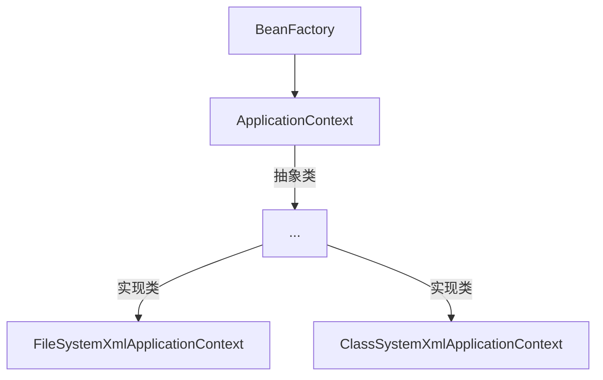

# Spring

[TOC]

## 1. Spring框架概述

### 1.1 Spring基础知识

- `Spring`是一个轻量级的开源的`JavaEE`框架

- `Spring`可以解决企业应用开发的复杂性

- `Spring`的核心部分`IOC`和`AOP`

  `IOC`：控制反转，把创建对象的过程交给`Spring`进行管理

  `AOP`：面向切面，在不修改源代码的情况下进行功能增强

### 1.1 Spring特点

1. 方便解耦，简化开发
2. `AOP`编程支持
3. 方便程序的测试
4. 方便和其他框架进行集合
5. 方便进行事务操作
6. 降低开发`API`的开发难度

## 2. IOC容器

- `IOC`控制反转：将对象的创建和创建对象之间的调用过程，交给`Spring`进行管理
- 使用`IOC`的目的：为了降低耦合度

### 2.1 IOC底层原理

- `xml`解析、工厂模式、反射

### 2.2 IOC过程

1. `xml`配置文件、配置创建的对象

   ```xml
   <bean id="别名" class="类的全路径"></bean>
   ```

2. 假设有`service`类和`dao`类，创建工厂类

   ```java
   class UserFactory{
   	public static UserDao getDao() {
   		String classValue = class属性值; // xml解析
           Class clazz = Class.forName(classValue); // 通过反射创建对象
           return (UserDao) clazz.newInstance();
   	}
   }
   ```

### 2.3 IOC接口

1. `IOC`思想基于`IOC`容器完成，`IOC`容器底层就是对象工厂

2. `Spring`提供了`IOC`容器实现的两种方式(两个接口)

   `BeanFactory`：`IOC`容器基本实现，是`Spring`内部的使用接口，不提供开发人员进行使用，加载配置文件时不会创建对象；在获取对象(使用)在获取对象(使用)才去创建对象

   `ApplicationContext`：`BeanFactory`接口的子接口，提供更多更强大的功能，一般供开发人员使用；加载配置文件时就会把在配置文件对象进行创建

3. 主要实现类



`FileSystemXmlApplicationContext`：绝对路径

`ClassSystemXmlApplicationContext`：类路径

## 3. Bean管理

什么是`Bean`管理
- `Spring`创建对象
- `Spring`注入属性

### 3.1 基于`xml`配置文件方式创建对象

1. 实现

   `bean.xml`

   ```xml
   <?xml version="1.0" encoding="UTF-8"?>
   <beans xmlns="http://www.springframework.org/schema/beans"
          xmlns:xsi="http://www.w3.org/2001/XMLSchema-instance"
          xsi:schemaLocation="http://www.springframework.org/schema/beans http://www.springframework.org/schema/beans/spring-beans.xsd">
       <bean id="user" class="User"/>
   </beans>
   ```

   `User.java`

   ```java
   public class User {
       public void show() {
           System.out.println("********************************************");
       }
   }
   ```

   `ServiceTest.java`

   ```java
   import org.junit.jupiter.api.Test;
   import org.springframework.context.ApplicationContext;
   import org.springframework.context.support.ClassPathXmlApplicationContext;
   
   public class ServiceTest {
       @Test
       public void test() {
           // 加载Spring的配置文件
           ApplicationContext context = new ClassPathXmlApplicationContext("bean.xml");
   
           // 获取配置文件创建的对象
           User user = context.getBean("user", User.class);
           user.show();
       }
   
   }
   ```

2. `bean`标签的常用属性

   `id`：唯一标识

   `class`：类的全路径(包路径)

   `name`：与`id`类似，可以有特殊符号

3. 创建对象时默认使用无参的构造函数

基于`xml`方式注入属性

1. `DI`：依赖注入，就是注入属性

   **使用`set`方法注入**

   ```java
   package dependency.injection;
   
   import org.springframework.context.ApplicationContext;
   import org.springframework.context.support.ClassPathXmlApplicationContext;
   
   public class DependencyInjectionTest {
       public static void main(String[] args) {
           ApplicationContext context = new ClassPathXmlApplicationContext("bean.xml");
           Book book = context.getBean("book", Book.class);
           System.out.println(book);
       }
   }
   
   class Book{
       private String bookName;
       private String bookAuthor;
   
       public void setBookName(String bookName) {
           this.bookName = bookName;
       }
   
       public void setBookAuthor(String bookAuthor) {
           this.bookAuthor = bookAuthor;
       }
   
       @Override
       public String toString() {
           return "Book{" +
                   "bookName='" + bookName + '\'' +
                   ", bookAuthor='" + bookAuthor + '\'' +
                   '}';
       }
   }
   ```

   配置

   ```xml
   <bean id="book" class="dependency.injection.Book">
       <!--使用property完成属性注入-->
       <property name="bookName" value="狂人日记"></property>
       <property name="bookAuthor" value="鲁迅"></property>
   </bean>
   ```

   **使用有参构造注入**

   ```java
   class Order{
       private String name;
       private String address;
       public Order(String name, String address) {
           this.name = name;
           this.address = address;
       }
   
       @Override
       public String toString() {
           return "Order{" +
                   "name='" + name + '\'' +
                   ", address='" + address + '\'' +
                   '}';
       }
   }
   ```

   `bean.xml`

   ```java
   <!--constructor-arg 中可以使用index属性来指定究竟是第几个构造函数被调用-->
   <bean id="order" class="dependency.injection.Order">
       <constructor-arg name="name" value="小米手机"></constructor-arg>
       <constructor-arg name="address" value="China"></constructor-arg>
   </bean>
   ```

   测试

   ```java
   @Test
   public void test() {
       ApplicationContext context = new ClassPathXmlApplicationContext("bean.xml");
       Order order = context.getBean("order", Order.class);
       System.out.println(order); // Order{name='小米手机', address='China'}
   }
   ```

**p名称空间注入**

`bean.xml`在根标签`beans`中加入如下属性

```xml
xmlns:p="http://www.springframework.org/schema/p"
```

p名称空间的本质是调用`set`方法

```xml
<bean id="book2" class="dependency.injection.Book" p:bookName=""></bean>
```

**`xml`注入其他类型属性**

1. `null`值

   ```xml
   <bean id="book" class="dependency.injection.Book">
       <property name="bookName" value="狂人日记"></property>
       <property name="bookAuthor" value="鲁迅"></property>
       <!--设置null值-->
       <property name="address">
       	<null></null>
       </property>
   </bean>
   ```

2. 包含特殊符号

   使用`<![CDATA[<<南京>>]]>`

   ```xml
   <property name="address">
       <value><![CDATA[<<南京>>]]></value>
   </property>
   ```

   转义

   ```xml
   <property name="address" value="&lt;&lt;南京&gt;&gt;"></property>
   ```


### 3.2 属性注入

#### 3.2.1 外部bean

创建两个类`service`类和`dao`类

在`service`调用`dao`里面的方法

`dao`包

```java
package dao;

public interface UserDao {
    void update();
}
```

```java
package dao;

public class UserDaoImpl implements UserDao{
    @Override
    public void update() {
        System.out.println("update....");
    }
}
```

`service`

```java
package service;

import dao.UserDao;

public class UserService {
    // 创建UserDao类型的属性，生成set方法
    private UserDao userDao;
    public void setUserDao(UserDao userDao) {
        this.userDao = userDao;
    }

    public void show() {
        System.out.println("service.....");
        userDao.update();
    }
}
```

配置`xml`

```xml
<!--service和dao对象的创建-->
<bean id="userService" class="service.UserService">
    <!--
        注入userDao类型属性
        name：类里面属性名称
        ref：创建userDao对象bean标签id值
    -->
    <property name="userDao" ref="userDaoImpl"></property>
</bean>
<bean id="userDaoImpl" class="dao.UserDaoImpl"></bean>
```

测试

```java
@Test
public void test() {
    // 测试外部bean
    ApplicationContext context = new ClassPathXmlApplicationContext("service/bean.xml");
    UserService userService = context.getBean("userService", UserService.class);
    userService.show();
}
// service.....
// update....
```

#### 3.2.2 内部bean和级联赋值

一对多关系：一个部门对应多个员工

创建部门类

```java
package bean;

// 部门类
public class Dept {
    private String deptName;

    public void setDeptName(String deptName) {
        this.deptName = deptName;
    }

    @Override
    public String toString() {
        return "Dept{" +
                "deptName='" + deptName + '\'' +
                '}';
    }
}
```

创建员工类

```java
package bean;

// 员工类
public class Emp {
    private String empName;
    private String gender;
    // 员工的部门
    private Dept dept;
    
    public Dept getDept() {
        return dept;
    }
    public void setEmpName(String empName) {
        this.empName = empName;
    }

    public void setGender(String gender) {
        this.gender = gender;
    }

    public void setDept(Dept dept) {
        this.dept = dept;
    }

    @Override
    public String toString() {
        return "Emp{" +
                "empName='" + empName + '\'' +
                ", gender='" + gender + '\'' +
                ", dept=" + dept +
                '}';
    }
}

```

#### 3.2.3 内部bean

配置`xml`

```xml
<!--内部bean-->
<bean id="emp" class="bean.Emp">
    <!--设置两个普通的属性-->
    <property name="empName" value="lucy"></property>
    <property name="gender" value="women"></property>

    <!--设置对象属性-->
    <property name="dept">
        <bean id="dept" class="bean.Dept">
        	<property name="deptName" value="保安部"></property>
        </bean>
    </property>
</bean>
```

测试

```java
@Test
public void test() {
    // 测试内部bean
    ApplicationContext context = new ClassPathXmlApplicationContext("bean/bean.xml");
    Emp emp = context.getBean("emp", Emp.class);
    System.out.println(emp);
}
// Emp{empName='lucy', gender='women', dept=Dept{deptName='保安部'}}
```

#### 3.2.4 级联赋值

**第一种写法**

配置`xml`

```java
<!--级联赋值-->
<bean id="emp" class="bean.Emp">
    <!--设置两个普通的属性-->
    <property name="empName" value="lucy"></property>
    <property name="gender" value="women"></property>

    <!--设置对象属性-->
    <property name="dept" ref="dept"></property>
</bean>
<bean id="dept" class="bean.Dept">
	<property name="deptName" value="财务部"></property>
</bean>
```

测试

```java
@Test
public void test() {
    // 测试级联
    ApplicationContext context = new ClassPathXmlApplicationContext("bean/bean1.xml");
    Emp emp = context.getBean("emp", Emp.class);
    System.out.println(emp);
}
```

**第二种写法**

配置`xml`

```xml
<bean id="emp" class="bean.Emp">
    <property name="empName" value="lucy"></property>
    <property name="gender" value="women"></property>

    <property name="dept" ref="dept"></property>
    <property name="dept.deptName" value="技术部"></property>
    <!--需要有get方法-->
</bean>
<bean id="dept" class="bean.Dept"></bean>
```

测试

```java
@Test
public void test() {
    ApplicationContext context = new ClassPathXmlApplicationContext("bean/bean2.xml");
    Emp emp = context.getBean("emp", Emp.class);
    System.out.println(emp);
}
// Emp{empName='lucy', gender='women', dept=Dept{deptName='技术部'}}
```

#### 3.2.5 集合属性注入

**普通注入**

```java
import java.util.List;
import java.util.Map;
import java.util.Set;

public class Student {
    // 数组类型
    private String[] courses;

    // list集合类型
    private List<String> list;

    // Map类型
    private Map<String, String> map;

    // Set类型
    private Set<String> set;

    public void setCourses(String[] courses) {
        this.courses = courses;
    }

    public void setList(List<String> list) {
        this.list = list;
    }

    public void setMap(Map<String, String> map) {
        this.map = map;
    }

    public void setSet(Set<String> set) {
        this.set = set;
    }
    
    @Override
    public String toString() {
        return "Student{" +
                "courses=" + Arrays.toString(courses) +
                ", name=" + name +
                ", map=" + map +
                ", set=" + set +
                '}';
    }
}
```

配置`xml`

```xml
<?xml version="1.0" encoding="UTF-8"?>
<beans xmlns="http://www.springframework.org/schema/beans"
       xmlns:xsi="http://www.w3.org/2001/XMLSchema-instance"
       xsi:schemaLocation="http://www.springframework.org/schema/beans http://www.springframework.org/schema/beans/spring-beans.xsd">
	<!--集合类型的注入-->
    <bean id="student" class="Student">
		<!--数组类型注入-->
        <property name="courses">
            <array>
                <value>java课程</value>
                <value>数据库课程</value>
            </array>
        </property>

		<!--list类型注入-->
        <property name="name">
            <list>
                <value>张三</value>
                <value>小三</value>
            </list>
        </property>

		<!--map类型注入-->
        <property name="map">
            <map>
                <entry key="JAVA" value="java"></entry>
                <entry key="PHP" value="php"></entry>
            </map>
        </property>

		<!--set集合注入-->
        <property name="set">
            <set>
                <value>SQL</value>
                <value>Redis</value>
            </set>
        </property>
    </bean>
</beans>
```

测试

```java
@Test
public void test() {
    ApplicationContext context = new ClassPathXmlApplicationContext("bean.xml");
    Student student = context.getBean("student", Student.class);
    System.out.println(student);
}
// Student{courses=[java课程, 数据库课程], name=[张三, 小三], map={JAVA=java, PHP=php}, set=[SQL, Redis]}
```

 **集合里设置对象值**

`Course.java`

```java
package classtype;

public class Course {
    private String name;

    public void setName(String name) {
        this.name = name;
    }

    @Override
    public String toString() {
        return "Course{" +
                "name='" + name + '\'' +
                '}';
    }
}
```

`Teacher.java`

```java
package classtype;


import java.util.List;

public class Teacher {
    private List<Course> courses;

    public void setCourses(List<Course> courses) {
        this.courses = courses;
    }

    @Override
    public String toString() {
        return "Teacher{" +
                "courses=" + courses +
                '}';
    }
}
```

配置`xml`

```xml
<!--    集合类型注入对象值-->
<bean id="teacher" class="classtype.Teacher">
    <property name="courses">
        <list>
            <ref bean="course1"></ref>
            <ref bean="course2"></ref>
            <ref bean="course3"></ref>
        </list>
    </property>
</bean>

<!--    创建多个course对象-->
<bean id="course1" class="classtype.Course">
	<property name="name" value="java"></property>
</bean>
<bean id="course2" class="classtype.Course">
    <property name="name" value="php"></property>
</bean>
<bean id="course3" class="classtype.Course">
	<property name="name" value="c++"></property>
</bean>
```

测试

```java
@Test
public void test() {
    ApplicationContext context = new ClassPathXmlApplicationContext("bean.xml");
    Teacher teacher = context.getBean("teacher", Teacher.class);
    System.out.println(teacher);
}
// Teacher{courses=[Course{name='java'}, Course{name='php'}, Course{name='c++'}]}
```

**提取重复的配置**

- 创建`book.java`

  ```java
  package common;
  
  import java.util.List;
  
  public class Book {
      private List<String> list;
  
      public void setList(List<String> list) {
          this.list = list;
      }
  
      @Override
      public String toString() {
          return "Book{" +
                  "list=" + list +
                  '}';
      }
  }
  ```

- 在`spring`配置文件中引入名称空间`util`

  ```xml
  <?xml version="1.0" encoding="UTF-8"?>
  <beans xmlns="http://www.springframework.org/schema/beans"
         xmlns:xsi="http://www.w3.org/2001/XMLSchema-instance"
         xmlns:util="http://www.springframework.org/schema/util"
         xsi:schemaLocation="http://www.springframework.org/schema/beans http://www.springframework.org/schema/beans/spring-beans.xsd
                             http://www.springframework.org/schema/util http://www.springframework.org/schema/util/spring-util.xsd">
  
  </beans>
  ```

- 使用`util`标签完成`list`结合注入提取

  ```xml
  <!--提取list集合类型注入-->
  <util:list id="bookList">
      <value>遮天</value>
      <value>完美世界</value>
      <value>圣墟</value>
  </util:list>
  
  <!--提取list集合类型属性注入使用-->
  <bean id="book" class="common.Book">
  	<property name="list" ref="bookList"></property>
  </bean>
  ```

- 测试

  ```java
  @Test
  public void test() {
      ApplicationContext context = new ClassPathXmlApplicationContext("bean2.xml");
      Book book = context.getBean("book", Book.class);
      System.out.println(book);
  }
  // Book{list=[遮天, 完美世界, 圣墟]}
  ```

### 3.3 FactoryBean

- `Spring`中有两种类型`bean`，一种是普通`bean`,另外一种是工厂`bean`
- 普通`bean`：在配置文件中定义`bean`类型就是返回类型
- 工厂`bean`：在配置文件中定义`bean`类型可以和返回的类型不一致

1. 创建类，让这个类实现接口`FactoryBean`

2. 实现接口里面的方法，在实现的方法中定义返回的`bean`类型

   ```java
   package factorybean;
   
   import org.springframework.beans.factory.FactoryBean;
   
   public class MyBean implements FactoryBean<Course> {
   
       @Override
       public Course getObject() throws Exception {
           // 定义返回bean
           Course course = new Course();
           course.setName("敢问上天是否有仙");
           return course;
       }
   
       @Override
       public Class<?> getObjectType() {
           return null;
       }
   
       @Override
       public boolean isSingleton() {
           return false;
       }
   }
   ```

3. 配置`xml`

   ```xml
   <bean id="myBean" class="factorybean.MyBean"></bean>
   ```

4. 测试

   ```java
   @Test
   public void test(){
       ApplicationContext context = new ClassPathXmlApplicationContext("bean.xml");
       Course course = context.getBean("myBean", Course.class);
       System.out.println(course);
   }
   // Course{name='敢问上天是否有仙'}
   ```

### 3.4 Bean作用域与生命周期

#### 3.4.1 作用域

1. `Spring`中默认的`bean`是单例模式，即使用`ApplicationContext`获取的对象永远是同一个；可以通过`<bean>`标签中的`scope`属性设置多例模式
2. `scope`的取值：`singleton`单例模式，默认。`prototype`多例模式
3. 对于`singleton`默认是在加载配置文件时创建实例，`prototype`是在调用`getBean`时创建多实例对象

#### 3.4.2 生命周期

生命周期：从对象创建到对象销毁的过程

`bean`的生命周期

- 用过构造器创建`bean`实例(无参构造)

  ```java
  public Order(){
  	System.out.println("1.调用的无参构造");
  }
  ```

- 为`bean`的属性设置值和对其他`bean`引用(调用`set`方法)

  ```java
  public void setName(String name) {
      this.name = name;
      System.out.println("2.调用set方法");
  }
  ```

- 调用`bean`的初始化的方法(需要进行配置)

  ```java
  public void init(){
  	System.out.println("3.调用初始化方法");
  }
  // xml配置文件的bean标签中需要添加init-method="init"属性
  ```

- `bean`已经获取(对象获取到了)

  ```java
  @Test
  public void test() {
      ApplicationContext context = new ClassPathXmlApplicationContext("bean.xml");
      Order order = context.getBean("order", Order.class);
      System.out.println("4.获取对象：" + order);
  
      // 销毁对象
      ((ClassPathXmlApplicationContext)context).close();
  }
  ```

- 容器关闭时，调用`bean`的销毁的方法(需要进行配置销毁的方法)，需要手动销毁对象

  ```java
  public void destroy(){
  	System.out.println("5.执行销毁的方法");
  }
  // xml配置文件中添加destroy-method="destroy"
  ```

- 完整代码

  `Order.java`

  ```java
  package bean;
  
  public class Order {
      private String name;
  
      public Order(){
          System.out.println("1.调用的无参构造");
      }
  
      public void setName(String name) {
          this.name = name;
          System.out.println("2.调用set方法");
      }
  
      // 创建执行初始化的方法
      public void init(){
          System.out.println("3.调用初始化方法");
      }
  
      // 创建销毁时执行的方法
      public void destroy(){
          System.out.println("5.执行销毁的方法");
      }
  }
  ```

  `xml`

  ```xml
  <?xml version="1.0" encoding="UTF-8"?>
  <beans xmlns="http://www.springframework.org/schema/beans"
         xmlns:xsi="http://www.w3.org/2001/XMLSchema-instance"
         xsi:schemaLocation="http://www.springframework.org/schema/beans http://www.springframework.org/schema/beans/spring-beans.xsd">
      <bean id="order" class="bean.Order" init-method="init" destroy-method="destroy">
          <property name="name" value="手机"></property>
      </bean>
  </beans>
  ```

  测试

  ```
  @Test
  public void test() {
      ApplicationContext context = new ClassPathXmlApplicationContext("bean.xml");
      Order order = context.getBean("order", Order.class);
      System.out.println("4.获取对象：" + order);
  
      // 销毁对象
      ((ClassPathXmlApplicationContext)context).close();
  }
  // 1.调用的无参构造
  // 2.调用set方法
  // 3.调用初始化方法
  // 4.获取对象：bean.Order@3899782c
  // 5.执行销毁的方法
  ```

#### 3.4.3 bean的后置处理器

1. 调用初始化方法之前：把`bean`的实例传递`bean`后置处理器的方法`postProcessBeforeInitialization`
2. 对象获取之前：把`bean`的实例传递`bean`后置处理器的方法`postProcessAfterInitialization`

**具体实现**

1. 创建类，类实现`BeanPostProcessor`接口，作为后置处理器

   ```java
   package post;
   
   import org.springframework.beans.BeansException;
   import org.springframework.beans.factory.config.BeanPostProcessor;
   
   public class Bean implements BeanPostProcessor {
       @Override
       public Object postProcessBeforeInitialization(Object bean, String beanName) throws BeansException {
           System.out.println("初始化之前执行");
           return bean;
       }
   
       @Override
       public Object postProcessAfterInitialization(Object bean, String beanName) throws BeansException {
           System.out.println("初始化之后执行");
           return bean;
       }
   }
   ```

2. 配置`xml`，即配置后置处理器

   ```xml
   <bean id="MyBean" class="post.Bean"></bean>
   ```

   配置的后置处理器会对当前`xml`文件，配置的所有`bean`生效

3. 测试

   ```java
   @Test
   public void test() {
       ApplicationContext context = new ClassPathXmlApplicationContext("bean.xml");
       Order order = context.getBean("order", Order.class);
       System.out.println("4.获取对象：" + order);
   
       // 销毁对象
       ((ClassPathXmlApplicationContext)context).close();
   }
   // 1.调用的无参构造
   // 2.调用set方法
   // 初始化之前执行
   // 3.调用初始化方法
   // 初始化之后执行
   // 4.获取对象：bean.Order@332796d3
   // 5.执行销毁的方法
   ```

### 3.5 自动装配

```java
package autowire;

public class Dept {
}
```

```java
package autowire;

public class Emp {
    private Dept dept;

    public void setDept(Dept dept) {
        this.dept = dept;
    }
}
```

根据指定装配规则(属性名称或者属性类型)，`Spring`自动将匹配的属性值进行注入

自动装配的原则有两条

1. 根据名称注入，注入值bean的id值和类属性的名称相同

   ```xml
   <bean id="emp" class="autowire.Emp" autowire="byName"></bean>
   <bean id="dept" class="autowire.Dept"></bean>
   ```

2. 根据类型注入，相同类型的`bean`只能有一个

   ```xml
   <bean id="emp" class="autowire.Emp" autowire="byType"></bean>
   <bean id="dept" class="autowire.Dept"></bean>
   ```

### 3.6 引入外部属性文件

实例：配置德鲁伊连接池

正常配置：

```xml
<bean id="dataSorce" class="com.alibaba.druid.pool.DruidDataSource">
    <property name="driverClassName" value="com.mysql.jdbc.Driver"></property>
    <property name="url" value="jdbc:mysql://localhost:3306/test"></property>
    <property name="username" value="root"></property>
    <property name="password" value="123456"></property>
</bean>
```

引入外部属性文件：

1. 创建外部属性文件，`properties`格式文件，写数据库信息。`jdbc.properties`

   ```properties
   prop.driverClass=com.mysql.jdbc.Driver
   prop.url=jdbc:mysql://localhost:3306/test
   prop.userName=root
   prop.password=123456
   ```

2. 把外部`properties`属性文件引入到`spring`配置文件中


