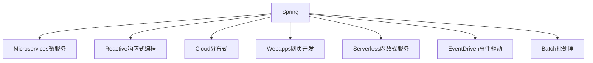
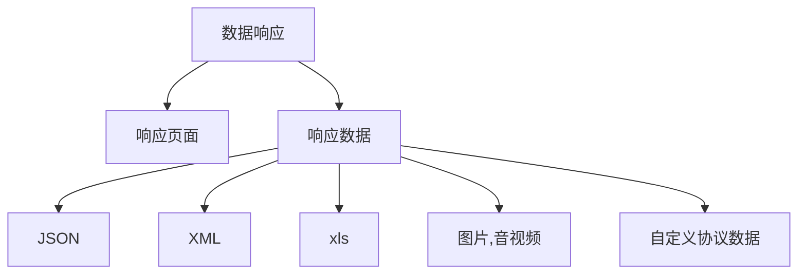
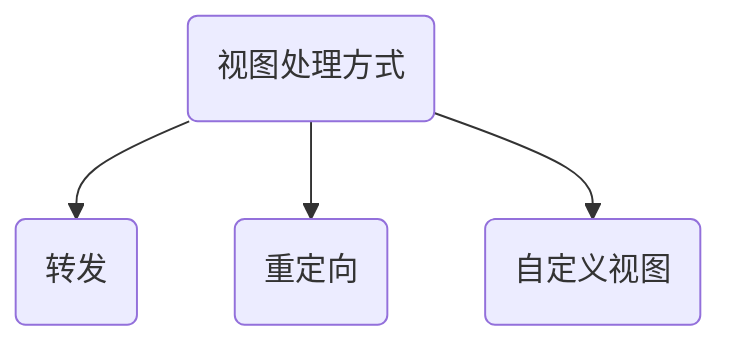

# SpringBoot

[TOC]

## 1. 基础入门

### 1.1 Spring与SpringBoot



`SpringBoot`就是整合`Spring`各种框架的一个脚手架

#### 1.1.1 优点

1. 创建独立`Spring`应用
2. 内嵌`web`服务器
3. 自动`starter`依赖，简化构建配置
4. 自动配置`spring`以及第三方功能
5. 提供产品级别的监控、健康检查即外部配置
6. 无代码生成、无需编写`XML`

#### 1.1.2 缺点

1. 版本迭代太快，需要时刻关注变化
2. 封装太深，内部原理复杂，不容易精通

### 1.2 时代背景

#### 1.2.1 微服务

- 微服务是一种架构风格
- 一个应用拆分为一组小型服务
- 每个服务运行在自己的进程内，也就是可独立部署和升级
- 服务之间使用轻量级`HTTP`交互
- 服务围绕业务功能拆分
- 可以有自动部署机制独立部署
- 去中心化，服务自治。服务可以使用不同的语言、不同的存储技术

#### 1.2.2 分布式

分布式的困难

- 远程调用
- 服务发现
- 负载均衡
- 服务容错
- 配置管理
- 服务监控
- 链路追踪
- 日志管理
- 任务调度
- ......

解决方案，`SpringBoot`+`SpringCloud`

#### 1.2.3 云原生

原生应用如何上云。`Cloud Native`

上云的困难

- 服务自愈
- 弹性伸缩
- 服务隔离
- 自动化部署
- 灰度发布
- 流量治理
- .......

### 1.3 HelloWorld

1. 创建一个`Maven`项目

2. `pom.xml`新增

   ```xml
   <parent>
       <groupId>org.springframework.boot</groupId>
       <artifactId>spring-boot-starter-parent</artifactId>
       <version>2.4.2</version>
   </parent>
   ```

3. 添加`web`依赖的启动器

   ```xml
   <dependency>
       <groupId>org.springframework.boot</groupId>
       <artifactId>spring-boot-starter-web</artifactId>
   </dependency>
   ```

4. 新建一个入口程序，并添加注解`@SpringBootApplication`

   ```java
   @SpringBootApplication
   public class MainApplication {
       public static void main(String[] args) {
           SpringApplication.run(MainApplication.class, args);
       }
   }
   ```

5. 编写`controller`

   ```java
   @RestController
   public class HelloController {
   
       @RequestMapping("/hello")
       public String hello() {
           return "Hello Spring Boot!";
       }
   }
   ```

6. 运行主类测试

7. 在`resource`文件夹下新建`application.properties`可用于修改`SpringBoot`的默认配置

8. 导入`SpringBoot`提供的插件，可以将应用打包为`Jar`的形式

   ```xml
   <build>
   	<plugins>
           <plugin>
               <groupId>org.springframework.boot</groupId>
               <artifactId>spring-boot-maven-plugin</artifactId>
           </plugin>
       </plugins>
   </build>
   ```

9. 输入命令

   ```
   mvn package
   ```

## 2. 自动配置原理

### 2.1 SpringBoot特点

#### 2.1.1 依赖管理

- 父项目做依赖管理

- 开发导入`starter`场景启动器，一个`starter`就包含了一个开发场景所需要的依赖，官方的`starter`以`spring-boot-starter-`开头，第三方的以`-spring-boot-starter`结尾

  所有`starter`的根`starter`

  ```xml
  <dependency>
      <groupId>org.springframework.boot</groupId>
      <artifactId>spring-boot-starter</artifactId>
      <version>2.4.2</version>
  </dependency>
  ```

- 无需关注版本号，自动版本仲裁。`starter`里声明了很多依赖的版本号，依赖引入时，不用关注版本号

  ```xml
  <dependency>
      <groupId>mysql</groupId>
      <artifactId>mysql-connector-java</artifactId>
  </dependency>
  ```

  如果是`springboot`中没有声明的依赖，需要加入版本号

- 可以修改版本号`pom.xml`，以修改`mysql`版本号为例

  ```xml
  <!-- 需要在spring-boot-dependencies找到对应的版本标识 -->
  <properties>
  	<mysql.version>5.1.43</mysql.version>
  </properties>
  ```

#### 2.1.2 自动配置

- 自动配置好`Tomcat`

  ```xml
  <dependency>
      <groupId>org.springframework.boot</groupId>
      <artifactId>spring-boot-starter-tomcat</artifactId>
      <version>2.4.2</version>
  </dependency>
  ```

- 自动配置好`SpringMVC`

  ```xml
  <dependency>
      <groupId>org.springframework</groupId>
      <artifactId>spring-web</artifactId>
      <version>5.3.3</version>
      <scope>compile</scope>
  </dependency>
  <dependency>
      <groupId>org.springframework</groupId>
      <artifactId>spring-webmvc</artifactId>
      <version>5.3.3</version>
      <scope>compile</scope>
  </dependency>
  ```

- 自动配置好`web`常见功能，如：字符编码问题

- 默认的包结构

  主程序所在的包及其下面的所有子包里面的组件都会被默认扫描进来

  可以修改默认扫描的包

  ```
  @SpringBootApplication(scanBasePackages = "com.valid")
  ```

- 各种配置拥有默认值

  默认的配置最终都是映射到`MultipartProperties`

  配置文件的值最终会绑定在每个类上，这个类会在容器中创建对象

- 按需加载所有自动配置项

  所有的自动配置功能都在`spring-boot-autoconfigure`包里面

- ......

### 2.2 容器功能

#### 2.2.1 组件添加

1. `@Configuration`

   `Spring`中注册一个组件需要编写`bean.xml`，`SpringBoot`中则不需要，而是通过注解来注册组件

   假设有以下`bean`

   ```java
   public class User {
       private String name;
       private int age;
       // geter seter 有参构造 无参构造
   }
   ```

   新建一个`MyConfig.java`

   ```java
   @Configuration(proxyBeanMethods = true) // 告诉SpringBoot这是一个配置类
   public class MyConfig {
   
       @Bean  //在容器中添加组件，以方法名作为组件的id。返回类型就是组件类型。返回的值就是组件在容器中的实例
       public User user() {
           return new User("张三", 18);
       }
   }
   ```

   配置类本身也是组件

   `proxyBeanMethods`: 代理`bean`的方法，如果为`true`，则获得`MyConfig`的实例之后调用本身的方法，返回的对象永远都是相同的。如果为`false`则不同，默认为`true`

   `proxyBeanMethods=true`称为`Full`模式：对于一个组件的调用，`SpringBoot`都会去检查容器中是否存在

   `proxyBeanMethods=false`称为`Lite`模式：对于一个组件的调用，`SpringBoot`不会去检查容器中是否存在

   `@Bean`可传入一个字符串作为组件的`id`

   **使用场景**

   如果一个组件中没有依赖其他组件推荐使用`Lite`模式，如果使用了组件则推荐使用`Full`

2. `Spring`中其他添加组件的注解

   `@Component`、`@Controller`、`@Service`、`@Repository`

   组件的`id`是类名称，首字母小写
   
3. `@Import()`

   ```java
   @Import({User.class, String.class})
   @Configuration
   public class MyConfig {
   
   }
   ```

   参数为一个数组，会在容器中自动创建出这连个类型的组件，默认组件的名字为类的全类名

4. `@Conditional`

   条件装配：满足`Conditional`指定的条件，才进行注入。它是一个根注解，其下有许多的子注解。
   
5. `@ImportResource()`原生配置文件导入组件

   ```java
   @ImportResource("classpath:beans.xml")
   ```

   `@ImportResource`加载任意类上，可以导入从配置文件中定义的组件

#### 2.2.2 配置绑定

**第一种方式**

1. 新建一个实体类

   ```java
   /*
   * 只有在容器中的组件，才会拥有SpringBoot提供的功能
   * */
   @Component
   @ConfigurationProperties(prefix = "mycar")
   public class Car {
       private String brand;
       private Integer price;
   	// geter seter 有参构造 无参构造
   }
   ```

   `@ConfigurationProperties`指定声明的属性在配置文件中的前缀

2. 在`application.properties`中添加

   ```properties
   mycar.brand=BYD
   mycar.price=100000
   ```

3. 声明的配置就会被注入到`Car`组件内

**第二种方式**

在配置类上添加以下注解

```java
@EnableConfigurationProperties(Car.class)
```

在实体类上就不用添加注册组件的注解了，一般用于第三方包的配置绑定

### 2.3 自动配置原理入门

#### 2.3.1 引导加载自动配置类

`@SpringBootApplication`相当于以下三个注解

```java
@SpringBootConfiguration
@EnableAutoConfiguration
@ComponentScan(excludeFilters = { @Filter(type = FilterType.CUSTOM, classes = TypeExcludeFilter.class),
		@Filter(type = FilterType.CUSTOM, classes = AutoConfigurationExcludeFilter.class) })
public @interface SpringBootApplication {}
```

1. `@SpringBootConfiguration`

   相当于`@Configuration`是一个配置类

2. `@ComponentScan`

   指定要扫描的包

3. `@EnableAutoConfiguration`是以下两个注解的合成

   ```java
   @AutoConfigurationPackage
   @Import(AutoConfigurationImportSelector.class)
   public @interface EnableAutoConfiguration {}
   ```

   - `@AutoConfigurationPackage`自动配置包内部实现是一个`@Import`

     ```
     @Import(AutoConfigurationPackages.Registrar.class)
     public @interface AutoConfigurationPackage {}
     ```

     利用`Registrar`给容器中导入一系列组件

     将指定的一个包下的所有组件导入进来，即将`MainApplication`所在的包

   - `@Import(AutoConfigurationImportSelector.class)`

     利用`public String[] selectImports(AnnotationMetadata annotationMetadata)`给容器中批量导入一系列组件

     调用以下方法获取所有需要导入到容器的配置类

     ```java
     List<String> configurations = getCandidateConfigurations(annotationMetadata, attributes)
     ```

     利用工厂加载`Map<String, List<String>> loadSpringFactories(@Nullable ClassLoader classLoader)`得到所有的组件，这个方法是从从`META-INF/spring.factories`位置来加载一个文件。默认扫描我们当前系统里面所有`META-INF/spring.factories`位置的文件

     `spring-boot-autoconfigure-2.3.4.RELEASE.jar`包里面也有`META-INF/spring.factories`，其下有`127`个加载类

#### 2.3.2 按需开启自动配置项

虽然我们`127`个场景的所有自动配置启动的时候默认全部加载，但最终会按需配置


总结：

- `SpringBoot`先加载所有的自动配置类

- 每个自动配置类按照条件进行生效，如果生效则会默认启动属性绑定的功能

- 生效的配置类就会给容器中装配很多组件

- 只要容器中有这些组件，相当于功能就有了

- 定制化配置的两种方法

  用户直接使用`@Bean`自己注入一个组件，`SpringBoot`就不会自动配置对应的组件

  在配置文件`application.properties`中进行配置

#### 2.3.3 最佳实践

1. 引入场景依赖即[starter](https://docs.spring.io/spring-boot/docs/current/reference/html/using-spring-boot.html#using-boot-starter)

2. 查看自动配置了哪些(选做)

   - 自己分析，引入场景对应的自动配置一般都生效了
   - `application.properties`中`debug=true`开启自动配置报告，`Negative`（不生效）`Positive`（生效）

3. 是否需要修改

   - 参照[文档](https://docs.spring.io/spring-boot/docs/current/reference/html/appendix-application-properties.html#common-application-properties)

   - 自己分析。`xxxProperties`绑定了哪些配置

   - 自定义加入或者替换组件

     `@Bean`、`@Component`。。。

   - 自定义器`xxxCustomizer`

4. `dev-tools`热更新<kbd>Ctrl</kbd>+<kbd>F9</kbd>

   ```xml
   <dependency>
       <groupId>org.springframework.boot</groupId>
       <artifactId>spring-boot-devtools</artifactId>
       <optional>true</optional>
   </dependency>
   ```

## 3. 配置文件

`properties`文件作为配置文件的书写十分不方便，因此`SpringBoot`的配置文件一般采用`YAML`格式

`yaml`文件提示依赖

```xml
<dependency>
    <groupId>org.springframework.boot</groupId>
    <artifactId>spring-boot-configuration-processor</artifactId>
    <optional>true</optional>
</dependency>

<build>
    <plugins>
        <plugin>
            <groupId>org.springframework.boot</groupId>
            <artifactId>spring-boot-maven-plugin</artifactId>
            <configuration>
                <!--将yaml提示依赖在打包时移除-->
                <excludes>
                    <groupId>org.springframework.boot</groupId>
                    <artifactId>spring-boot-configuration-processor</artifactId>
                </excludes>
            </configuration>
        </plugin>
    </plugins>
</build>
```

### 3.1 基本语法

- `key: value`，`kv`之间有空格
- 大小写敏感
- 使用缩进表示层级关系
- 缩进不允许使用<kbd>Tab</kbd>，只允许<kbd>空格</kbd>
- 缩进的空格树不重要，只要相同层级的元素左对齐即可
- `#`表示注释
- 字符串不需要加`""`

### 3.2 数据类型

- 字面量：单个的、不可再分的值。`date`、`boolean`、`string`、`number`、`null`

```yaml
Key: value
```

- 对象：键值对的集合。`map`、`hash`、`set`、`object`

  行内写法

  ```yaml
  key: {k1: v1, k2: v2, k3: v3}
  ```

  分行写法

  ```yaml
  key:
  	k1: v1
  	k2: v2
  	k3: v3
  ```

- 数组：一行按次序排列的值。`array`、`list`、`queue`

  行内写法

  ```yaml
  key: [v1, v2, v3]
  ```

  分行写法

  ```yaml
  key:
  	- v1
  	- v2
  	- v3
  ```

### 3.3 具体实现

1. 新建`Car.java`

   ```java
   public class Car {
       private String brand;
       private Integer price;
       // geter seter 有参构造 无参构造 toString
   }    
   ```

2. 新建`Person.java`

   ```java
   public class Person {
       private String userName;
       private Boolean boos;
       private Date birth;
       private Integer age;
       private Car car;
       private String[] interests;
       private List<String> animal;
       private Map<String, Object> score;
       private Set<Double> salaries;
       private Map<String, List<Car>> allCars;
       // geter seter 有参构造 无参构造 toString
   }
   ```

3. `resource`目录下新建`application.yaml`

   ```yaml
   person:
       userName: 张三
       boos: true
       birth: 1999/11/11
       age: 22
       car:
           brand: 奔驰
           price: 1000000000
       intersts:
           - 吃饭
           - 睡觉
           - 写代码
       animal: [大黄, 小黑]
       score:
           java程序设计: 100
           数据结构: 62
           操作系统: 90
       salaries:
           - 1000000
           - 300000
       allCars:
           helth:
               - {brand: 奔驰, price: 1800000}
               - {brand: 玛莎拉蒂, price: 3000000}
           sick:
               - {brand: 迈巴赫, price: 4000000}
               - {brand: 兰博基尼, price: 6000000}
   ```

4. 编写`controller`启动测试

   ```java
   @RestController
   public class HelloController {
   
       @Autowired
       private Person person;
   
       @RequestMapping("/person")
       public String person() {
           return person.toString();
       }
   }
   ```

5. 运行结果

   ```
   Person(userName=张三, boos=true, birth=Thu Nov 11 00:00:00 CST 1999, age=22, car=Car{brand='奔驰', price=1000000000}, interests=null, animal=[大黄, 小黑], score={java=100}, salaries=[1000000.0, 300000.0], allCars={helth=[Car{brand='奔驰', price=1800000}, Car{brand='玛莎拉蒂', price=3000000}], sick=[Car{brand='迈巴赫', price=4000000}, Car{brand='兰博基尼', price=6000000}]})
   ```

对于特殊的转义字符`""`会正常输出转义字符的含义，`''`则会转义特殊字符

## 4. Web开发

### 4.1  SpringMVC自动配置预览

1. `ContentNegotiatingViewResolver`和`BeanNameViewResolver`
2. 静态资源
3. 自动注册`Converter, GenericConverters, Formatter`
4. 支持`HttpMessageConverters`
5. 自动注册`MessageCodesResolver`
6. 静态`index.html`支持
7. 自定义`Favicon`
8. 自动使用`ConfigurableWebBindingInitializer`（`DataBinder`将请求数据绑定到`JavaBean`上）

### 4.2 简单功能分析

#### 4.2.1 静态资源访问

1. 静态资源目录

   `/static`or`/public`or`/resources`or`/META-INF/resources`

   访问：当前项目根路径/+静态资源名

   原理：静态资源映射`/**`

   ```yaml
   # 修改默认的资源路径
   spring:
       web:
           resources:
               static-locations: classpath:/test/
   ```

   请求进来，先去找`Controller`看看能不能处理。不能处理的所有请求都交给静态资源处理器。静态资源也找不到就出现`404`

2. 静态资源访问前缀

   默认无前缀

   ```yaml
   spring:
       mvc:
           static-path-pattern: /res/**
   ```

   此时访问静态资源需要 当前项目 + `static-path-pattern` + 静态资源名

3. [webjars]([WebJars - Web Libraries in Jars](https://www.webjars.org/))

   将一些前端`js`库映射为`jar`包形式

   ```xml
   <dependency>
       <groupId>org.webjars</groupId>
       <artifactId>jquery</artifactId>
       <version>3.5.1</version>
   </dependency>
   ```

   访问路径

   ```
   http://127.0.0.1:8080/webjars/jquery/3.5.1/jquery.js
   ```

#### 4.2.2 欢迎页支持(首页)

1. 静态资源路径下`index.html`，网站图标同理
   - 可以配置静态资源路径
   - 不能够配置静态资源的访问前缀。否则导致`index.html`和图标不能被默认访问
2. `controller`能处理`/index`请求的

#### 4.2.3 静态资源配置原理

- `SpringBoot`启动默认加载`xxxAutoConfiguration`类(自动配置类)

- `SpringMVC`功能的自动配置类`WebMvcAutoConfiguration`生效

  ```java
  @Configuration(proxyBeanMethods = false)
  @ConditionalOnWebApplication(type = Type.SERVLET)
  @ConditionalOnClass({ Servlet.class, DispatcherServlet.class, WebMvcConfigurer.class })
  @ConditionalOnMissingBean(WebMvcConfigurationSupport.class)
  @AutoConfigureOrder(Ordered.HIGHEST_PRECEDENCE + 10)
  @AutoConfigureAfter({ DispatcherServletAutoConfiguration.class, TaskExecutionAutoConfiguration.class,
          ValidationAutoConfiguration.class })
  public class WebMvcAutoConfiguration {}
  
  ```

- 给容器中配置的东西

  ```java
  @Configuration(proxyBeanMethods = false)
  @Import(EnableWebMvcConfiguration.class)
  @EnableConfigurationProperties({ WebMvcProperties.class, ResourceProperties.class })
  @Order(0)
  public static class WebMvcAutoConfigurationAdapter implements WebMvcConfigurer {}
  ```

  配置文件的相关属性和xxx进行了绑定。WebMvcProperties==**spring.mvc**、ResourceProperties==**spring.resources**

- 如果一个自动配置类只有一个有参构造器，那么有参构造器所有参数的值都会从容器中确定

  ```java
  //有参构造器所有参数的值都会从容器中确定
  //ResourceProperties resourceProperties；获取和spring.resources绑定的所有的值的对象
  //WebMvcProperties mvcProperties 获取和spring.mvc绑定的所有的值的对象
  //ListableBeanFactory beanFactory Spring的beanFactory
  //HttpMessageConverters 找到所有的HttpMessageConverters
  //ResourceHandlerRegistrationCustomizer 找到 资源处理器的自定义器。=========
  //DispatcherServletPath  
  //ServletRegistrationBean   给应用注册Servlet、Filter....
  public WebMvcAutoConfigurationAdapter(ResourceProperties resourceProperties, WebMvcProperties mvcProperties,
          ListableBeanFactory beanFactory, ObjectProvider<HttpMessageConverters> messageConvertersProvider,
          ObjectProvider<ResourceHandlerRegistrationCustomizer> resourceHandlerRegistrationCustomizerProvider,
          ObjectProvider<DispatcherServletPath> dispatcherServletPath,
          ObjectProvider<ServletRegistrationBean<?>> servletRegistrations) {
      this.resourceProperties = resourceProperties;
      this.mvcProperties = mvcProperties;
      this.beanFactory = beanFactory;
      this.messageConvertersProvider = messageConvertersProvider;
      this.resourceHandlerRegistrationCustomizer = resourceHandlerRegistrationCustomizerProvider.getIfAvailable();
      this.dispatcherServletPath = dispatcherServletPath;
      this.servletRegistrations = servletRegistrations;
  }
  ```

### 4.3 请求参数处理

#### 4.3.1 请求映射

`@xxxMapping`restful请求

```java
@RestController
public class TestController {

    @RequestMapping(value = "/user", method = RequestMethod.GET)
    public String getUser() {
        return "GET-user";
    }
    @RequestMapping(value = "/user", method = RequestMethod.POST)
    public String saveUser() {
        return "POST-user";
    }
    @RequestMapping(value = "/user", method = RequestMethod.PUT)
    public String putUser() {
        return "PUT-user";
    }
    @RequestMapping(value = "/user", method = RequestMethod.DELETE)
    public String deleteUser() {
        return "DELETE-user";
    }
}
```

表单使用`RESTFUL`风格的`PUT`请求和`DELETE`请求需要手动开启

```yaml
spring:
    mvc:
        hiddenmethod:
            filter:
                enabled: true
```

而且表单需要加一个隐藏标签（针对`PUT`和`DELETE`），表单的请求方法依然使用`POST`

```html
<form action="/user" method="post">
    <input name="_method" type="hidden" value="PUT">
    <input value="REST-PUT" type="submit">
</form>
```

#### 4.3.2 普通参数与基本注解

测试所使用的`Controller`

```java
@RestController
public class ParameterTestController {
}
```

**注解**

1. 获取路径变量

   ```java
   @GetMapping("/car/{id}/owner/{username}")
   public Map<String, Object> getCar(@PathVariable("id") Integer id, @PathVariable("username") String username) {
       Map<String, Object> map = new HashMap<>();
       map.put("id", id);
       map.put("username", username);
   
       return map;
   }
   ```

   访问测试

   ```
   访问：http://127.0.0.1:8080/car/1/owner/张三
   
   返回
   {
       "id": 1,
       "username": "张三"
   }
   ```

   也可以传递一个`Map<String, String> map`将参数自动映射到map中

   ```java
   @GetMapping("/car/{id}/owner/{username}")
   public Map<String, String> getCar(@PathVariable Map<String, String> map) {
   	return map;
   }
   ```

2. 获取请求头

   ```java
   @GetMapping("/header")
   public String getHeader(@RequestHeader("User-Agent") String userAgent) {
   	return userAgent;
   }
   ```

   访问测试

   ```
   http://127.0.0.1:8080/header
   
   Mozilla/5.0 (Windows NT 10.0; Win64; x64) AppleWebKit/537.36 (KHTML, like Gecko) Chrome/88.0.4324.96 Safari/537.36 Edg/88.0.705.50
   ```

   也可以获取全部的请求头

   ```java
   @GetMapping("/header")
   public Map<String, String>  getHeader(@RequestHeader Map<String, String> userAgent) {
       return userAgent;
   }
   ```

   访问测试

   ```json
   http://127.0.0.1:8080/header
   
   {"host":"127.0.0.1:8080","connection":"keep-alive","cache-control":"max-age=0","upgrade-insecure-requests":"1","user-agent":"Mozilla/5.0 (Windows NT 10.0; Win64; x64) AppleWebKit/537.36 (KHTML, like Gecko) Chrome/88.0.4324.96 Safari/537.36 Edg/88.0.705.50","accept":"text/html,application/xhtml+xml,application/xml;q=0.9,image/webp,image/apng,*/*;q=0.8,application/signed-exchange;v=b3;q=0.9","sec-fetch-site":"none","sec-fetch-mode":"navigate","sec-fetch-user":"?1","sec-fetch-dest":"document","accept-encoding":"gzip, deflate, br","accept-language":"zh-CN,zh;q=0.9,en;q=0.8,en-GB;q=0.7,en-US;q=0.6,zh-TW;q=0.5","cookie":"username-127-0-0-1-8888=\"2|1:0|10:1610972519|23:username-127-0-0-1-8888|44:NGMwNzhhZDA5YjQ5NGFmMmJkYWI0YzdjNmY1YTFkOWI=|11f885b4841a2571dbe4df5bb6daa332b092df0b572f891f6941269e3af40230\""}
   ```

3. 获取请求参数

   ```java
   @GetMapping("/param")
   public int getParam(@RequestParam("age") Integer age){
   	return age;
   }
   ```

   访问测试

   ```
   http://127.0.0.1:8080/param?age=10
   
   10
   ```

   获取全部请求参数

   ```java
   @GetMapping("/param")
   public Map<String, String> getParam(@RequestParam Map<String, String> map){
   	return map;
   }
   ```

   访问测试

   ```json
   http://127.0.0.1:8080/param?age=10&inters=%E7%AF%AE%E7%90%83&inters=%E7%BC%96%E7%A8%8B
   
   {
       "age": "10",
       "inters": "篮球"
   }
   ```

4. 请求获取`cookie`的值

   ```java
   @GetMapping("/cookie")
   public String getCookie(@CookieValue("ga") String cookie) {
   	return cookie;
   }
   ```

   获取`cookie`的所有信息

   ```java
   @GetMapping("/cookie")
   public Cookie getCookie(@CookieValue("ga")Cookie cookie) {
   	return cookie;
   }
   ```

5. 获取请求体的值

   ```java
   @PostMapping("/body")
   public String getBody(@RequestBody String content) {
   	return content;
   }
   ```

6. 获取请求属性

   新建一个类
   
   ```java
   @Controller
   public class RequestController {
   
       @GetMapping("/goto")
       public String goToPage(HttpServletRequest request) {
   
           request.setAttribute("msg", "成功了");
           request.setAttribute("code", 200);
   
           return "forward:/success"; //转发到 /success请求
       }
   
       @ResponseBody
       @GetMapping("/success")
       public Map<String, Object> success(@RequestAttribute("msg") String msg, HttpServletRequest request) {
           // 两种方式取出attribute
           // 1. @RequestAttribute
           // 2. 原生Servlet
   
           Object servlet = request.getAttribute("msg");
   
           Map<String, Object> map = new HashMap<>();
           map.put("servlet", servlet);
           map.put("@RequestAttribute", msg);
   
           return map;
       }
   }
   ```
   
   请求测试
   
   ```json
   http://127.0.0.1:8080/goto
   
   {
       "@RequestAttribute": "成功了",
       "servlet": "成功了"
   }
   ```
   
7. 矩阵变量

   形如以下的请求地址

   ```
   http://127.0.0.1:8080/cars/sell;low=34;brand=byd,audi,yd
   
   或者
   
   http://127.0.0.1:8080/cars/sell;low=34;brand=byd;brand=audi;brand=yd
   ```

   ```java
   @GetMapping("/cars/{path}")
   public Map<String, Object> carsSell(@MatrixVariable("low") Integer low, @MatrixVariable("brand") List<String> brand) {
       Map<String, Object> map = new HashMap<>();
   
       map.put("low", low);
       map.put("brand", brand);
       return map;
   }
   ```

   `SpringBoot`默认禁用了矩阵变量的功能，需要手动开启

   第一种方法，在容器中添加一个`WebMvcConfigurer`组件

   ```java
   @Configuration(proxyBeanMethods = false)
   public class WebConfig {
       @Bean
       public WebMvcConfigurer webMvcConfigurer() {
           return new WebMvcConfigurer() {
               @Override
               public void configurePathMatch(PathMatchConfigurer configurer) {
                   UrlPathHelper urlPathHelper = new UrlPathHelper();
   
                   // 设置不移除分号后的内容
                   urlPathHelper.setRemoveSemicolonContent(false);
                   configurer.setUrlPathHelper(urlPathHelper);
               }
           };
       }
   }
   ```

   第二种方法，配置类实现`WebMvcConfigurer`接口，重写`configurePathMatch`方法

   ```java
   @Configuration(proxyBeanMethods = false)
   public class WebConfig implements WebMvcConfigurer {
       @Override
       public void configurePathMatch(PathMatchConfigurer configurer) {
           UrlPathHelper urlPathHelper = new UrlPathHelper();
   
           // 设置不移除分号后的内容
           urlPathHelper.setRemoveSemicolonContent(false);
           configurer.setUrlPathHelper(urlPathHelper);
       }
   }
   ```

#### 4.3.3 自定义的参数绑定

**默认绑定**

1. 定义实体类`Pet.java`

   ```java
   @Data
   public class Pet {
       private String name;
       private int age;
   }
   ```

2. 定义实体类`Person.java`

   ```java
   @Data
   public class Person {
       private String userName;
       private int age;
       private Date birth;
       private Pet pet;
   }
   ```

3. 表单数据

   ```html
   <form action="/saveuser" method="post">
       姓名：<input name="userName" value="zhangsan" /><br />
       年龄：<input name="age" value="18" /><br />
       生日：<input name="birth" value="2003/12/01" /><br />
       宠物姓名：<input name="pet.name" value="大黄" /><br />
       宠物年龄：<input name="pet.age" value="5" /><br />
       <input type="submit" value="保存">
   </form>
   ```

4. 编写`Controller`

   ```java
   @PostMapping("/saveuser")
   public String saveUser(Person person) {
   	return person.toString();
   }
   ```

5. 启动测试

   ```
   Person(userName=zhangsan, age=18, birth=Mon Dec 01 00:00:00 CST 2003, pet=Pet(name=大黄, age=5))
   ```

数据绑定：页面提交的请求数据`GET`、`POST`都可以和对象属性进行绑定

**自定义绑定**

1. 表单数据

   ```html
   <form action="/saveuser" method="post">
       姓名：<input name="userName" value="zhangsan" /><br />
       年龄：<input name="age" value="18" /><br />
       生日：<input name="birth" value="2003/12/01" /><br />
       宠物：<input name="pet" value="大黄,10" /><br />
       <input type="submit" value="保存">
   </form>
   ```

2. 自定义转换器

   ```java
   @Configuration(proxyBeanMethods = false)
   public class WebConfig implements WebMvcConfigurer {
       @Override
       public void addFormatters(FormatterRegistry registry) {
           registry.addConverter(new Converter<String, Pet>() {
   
               @Override
               public Pet convert(String source) {
                   // 转换源数据
                   if(StringUtils.hasLength(source)) {
                       Pet pet = new Pet();
                       String[] split = source.split(",");
                       pet.setName(split[0]);
                       pet.setAge(Integer.parseInt(split[0]));
                       return pet;
                   }
                   return null;
               }
           });
       }
   }
   ```

3. `Controller`不做变化

### 4.4 数据响应与内容协商



#### 4.4.1 响应JSON

`spring-boot-starter-web`中已经自动引入了`json`场景，它会给请求对象默认返回`JSON`值

```java
@ResponseBody
@GetMapping("/test/person")
public Person getPerson() {
    Person person = new Person("张三", 18, new Date(), new Pet("大黄", 180));
    return person;
}
```

支持的返回值类型

```java
ModelAndView
Model
View
ResponseEntity
ResponseBodyEmitter
StreamingResponseBody
HttpEntity
HttpHeaders
Callable
DeferedResult
CompletionStage
WebAsyncTask
有 @ModelAttribute、@ResponseBody注解的
```

#### 4.4.2 内容协商

根据客户端接受能力的不同，返回不同媒体类型的数据

假设返回`json`和`xml`

1. 引入`xml`依赖（`json`依赖已经包含在`web starter`内）

   ```xml
   <dependency>
       <groupId>com.fasterxml.jackson.dataformat</groupId>
       <artifactId>jackson-dataformat-xml</artifactId>
   </dependency>
   ```

2. 再次请求`http://127.0.0.1:8080/test/person`

   ```xml
   <Person>
       <userName>张三</userName>
       <age>18</age>
       <birth>2021-01-28T06:06:51.760+00:00</birth>
       <pet>
           <name>大黄</name>
           <age>180</age>
       </pet>
   </Person>
   ```

3. `SpringBoot`根据请求头中的`Accept`字段，来返回不同的数据。浏览器默认`xml`优先

4. 开启参数方式的内容协商`application.yaml`

   为了方便能够根据不同的场景返回不同类型的数据，需要开启参数内容协商

   ```yaml
   spring:
       mvc:
           contentnegotiation:
               favor-parameter: true
   ```

   开启过后只需要请求地址加上一个`format`参数就能返回不同的数据类型

   ```
   // 返回json
   http://127.0.0.1:8080/test/person?format=json
   
   // 返回xml
   http://127.0.0.1:8080/test/person?format=xml
   ```

**自定义内容协商**

- 浏览器发送请求直接返回`xml`

- `ajax`发送请求 返回`json`

- `app`发送请求 返回自定义的数据格式

1. 在`WebCofing.java`（该类以实现`WebMvcConfigurer`接口）中添加一个方法

   ```java
   @Override
   public void extendMessageConverters(List<HttpMessageConverter<?>> converters) {
       converters.add(new AppMessageConverter());
   }
   ```

2. 新建一个`AppMessageConverter`类

   ```java
   public class AppMessageConverter implements HttpMessageConverter<Person> {
   
       @Override
       public boolean canRead(Class<?> clazz, MediaType mediaType) {
           // 能不能够自动映射到标注了@RequestBody的参数上
           return false;
       }
   
       @Override
       public boolean canWrite(Class<?> clazz, MediaType mediaType) {
           // 如果是Person类型就能够正常写入,并返回给服务器
   
           return clazz.isAssignableFrom(Person.class);
       }
   
       @Override
       public List<MediaType> getSupportedMediaTypes() {
           // 获取所有支持的类型
           // 假设app要返回的数据类型是 application/x-valid
   
           return MediaType.parseMediaTypes("application/x-valid");
       }
   
       @Override
       public Person read(Class<? extends Person> clazz, HttpInputMessage inputMessage) throws IOException, HttpMessageNotReadableException {
           return null;
       }
   
       @Override
       public void write(Person person, MediaType contentType, HttpOutputMessage outputMessage) throws IOException, HttpMessageNotWritableException {
           // 自定义类型数据的写出
           String data = person.getUserName() + ";" + person.getAge() + ";" + person.getBirth() + ";" + person.getPet();
   
           // 写出
           OutputStream body = outputMessage.getBody();
           body.write(data.getBytes());
           body.close();
       }
   }
   ```

3. `WebConfig.java`添加参数指定访问的方法

   ```java
   @Override
   public void configureContentNegotiation(ContentNegotiationConfigurer configurer) {
       Map<String, MediaType> mediaType = new HashMap<>();
       // 指定支持解析哪些参数对应的哪些媒体类型
       mediaType.put("json", MediaType.APPLICATION_JSON);
       mediaType.put("xml", MediaType.APPLICATION_XML);
       mediaType.put("valid", MediaType.parseMediaType("application/x-valid"));
   
       // 基于请求参数的适配策略
       ParameterContentNegotiationStrategy parameterStrategy = new ParameterContentNegotiationStrategy(mediaType);
   
       // 基于请求头的适配策略
       HeaderContentNegotiationStrategy headerStrategy = new HeaderContentNegotiationStrategy();
   
       configurer.strategies(Arrays.asList(parameterStrategy, headerStrategy));
   }
   
   // http://127.0.0.1:8080/test/person?format=valid
   ```

### 4.5 视图解析与模板引擎

视图解析：`SpringBoot`默认不支持`JSP`，需要引入第三方末班引擎技术实现页面渲染

#### 4.5.1 视图解析



#### 4.5.2 模板引擎Thymeleaf

引入依赖

```xml
<dependency>
    <groupId>org.springframework.boot</groupId>
    <artifactId>spring-boot-starter-thymeleaf</artifactId>
</dependency>
```

**基本语法**

1. 表达式

   | 表达式名字 | 语法 | 用途                          |
   | ---------- | ---- | ----------------------------- |
   | 变量取值   | ${}  | 获取请求域、session域、对象等 |
   | 选择变量   | *{}  | 获取上下文对象                |
   | 消息       | #{}  | 获取国际化等值                |
   | 链接       | @{}  | 生成链接                      |
   | 片段表达式 | ~{}  | jsp:include作用，引入公共页面 |

2. 条件运算

   if-then：`(if) ? (then)`

   if-then-else：`(if) ? (then) : (else)`

   Default：`(value) ? : (defaultvalue)`

3. 配置的规则

   模板都放在`classpath:/templates/`

   后缀都是`.html`

   `xxx.html`文件都引入名称空间

   ```html
   <html lang="en" xmlns:th="http://www.thymeleaf.org">
   ```

**快速入门**

1. 新建`thymeleaf.html`

   ```html
   <!DOCTYPE html>
   <html lang="en" xmlns:th="http://www.thymeleaf.org">
       <head>
           <meta charset="UTF-8">
           <title>thymeleaf</title>
       </head>
       <body>
           <h1>Hello World</h1>
           <div th:text="${test}">哈哈</div>
           <a href="http://www.qq.com" th:href="${link}">去百度</a>
       </body>
   </html>
   ```

2. 编写`controller`

   ```java
   @Controller
   public class ViewTestController {
   
       @GetMapping("/thymeleaf")
       public String Thymeleaf(Model model) {
   
           // Model 中的放入的数据会自动放入到请求域中‘
           model.addAttribute("test", "我是thymeleaf");
           model.addAttribute("link", "http://www.baidu.com");
           return "thymeleaf";
       }
   }
   ```


### 4.6 拦截器

1. 新建`LoginInterceptor.java`并实现`HandlerInterceptor`接口

   ```java
   public class LoginInterceptor implements HandlerInterceptor {
   
       // 目标方法执行之前
       @Override
       public boolean preHandle(HttpServletRequest request, HttpServletResponse response, Object handler) throws Exception {
           return false;
       }
   
       // 目标方法执行之后
       @Override
       public void postHandle(HttpServletRequest request, HttpServletResponse response, Object handler, ModelAndView modelAndView) throws Exception {
   
       }
   
       // 页面渲染之后
       @Override
       public void afterCompletion(HttpServletRequest request, HttpServletResponse response, Object handler, Exception ex) throws Exception {
   
       }
   }
   ```

2. 编写登录检查的逻辑

   ```java
   @Override
   public boolean preHandle(HttpServletRequest request, HttpServletResponse response, Object handler) throws Exception {
       // 登录检查
       HttpSession session = request.getSession();
       Object loginUser = session.getAttribute("loginUser");
   
       if(loginUser != null) {
           // 登录放行
           return true;
       }
   
       // 拦截住。未登录。跳转至登录页
       request.setAttribute("msg", "请登录后重试");
       request.getRequestDispatcher("/").forward(request, response);
       return false;
   }
   ```

3. 新建`WebConfig.java`

   ```java
   @Configuration
   public class WebConfig implements WebMvcConfigurer {
       @Override
       public void addInterceptors(InterceptorRegistry registry) {
           registry.addInterceptor(new LoginInterceptor())
               	// 拦截哪些请求，/**所有请求，静态资源也会被拦截
                   .addPathPatterns("/**")
               	// 不拦截哪些请求，静态资源也需要放行
                   .excludePathPatterns("/", "/login", "/css/**", "/fonts/**", "/images/**", "/js/**"); 
       }
}
   ```
   

### 4.7 文件上传

1. 表单

   ```html
   <form role="form" th:action="@{/upload}" method="post" enctype="multipart/form-data">
       <div class="form-group">
           <label for="exampleInputEmail1">邮箱</label>
           <input name="email" type="email" class="form-control" id="exampleInputEmail1" placeholder="Enter email">
       </div>
       <div class="form-group">
           <label for="exampleInputPassword1">名字</label>
           <input name="username" type="text" class="form-control" id="exampleInputPassword1" placeholder="Password">
       </div>
       <div class="form-group">
           <label for="exampleInputFile">单文件上传</label>
           <input name="file" type="file" id="exampleInputFile">
       </div>
       <div class="form-group">
           <label for="exampleInputFile">多文件上传</label>
           <input name="files" type="file" multiple>
       </div>
       <div class="checkbox">
           <label>
           <input type="checkbox"> Check me out
           </label>
       </div>
       <button type="submit" class="btn btn-primary">提交</button>
   </form>
   ```

2. 编写`controller`

   ```java
   @PostMapping("/upload")
   public String upload(@RequestParam("email") String email,
                        @RequestParam("username") String userName,
                        @RequestParam("file") MultipartFile singleFile,
                        @RequestParam("files") MultipartFile[] manyFile) throws IOException {
   
       log.info(email);
       log.info(userName);
   
       if(!singleFile.isEmpty()) {
           // 保存到文件服务器
           singleFile.transferTo(Paths.get("D:\\code\\java\\SpringBoot2\\03_admin\\" + singleFile.getOriginalFilename()));
       }
   
       if(manyFile.length > 0) {
           for(MultipartFile file : manyFile) {
               if(!file.isEmpty()) {
                   singleFile.transferTo(Paths.get("D:\\code\\java\\SpringBoot2\\03_admin\\" + file.getOriginalFilename()));
               }
           }
       }
       // 上传成功返回main页面
       return "main";
   }
   ```

3. 配置文件的上传规则

   ```yaml
   spring:
       servlet:
           multipart:
               max-file-size: 10MB
               max-request-size: 100MB
   ```


### 4.8 异常处理

- 默认情况下，`Spring Boot`提供`/error`处理所有错误的映射

- 对于机器客户端，它将生成`JSON`响应，其中包含错误，`HTTP`状态和异常消息的详细信息。对于浏览器客户端，响应一个`whitelabel`错误视图，以`HTML`格式呈现相同的数据

- 要对其进行自定义，添加`View`解析为`error`

- 要完全替换默认行为，可以实现`ErrorController`并注册该类型的`Bean`定义，或添加`ErrorAttributes`类型的组件以使用现有机制但替换其内容

- `templates/error`和`public/error`下的`404.html`和`5xx.html`会被当做错误页面响应，可以修改默认的响应路径

  ```
  server:
      error:
          path: 
  ```

**自定义异常处理**

1. `@ControllerAdvice`+`@ExceptionHandler`

   ```java
   @ControllerAdvice
   public class GlobalExceptionHandler {
   
       @ExceptionHandler({ArithmeticException.class, NullPointerException.class}) //处理异常的类型
       public String handlerMathException(Exception e) {
           
           log.error("异常是: ", e);
           return "login"; //视图地址
       }
   }
   ```

2. `@ResponseStatus`方式

   ```java
   @ResponseStatus(value = HttpStatus.FORBIDDEN, reason = "第二种异常处理方式")
   public class SecondException extends RuntimeException{
       
       public SecondException() {}
       public SecondException(String message) {
           super(message);
       }
   }
   ```

   这种异常处理方式，需要用户手动抛出

   ```
   throw new SecondException();
   ```

3. 自定义异常解析器

   ```java
   @Order(value = Ordered.HIGHEST_PRECEDENCE) //优先级，数字越小优先级越高
   @Component
   public class CustomerHandlerException implements HandlerExceptionResolver {
   
       @Override
       public ModelAndView resolveException(HttpServletRequest request,
                                            HttpServletResponse response,
                                            Object handler, Exception ex) {
           try {
               response.sendError(511, "自定义的错误解析器");
           } catch (IOException e) {
               e.printStackTrace();
           }
           return new ModelAndView();
       }
   }
   ```

   自定义的错误解析器同样会使用`4xx.html`和`5xx.html`视图

### 4.9 原生web组件注入

#### 4.9.1 使用Servlet API

**servlet**

1. 编写`Servlet`

   ```java
   @WebServlet(urlPatterns = "/servlet")
   public class MyServlet extends HttpServlet {
       @Override
       protected void doGet(HttpServletRequest req, HttpServletResponse resp) throws ServletException, IOException {
           resp.getWriter().write("servlet原生组件注入");
       }
   }
   ```

2. 启动类上添加注解

   ```java
   @ServletComponentScan(basePackages ="com.valid.admin" )
   ```

原生的`servlet`组件不会经过`SpringBoot`的拦截器

**Filter**

```java
@Slf4j
@WebFilter(urlPatterns = {"/css/*", "/images/*"})
public class MyFilter implements Filter {

    @Override
    public void init(FilterConfig filterConfig) throws ServletException {
        log.info("初始化");
    }

    @Override
    public void doFilter(ServletRequest request, ServletResponse response, FilterChain chain) throws IOException, ServletException {
        log.info("拦截");
        chain.doFilter(request, response);
    }

    @Override
    public void destroy() {
        log.info("销毁");
    }
}
```

**Listener**

```java
@Slf4j
@WebListener
public class MyListener implements ServletContextListener {
    @Override
    public void contextInitialized(ServletContextEvent sce) {
        log.info("监听项目初始化");
    }

    @Override
    public void contextDestroyed(ServletContextEvent sce) {
        log.info("监听项目销毁");
    }
}
```

#### 4.9.2 RegisterBean

不使用`@Webxxx`注解的方式注入组件

```java
@Configuration
public class MyRegisterConfig {

    @Bean
    public ServletRegistrationBean<MyServlet> myServlet() {
        return new ServletRegistrationBean<>(new MyServlet(), "/my");
    }

    @Bean
    public FilterRegistrationBean<MyFilter> myFilter() {
        // 第二个参数为要拦截的servlet
        return new FilterRegistrationBean<>(new MyFilter(), myServlet());
    }

    @Bean
    public ServletListenerRegistrationBean<MyListener> myListener() {
        return new ServletListenerRegistrationBean<>(new MyListener());
    }
}
```

## 5. 数据访问

### 5.1 SQL

#### 5.1.1 数据源的自动配置

1. 导入`JDBC`依赖

   ```xml
   <dependency>
       <groupId>org.springframework.boot</groupId>
       <artifactId>spring-boot-starter-data-jdbc</artifactId>
   </dependency>
   ```

2. 分析自动配置

   自动导入了事务处理、spring-jdbc、数据源

3. 导入`Mysql`驱动

   ```xml
   <!-- https://mvnrepository.com/artifact/mysql/mysql-connector-java -->
   <dependency>
       <groupId>mysql</groupId>
       <artifactId>mysql-connector-java</artifactId>
       <version>8.0.23</version>
   </dependency>
   ```

4. `application.yaml`配置数据源

   ```yaml
   spring:
       datasource:
           url: 
           username: 
           password: 
   ```

   `SpringBoot`默认已经配置了一个`JdbcTemplate`对象用于操纵数据库并且可以通过`spring.jdbc`来修改其属性

5. 测试

   ```java
   @SpringBootTest
   public class ApplicationTests {
       @Autowired
       private JdbcTemplate jdbcTemplate;
       @Test
       public void test1() {
           int count = jdbcTemplate.queryForObject("SELECT COUNT(*) FROM user", Integer.class);
           System.out.println(count);
       }
   }
   ```

#### 5.1.2 使用Durid数据源

**自定义方式**

1. 导入依赖

   ```xml
   <dependency>
       <groupId>com.alibaba</groupId>
       <artifactId>druid</artifactId>
       <version>1.1.17</version>
   </dependency>
   ```

2. 创建一个配置类`MyDataSourceConfig.java`

   ```
   @Configuration
   public class MyDataSourceConfig {
   
       @Bean
       @ConfigurationProperties(prefix = "spring.datasource") //绑定配置文件
       public DataSource dataSource() throws SQLException {
           DruidDataSource dataSource = new DruidDataSource();
   
           // stat开启页面统计 wall防火墙
   //        dataSource.setFilters("stat,wall");
           return dataSource;
       }
   
       // 配置druid的监控页功能
       @Bean
       public ServletRegistrationBean<StatViewServlet> statViewServlet() {
           StatViewServlet statViewServlet = new StatViewServlet();
           ServletRegistrationBean<StatViewServlet> registrationBean = new ServletRegistrationBean<>(statViewServlet, "/druid/*");
           registrationBean.addInitParameter("loginUsername", "admin");
           registrationBean.addInitParameter("loginPassword", "123456");
           return registrationBean;
       }
   
       /*
       * WebStatFilter用于采集web-jdbc关联监控的数据
       * */
       @Bean
       public FilterRegistrationBean<WebStatFilter> webStatFilter() {
           WebStatFilter webStatFilter = new WebStatFilter();
           FilterRegistrationBean<WebStatFilter> registrationBean = new FilterRegistrationBean<>(webStatFilter);
           registrationBean.setUrlPatterns(Arrays.asList("/*"));
           registrationBean.addInitParameter("exclusions", "*.js,*.gif,*.jpg,*.png,*.css,*.ico,/druid/*");
           return registrationBean;
       }
   }
   ```

**使用starter的方式**

[官方文档](https://github.com/alibaba/druid/tree/master/druid-spring-boot-starter)

1. 导入依赖

   ```xml
   <dependency>
      <groupId>com.alibaba</groupId>
      <artifactId>druid-spring-boot-starter</artifactId>
      <version>1.1.17</version>
   </dependency>
   ```

2. 配置项

   扩展配置项`spring.datasource.druid`

   监控`SpringBean`的配置`spring.datasource.druid.aop-patterns`

   监控页的配置`spring.datasource.druid.stat-view-servlet`默认监控页是开启的

   `web`监控配置`spring.datasource.druid.web-stat-filter`默认开启

3. 具体配置

   ```yaml
   spring:
       datasource:
           driver-class-name: org.mariadb.jdbc.Driver
           url: jdbc:mysql://192.168.1.103:3306/test
           username: root
           password: 123456
   
           druid:
               aop-patterns: com.valid.admin.* # 监控Springbean
   
               stat-view-servlet:
                   enabled: true
                   login-username: admin
                   login-password: admin
                   reset-enable: false
               web-stat-filter:
                   enabled: true
                   url-pattern: /*
                   exclusions: '*.js,*.gif,*.jpg,*.png,*.css,*.ico,/druid/*'
                   
               filters: stat,wall,slf4j
               filter:
                   stat:
                       log-slow-sql: true
                       slow-sql-millis: 1000
                   wall:
                       enabled: true
   ```

#### 5.1.3 整合MyBatis

**配置模式**

1. 引入`stater`

   ```xml
   <dependency>
       <groupId>org.mybatis.spring.boot</groupId>
       <artifactId>mybatis-spring-boot-starter</artifactId>
       <version>2.1.4</version>
   </dependency>
   ```

2. 所有的配置都在`mybatis`中`application.yaml`中配置

   ```yaml
   mybatis:
       # config-location: classpath:mybatis/mybatis-config.xml # 全局配置文件位置
       mapper-locations: classpath:mybatis/mapper/*.xml # sql映射文件位置
       configuration:
           map-underscore-to-camel-case: true # 开启驼峰命名映射
   # 可以不写配置文件，所有的配置都写在configuration     
   ```

3. 新建实体类`Account.java`

   ```java
   @Data
   public class Account {
       private Long id;
       private String name;
       private Integer age;
   }
   ```

4. 新建`Mapper`接口

   ```java
   @Mapper
   public interface AccountMapper {
       public Account getAccountById(Long id);
   }
   ```

5. 在资源文件夹`resource`下新建文件夹目录

   ```
   mybatis
   	- mapper
   		- AccountMapper.xml
   	- mybatis-config.xml
   ```

   `mybatis-config.xml`内容

   ```xml
   <?xml version="1.0" encoding="UTF-8" ?>
   <!DOCTYPE configuration
           PUBLIC "-//mybatis.org//DTD Config 3.0//EN"
           "http://mybatis.org/dtd/mybatis-3-config.dtd">
   <configuration>
       <settings>
           <!--开启驼峰命名映射-->
           <setting name="mapUnderscoreToCamelCase" value="true"/>
       </settings>
   </configuration>
   ```

   `AccountMapper.xml`

   ```xml
   <?xml version="1.0" encoding="UTF-8" ?>
   <!DOCTYPE mapper
           PUBLIC "-//mybatis.org//DTD Mapper 3.0//EN"
           "http://mybatis.org/dtd/mybatis-3-mapper.dtd">
   <mapper namespace="com.valid.admin.mapper.AccountMapper">
       <select id="getAccountById" resultType="com.valid.admin.bean.Account">
           select * from account where id = #{id}
       </select>
   </mapper>
   ```

6. 新建`service`

   ```java
   @Service
   public class AccountService {
       @Autowired
       AccountMapper accountMapper;
       public Account getAccountById(Long id){
           return accountMapper.getAccount(id);
       }
   }
   ```

7. 新建`Controller`

   ```java
   @Controller
   public class IndexController {
       @Autowired
       private AccountService accountService;
   
       @GetMapping("/account")
       public Account getAccountById(@RequestParam("id") Long id) {
           return accountService.getAccountById(id);
       }
   }
   ```

8. 访问测试

   ```json
   http://127.0.0.1:8080/account?id=1
   
   {
       "id": 1,
       "name": "张三",
       "age": 18
   }
   ```

对于简单的查询也可以使用`sql`注解的方式

#### 5.1.4 整合MyBatis-plus

1. 导入依赖

   ```xml
   <dependency>
       <groupId>com.baomidou</groupId>
       <artifactId>mybatis-plus-boot-starter</artifactId>
       <version>3.4.2</version>
   </dependency>
   ```

2. 分析自动配置

   **mybatis-plus: xxx**

   `SqlSessionFactory`：默认为容器中的数据源

   `mapperLocations`：`classpath*:/mapper/**/*.xml`任意包的类路径下的所有`mapper`文件夹下的`xml`文件

   容器中也自动配置了`SqlSessionTemplate`

   `@Mapper`的接口会被扫描

3. 编写实体类

   ```java
   @Data
   @NoArgsConstructor
   @AllArgsConstructor
   public class User {
       // MybatisPlus中要求所有的字段在数据库中都必须存在，对于不存在的字段应该标注@TableField
       @TableField(exist = false)
       private String userName;
       @TableField(exist = false)
       private String password;
       
       // 以下是数据库字段
       private Long id;
       private String name;
       private Integer age;
       private String email;
   }
   ```

4. 编写`mapper`接口

   ```java
   @Mapper
   public interface UserMapper extends BaseMapper<User>{
       
   }
   // 只要继承BaseMapper就会有简单的CRUD功能
   ```

5. 启动测试

   ```java
   @Autowired
   private UserMapper userMapper;
   
   @Test
   public void test3() {
   User user = userMapper.selectById(1);
   	log.info("用户信息：{}", user);
   }
   ```

### 5.2 NoSQL

以`redis`为代表

1. 导入依赖

   ```xml
   <dependency>
       <groupId>org.springframework.boot</groupId>
       <artifactId>spring-boot-starter-data-redis</artifactId>
   </dependency>
   ```

2. 自动配置

   配置前缀：`spring.redis`

   连接工厂：`LettuceConnectionConfiguration`、`JedisConnectionConfiguration`

   自动注入了：`RedisTemplate<Object, Object>`、`StringRedisTemplate<String, String>`

3. 配置文件

   ```yaml
   spring:
       redis:
           host: 192.168.1.103
           port: 6379
           password: 123456
           client-type: LETTUCE # 操作redis的工具
   ```

4. 启动测试

   ```java
   @Autowired
   private StringRedisTemplate redisTemplate;
   @Test
   public void test4() {
       ValueOperations<String, String> operations = redisTemplate.opsForValue();
   
       operations.set("hello", "world");
   
       System.out.println(operations.get("hello"));
   }
   ```

## 6. 单元测试

`SpringBoot 2.2.0`开始引入JUnit5作为单元测试默认库

### 6.1 JUnit5的变化

作为最新版的`JUnit`框架，`JUnit5`与之前的版本的`Junit`框架有很大的不同。由三个不同子项目的几个不同模块组成。

```
JUnit=JUnit Platform + JUnit Jupiter + JUnit Vintage
```

`JUnit Platform`：是在`JVM`上启动测试框架的基础，不仅支持`JUnit`自制的测试引擎，其他测试引擎也都可以接入。

`JUnit Jupiter`：提供了`JUnit5`的新的编程模型，是`JUnit5`新特性的核心。内部包含了一个测试引擎，用于在`Junit Platform`上运行

`JUnit Vintage`：兼容`JUnit4.x`，`JUnit3.x`的测试引擎

`SpringBoot2.4`及以上的版本默认移除`Vintage`的支持，如需使用自行引入

```xml
<dependency>
    <groupId>org.junit.vintage</groupId>
    <artifactId>junit-vintage-engine</artifactId>
    <scope>test</scope>
    <exclusions>
        <exclusion>
            <groupId>org.hamcrest</groupId>
            <artifactId>hamcrest-core</artifactId>
        </exclusion>
    </exclusions>
</dependency>
```

`SpringBoot`整合`JUnit`以后

- 编写测试方法：`@Test`注解
- `JUnit`具有`Spring`的功能，`@Autowired`、`@Transactional`(测试完成后自动回滚)

### 6.2 JUnit5常用注解

`JUnit5`的注解与`JUnit4`的注解有所变化

- `@Test`：表示方法是测试方法。但是与`JUnit4`的`@Test`不同，他的职责非常单一不能声明任何属性，拓展的测试将会由`Jupiter`提供额外测试
- `@ParameterizedTest`：表示方法是参数化测试
- `@RepeatedTest`：表明方法可重复执行
- `@DisplayName`：为测试类或测试方法展示名称
- `@BeforeEach`：表示在每个单元测试之前执行
- `@AfterEach`：表示在每个单元测试之后执行
- `@BeforeAll`：表示在所有单元测试之前执行
- `@AfterAll`：表示在所有单元测试之后执行
- `@Tag`：表示单元测试类别，类似于`JUnit4`中的`@Categories`
- `@Disabled`：表示测试类或测试方法不执行，类似于`JUnit4`中的`@Ignore`
- `@Timeout`：表示测试方法如果超过了指定时间将会返回错误
- `@ExtendWith`：为测试类或测试方法提供扩展类引用

### 6.3 断言

断言`assertions`是测试方法中的核心部分，用来对测试需要满足的条件进行验证。这些断言方法都是`org.junit.jupiter.api.Assertions`的静态方法。`JUnit5`内置的断言可以分成如下几个类别：检查业务逻辑返回的数据是否正确

#### 6.3.1 简单断言

用来对单个值进行简单的验证

| 方法            | 说明                                 |
| --------------- | ------------------------------------ |
| assertEquals    | 判断两个对象或两个原始类型是否相等   |
| assertNotEquals | 判断两个对象或两个原始类型是否不相等 |
| assertSame      | 判断两个对象引用是否能指向不同的对象 |
| assertNotSame   | 判断两个对象引用是否指向不同的对象   |
| assertTrue      | 判断给定的布尔值是否为true           |
| assertFalse     | 判断给定的布尔值是否为false          |
| assertNull      | 判断给定的对象引用是否为null         |
| assertNotNull   | 判断给定的对象引用是否不为null       |

**测试示例**

```java
@DisplayName("测试简单断言")
@Test
public void testSimple() {
    int cal = cal(2, 3);
    Assertions.assertEquals(4, cal);
    // 也可以定义错误信息
    // Assertions.assertEquals(4, cal, "计算失败");
}

public int cal(int i, int j) {
    return i + j;
}
```

如果断言执行失败，那么错误往后的代码都不会执行

#### 6.3.2 数组断言

```java
@DisplayName("测试数组断言")
@Test
public void testArray() {
	Assertions.assertArrayEquals(new int[]{1, 2}, new int[]{2, 1}, "数组不相等");
}
```

#### 6.3.3 组合断言

`assertAll`方法接受多个`org.junit.jupiter.api.Executable`函数式接口的实例作为要验证的断言，可以通过`lambda`表达式横容易的提供这些断言

```java
@DisplayName("组合断言")
@Test
public void testAssertAll() {
    Assertions.assertAll("组合断言测试",
        () -> Assertions.assertEquals(2, 1 + 1),
        () -> Assertions.assertTrue( 1 < 0)
    );
}
```

#### 6.3.4 异常断言

对于一定会出现异常的情况使用

```java
@DisplayName("异常断言")
@Test
public void testAssertThrows() {
    // 扔出断言异常
    ArithmeticException exception = Assertions.assertThrows(
        // 扔出异常
        ArithmeticException.class,
        () -> System.out.println(1 / 0),
        "没有出现异常"
    );
}
```

#### 6.3.5 超时断言

为测试方法设置超时时间

```java
@DisplayName("超时断言")
@Test
public void testAssertTimeout() {
Assertions.assertTimeout(
        Duration.ofMillis(1000),
        () -> Thread.sleep(1001),
        "方法执行超时"
    );
}
```

#### 6.3.6 快速失败

```java
@DisplayName("快速测试")
@Test
public void testFail() {
	Assertions.fail("通过此方法可以直接使测试失败");
}
```

### 6.4 前置条件

`JUnit5`中的前置条件`assumptions`类似于断言，不同之处在于不满足的断言会使得测试方法失败，而不满足的前置条件只会使得测试方法的执行终止。前置条件可以看成是测试方法执行的前提，当前提不满足时，就没有继续执行的必要

```java
@DisplayName("测试假设")
@Test
public void testAssumptions() {
    Assertions.assertTrue(false, "结果不是true");
    System.out.println("假设成立");
}
```

### 6.5 嵌套测试

`JUnit5`可以通过`java`中的内部类和`@Nested`注解实现嵌套测试，从而可以更好的把相关的测试方法组织在一起。在内部类中可以使用`@BeforeEach`和`@AfterEach`注解，而且嵌套的层次没有限制

```java
@DisplayName("嵌套测试")
public class Testing {

    @Nested
    @DisplayName("第二层测试")
    class WhenNew {
    
    	@Nested
        @DisplayName("第三层测试")
        class AfterPushing {
     
     	}
     }
}   
```

### 6.6 参数化测试

参数化测试是`JUnit5`很重要的一个新特性，它使得用不同的参数多次运行测试称为了可能，也为我们的单元测试带来许多便利

利用`@ValueSource`等注解，指定入参，我们可以使用不同的参数进行多次单元测试，也不需要每新增一个参数就新增一个单元测试，省去了许多冗余的代码

**常用注解**

`@ValueSource`：为参数化测试指定入参来源，支持八大基础类以及`String`类型，`Class`类型

```java
@ParameterizedTest
@DisplayName("参数化测试")
@ValueSource(ints = {1, 2, 3, 4, 5})
public void testParameterized(int i) {
}
```

`@NullSource`：表示为参数化测试提供一个枚举入参

`@CsvFileSource`：表示读取指定`CSV`文件内容作为参数化测试入参

`@MethodSource`：表示读取指定方法的返回值作为参数测试入参(注意方法返回需要是一个流)

## 8. 指标监控

### 8.1 SpringBoot Actuator

#### 8.1.1 简介

未来每一个微服务在云上部署后，我们都需要对其进行监控、追踪、审计、控制等。`SpringBoot`就提取了`Actuator`场景，使得我们每个微服务快速引用即可获得生产级别的应用监控、审计等功能

**依赖**

```xml
<dependency>
    <groupId>org.springframework.boot</groupId>
    <artifactId>spring-boot-starter-actuator</artifactId>
</dependency>
```

#### 8.1.2 如何使用

- 导入依赖

- 访问`http://localhost:8080/actuator/**`

- 默认以`JMX`暴露所有的`Endpoint`

- 配置`web`的方式暴露

  ```yaml
  management:
      endpoints:
          web:
              exposure:
                  include: '*' # 以web方式暴露所有端点
  ```

### 8.2 Actuator Endpoint

#### 8.2.1 常用端点

| ID               | 描述                                                         |
| ---------------- | ------------------------------------------------------------ |
| auditevents      | 暴露当前应用程序的审核事件信息。需要一个AuditEventRepository组件 |
| beans            | 显示应用中所有的Spring Bean的完整列表                        |
| caches           | 暴露可用的缓存                                               |
| conditions       | 显示自动配置的所有条件信息，包括匹配或不匹配的原因           |
| configprops      | 显示所有@ConfigurationProperties                             |
| env              | 暴露Spring的属性ConfigurableEnvironment                      |
| flyway           | 显示已应用的所有Flyway数据库迁移。需要一个或多个Flyway组件   |
| health           | 显示应用程序运行状况信息                                     |
| info             | 显示应用程序信息                                             |
| integrationgraph | 显示Spring integrationgraph，需要依赖spring-integration-core |
| httptrace        | 显示HTTP跟踪信息（默认情况下，最近100个HTTP请求-响应）。需要一个HTTPTraceRepository组件 |
| loggers          | 显示和修改应用程序中日志的配置                               |
| liquibase        | 显示已应用的所有Liquibase数据库迁移。需要一个或多个Liquibase组件 |
| metrics          | 显示当前应用程序的指标信息                                   |
| mappings         | 显示所有@RequestMapping路径列表                              |
| scheduledtasks   | 显示应用程序中的计划任务                                     |
| sessions         | 允许Spring Session支持的会话存储中检索和删除用户会话。需要使用Spring Session的基于Servlet的Web应用程序 |
| threaddump       | 执行线程转储                                                 |

常用的`Endpoint`

`health`健康状况、`metrics`运行时指标、`loggers`日志记录

#### 8.2.2 health

配置`health`的详细信息

```yaml
management:
    endpoint:
        health:
            show-details: always
```

配置过之后访问`http://127.0.0.1:8080/actuator/health`返回的是一个汇总报告

只有所有的组件都是`up`应用才为`up`

```json
{
    "status": "UP",
    "components": {
        "db": {
            "status": "UP",
            "details": {
                "database": "MariaDB",
                "validationQuery": "isValid()"
            }
        },
        "diskSpace": {
            "status": "UP",
            "details": {
                "total": 1000203087872,
                "free": 918287458304,
                "threshold": 10485760,
                "exists": true
            }
        },
        "ping": {
            "status": "UP"
        },
        "redis": {
            "status": "UP",
            "details": {
                "version": "6.0.10"
            }
        }
    }
}
```

#### 8.2.3 Mertics Endpoint

提供详细的、层级的、控件指标信息，这些信息可以被`pull`（主动推送）或者`push`（被动获取）方式得到

- 通过`mertics`对接多种监控系统
- 简化核心`metrics`开发
- 添加自定义的`metrics`或者扩展已有的`metrics`

### 8.3 定制Endpoint

#### 8.3.1 定制Health信息

