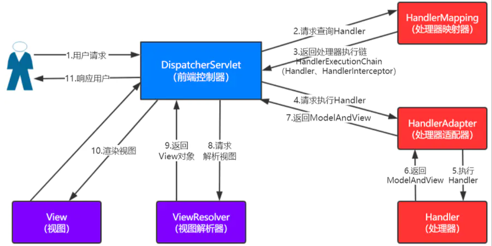

# SpringMVC

[TOC]

## 1. 概述

### 1.1 什么是SpringMVC

`SpringMVC`是`Spring Framework`的一部分，是基于`java`实现的MVC的轻量级`Web`框架

特点

1. 轻量级，简单易学
2. 高效，基于请求和响应的`MVC`框架
3. 与`Spring`兼容性好，无缝结合
4. 约定优于配置
5. 功能强大：`RESTFUL`、数据验证、格式化、本地化、主题等
6. 简洁灵活

### 1.2 中心控制器

- `Spring`的`web`框架围绕`DispatcherServlet`调度`Servelt`设计
- `DispatcherServlet`的作用域是将请求分发到不同的处理器，`Spring2.5`开始，使用`Java5`或者以上的版本的用户可以采用基于注解的`controller`声明方式
- `Spring MVC`框架像许多其他`MVC`框架一样，以请求为驱动，围绕一个中心`Servlet`分派请求及提供其他功能，`DispatcherServlet`是一个实际的`Servelt`(它继承自`HttpServlet`基类)

### 1.3 快速入门

1. 新建一个`Moudle`，添加`web`支持

2. 导入依赖

   ```xml
   <!--servlet-->
   <dependency>
       <groupId>javax.servlet</groupId>
       <artifactId>javax.servlet-api</artifactId>
       <version>4.0.1</version>
   </dependency>
   <dependency>
       <groupId>javax.servlet.jsp</groupId>
       <artifactId>javax.servlet.jsp-api</artifactId>
       <version>2.3.3</version>
   </dependency>
   
   <!--Spring-->
   <dependency>
       <groupId>org.springframework</groupId>
       <artifactId>spring-webmvc</artifactId>
       <version>5.2.11.RELEASE</version>
   </dependency>
   ```

3. 配置`web.xml`，注册`DispatcherServlet`

   ```xml
   <!--注册DispatcherServlet-->
   <servlet>
       <servlet-name>springmvc</servlet-name>
       <servlet-class>org.springframework.web.servlet.DispatcherServlet</servlet-class>
   
       <!--关联一个springmvc的配置文件【servlet-name】-servlet.xml-->
       <init-param>
           <param-name>contextConfigLocation</param-name>
           <param-value>classpath:springmvc-servlet.xml</param-value>
       </init-param>
       <!--启动级别1-->
       <load-on-startup>1</load-on-startup>
   </servlet>
   
   <!--/ 匹配所有的请求不包括.jsp-->
   <!--/* 匹配所有的请求包括.jsp-->
   <servlet-mapping>
       <servlet-name>springmvc</servlet-name>
       <url-pattern>/</url-pattern>
   </servlet-mapping>
   ```

4. 新建`springmvc-servlet.xml`

   ```xml
   <?xml version="1.0" encoding="UTF-8"?>
   <beans xmlns="http://www.springframework.org/schema/beans"
          xmlns:xsi="http://www.w3.org/2001/XMLSchema-instance"
          xsi:schemaLocation="http://www.springframework.org/schema/beans http://www.springframework.org/schema/beans/spring-beans.xsd">
   
       <!--1. 添加处理映射器-->
       <bean class="org.springframework.web.servlet.handler.BeanNameUrlHandlerMapping" />
   
       <!--2. 添加处理器适配器-->
       <bean class="org.springframework.web.servlet.mvc.SimpleControllerHandlerAdapter" />
   
       <!--3. 添加视图解析器-->
       <bean class="org.springframework.web.servlet.view.InternalResourceViewResolver" id="internalResourceViewResolver">
           <!--前缀-->
           <property name="prefix" value="/WEB-INF/jsp/" />
   
           <!--后缀-->
           <property name="suffix" value=".jsp" />
       </bean>
   </beans>
   ```

5. 编写我们要操作的业务`Controller`，要么实现`Controller`接口，要么增加注解；需要返回一个`ModelAndView`，封装数据与视图

   ```java
   public class HelloController implements Controller {
   
       @Override
       public ModelAndView handleRequest(HttpServletRequest httpServletRequest, HttpServletResponse httpServletResponse) throws Exception {
           // ModelAndView 模型和视图
           ModelAndView mv = new ModelAndView();
   
           // 封装对象，放在ModelAndView中
           mv.addObject("msg", "HelloSpringMVC");
   
           // 封装要跳转的视图，放在ModelAndView中
           mv.setViewName("hello"); // /WEB-INF/jsp/hello.jsp
   
           return mv;
       }
   }
   ```

6. 在`springmvc-servlet.xml`配置`HelloController`实例

   ```xml
   <bean id="/hello" class="HelloController" />
   ```

7. `web`目录下新建`jsp/hello.jsp`

   ```jsp
   <%@ page contentType="text/html;charset=UTF-8" language="java" %>
   <html>
   <head>
       <title>Title</title>
   </head>
   <body>
       ${msg}
   </body>
   </html>
   ```

8. 配置`tomcat`启动测试

可能会遇到的问题`404`，打包好的项目下没有`lib`目录，需要手动导入依赖

### 1.4 SpringMVC执行原理



1. `DispatcherServlet`表示前置控制器，是整个`SpringMVC`的控制中心。用户发出请求，`DispatcherServlet`接受请求并拦截
2. `HandlerMapping`为处理器映射。`DispatcherServlet`调用`HandlerMapping`，`HandlerMapping`根据请求`url`查找`Handler`
3. `HandlerException`表示具体的`Handler`，其主要作用是根据`url`查找控制器，上述例子中的控制器为`hello`
4. `HandlerException`将解析后的信息传递给`DispatcehrServlet`，如解析控制器映射等
5. `HandlerAdapter`表示处理器适配器，其按照特定的规则去执行`handler`
6. `Handler`让具体的`Controller`执行
7. `Controller`将具体的执行信息返回给`handlerAdapter`，如`ModelAndView`
8. `handlerAdapter`将试图逻辑名或者模型传递给`DispatcherServlet`
9. `DispatcherServlet`根据视图解析器的解析结果，调用具体的视图
10. 视图呈现给用户

## 2. Controller

控制器`Controller`

- 控制器负载提供访问应用程序的行为，通常通过接口定义或注解定义两种方法实现
- 控制器负责解析用户的请求并将其转换为一个模型
- 在`Spring MVC`中一个控制器类可以包含多个方法
- 在`Spring MVC`中，对于`Controller`的配置方式有很多种

### 2.1 实现Controller接口

1. 编写`ContorllerTest1.java`实现`Controller`的功能

   ```java
   public class ControllerTest1 implements Controller {
       @Override
       public ModelAndView handleRequest(HttpServletRequest httpServletRequest, HttpServletResponse httpServletResponse) throws Exception {
           ModelAndView mv = new ModelAndView();
   
           mv.addObject("msg", "ControllerTest1");
           mv.setViewName("test");
           return mv;
       }
   }
   ```

2. 在`springmvc-servlet.xml`文件中注册请求的`bean`；`name`对应请求路径，`class`对应处理请求的类

   ```
   <bean id="/test" class="com.valid.controller.ControllerTest1" />
   ```

这种方法不需要在`springmvc-servlet.xml`中配置处理映射器和处理适配器

缺点：一个控制器中只有一个方法，如果是多个方法就需要定义多个`Controller`

### 2.2 注解开发

#### 2.2.1 注解实例

1. 修改`springmvc-servlet.xml`

   ```xml
   <?xml version="1.0" encoding="UTF-8"?>
   <beans xmlns="http://www.springframework.org/schema/beans"
          xmlns:xsi="http://www.w3.org/2001/XMLSchema-instance"
          xmlns:context="http://www.springframework.org/schema/context"
          xmlns:mvc="http://www.springframework.org/schema/mvc"
          xsi:schemaLocation="http://www.springframework.org/schema/beans http://www.springframework.org/schema/beans/spring-beans.xsd http://www.springframework.org/schema/context https://www.springframework.org/schema/context/spring-context.xsd http://www.springframework.org/schema/mvc https://www.springframework.org/schema/mvc/spring-mvc.xsd">
   
       <!--开启组件扫描-->
       <context:component-scan base-package="com.valid.controller" />
       <!--SpringMVC不处理静态资源-->
       <mvc:default-servlet-handler />
   
       <!--开启自动注入处理映射器以及适配器-->
       <mvc:annotation-driven />
   
       <!--3. 添加视图解析器-->
       <bean class="org.springframework.web.servlet.view.InternalResourceViewResolver" id="internalResourceViewResolver">
           <!--前缀-->
           <property name="prefix" value="/WEB-INF/jsp/" />
   
           <!--后缀-->
           <property name="suffix" value=".jsp" />
       </bean>
   </beans>
   ```

   视图解析器中将所有的视图放在`WEB-INF`下，这样可以保证视图安全，因为这个目录下的文件，客户端不能直接访问

2. 编写`HelloContorller.java`

   ```java
   @Controller
   public class HelloController {
   
       @RequestMapping("/hello")
       public String hello(Model model) {
           // 封装数据，数据可以在jsp页面中获取
           model.addAttribute("msg", "Hello SpringMVCAnnotation");
   
           return "hello"; // 会被视图解析器处理
       }
   }
   ```

   `@Controller`代表这个类会被`Spring`接管，这个类中所有返回值为`String`，并且有具体页面可以跳转的，那么就会被视图解析器解析

3. 启动测试

如果出现无法识别的`UTF-8`的问题在`pom.xml`中添加

```xml
<properties>
	<project.build.sourceEncoding>UTF-8</project.build.sourceEncoding>
</properties>
```

#### 2.2.2 RequestMapping

`@RequestMapping`可以用于类或者方法，如果用于类则认为类中的所有的`url`默认拼接类上的`@RequestMapping`

## 3. RestFul风格

### 3.1 概述

**概念**

`Restful`就是一种资源定位操作的风格。不是标准也不是协议，只是一种风格。基于这个风格设计的软件可以更加简洁，更有层次，易于实现缓存等机制

**功能**

- 资源：互联网所有的事物都可以被抽象为资源 
- 资源操作：使用POST、DELETE、PUT、GET，使用不同方法对资源进行操作。 
- 分别对应 添加、 删除、修改、查询。

**传统方式操作资源** ：

- 通过不同的参数来实现不同的效果！方法单一，post 和 get

- http://127.0.0.1/item/queryItem.action?id=1 查询,GET
-  http://127.0.0.1/item/saveItem.action 新增,POST 
- http://127.0.0.1/item/updateItem.action 更新,POST
-  http://127.0.0.1/item/deleteItem.action?id=1 删除,GET或POST

**使用RESTful操作资源** ：可以通过不同的请求方式来实现不同的效果！如下：请求地址一样，但是功能可以不同！

- http://127.0.0.1/item/1 查询,GET
-  http://127.0.0.1/item 新增,POST
-  http://127.0.0.1/item 更新,PUT 

- http://127.0.0.1/item/1 删除,DELETE

### 3.2 实例

计算`a+b`的值并返回

普通写法

```java
// http://localhost:8080/s4/add?a=1&b=2
@RequestMapping("/add")
    public String test(int a, int b, Model model) {
    int res = a + b;
    model.addAttribute("msg", "结果为" + res);
    return "test";
}
```

`resful`风格

```java
// http://localhost:8080/s4/add/1/2
@RequestMapping(path = "/add/{a}/{b}", method = RequestMethod.POST)
public String test(@PathVariable int a,@PathVariable int b, Model model) {
    int res = a + b;
    model.addAttribute("msg", "结果为" + res);
    return "test";
}
```

`@PathVariable`将地址栏中的变量绑定在方法上

对于请求方法也可以通过`RequestMapping`的变体实现

```java
@PostMapping("/add/{a}/{b}")
public String test(@PathVariable int a,@PathVariable int b, Model model) {
    int res = a + b;
    model.addAttribute("msg", "结果为" + res);
    return "test";
}
```

`@GetMapping`、`@PostMapping`、`@PutMapping`、`@DeleteMapping`、`@PatchMapping`

## 4. 结果跳转方式

### 4.1 ModelAndView

设置`ModelAndView`对象，根据`view`的名称，和视图解析器跳转到指定的页面

页面：{视图解析器前缀} + `viewName` + {视图解析器后缀}

### 4.2 重定向和转发

通过`SpringMVC`来实现转发和重定向 - 无需视图解析器

测试前，需要将视图解析器注释

1. 转发

   ```java
   @RequestMapping("/t1")
   public String test1(Model model) {
       model.addAttribute("msg", "转发");
       return "/WEB-INF/jsp/test.jsp";
       
       // 也可以通过指定forward前缀进行转发
       // return "forward:/WEB-INF/jsp/test.jsp";
   }
   ```

2. 重定向

   ```java
   @RequestMapping("/t2")
   public String test2(Model model) {
       model.addAttribute("msg", "重定向");
       return "redirect:/index.jsp";
   }
   ```

有视图解析器的情况下直接写视图即可

## 5. 数据处理

### 5.1 处理提交的数据

1. 如果请求的参数的名称和处理器方法的参数名称相同，可以直接通过参数拿到

   ```
   http://192.168.1.108:8080/s4/hello?name=hahah
   ```

   ```java
   @RequestMapping("/hello")
   public String hello(String name) {
       System.out.println(name);
       return "test";
   }
   ```

2. 如果请求的参数与处理器方法的参数名称不同

   ```
   http://192.168.1.108:8080/s4/different?username=hahha
   ```

   通过`@RequestParam`指定参数的名称

   ```java
   @RequestMapping("/different")
   public String test(@RequestParam("username") String name) {
       System.out.println(name);
       return "test";
   }
   ```

3. 返回对象

   实体类

   ```java
   public class User {
       private int id;
       private String name;
       private int age;
   }
   ```

   编写控制器

   ```
   // http://localhost:8080/s4/object?id=1&name=haha&age=18
   ```

   ```
   @RequestMapping("/object")
   public String test1(User user) {
       // 前端返回对象
       System.out.println(user);
   
       return "test";
   }
   ```

   前端传递的参数名和对象的属性名需要一致，匹配不到的字段为类型零值

### 5.2 数据回显前端

1. `ModelAndView`

   ```java
   @Override
   public ModelAndView handleRequest(HttpServletRequest httpServletRequest, HttpServletResponse httpServletResponse) throws Exception {
       ModelAndView mv = new ModelAndView();
   
       mv.addObject("msg", "ControllerTest1");
       mv.setViewName("test"); // 视图
       return mv;
   }
   ```

2. `Model`

   ```java
   @RequestMapping("/test")
   public String test(Model model) {
       model.addAttribute("msg", "ControllerTest");
   
       return "test";
   }
   ```

3. `ModleMap`

   ```java
   @RequestMapping("/modelmap")
   public String test2(ModelMap map) {
       map.addAttribute("msg", "ModelMap");
   
       return "test";
   }
   ```

`Model`：只有寥寥几个方法只适合用于存储数据，简化了新手对于`Model`对象的操作和理解

`ModelMap`：继承了`LinkedMap`，除了实现了自身的一些方法，同样的继承`LinkedMap`的方法和特性

`ModelAndView`：可以在存储数据的同时，可以进行设置返回的逻辑视图，进行控制展示层的跳转

### 5.3 乱码问题

1. 我们可以在首页编写一个提交的表单`form.jsp`

   ```html
   <form action="encoding" method="post">
       <input type="text" name="name">
       <input type="submit">
   </form>
   ```

2. 编写`Controller`

   ```java
   @PostMapping("/encoding")
   public String test(String name, Model model) {
       model.addAttribute("msg", name);
       return "test";
   }
   ```

3. 启动测试

   如果是输入中文，很大的可能会乱码

**解决方法**

使用`Spring`提供的过滤器

```xml
<filter>
    <filter-name>encoding</filter-name>
    <filter-class>org.springframework.web.filter.CharacterEncodingFilter</filter-class>
    <init-param>
        <param-name>encoding</param-name>
        <param-value>utf-8</param-value>
    </init-param>
</filter>
<filter-mapping>
    <filter-name>encoding</filter-name>
    <url-pattern>/*</url-pattern>
</filter-mapping>
```

