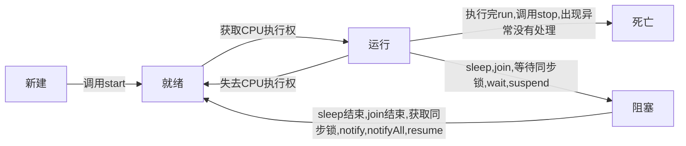

# java高级

[TOC]

## 1. 多线程

### 1.1 基本概念

1. 程序`program`：是为完成特定任务、用某种语言编写的一组指令的集合。即指一段静态的代码，静态对象

2. 进程`process`：是程序的一次执行过程，或是正在运行的一个程序。是一个动态的过程：有它自身的产生、存在和消亡的过程。---生命周期，进程作为资源分配的单位，系统在运行时会为每个进程分配不同的内存区域。

3. 线程`thread`：进程可进一步细化为线程，是一个程序内部的一条执行路径

   - 若一个进城同一时间并行执行多个线程，就是支持多线程的

   - 线程作为调度和执行的单位，每个线程拥有独立的运行栈和程序计数器(pc),线程切换的开销比较小
   - 一个进程中的多个线程共享相同的内存单元/内存地址空间->它们从同一堆中分配对象，可以访问相同的变量和对象。这就使得线程间通信更简便、高效。但多个线程操作共享的系统资源就可能会带来安全的隐患

4. 并行与并发

   并行：多个CPU同时执行多个任务

   并发：一个CPU(采用时间片)同时执行多个任务

### 1.2 线程的创建和使用

#### 1.2.1 方式一

1. 创建一个继承于`Thread`类的子类

2. 重写`Thread`类的`run()`，将此线程执行的操作声明在`run()`中

3. 创建`Thread`类的子类的对象

4. 通过此对象调用`start()`：`start`会启动这个线程，调用当前线程的`run()`

   ```java
   public class ThreadTest {
       public static void main(String[] args){
           MyThread t1 = new MyThread();
           t1.start();
           for(int i = 1; i <= 100; i++){
               if(i % 2 != 0) {
                   System.out.printf("MainThread: %d\n", i);
               }
           }
       }
   }
   
   class MyThread extends Thread{
       @Override
       public void run() {
           for(int i = 1; i <= 100; i++){
               if(i % 2 == 0) {
                   System.out.printf("MyThread: %d\n", i);
               }
           }
       }
   }
   ```

   执行结果

   ```java
   MainThread: 1
   MainThread: 3
   MainThread: 5
   MainThread: 7
   MainThread: 9
   MainThread: 11
   MainThread: 13
   MainThread: 15
   MainThread: 17
   MainThread: 19
   MainThread: 21
   MainThread: 23
   MainThread: 25
   MainThread: 27
   MainThread: 29
   MainThread: 31
   MainThread: 33
   MainThread: 35
   MainThread: 37
   MainThread: 39
   MainThread: 41
   MainThread: 43
   MyThread: 2
   MyThread: 4
   MainThread: 45
   MainThread: 47
   MainThread: 49
   MainThread: 51
   MainThread: 53
   MainThread: 55
   MainThread: 57
   MainThread: 59
   MainThread: 61
   MainThread: 63
   MainThread: 65
   MainThread: 67
   MainThread: 69
   MainThread: 71
   MainThread: 73
   MyThread: 6
   MyThread: 8
   MyThread: 10
   MainThread: 75
   MainThread: 77
   MainThread: 79
   MainThread: 81
   MainThread: 83
   MainThread: 85
   MainThread: 87
   MainThread: 89
   MainThread: 91
   MainThread: 93
   MainThread: 95
   MainThread: 97
   MainThread: 99
   MyThread: 12
   MyThread: 14
   MyThread: 16
   MyThread: 18
   MyThread: 20
   MyThread: 22
   MyThread: 24
   MyThread: 26
   MyThread: 28
   MyThread: 30
   MyThread: 32
   MyThread: 34
   MyThread: 36
   MyThread: 38
   MyThread: 40
   MyThread: 42
   MyThread: 44
   MyThread: 46
   MyThread: 48
   MyThread: 50
   MyThread: 52
   MyThread: 54
   MyThread: 56
   MyThread: 58
   MyThread: 60
   MyThread: 62
   MyThread: 64
   MyThread: 66
   MyThread: 68
   MyThread: 70
   MyThread: 72
   MyThread: 74
   MyThread: 76
   MyThread: 78
   MyThread: 80
   MyThread: 82
   MyThread: 84
   MyThread: 86
   MyThread: 88
   MyThread: 90
   MyThread: 92
   MyThread: 94
   MyThread: 96
   MyThread: 98
   MyThread: 100
   ```

5. `start()`一个对象只能调用一次

6. `Thread`中常用的方法

   ```java
   start() 启动当前线程，调用当前线程的run()
   run() 通常需要重写Thread类中的方法，将创建的线程要执行的操作声明在此方法中
   currentThread() 静态方法，返回当前代码执行的线程
   getName() 获取当前线程的名字
   setName() 设置当前线程的名字
   yield() 释放当前CPU的所有权
   join() 在线程A中调用线程B的join(),此时的线程A进入阻塞状态，直到线程B执行完毕
   sleep(long millis) 阻塞当前线程millis毫秒
   isAlive() 判断当前线程是否存活
   ```

#### 1.2.2 方式二

1. 创建一个实现了Runnable接口的类

2. 实现run方法

3. 创建实现类的对象

4. 将此对象作为参数传递到Thread类的构造器中，创建Thread类的对象

5. 通过Thread类的对象调用start()方法

   ```java
   public class ThreadTest2 {
       public static void main(String[] args) {
           MThread mThread = new MThread();
           Thread t1 = new Thread(mThread);
           t1.setName("线程1");
           t1.start();
   
           // 启动第二个线程
           Thread t2 = new Thread(mThread);
           t2.setName("线程二");
           t2.start();
       }
   }
   class MThread implements Runnable{
       @Override
       public void run() {
           for(int i = 1; i < 100; i++){
               if(i % 2 == 0) {
                   System.out.println(Thread.currentThread().getName() + ": " + i);
               }
           }
       }
   }
   ```

6. 比较创建线程的两种方式

   开发中优先使用Runnable接口的方式

   实现的方式没有类的单继承性的局限性

   实现的方式更适合来处理多个线程有共享数据的情况

#### 1.2.3 方式三

**实现Callable接口与使用`Runnable`相比，`Callable`功能更强大些**

1. 相比`run()`方法，可以有返回值
2. 方法可以抛出异常
3. 支持泛型的返回值
4. 需要借助`Future Task`类，比如获取返回结果

**`Future`接口**

1. 可以对具体`Runnable`、`Callable`任务的执行结果进行取消、查询是否完成、获取结果等。
2. `FutureTask`是`Futrue`接口的唯一实现类
3. `FutureTask`同时实现了`Runnable`、`Future`接口。它既可以作为`Runnable`被线程执行，又可以作为`future`得到`Callable`的返回值。

```java
import java.util.concurrent.Callable;
import java.util.concurrent.ExecutionException;
import java.util.concurrent.FutureTask;

public class ThreadNew {
    public static void main(String[] args) {
        // 创建Callable接口实现类的对象
        NumThread numThread = new NumThread();

        // 将此CallAble接口实现类的对象作为传递到FutureTask(numThread);
        FutureTask futureTask = new FutureTask(numThread);

        // 将FutureTask的对象作为参数传递到Thread传递到Thread类的构造器中，创建Thread对象，并调用start
        new Thread(futureTask).start();
        try {
            // get()返回值即为FutureTask构造器参数Callable实现类中重写的call方法的返回值
            Object num = futureTask.get();
            System.out.println("总和为：" + num);
        } catch (InterruptedException e) {
            e.printStackTrace();
        } catch (ExecutionException e) {
            e.printStackTrace();
        }
    }
}

class NumThread implements Callable{
    public Object call() throws Exception {
        int sum = 0;
        for(int i = 1; i <= 100; i++) {
            if(i % 2 == 0) {
                System.out.println(i);
                sum += i;
            }
        }
        return sum;
    }
}
```

**Callable与Runnable接口对比**

1. `call()`可以有返回值
2. `call()`可以抛出异常，被外面的操作捕获，获取异常信息
3. `Callable`可以支持实现泛型

#### 1.2.4 方式四

线程池：提前创建好多个线程，放入线程池中，使用时直接获取，使用完后放回池中。可以避免频繁创建销毁、实现重复利用。

**线程池API**

`JDK5.0`起提供了线程池相关API`ExecutorService`和`Executors`

- `ExecutorService`：真正的线程池接口。常见子类`ThreadPoolExecutor`
- `void execute(Runnable command)`：执行任务/命令，没有返回值，一般用来执行`Runnable`
- `<E> Future<E> submit(Callable<T> task)`：执行任务，有返回值，一般用来执行`Callable`
- `void shutdown()`：关闭连接池

`Executors`：工具类、线程池的工厂类，用于创建并返回不同类型的线程池

- `Executors.newCachedThreadPool()`：创建一个可根据需要创建新线程的线程池
- `Executors.newFixedThreadPool(n)`：创建一个可重用固定线程数的线程池
- `Executors.newSingleThreadExector()`：创建一个只有一个线程的线程池
- `Executors.newScheduledPool(n)`：创建一个线程池，它可安排在给定延迟后运行命令或者定期地执行

线程管理

```java
corePoolSize：核心池的大小
maximumPoolSize：最大线程数
keepAliveTime：线程没有任务时最多保持的时间
```

```java
import java.util.concurrent.ExecutorService;
import java.util.concurrent.Executors;

public class ThreadPool {
    public static void main(String[] args) {
        // 创建一个大小为10的线程池
        ExecutorService service = Executors.newFixedThreadPool(10);

        service.execute(new NumberThread()); // 适合适用于Runnable
//        service.submit();  // 适合适用于Callable

        // 关闭线程池
        service.shutdown();
    }
}

class NumberThread implements Runnable{
    @Override
    public void run() {
        for(int i = 0; i <= 10; i++){
            if(i % 2 == 0) {
                System.out.println(Thread.currentThread().getName() + i);
            }
        }
    }
}
```


#### 1.2.5 线程的调度

**调度策略**

- 时间片
- 抢占式：高优先级的线程抢占CPU

**java的调度方法**

- 同优先级线程组成先进先出(先到先服务)，使用时间片策略
- 对高优先级，使用优先调度的抢占式策略

**线程的优先级**

1. 线程的优先级等级

   ```java
   MAX_PRIORITY: 10
   MIN_PRIORITY: 1
   NORM_PRIORITY: 5 // 默认优先级
   ```

2. 涉及的方法

   ```
   // 返回线程的优先级
   getPriority();
   
   // 改变线程的优先级
   setPriority(int new Priority);
   ```

3. 说明

   线程创建时继承父线程的优先级

   低优先级只是获得调度的概率低，并非一定是在高优先级线程之后才被调用

### 1.3 线程的生命周期

 `JDK`中用`Thread.State`类定义了线程的几种状态，要想实现多线程，必须在主线程中创建新的线程对象。`Java`语言使用`Thread`类及其子类的对象来表示线程，在它的一个完整的生命周期中通常要经历如下的五种状态

- 新建：当一个`Thread`类或其子类的对象被声明并创建时，新生的线程对象处于新建状态
- 就绪：处于新建状态的线程被`start()`后，将进入线程队列等待CPU时间片，此时它已具备了运行的条件，只是没有分配到CPU资源
- 当就绪的线程被调度并获得CPU资源时，便进入运行状态，run()方法定义了线程的操作和功能
- 阻塞：在某种特殊情况下，被人为挂起或执行输入输出操作时，让出CPU并临时中止自己的执行，进入阻塞状态
- 死亡：线程完成了它的全部工作或线程被提前强制性地中止或出现异常导致结束



### 1.4 线程同步

多线程的问题：多个线程执行的不确定性引起执行结果的不稳定。多个线程对于数据的共享，会造成操作的不完整性，会破坏数据。

#### 1.4.1 方式一：同步代码块

```java
synchronized (同步监视器){
	// 需要被同步的代码 
}
```

- 操作共享数据的代码，即为需要被同步的代码

- 共享数据：多个线程共同操作的变量

- 同步监视器：锁，任何一个类的对象都可以充当锁,多个线程必须要共用同一把锁

  ```java
  public class WindowTest {
      public static void main(String[] args) {
          Window window = new Window();
  
          Thread t1 = new Thread(window);
          t1.setName("线程一：");
          Thread t2 = new Thread(window);
          t2.setName("线程二：");
          Thread t3 = new Thread(window);
          t3.setName("线程三：");
  
          t1.start();
          t2.start();
          t3.start();
      }
  }
  class Window implements Runnable{
      private int ticket = 100;
      private Object obj = new Object();
      @Override
      public void run() {
          while(true){
              synchronized (obj){
                  if(ticket > 0) {
                      System.out.println(Thread.currentThread().getName() + "：已出售：" + ticket);
                      ticket--;
                  } else {
                      break;
                  }
              }
  
          }
      }
  }
  ```

- 同步的方式，解决了线程安全问题

- 在实现`Runnable`接口创建的多线程方式中，可以使用`this`充当同步监视器

- 在继承`Thread`类创建多线程的方式中，可以考虑使用当前类充当同步监视器

#### 1.4.2 方式二：同步方法

   如果操作共享数据的代码完整的声明在一个方法中，可以考虑将此方法声明同步的

`Runnable`

```java
class Window implements Runnable{
    private int ticket = 100;
    @Override
    public void run(){
        while(true) {
            show();
        }
    }

    private synchronized void show() {
        if(ticket > 0) {
            try {
                Thread.sleep(10);
            } catch (InterruptedException e) {
                e.printStackTrace();
            }
            System.out.println(Thread.currentThread().getName() + "：已出售：" + ticket);
            ticket--;
        }
    }
}
```

`Thread`

```java
class Window extends Thread{
    private static int ticket = 100;
    @Override
    public void run(){
        while(true) {
            show();
        }
    }
	
    // 必须保证同步的方法是静态的
    private static synchronized void show() {
        if(ticket > 0) {
            System.out.println(Thread.currentThread().getName() + "：已出售：" + ticket);
            ticket--;
        }
    }
}
```

同步方法仍然涉及到同步监视器，只是不需要我们显示的声明

非静态的同步方法的同步监视器：`this`，静态的同步方法的同步监视器：当前类本身

#### 1.4.3 死锁

1. 死锁的理解：不同的线程分别占用对方需要的同步资源不放弃，都在等待对方放弃自己需要的同步资源，就形成了线程的死锁

2. 出现死锁后，不会出现异常，不会出现提示，只是所有的线程都处于阻塞状态，无法继续

3. 使用同步时要避免出现死锁

   ```java
   public class ThreadTest {
       public static void main(String[] args) {
           StringBuffer s1 = new StringBuffer();
           StringBuffer s2 = new StringBuffer();
   
           new Thread(){
               @Override
               public void run() {
                   synchronized (s1){
                       s1.append("a");
                       s2.append("1");
   
                       try {
                           Thread.sleep(100);
                       } catch (InterruptedException e) {
                           e.printStackTrace();
                       }
   
                       synchronized (s2) {
                           s1.append("b");
                           s2.append("2");
   
                           System.out.println(s1);
                           System.out.println(s2);
                       }
                   }
               }
           }.start();
   
           new Thread(new Runnable() {
               @Override
               public void run() {
                   synchronized (s2){
                       s1.append("3");
                       s2.append("c");
   
                       try {
                           Thread.sleep(100);
                       } catch (InterruptedException e) {
                           e.printStackTrace();
                       }
   
                       synchronized (s1) {
                           s1.append("d");
                           s2.append("4");
   
                           System.out.println(s1);
                           System.out.println(s2);
                       }
                   }
               }
           }).start();
       }
   }
   ```

#### 1.4.4 方式三：Lock(锁)

1. 从`JDK5.0`之后，`java`提供了更强大的线程同步机制——通过显示定义同步锁对象来实现同步。同步锁使用`Lock`对象充当

2. `java.util.concurrent.locks.Lock`接口是控制多个线程对共享资源进行访问的工具。锁提供了对共享资源的独占访问，每次只能有一个线程对`Lock`对象加锁，线程开始访问共享资源之前应先获得`Lock`对象

3. `ReentrantLock`类实现了`Lock`，它拥有与`synchronized`相同的并发性和内存语义，在实现线程安全的控制中，比较常用的`ReentrantLock`，可以显示加锁、释放锁

   ```java
   import java.util.concurrent.locks.ReentrantLock;
   public class LockTest {
       public static void main(String[] args) {
           Window wi = new Window();
   
           Thread t1 = new Thread(wi);
           Thread t2 = new Thread(wi);
           Thread t3 = new Thread(wi);
   
           t1.start();
           t2.start();
           t3.start();
       }
   }
   class Window implements Runnable{
       private int ticket = 100;
       private ReentrantLock lock = new ReentrantLock();
       @Override
       public void run() {
           while (true) {
              try{
                  // 调用lock上锁
                  lock.lock();
                  if (ticket > 0) {
                      try {
                          Thread.sleep(10);
                      } catch (InterruptedException e) {
                          e.printStackTrace();
                      }
                      System.out.println(Thread.currentThread().getName() + ": " + ticket);
                      ticket--;
                  } else {
                      break;
                  }
              } finally {
                  // 解锁
                  lock.unlock();
              }
           }
       }
   }
   ```

4. `synchronized`与`Lock`的对比

   - `Lock`是显式锁(手动开启和关闭锁)，`synchronized`是隐式锁，出了作用域自动释放

   - `Lock`只有代码块锁，`synchronized`有代码块锁和方法锁

   - 使用`Lock`锁，`JVM`将花费较少的时间来调整线程，性能更好。并且具有更好的扩展性

### 1.5 线程通信

#### 1.5.1 涉及到的三个方法

- `wait() `：当前线程就进入阻塞状态，并释放同步监视器
- `notify()`：就会唤醒被`wait`的一个线程，如果有多个线程被`wait`，唤醒优先级高的线程
- `notifyAll`：唤醒所有被`wait`的线程
- 三个方法必须使用在同步代码块或同步方法中
- 三个方法的调用者必须是同步代码块或同步方法中的同步监视器，否则，会出现`IllgealMonitorStateException`异常
- 三个方法都定义在`Object`中

#### 1.5.2 线程通信的例子

使用两个线程打印 1-100 线程1 线程2 交替打印

```java
public class CommunicationTest {
    public static void main(String[] args) {
        Number number = new Number();
        Thread t1 = new Thread(number);
        Thread t2 = new Thread(number);

        t1.setName("线程1");
        t2.setName("线程2");

        t1.start();
        t2.start();
    }
}
class Number implements Runnable{
    private int number = 1;

    @Override
    public void run() {
        while (true) {
            synchronized (this) {

                // 唤醒其他线程
                notify();

                try {
                    Thread.sleep(10);
                } catch (InterruptedException e) {
                    e.printStackTrace();
                }

                if(number < 100) {
                    System.out.println(Thread.currentThread().getName() + ": " + number);
                    number++;
                } else{
                    break;
                }

                try {
                    // 使得调用如下wait()方法的线程进入阻塞状态
                    wait();
                } catch (InterruptedException e) {
                    e.printStackTrace();
                }
            }
        }
    }
}
```

#### 1.5.3 sleep和wait的异同

1. 相同点：一旦执行方法，都可以使得当前的线程进入阻塞状态

2. 不同点：

   两个方法声明的位置不同：`Thread`类中声明`sleep()`，`Object`类中生命`wait()`。

   调用的要求不同：`sleep()`可以在任何需要的场景下调用，`wait()`必须使用在同步代码块中。

   关于是否释放同步监视器：如果两个方法都使用在同步代码块或同步方法中，`sleep`不会释放同步监视器

## 2. JAVA常用类

### 2.1 字符串相关类

#### 2.1.1 String类

- `String`类代表字符串。`java`程序中的所有字符串字面值(如`abc`)都作为此类的实例出现

- `String`是一个`final`类，代表**不可变**的字符序列

- 字符串是常量，用双引号引起来表示。它们的值在创建之后不能更改

- `String`对象的字符内容是存储在一个字符数组`value[]`中的

- `String`实现了`Serializable`接口：表示字符串是支持序列化的；实现了`Comparable`接口，可比较大小

- 通过字面量的方式(区别于new)给一个字符串赋值，此时的字符串声明在字符串常量池中。常量池中不会维护两个相同的字符串常量

  ```java
  public static void main(String[] args) {
  	String str1 = "abc";
      String str2 = "abc";
      System.out.println(str1 == str2); // true
      str2 = "hello";
      System.out.println(str1 == str2); // false
  }
  ```
  

**String对象的创建**

对于`new`的字符串声明在堆中，堆中的变量引用常量池中的字符串，普通字面量赋值声明在常量池中

```java
public static void test2(){
    String str1 = "hello";
    String str2 = new String("hello");
    System.out.println(str1 == str2); // false
}
```

**String不同的拼接方式**

常量与常量的拼接结果在常量池中。且常量池中不会存在相同内容的常量

```java
public static void test3(){
    String s1 = "hello";
    String s2 = "world";

    String s3 = "helloworld";
    String s4 = "hello" + "world";
    String s5 = s1 + "world";
    String s6 = "hello" + s2;
    String s7 = s1 + s2;

    System.out.println(s3 == s4); // true
    System.out.println(s3 == s5); // false
    System.out.println(s3 == s6); // false
    System.out.println(s3 == s7); // false
    System.out.println(s5 == s6); // false
    System.out.println(s5 == s7); // false
    System.out.println(s6 == s7); // false
}
```


返回值得到的s8使用常量池中已经存在的"helloworld"

```java
String s8 = s5.intern();
System.out.println(s3 == s8); //true
```

**String常用方法**

- 返回字符串长度`int length()`

  ```java
  public static void main(String[] args){
  	String str = "Hello ";
      String str2 = "world";
      String str3 = "hello ";
  	System.out.println(str.length()); // 6
  }
  ```

- 返回指定索引处的字符`char charAt(int index)`

  ```java
  System.out.println(str.charAt(1)); // e
  ```

- 判断是否是空字符串`boolean isEmpty()`

  ```java
  System.out.println(str.isEmpty()); // false
  ```

- 使用默认语言环境，将`String`中的所有字符转换为小写`String toLowerCase()`

  ```java
  System.out.println(str.toLowerCase()); // hello
  ```

- 使用默认语言环境，将`String`中所有的字符转换为大写`String toUpperCase()`

  ```java
  System.out.println(str.toUpperCase()); // HELLO
  ```

- 返回字符串的副本，忽略前导空白和尾部空白`String trim()`

  ```java
  System.out.println(str.trim()); // hello
  ```

- 比较字符串的内容是否相同`boolean equals(Object obj)`

  ```java
  System.out.println(str.equals(str2)); // false
  ```

- 与`equals`方法类似，忽略大小写`boolean equalsIgnoreCase(String anotherString)`

  ```java
  System.out.println(str.equalsIgnoreCase(str3)); // true
  ```

- 将指定字符连接到此字符串的结尾。等价于"+"`String concat(String str)`

  ```java
  System.out.println(str.concat(str2)); // Hello world
  ```

- 比较两个字符串的大小`int compareTo(String anotherString)`

  ```java
  System.out.println(str.compareTo(str2)); // -47
  ```

- 返回一个新的字符串，它是此字符串从`beginIndex`开始截取的子串`String substring(int beginIndex)`

  ```java
  System.out.println(str.substring(2)); // llo 
  ```

- 返回一个新的字符串，它是此字符串从`beginIndex`开始到`endIndex`(不包括)结束`String substring(int beginIndex, int endIndex)`

  ```java
  System.out.println(str.substring(1, 3)); // el
  ```

- 判断此字符串是不是以指定字符串结束`boolean endsWith(String suffix)`

  ```java
  System.out.println(str.endsWith(" ")); // true
  ```

- 判断此字符串是不是以指定字符串开始`boolean startsWith(String prefix)`

  ```java
  System.out.println(str.startsWith("He")); // true
  ```

