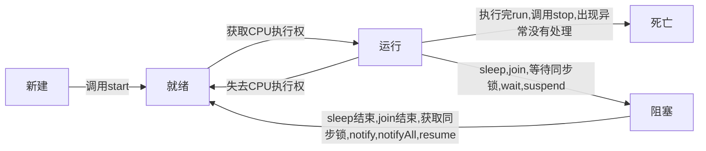
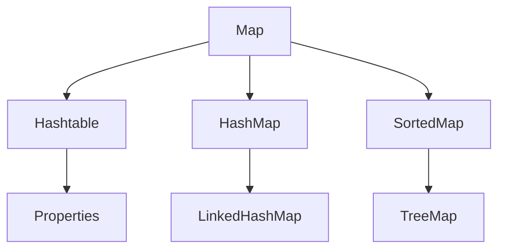
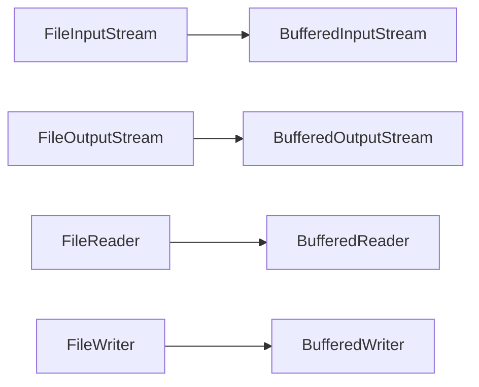

# java高级

[TOC]

## 1. 多线程

### 1.1 基本概念

1. 程序`program`：是为完成特定任务、用某种语言编写的一组指令的集合。即指一段静态的代码，静态对象

2. 进程`process`：是程序的一次执行过程，或是正在运行的一个程序。是一个动态的过程：有它自身的产生、存在和消亡的过程。---生命周期，进程作为资源分配的单位，系统在运行时会为每个进程分配不同的内存区域。

3. 线程`thread`：进程可进一步细化为线程，是一个程序内部的一条执行路径

   - 若一个进城同一时间并行执行多个线程，就是支持多线程的

   - 线程作为调度和执行的单位，每个线程拥有独立的运行栈和程序计数器(pc),线程切换的开销比较小
   - 一个进程中的多个线程共享相同的内存单元/内存地址空间->它们从同一堆中分配对象，可以访问相同的变量和对象。这就使得线程间通信更简便、高效。但多个线程操作共享的系统资源就可能会带来安全的隐患

4. 并行与并发

   并行：多个CPU同时执行多个任务

   并发：一个CPU(采用时间片)同时执行多个任务

### 1.2 线程的创建和使用

#### 1.2.1 方式一

1. 创建一个继承于`Thread`类的子类

2. 重写`Thread`类的`run()`，将此线程执行的操作声明在`run()`中

3. 创建`Thread`类的子类的对象

4. 通过此对象调用`start()`：`start`会启动这个线程，调用当前线程的`run()`

   ```java
   public class ThreadTest {
       public static void main(String[] args){
           MyThread t1 = new MyThread();
           t1.start();
           for(int i = 1; i <= 100; i++){
               if(i % 2 != 0) {
                   System.out.printf("MainThread: %d\n", i);
               }
           }
       }
   }
   
   class MyThread extends Thread{
       @Override
       public void run() {
           for(int i = 1; i <= 100; i++){
               if(i % 2 == 0) {
                   System.out.printf("MyThread: %d\n", i);
               }
           }
       }
   }
   ```

   执行结果

   ```java
   MainThread: 1
   MainThread: 3
   MainThread: 5
   MainThread: 7
   MainThread: 9
   MainThread: 11
   MainThread: 13
   MainThread: 15
   MainThread: 17
   MainThread: 19
   MainThread: 21
   MainThread: 23
   MainThread: 25
   MainThread: 27
   MainThread: 29
   MainThread: 31
   MainThread: 33
   MainThread: 35
   MainThread: 37
   MainThread: 39
   MainThread: 41
   MainThread: 43
   MyThread: 2
   MyThread: 4
   MainThread: 45
   MainThread: 47
   MainThread: 49
   MainThread: 51
   MainThread: 53
   MainThread: 55
   MainThread: 57
   MainThread: 59
   MainThread: 61
   MainThread: 63
   MainThread: 65
   MainThread: 67
   MainThread: 69
   MainThread: 71
   MainThread: 73
   MyThread: 6
   MyThread: 8
   MyThread: 10
   MainThread: 75
   MainThread: 77
   MainThread: 79
   MainThread: 81
   MainThread: 83
   MainThread: 85
   MainThread: 87
   MainThread: 89
   MainThread: 91
   MainThread: 93
   MainThread: 95
   MainThread: 97
   MainThread: 99
   MyThread: 12
   MyThread: 14
   MyThread: 16
   MyThread: 18
   MyThread: 20
   MyThread: 22
   MyThread: 24
   MyThread: 26
   MyThread: 28
   MyThread: 30
   MyThread: 32
   MyThread: 34
   MyThread: 36
   MyThread: 38
   MyThread: 40
   MyThread: 42
   MyThread: 44
   MyThread: 46
   MyThread: 48
   MyThread: 50
   MyThread: 52
   MyThread: 54
   MyThread: 56
   MyThread: 58
   MyThread: 60
   MyThread: 62
   MyThread: 64
   MyThread: 66
   MyThread: 68
   MyThread: 70
   MyThread: 72
   MyThread: 74
   MyThread: 76
   MyThread: 78
   MyThread: 80
   MyThread: 82
   MyThread: 84
   MyThread: 86
   MyThread: 88
   MyThread: 90
   MyThread: 92
   MyThread: 94
   MyThread: 96
   MyThread: 98
   MyThread: 100
   ```

5. `start()`一个对象只能调用一次

6. `Thread`中常用的方法

   ```java
   start() 启动当前线程，调用当前线程的run()
   run() 通常需要重写Thread类中的方法，将创建的线程要执行的操作声明在此方法中
   currentThread() 静态方法，返回当前代码执行的线程
   getName() 获取当前线程的名字
   setName() 设置当前线程的名字
   yield() 释放当前CPU的所有权
   join() 在线程A中调用线程B的join(),此时的线程A进入阻塞状态，直到线程B执行完毕
   sleep(long millis) 阻塞当前线程millis毫秒
   isAlive() 判断当前线程是否存活
   ```

#### 1.2.2 方式二

1. 创建一个实现了Runnable接口的类

2. 实现run方法

3. 创建实现类的对象

4. 将此对象作为参数传递到Thread类的构造器中，创建Thread类的对象

5. 通过Thread类的对象调用start()方法

   ```java
   public class ThreadTest2 {
       public static void main(String[] args) {
           MThread mThread = new MThread();
           Thread t1 = new Thread(mThread);
           t1.setName("线程1");
           t1.start();
   
           // 启动第二个线程
           Thread t2 = new Thread(mThread);
           t2.setName("线程二");
           t2.start();
       }
   }
   class MThread implements Runnable{
       @Override
       public void run() {
           for(int i = 1; i < 100; i++){
               if(i % 2 == 0) {
                   System.out.println(Thread.currentThread().getName() + ": " + i);
               }
           }
       }
   }
   ```

6. 比较创建线程的两种方式

   开发中优先使用Runnable接口的方式

   实现的方式没有类的单继承性的局限性

   实现的方式更适合来处理多个线程有共享数据的情况

#### 1.2.3 方式三

**实现Callable接口与使用`Runnable`相比，`Callable`功能更强大些**

1. 相比`run()`方法，可以有返回值
2. 方法可以抛出异常
3. 支持泛型的返回值
4. 需要借助`Future Task`类，比如获取返回结果

**`Future`接口**

1. 可以对具体`Runnable`、`Callable`任务的执行结果进行取消、查询是否完成、获取结果等。
2. `FutureTask`是`Futrue`接口的唯一实现类
3. `FutureTask`同时实现了`Runnable`、`Future`接口。它既可以作为`Runnable`被线程执行，又可以作为`future`得到`Callable`的返回值。

```java
import java.util.concurrent.Callable;
import java.util.concurrent.ExecutionException;
import java.util.concurrent.FutureTask;

public class ThreadNew {
    public static void main(String[] args) {
        // 创建Callable接口实现类的对象
        NumThread numThread = new NumThread();

        // 将此CallAble接口实现类的对象作为传递到FutureTask(numThread);
        FutureTask futureTask = new FutureTask(numThread);

        // 将FutureTask的对象作为参数传递到Thread传递到Thread类的构造器中，创建Thread对象，并调用start
        new Thread(futureTask).start();
        try {
            // get()返回值即为FutureTask构造器参数Callable实现类中重写的call方法的返回值
            Object num = futureTask.get();
            System.out.println("总和为：" + num);
        } catch (InterruptedException e) {
            e.printStackTrace();
        } catch (ExecutionException e) {
            e.printStackTrace();
        }
    }
}

class NumThread implements Callable{
    public Object call() throws Exception {
        int sum = 0;
        for(int i = 1; i <= 100; i++) {
            if(i % 2 == 0) {
                System.out.println(i);
                sum += i;
            }
        }
        return sum;
    }
}
```

**Callable与Runnable接口对比**

1. `call()`可以有返回值
2. `call()`可以抛出异常，被外面的操作捕获，获取异常信息
3. `Callable`可以支持实现泛型

#### 1.2.4 方式四

线程池：提前创建好多个线程，放入线程池中，使用时直接获取，使用完后放回池中。可以避免频繁创建销毁、实现重复利用。

**线程池API**

`JDK5.0`起提供了线程池相关API`ExecutorService`和`Executors`

- `ExecutorService`：真正的线程池接口。常见子类`ThreadPoolExecutor`
- `void execute(Runnable command)`：执行任务/命令，没有返回值，一般用来执行`Runnable`
- `<E> Future<E> submit(Callable<T> task)`：执行任务，有返回值，一般用来执行`Callable`
- `void shutdown()`：关闭连接池

`Executors`：工具类、线程池的工厂类，用于创建并返回不同类型的线程池

- `Executors.newCachedThreadPool()`：创建一个可根据需要创建新线程的线程池
- `Executors.newFixedThreadPool(n)`：创建一个可重用固定线程数的线程池
- `Executors.newSingleThreadExector()`：创建一个只有一个线程的线程池
- `Executors.newScheduledPool(n)`：创建一个线程池，它可安排在给定延迟后运行命令或者定期地执行

线程管理

```java
corePoolSize：核心池的大小
maximumPoolSize：最大线程数
keepAliveTime：线程没有任务时最多保持的时间
```

```java
import java.util.concurrent.ExecutorService;
import java.util.concurrent.Executors;

public class ThreadPool {
    public static void main(String[] args) {
        // 创建一个大小为10的线程池
        ExecutorService service = Executors.newFixedThreadPool(10);

        service.execute(new NumberThread()); // 适合适用于Runnable
//        service.submit();  // 适合适用于Callable

        // 关闭线程池
        service.shutdown();
    }
}

class NumberThread implements Runnable{
    @Override
    public void run() {
        for(int i = 0; i <= 10; i++){
            if(i % 2 == 0) {
                System.out.println(Thread.currentThread().getName() + i);
            }
        }
    }
}
```


#### 1.2.5 线程的调度

**调度策略**

- 时间片
- 抢占式：高优先级的线程抢占CPU

**java的调度方法**

- 同优先级线程组成先进先出(先到先服务)，使用时间片策略
- 对高优先级，使用优先调度的抢占式策略

**线程的优先级**

1. 线程的优先级等级

   ```java
   MAX_PRIORITY: 10
   MIN_PRIORITY: 1
   NORM_PRIORITY: 5 // 默认优先级
   ```

2. 涉及的方法

   ```
   // 返回线程的优先级
   getPriority();
   
   // 改变线程的优先级
   setPriority(int new Priority);
   ```

3. 说明

   线程创建时继承父线程的优先级

   低优先级只是获得调度的概率低，并非一定是在高优先级线程之后才被调用

### 1.3 线程的生命周期

 `JDK`中用`Thread.State`类定义了线程的几种状态，要想实现多线程，必须在主线程中创建新的线程对象。`Java`语言使用`Thread`类及其子类的对象来表示线程，在它的一个完整的生命周期中通常要经历如下的五种状态

- 新建：当一个`Thread`类或其子类的对象被声明并创建时，新生的线程对象处于新建状态
- 就绪：处于新建状态的线程被`start()`后，将进入线程队列等待CPU时间片，此时它已具备了运行的条件，只是没有分配到CPU资源
- 当就绪的线程被调度并获得CPU资源时，便进入运行状态，run()方法定义了线程的操作和功能
- 阻塞：在某种特殊情况下，被人为挂起或执行输入输出操作时，让出CPU并临时中止自己的执行，进入阻塞状态
- 死亡：线程完成了它的全部工作或线程被提前强制性地中止或出现异常导致结束



### 1.4 线程同步

多线程的问题：多个线程执行的不确定性引起执行结果的不稳定。多个线程对于数据的共享，会造成操作的不完整性，会破坏数据。

#### 1.4.1 方式一：同步代码块

```java
synchronized (同步监视器){
	// 需要被同步的代码 
}
```

- 操作共享数据的代码，即为需要被同步的代码

- 共享数据：多个线程共同操作的变量

- 同步监视器：锁，任何一个类的对象都可以充当锁,多个线程必须要共用同一把锁

  ```java
  public class WindowTest {
      public static void main(String[] args) {
          Window window = new Window();
  
          Thread t1 = new Thread(window);
          t1.setName("线程一：");
          Thread t2 = new Thread(window);
          t2.setName("线程二：");
          Thread t3 = new Thread(window);
          t3.setName("线程三：");
  
          t1.start();
          t2.start();
          t3.start();
      }
  }
  class Window implements Runnable{
      private int ticket = 100;
      private Object obj = new Object();
      @Override
      public void run() {
          while(true){
              synchronized (obj){
                  if(ticket > 0) {
                      System.out.println(Thread.currentThread().getName() + "：已出售：" + ticket);
                      ticket--;
                  } else {
                      break;
                  }
              }
  
          }
      }
  }
  ```

- 同步的方式，解决了线程安全问题

- 在实现`Runnable`接口创建的多线程方式中，可以使用`this`充当同步监视器

- 在继承`Thread`类创建多线程的方式中，可以考虑使用当前类充当同步监视器

#### 1.4.2 方式二：同步方法

   如果操作共享数据的代码完整的声明在一个方法中，可以考虑将此方法声明同步的

`Runnable`

```java
class Window implements Runnable{
    private int ticket = 100;
    @Override
    public void run(){
        while(true) {
            show();
        }
    }

    private synchronized void show() {
        if(ticket > 0) {
            try {
                Thread.sleep(10);
            } catch (InterruptedException e) {
                e.printStackTrace();
            }
            System.out.println(Thread.currentThread().getName() + "：已出售：" + ticket);
            ticket--;
        }
    }
}
```

`Thread`

```java
class Window extends Thread{
    private static int ticket = 100;
    @Override
    public void run(){
        while(true) {
            show();
        }
    }
	
    // 必须保证同步的方法是静态的
    private static synchronized void show() {
        if(ticket > 0) {
            System.out.println(Thread.currentThread().getName() + "：已出售：" + ticket);
            ticket--;
        }
    }
}
```

同步方法仍然涉及到同步监视器，只是不需要我们显示的声明

非静态的同步方法的同步监视器：`this`，静态的同步方法的同步监视器：当前类本身

#### 1.4.3 死锁

1. 死锁的理解：不同的线程分别占用对方需要的同步资源不放弃，都在等待对方放弃自己需要的同步资源，就形成了线程的死锁

2. 出现死锁后，不会出现异常，不会出现提示，只是所有的线程都处于阻塞状态，无法继续

3. 使用同步时要避免出现死锁

   ```java
   public class ThreadTest {
       public static void main(String[] args) {
           StringBuffer s1 = new StringBuffer();
           StringBuffer s2 = new StringBuffer();
   
           new Thread(){
               @Override
               public void run() {
                   synchronized (s1){
                       s1.append("a");
                       s2.append("1");
   
                       try {
                           Thread.sleep(100);
                       } catch (InterruptedException e) {
                           e.printStackTrace();
                       }
   
                       synchronized (s2) {
                           s1.append("b");
                           s2.append("2");
   
                           System.out.println(s1);
                           System.out.println(s2);
                       }
                   }
               }
           }.start();
   
           new Thread(new Runnable() {
               @Override
               public void run() {
                   synchronized (s2){
                       s1.append("3");
                       s2.append("c");
   
                       try {
                           Thread.sleep(100);
                       } catch (InterruptedException e) {
                           e.printStackTrace();
                       }
   
                       synchronized (s1) {
                           s1.append("d");
                           s2.append("4");
   
                           System.out.println(s1);
                           System.out.println(s2);
                       }
                   }
               }
           }).start();
       }
   }
   ```

#### 1.4.4 方式三：Lock(锁)

1. 从`JDK5.0`之后，`java`提供了更强大的线程同步机制——通过显示定义同步锁对象来实现同步。同步锁使用`Lock`对象充当

2. `java.util.concurrent.locks.Lock`接口是控制多个线程对共享资源进行访问的工具。锁提供了对共享资源的独占访问，每次只能有一个线程对`Lock`对象加锁，线程开始访问共享资源之前应先获得`Lock`对象

3. `ReentrantLock`类实现了`Lock`，它拥有与`synchronized`相同的并发性和内存语义，在实现线程安全的控制中，比较常用的`ReentrantLock`，可以显示加锁、释放锁

   ```java
   import java.util.concurrent.locks.ReentrantLock;
   public class LockTest {
       public static void main(String[] args) {
           Window wi = new Window();
   
           Thread t1 = new Thread(wi);
           Thread t2 = new Thread(wi);
           Thread t3 = new Thread(wi);
   
           t1.start();
           t2.start();
           t3.start();
       }
   }
   class Window implements Runnable{
       private int ticket = 100;
       private ReentrantLock lock = new ReentrantLock();
       @Override
       public void run() {
           while (true) {
              try{
                  // 调用lock上锁
                  lock.lock();
                  if (ticket > 0) {
                      try {
                          Thread.sleep(10);
                      } catch (InterruptedException e) {
                          e.printStackTrace();
                      }
                      System.out.println(Thread.currentThread().getName() + ": " + ticket);
                      ticket--;
                  } else {
                      break;
                  }
              } finally {
                  // 解锁
                  lock.unlock();
              }
           }
       }
   }
   ```

4. `synchronized`与`Lock`的对比

   - `Lock`是显式锁(手动开启和关闭锁)，`synchronized`是隐式锁，出了作用域自动释放

   - `Lock`只有代码块锁，`synchronized`有代码块锁和方法锁

   - 使用`Lock`锁，`JVM`将花费较少的时间来调整线程，性能更好。并且具有更好的扩展性

### 1.5 线程通信

#### 1.5.1 涉及到的三个方法

- `wait() `：当前线程就进入阻塞状态，并释放同步监视器
- `notify()`：就会唤醒被`wait`的一个线程，如果有多个线程被`wait`，唤醒优先级高的线程
- `notifyAll`：唤醒所有被`wait`的线程
- 三个方法必须使用在同步代码块或同步方法中
- 三个方法的调用者必须是同步代码块或同步方法中的同步监视器，否则，会出现`IllgealMonitorStateException`异常
- 三个方法都定义在`Object`中

#### 1.5.2 线程通信的例子

使用两个线程打印 1-100 线程1 线程2 交替打印

```java
public class CommunicationTest {
    public static void main(String[] args) {
        Number number = new Number();
        Thread t1 = new Thread(number);
        Thread t2 = new Thread(number);

        t1.setName("线程1");
        t2.setName("线程2");

        t1.start();
        t2.start();
    }
}
class Number implements Runnable{
    private int number = 1;

    @Override
    public void run() {
        while (true) {
            synchronized (this) {

                // 唤醒其他线程
                notify();

                try {
                    Thread.sleep(10);
                } catch (InterruptedException e) {
                    e.printStackTrace();
                }

                if(number < 100) {
                    System.out.println(Thread.currentThread().getName() + ": " + number);
                    number++;
                } else{
                    break;
                }

                try {
                    // 使得调用如下wait()方法的线程进入阻塞状态
                    wait();
                } catch (InterruptedException e) {
                    e.printStackTrace();
                }
            }
        }
    }
}
```

#### 1.5.3 sleep和wait的异同

1. 相同点：一旦执行方法，都可以使得当前的线程进入阻塞状态

2. 不同点：

   两个方法声明的位置不同：`Thread`类中声明`sleep()`，`Object`类中生命`wait()`。

   调用的要求不同：`sleep()`可以在任何需要的场景下调用，`wait()`必须使用在同步代码块中。

   关于是否释放同步监视器：如果两个方法都使用在同步代码块或同步方法中，`sleep`不会释放同步监视器

## 2. JAVA常用类

### 2.1 字符串相关类

#### 2.1.1 String类

- `String`类代表字符串。`java`程序中的所有字符串字面值(如`abc`)都作为此类的实例出现

- `String`是一个`final`类，代表**不可变**的字符序列

- 字符串是常量，用双引号引起来表示。它们的值在创建之后不能更改

- `String`对象的字符内容是存储在一个字符数组`value[]`中的

- `String`实现了`Serializable`接口：表示字符串是支持序列化的；实现了`Comparable`接口，可比较大小

- 通过字面量的方式(区别于new)给一个字符串赋值，此时的字符串声明在字符串常量池中。常量池中不会维护两个相同的字符串常量

  ```java
  public static void main(String[] args) {
  	String str1 = "abc";
      String str2 = "abc";
      System.out.println(str1 == str2); // true
      str2 = "hello";
      System.out.println(str1 == str2); // false
  }
  ```
  

**String对象的创建**

对于`new`的字符串声明在堆中，堆中的变量引用常量池中的字符串，普通字面量赋值声明在常量池中

```java
public static void test2(){
    String str1 = "hello";
    String str2 = new String("hello");
    System.out.println(str1 == str2); // false
}
```

**String不同的拼接方式**

常量与常量的拼接结果在常量池中。且常量池中不会存在相同内容的常量

```java
public static void test3(){
    String s1 = "hello";
    String s2 = "world";

    String s3 = "helloworld";
    String s4 = "hello" + "world";
    String s5 = s1 + "world";
    String s6 = "hello" + s2;
    String s7 = s1 + s2;

    System.out.println(s3 == s4); // true
    System.out.println(s3 == s5); // false
    System.out.println(s3 == s6); // false
    System.out.println(s3 == s7); // false
    System.out.println(s5 == s6); // false
    System.out.println(s5 == s7); // false
    System.out.println(s6 == s7); // false
}
```


返回值得到的s8使用常量池中已经存在的"helloworld"

```java
String s8 = s5.intern();
System.out.println(s3 == s8); //true
```

**String常用方法**

- 返回字符串长度`int length()`

  ```java
  public static void main(String[] args){
  	String str = "Hello ";
      String str2 = "world";
      String str3 = "hello ";
  	System.out.println(str.length()); // 6
  }
  ```

- 返回指定索引处的字符`char charAt(int index)`

  ```java
  System.out.println(str.charAt(1)); // e
  ```

- 判断是否是空字符串`boolean isEmpty()`

  ```java
  System.out.println(str.isEmpty()); // false
  ```

- 使用默认语言环境，将`String`中的所有字符转换为小写`String toLowerCase()`

  ```java
  System.out.println(str.toLowerCase()); // hello
  ```

- 使用默认语言环境，将`String`中所有的字符转换为大写`String toUpperCase()`

  ```java
  System.out.println(str.toUpperCase()); // HELLO
  ```

- 返回字符串的副本，忽略前导空白和尾部空白`String trim()`

  ```java
  System.out.println(str.trim()); // hello
  ```

- 比较字符串的内容是否相同`boolean equals(Object obj)`

  ```java
  System.out.println(str.equals(str2)); // false
  ```

- 与`equals`方法类似，忽略大小写`boolean equalsIgnoreCase(String anotherString)`

  ```java
  System.out.println(str.equalsIgnoreCase(str3)); // true
  ```

- 将指定字符连接到此字符串的结尾。等价于"+"`String concat(String str)`

  ```java
  System.out.println(str.concat(str2)); // Hello world
  ```

- 比较两个字符串的大小`int compareTo(String anotherString)`

  ```java
  System.out.println(str.compareTo(str2)); // -47
  ```

- 返回一个新的字符串，它是此字符串从`beginIndex`开始截取的子串`String substring(int beginIndex)`

  ```java
  System.out.println(str.substring(2)); // llo 
  ```

- 返回一个新的字符串，它是此字符串从`beginIndex`开始到`endIndex`(不包括)结束`String substring(int beginIndex, int endIndex)`

  ```java
  System.out.println(str.substring(1, 3)); // el
  ```

- 判断此字符串是不是以指定字符串结束`boolean endsWith(String suffix)`

  ```java
  System.out.println(str.endsWith(" ")); // true
  ```

- 判断此字符串是不是以指定字符串开始`boolean startsWith(String prefix)`

  ```java
  System.out.println(str.startsWith("He")); // true
  ```
  
- 判断字符串是否包含另外一个字符串`boolean contains(String str)`

  ```java
  System.out.println(str.startsWith("He")); // true
  ```

**String和其它结构的转换**

1. 与包装类的转换

   `String` --> 基本数据类型，包装类：调用`parseXxx(str)`

   ```java
   @Test
   public void test1() {
       String str = "123";
       int num = Integer.parseInt(str);
       System.out.println(num);
   }
   ```

   基本数据类型 --> `String`

   ```java
   @Test
   public void test2(){
       // 基本数据类型转String
       int num = 123;
       String str1 = String.valueOf(num);
       String str2 = num + "";
   
       System.out.println(str1);
       System.out.println(str2);
   }                                                                
   ```

2. 与`char[]`之间的转换

   `String` --> `char[]`

   ```java
   @Test
   public void test3(){
       String str1 = "abc123";
       char[] charArray = str1.toCharArray();
       for(int i = 0; i < charArray.length; i++){
       System.out.print(charArray[i]);
       }
   }
   ```

   `char[]` --> `String`

   ```java
   @Test
   public void test4(){
       char[] charArray = {'1', 'a', 'c'};
       String str = new String(charArray);
       System.out.println(str);
   }
   ```

3. 与`byte[]`之间的转换

   `String` --> `byte[]`

   ```java
   @Test
   public void test5(){
       String str = "abc123";
       byte[] bytes = str.getBytes();
       System.out.println(Arrays.toString(bytes));
   }
   ```

   `byte[]` --> `String`

   ```java
   @Test
   public void test6(){
       byte[] bytes = {97, 98, 99, 49, 50, 51};
       String str = new String(bytes);
       System.out.println(str);
   }
   ```

#### 2.1.2 StringBuffer 和 StringBuilder

**三者的异同**

1. `StringBuffer`与`StringBuilder`都是可变的字符序列，`String`是不可变的字符序列
2. `StringBuffer`是线程安全的：效率低
3. `StringBuilder`：线程不安全，效率高
4. 底层都是使用`char[]`存储
5. `StringBuffer`和`StringBuilder`默认容量为`16`，对于扩容，会扩容为原来容量的`2倍加2`

**常用方法StringBuffer和StringBuilder相同**

```java
public static void main(String[] args) {
	StringBuffer str = new StringBuffer();
}
```

- 字符串的拼接`StringBuffer append(xxx)`

  ```java
  str.append("a");
  str.append(1);
  System.out.println(str); // Helloa1
  ```

- 删除指定位置的内容`StringBuffer delete(int start, int end)`

  ```java
  str.delete(4, 5);
  System.out.println(str); // Hell
  ```

- 替换字符串`StringBuffer replace(int start, int end, String str)`

  ```java
  str.replace(2, 4, "qwe");
  System.out.println(str); // heqweo
  ```

- 在指定位置插入`StringBuffer insert(int offset, xxx)`

  ```java
  str.insert(1, 123);
  System.out.println(str); // H123ello
  ```

- 反转当前字符序列`StringBuffer reverse()`

  ```java
  str.reverse();
  System.out.println(str); // olleH
  ```

- 设置某索引位置的字符`void setCharAt(int n, char ch)`

  ```java
  str.setCharAt(2, 't');
  System.out.println(str); // Hetlo
  ```

### 2.2 日期和时间

#### 2.2.1 JDK8之前

1. `java.lang.System`类

   `System`类提供的`public static long currentTimeMillis()`用来返回当前时间与`1970年1月1日0时0分0秒`之间的毫秒时间差(时间戳)

   ```java
   @Test
   public void test(){
       long time = System.currentTimeMillis();
       System.out.println(time); // 1604722875525
   }
   ```

2. `Date`类

   `java.util.Date`类

   ```java
   @Test
   public void test(){
       Date date = new Date();
       System.out.println(date); // Sat Nov 07 12:26:19 CST 2020
       System.out.println(date.getTime()); // 1604723179115 时间戳
   }
   ```

   自己构造时间对象

   ```java
   @Test
   public void test(){
       Date date = new Date(1604723179115L);
       System.out.println(date); // Sat Nov 07 12:26:19 CST 2020
   }@Test
   public void test7(){
       Calendar calendar = Calendar.getInstance();
       int day = calendar.get(Calendar.DAY_OF_MONTH);
       System.out.println("这个月的第 " + day + " 天"); // 这个月的第 7 天
   
       calendar.set(Calendar.DAY_OF_MONTH, 22);
       day = calendar.get(Calendar.DAY_OF_MONTH);
       System.out.println("今天更改为 " + day + " 天"); // 今天更改为 22 天
   
       calendar.add(Calendar.DAY_OF_MONTH, 3); // 可以为负
       day = calendar.get(Calendar.DAY_OF_MONTH);
       System.out.println("今天加 " + day + " 天"); // 今天加 25 天
   
       Date date = calendar.getTime(); // 获取时间对象
       System.out.println(date); // Wed Nov 25 16:07:04 CST 2020
   
       Date date1 = new Date();
       calendar.setTime(date1);
   }
   ```

   `java.sql.Date`类是`java.util.Date`的子类，对应数据库中的日期

   ```java
    @Test
    public void test(){
        java.sql.Date date = new java.sql.Date(1604723409503L);
        System.out.println(date); // 2020-11-07
    }
   ```

   `util.Date` --> `sql.Date`

   ```java
   @Test
   public void test(){
       java.util.Date date = new java.util.Date();
       java.sql.Date date2 = new java.sql.Date(date.getTime());   
   }
   ```

3. `java.text.SimpleDateFormat`类

   使用默认的构造器，即使用默认的时间格式

   ```java
   @Test
   public void test(){
       SimpleDateFormat sdf = new SimpleDateFormat();
   
       // 格式化
       Date date = new Date();
       String format = sdf.format(date);
       System.out.println(format); // 11/7/20, 3:21 PM
       
       // 解析
       String str = "11/7/20, 3:21 PM";
       try {
           Date date1 = sdf.parse(str);
           System.out.println(date1); // Sat Nov 07 15:21:00 CST 2020
       } catch (ParseException e) {
           e.printStackTrace();
       }
   }
   ```

   使用自定义的时间格式

   ```java
   @Test
   public void test(){
       SimpleDateFormat sdf = new SimpleDateFormat("yyyy-MM-dd hh:mm:ss");
       
       // 格式化
       String format = sdf.format(new Date());
       System.out.println(format); // 2020-11-07 03:29:49
       
       // 解析
       try {
           Date date = sdf.parse("2020-11-07 03:29:49");
           System.out.println(date); // Sat Nov 07 03:29:49 CST 2020
       } catch (ParseException e) {
           e.printStackTrace();
       }
   }
   ```

4. `java.util.Calendar`日历类

   `Calendar`是一个抽象基类，主要用于完成日期字段之间的相互操作的功能

   获取`Calendar`实例的方法：使用`Calendar.getInstance()`方法，调用它的子类`GregorianCalendar`的构造器

   ```java
   @Test
   public void test7(){
       Calendar calendar = Calendar.getInstance();
       int day = calendar.get(Calendar.DAY_OF_MONTH);
       System.out.println("这个月的第 " + day + " 天"); // 这个月的第 7 天
   
       calendar.set(Calendar.DAY_OF_MONTH, 22);
       day = calendar.get(Calendar.DAY_OF_MONTH);
       System.out.println("今天更改为 " + day + " 天"); // 今天更改为 22 天
   
       calendar.add(Calendar.DAY_OF_MONTH, 3); // 可以为负
       day = calendar.get(Calendar.DAY_OF_MONTH);
       System.out.println("今天加 " + day + " 天"); // 今天加 25 天
   
       Date date = calendar.getTime(); // 获取时间对象
       System.out.println(date); // Wed Nov 25 16:07:04 CST 2020
   
       Date date1 = new Date();
       calendar.setTime(date1); // 重新设置日期
   }
   ```

#### 2.2.2 JDK8的日期时间

- `java.time`：包含值对象的基础包
- `java.time.chrono`：提供对不同的日历系统的访问
- `java.time.format`：格式化和解析时间和日期
- `java.time.temporal`：包括底层框架和扩展特性
- `java.time.zone`：包含时区支持的类

对于绝大多数的开发者来说通常只能用到`java.time`和`java.time.format`

1. `LocalDate`、 `LocalTime`、 `LocalDateTime`

   ```java
   @Test
   public void test1(){
       LocalDate localDate = LocalDate.now();
       LocalTime localTime = LocalTime.now();
       LocalDateTime localDateTime = LocalDateTime.now();
   
       System.out.println(localDate); // 2020-11-07
       System.out.println(localTime); // 16:27:27.916185
       System.out.println(localDateTime); // 2020-11-07T16:27:27.916208
   }
   ```

   **`of() `设置指定的年，月，日，时，分，秒。没有偏移量**

   ```java
   LocalDateTime localDateTime = LocalDateTime.of(2020, 11, 7, 16, 30);
   System.out.println(localDateTime); // 2020-11-07T16:30
   ```

   **getXxx 获取年，月，日，时，分，秒**

   ```java
   LocalDateTime localDateTime = LocalDateTime.now();
   System.out.println(localDateTime.getDayOfMonth()); // 7
   
   System.out.println(localDateTime1.getMonth()); // NOVEMBER
   System.out.println(localDateTime1.getMonthValue()); // 11
   ```

   **withXxx设置日期时间**

   ```java
   LocalDateTime localDateTime = LocalDateTime.now();
   LocalDateTime localDateTime1 = localDateTime.withDayOfMonth(22);
   System.out.println(localDateTime1); // 2020-11-22T16:30
   ```

   **plusXxx添加指定的日期时间, minusXxx减去指定的时间日期**

   ```java
   LocalDateTime localDateTime = LocalDateTime.now();
   System.out.println(localDateTime); // 2020-11-07T16:44:09.883564
   LocalDateTime localDateTime1 =  localDateTime.plusDays(3);
   System.out.println(localDateTime1); // 2020-11-10T16:44:09.883564
   ```

2. 瞬时 `instant`

   `instant`：时间线上的一个瞬时点。这可能被用来记录应用程序中的时间时间戳

   ```java
   @Test
   public void test(){
       Instant instant = Instant.now(); // 获取的是本初子午线的时间
       System.out.println(instant); // 2020-11-07T08:50:44.950285Z
       
       OffsetDateTime offsetDateTime = instant.atOffset(ZoneOffset.ofHours(8));
       System.out.println(offsetDateTime); // 2020-11-07T16:54:37.527700+08:00 东八区时间
       
       // 获取对应的时间戳
       long l = instant.toEpochMilli();
       System.out.println(l); // 1604739444190
       
       // 解析
       Instant instant1 = Instant.ofEpochMilli(1604739444190L);
       System.out.println(instant1); // 2020-11-07T08:57:24.190Z
   }
   ```

3. `java.time.format.DateTimeFormatter`类，用来格式化或解析日期、时间，类似于`SimpleDateFormat`

   预定义的标准格式：`ISO_LOCAL_DATE_TIME`，`ISO_LOCAL_DATE`，`ISO_LOCAL_TIME`

   预定义方式

   ```java
   @Test
   public void test(){
       DateTimeFormatter formatter = DateTimeFormatter.ISO_LOCAL_DATE_TIME;
       // 格式化
       LocalDateTime localDateTime = LocalDateTime.now();
       String str = formatter.format(localDateTime);
       System.out.println(localDateTime); // 2020-11-07T19:33:55.475751
       System.out.println(str); // 2020-11-07T19:33:55.475751
       
       // 解析
       TemporalAccessor parse = formatter.parse("2020-11-07T19:33:55.475751");
       System.out.println(parse); // {},ISO resolved to 2020-11-07T19:33:55.475751
   }
   ```

   本地方式`ofLocalizedDateTime()/ofLocalizedDate`，`FormatStyle.LONG/FormatStyle.MEDIUM/FormatStyle.SHORT`：适用于`LocalDateTime`

   ```java
   @Test
   public void test(){
       // 本地化相关的格式
       LocalDateTime localDateTime = LocalDateTime.now();
       DateTimeFormatter formatter = DateTimeFormatter.ofLocalizedDateTime(FormatStyle.SHORT);
       String str = formatter.format(localDateTime);
       System.out.println(str); // 11/7/20, 7:52 PM
   }
   ```

   自定义方式`ofPattern("yyyy-MM-dd hh:mm:ss")`

   ```java
   @Test
   public void test(){
       // 自定义相关的格式
       LocalDateTime localDateTime = LocalDateTime.now();
       DateTimeFormatter formatter = DateTimeFormatter.ofPattern("yyyy-MM-dd hh:mm:ss");
       String str = formatter.format(localDateTime);
       System.out.println(str); // 2020-11-07 08:03:00
       
       // 解析
       TemporalAccessor date =  formatter.parse("2020-11-07 08:03:00");
       System.out.println(date);
       // {NanoOfSecond=0, SecondOfMinute=0, MilliOfSecond=0, HourOfAmPm=8, MinuteOfHour=3, MicroOfSecond=0},ISO resolved to 2020-11-07
   }
   ```

4. 其它API

   - `Zoneld`：该类中包含了所有的时区信息，一个时区的`ID`，如`Europe/Paris`
- `ZonedDateTime`：一个在`ISO-8601`日历系统时区的日期时间，如`2007-12-03T10:15:30+01:00 Europe/Pairs`其中每个时区都对应着`ID`，地区`ID`都为{区域}/{城市}的格式 `Asia/Shanghai`
   - `Clock`：使用时区提供对当前即时、日期和时间的访问时钟
- 持续时间：`Duration`，用于计算两个"时间"间隔
   - 日期间隔：`Period`，用于计算两个"日期"间隔
- `TemporalAdjuster`：时间校正器。有时我们可能需要获取例如：将日期调整到"下一个工作日"等操作
   - `TemporalAdjusters`：该类通过静态方法`firstDayOfXxx()/lastDayOfXxx/nextXxx()`提供了大量的常用`TemporalAdjuster`的实现

### 2.3 java比较器

`java`实现对象排序的方式有两种：自然排序`java.lang.Comparable`，定制排序`java.util.Comparator`

#### 2.3.1 Comparable的使用

1. 像`String`、包装类等实现了`Comparable`接口，重写了`compareTo`方法，给出了比较两个对象大小的方式

2. `String`、包装类重写了`compareTo()`方法以后，进行了从小到大的排序

3. 重写`compareTo()`的规则

   如果当前对象`this`大于形参对象`obj`，则返回正整数

   如果当前对象`this`小于形参对象`obj`，则返回负整数

   如果当前对象`this`等于形参对象`obj`，则返回零

4. 对于自定义的类，如果需要排序，我们可以让自定义类实现`Comparable`接口，重写`compareTo(obj)`方法在`compareTo(obj)`方法中指名如何排序

   ```java
   package compare;
   
   import org.junit.Test;
   
   import java.util.Arrays;
   public class CompareTest {
       @Test
       public void test(){
           Goods[] arr = new Goods[4];
           arr[0] = new Goods("小米", 99.9);
           arr[1] = new Goods("雷蛇", 299.9);
           arr[2] = new Goods("HP", 19.9);
           arr[3] = new Goods("戴尔", 199.9);
           Arrays.sort(arr);
           System.out.println(Arrays.toString(arr));
           // [Goods{name='HP', price=19.9}, Goods{name='小米', price=99.9}, Goods{name='戴尔', price=199.9}, Goods{name='雷蛇', price=299.9}]
       }
   
   }
   
   class Goods implements Comparable{
       private String name;
       private double price;
       public Goods(String name, double price){
           this.name = name;
           this.price = price;
       }
       @Override
       public String toString() {
           return "Goods{" +
                   "name='" + name + '\'' +
                   ", price=" + price +
                   '}';
       }
   
       @Override
   	public int compareTo(Object o) {
           if (o instanceof Goods) {
               Goods goods = (Goods)o;
               return (int)(this.price - goods.price);
           }
           throw new ClassCastException("类型错误");
       }
   }
   ```

#### 2.3.2 定制排序 Comparator

1. 当元素的类型没有实现`java.lang.Comparable`接口而又不方便修改代码，或者实现了`java.lang.Comaprable`接口的顺序不适合当前的操作，那么可以考虑使用`Comparator`的对象来排序，强行对多个对象进行整体排序的比较

2. 重写`compare(Object o1, Object o2)`方法，比较`o1`和`o2`的大小：如果方法返回正整数，则表示`o1`大于`o2`；如果返回0，表示相等；返回负整数，表示`o1`小于`o2`

3. 可以将`Comparator`传递给`sort`方法(如`Collections.sort`)或`Arrays.sort`，从而允许在排序顺序上事项精确控制

4. 还可以使用`Comparator`来控制某些数据结构(如有序`set`或有序映射)的顺序，或者为那些没有自然顺序的对象`collection`提供排序

   ```java
   @Test
   public void test(){
   String[] arr = new String[]{"AA", "BB", "PP", "GG", "CC"};
       Arrays.sort(arr, new Comparator<String>() {
           @Override
           public int compare(String o1, String o2) {
               return -o1.compareTo(o2);
           }
       });
       System.out.println(Arrays.toString(arr));
       // [PP, GG, CC, BB, AA]
   }
   ```

### 2.4 System类

1. `System`类代表系统类，系统级的很多属性和控制方法都放置在该类的内部该类位于`java.lang`包

2. 由于该类的构造器是`private`的，所以无法创建该类的对象，也就是无法实现化该类。其内部成员变量和成员方法都是`static`的，所以也可以很方便的进行调用

3. 成员变量：`System`类内部包含`in`、`out`、`err`三个成员变量，分别代表标准输入流`键盘输入`，标准输出流`显示器`和标准错误输出流`显示器`

4. 成员方法：

   `native long currentTimeMillis()`：返回当前的计算机时间，时间的表达格式为当前计算机时间和`GMT`时间(格林威治时间)`1970年1月1日0时0分0秒`所差的毫秒数

   `void exit(int status)`：该方法的作用是退出程序。其中`status`的值为`0`代表正常退出，非零代表异常退出。使用该方法可以在图形界面编程中实现程序的退出功能

   `void gc()`：该方法的作用是请求系统进行垃圾回收，至于系统是否立刻回收，则取决于系统中垃圾回收算法的实现以及系统执行时的情况

   `String getProperty(String key)`：该方法的作用是获得系统中属性名为`key`的属性对应的值。系统中常见的属性名及属性的作用如下

   | 属性名       | 属性说明           |
   | ------------ | ------------------ |
   | java.version | java运行时环境版本 |
   | java.home    | java安装目录       |
   | os.name      | 操作系统的名称     |
   | os.version   | 操作系统的版本     |
   | user.name    | 用户的账户名称     |
   | user.home    | 用户的主目录       |
   | user.dir     | 用户当前的工作目录 |

### 2.5 Math

1. `java.lang.Math`提供了一系列静态方法用于科学计算。其方法的参数和返回值类型一般为`double`型
2. `abs`：绝对值
3. `acos, asin, atan, cos, sin, tan`：三角函数
4. `sqrt`：平方根
5. `pow(double a, double b)`：a的b次幂
6. `log`：自然对数
7. `exp`：e为底指数
8. `max(double a, double b)`：最大值
9. `min(double a, double b)`：最小值
10. `random`：返回0.0到1.0的随机数
11. `long round(double a)`：`double`型数据a转换为`long`型(四舍五入)
12. `toDegrees(double angrad)`：弧度 --> 角度
13. `toRadians(double angdeg)`：角度 --> 弧度

### 2.6 BigInteger与BigDecimal

**Biginteger**

1. `Integer`类作为`int`的包转类，能存储的最大整数为`2^31-1`，`Long`类也是有限的，最大为`2^63-1`。如果要表示再大的整数，不管是基本数据类型还是他们的包装类都无能为力，更不用说进行计算了
2. `java.math`包的`BigInteger`可以表示不可变的任意精度的整数。`BigInteger`提供所有`java`的基本数据整数操作符的对应武，并提供`java.lang.Math`的所有相关方法。另外，`BigInteger`还提供以下运算：模算术、GCD计算、质数测试、素数生成、位操作以及一些其它操作
3. 构造器：`BigInteger(String val)`：根据字符串构建`BigInteger`对象

**Bigdecimal**与**BigInteger**相似主要用于处理浮点型的数据

## 3. 枚举类&注解

### 3.1 枚举类

- 类的对象只有有限个，确定的。
- 如果需要定义一组常量时，强烈建议使用枚举类
- 如果枚举类中只有一个对象，则可以作为单例模式的实现方式

#### 3.1.1 定义枚举类jdk5.0之前

```java
package enumtest;

public class SeasonTest {
    public static void main(String[] args) {
        Season spring = Season.SPRING;
        System.out.println(spring); // Season{seasonName='春天', seasonDesc='春暖花开'}
    }
}
// 自定义枚举类
class Season{
    // 1. 声明Season对象的属性
    private final String seasonName;
    private final String seasonDesc;

    // 2. 私有化的类的构造器
    private Season(String seasonName, String seasonDesc){
        this.seasonName = seasonName;
        this.seasonDesc = seasonDesc;
    }

    // 3. 提供当前枚举类的多个对象
    public static final Season SPRING = new Season("春天", "春暖花开");
    public static final Season SUMMER = new Season("夏天", "夏日炎炎");
    public static final Season AUTUMN = new Season("秋天", "秋高气爽");
    public static final Season WINTER = new Season("冬天", "寒风刺骨");

    // 4. 获取属性
    public String getSeasonDesc() {
        return seasonDesc;
    }

    public String getSeasonName() {
        return seasonName;
    }

    // 5. toString()
    @Override
    public String toString() {
        return "Season{" +
                "seasonName='" + seasonName + '\'' +
                ", seasonDesc='" + seasonDesc + '\'' +
                '}';
    }
}
```

#### 3.1.2 定义枚举类jdk5.0之后

`enum`类默认继承于`java.lang.Enum`

```java
package enumtest;

public class SeasonTest {
    public static void main(String[] args) {
        Season spring = Season.SPRING;
        System.out.println(spring); // SPRING
    }
}
enum Season {

    // 1. 提供当前枚举类的多个对象, 多个对象之间用逗号隔开末尾用分号隔开
    SPRING("春天", "春暖花开"),
    SUMMER("夏天", "夏日炎炎"),
    AUTUMN("秋天", "秋高气爽"),
    WINTER("冬天", "寒风刺骨");

    // 2. 声明Season对象的属性
    private final String seasonName;
    private final String seasonDesc;

    // 3. 私有化的类的构造器
    private Season(String seasonName, String seasonDesc){
        this.seasonName = seasonName;
        this.seasonDesc = seasonDesc;
    }

    // 4. 获取属性
    public String getSeasonDesc() {
        return seasonDesc;
    }
    public String getSeasonName() {
        return seasonName;
    }
}
```

枚举类实现接口，正常情况下，直接实现即可，如果想让每一个枚举类对象实现不同的功能，那每一个枚举类都需要实现接口

```java
interface Info{
    void show();
}

enum Season implements Info{

    SPRING("春天", "春暖花开"){
        @Override
        public void show() {
            System.out.println("我是春天");
        }
    },
    SUMMER("夏天", "夏日炎炎"){
        @Override
        public void show() {
            System.out.println("我是夏天");
        }
    },
    AUTUMN("秋天", "秋高气爽"){
        @Override
        public void show() {
            System.out.println("我是秋天");
        }
    },
    WINTER("冬天", "寒风刺骨"){
        @Override
        public void show() {
            System.out.println("我是冬天");
        }
    };

    private final String seasonName;
    private final String seasonDesc;

    private Season(String seasonName, String seasonDesc){
        this.seasonName = seasonName;
        this.seasonDesc = seasonDesc;
    }
}
```

#### 3.1.3 Enum类的主要方法

- `values()`：返回枚举类型的对象数组。该方法可以用来遍历所有的枚举值

  ```java
  for(int i = 0; i < spring.values().length; i++){
  	System.out.printf("%s ", spring.values()[i]);
  	// SPRING SUMMER AUTUMN WINTER SPRING
  }
  ```

- `valueOf(String str)`：把一个字符串转为对应的枚举类对象。要求字符串必须是枚举类对象的"名字",否则`IllegalArgumentException`

  ```java
  Season summer = Season.valueOf("SUMMER");
  System.out.println(summer); // SUMMER
  ```

- `toString()`：返回当前枚举类对象常量的名称

  ```java
  System.out.println(spring.toString()); // SPRING
  ```

### 3.2 注解Annotation

- 从`JDK5.0`开始，`java`增加了对元数据`MetaData`的支持，也就是`Annotation(注解)`
- `Annotation`其实就是代码里的特殊标记，这些标记可以在编译，类加载，运行时被读取，并执行相应的处理。通过使用`Annotation`，程序员可以在不改变原有逻辑的情况下，在源文件中嵌入一些补充信息。代码分析工具、开发工具和部署工具可以通过这些补充信息进行验证或者进行部署
- `Annotation`可以像修饰符一样被使用，可用于修饰包、类、构造器、方法、成员变量、参数、局部变量的声明，这些信息诶保存在`Annotation`的`name=value`中
- `JPA`是基于注解的，`Spring2.5`以上都是基于注解的，`Hibernate3.x`以后也是基于注解的，`Struts2`有一部分也是基于注解趋势：`框架 = 注解 + 反射 + 设计模式`

#### 3.2.1 文档注解

`@author`标明开发该类模块的作者

`@version`标明该类模块的版本

`@see`参考转向，也就是相关主题

`@since`从那个版本开始增加的

`@param`对方法中参数的说明，没有参数不写。可并列多个

`@return`对方法返回值的说明，如果方法的返回值类型是`void`不写

`@exception`对方法可能抛出的异常进行说明，如果方法没有用`throws`显示抛出的异常就不能写其中，可并列多个

#### 3.2.2 编译时的格式检查

- `@Override`限定重写父类方法，该注解只能用于方法

  ```java
  class Person{
      private String name;
      private int age;
  
      @Override
      public String toString() {
          return "Person{" +
                  "name='" + name + '\'' +
                  ", age=" + age +
                  '}';
      }
  }
  ```

- `@Deprecated`用于表示所修饰的元素(类、方法等) --> "已过时"。通常是因为所修饰的结构危险或存在更好的选择

- `@SuppressWarnings`抑制编译器警告

#### 3.2.3 跟踪代码的依赖性，实现替代配置文件功能

`Servlet3.0`提供的注解,使得不需要在`web.xml`文件中进行`servlet`的部署

#### 3.2.4 自定义注解

- 定义新的`Annotation`类型使用`@interface`关键字

  ```java
  public @interface MyAnnotation {
  }
  ```

- 自定义注解自动继承了`java.lang.annotation.Annotation`接口

- `Annotation`的成员变量在`Annotation`定义中以无参数方法的形式声明。其中方法名和返回值定义了该成员的名字和类型。称为配置参数。类型只能是八中基本数据类型、`String`、`Class`、`enum`、`Annotation`以上所有类型的数组

  ```java
  public @interface MyAnnotation {
      String value();
  }
  ```

- 可以定义`Annotation`的成员变量中为其指定初始值，指定成员变量的初始值可使用`default`关键字

  ```java
  public @interface MyAnnotation {
      String value() default "hello";
  }
  ```

- 如果只有一个参数成员，建议使用参数名为`value`

- 如果定义的注解含有配置参数，那么使用时必须指定参数值，除非它有默认值。格式是"参数名=参数值"，如果只有一个参数成员，且名称为`value`，可以省略`value=`

  ```java
  @MyAnnotation
  class Person{
      private String name;
      private int age;
  }
  ```

- 没有成员定义的`Annotation`称为标记，包含成员变量的`Annotation`称为元数据`Annotation`

#### 3.2.5 元注解

元`Annotation`用于修饰其它`Annotation`定义，即对现有的注解进行修饰

1. `Retention`：指定所修饰的`Annotation`的声明周期：`SORCE`、`CLASS(默认行为)`、`RUNTIME`

   ```java
   @Retention(RetentionPolicy.RUNTIME)
   public @interface MyAnnotation {
       String value() default "hello";
   }
   ```

2. `Target`：指名注解能够修饰的结构

   ```java
   @Target({ElementType.TYPE, ElementType.FIELD})
   public @interface MyAnnotation {
       String value() default "hello";
   }
   ```

3. `Documented`：用于指定被该元`Annotation`修饰的`Annotation`类将被`javadoc`工具提取成文档。默认情况下，`javadoc`不包括注解：定义为`Documented`的注解必须设置`Retention`值为`RUNTIME`

   ```java
   @Retention(RetentionPolicy.RUNTIME)
   @Documented
   public @interface MyAnnotation {
       String value() default "hello";
   }
   ```

4. `Inherited`：被它修饰的`Annotation`将具有继承性。如果某个类使用了被`Inherited`修饰的`Annotation`则其子类将自动具有该注解

   ```java
   @Inherited
   public @interface MyAnnotation {
       String value() default "hello";
   }
   ```

#### 3.2.6 通过反射获取注解信息

```java
import org.junit.Test;
import java.lang.annotation.Annotation;

public class AnnotationTest {
    @Test
    public void test(){
        Class<Student> studentClass = Student.class;
        Annotation[] annotations = studentClass.getAnnotations();
        for(int i = 0; i < annotations.length; i++){
            System.out.println(annotations[i]); // MyAnnotation(value="hello")
        }
    }
}
@MyAnnotation
class Person{

}
class Student extends Person{

}
```

#### 3.2.7 JDK8注解新特性

可重复注解

```java
import java.lang.annotation.ElementType;
import java.lang.annotation.Retention;
import java.lang.annotation.RetentionPolicy;
import java.lang.annotation.Target;

@Retention(RetentionPolicy.RUNTIME)
@Target({ElementType.TYPE, ElementType.FIELD})
public @interface MyAnnotations {
    MyAnnotation[] value();
}
```


```java
import java.lang.annotation.*;

@Retention(RetentionPolicy.RUNTIME)
@Target({ElementType.TYPE, ElementType.FIELD})
@Repeatable(MyAnnotations.class)
public @interface MyAnnotation {
    String value() default "hello";
}
```


```java
@MyAnnotation(value = "hello")
@MyAnnotation(value = "world")
class Person{

}
```

#### 3.2.8 类型注解

`ElementType.TYPE_PARAMETER`：表示该注解能写在类型变量的声明语句中

```java
import java.lang.annotation.*;

@Retention(RetentionPolicy.RUNTIME)
@Target({ElementType.TYPE_PARAMETER})
@Repeatable(MyAnnotations.class)
public @interface MyAnnotation {
    String value() default "hello";
}
```

```java
class Animal<@MyAnnotation T> {
    
}
```

`ElementType.TYPE_USE`：表示该注解能写在使用类型的任何语句中

```java
import java.lang.annotation.*;

@Retention(RetentionPolicy.RUNTIME)
@Target({ElementType.TYPE_USE})
@Repeatable(MyAnnotations.class)
public @interface MyAnnotation {
    String value() default "hello";
}
```

```java
@Test
public void test(){
    ArrayList<@MyAnnotation String> list = new ArrayList<>();
    int num = (@MyAnnotation int)10L;
}
```

## 4. java 集合

### 4.1 集合框架的概述

集合，数组都是对多个数据进行存储操作的结构，简称`java`容器

`java`集合可以分为`Collection`和`Map`两种体系

- `Collection`接口：单列数据，定义了存储一组对象的方法的集合

  `List接口`：元素有序、可重复的集合。实现类：`ArrayList`、`LinkedList`、`Vector`

  `Set接口`：元素无序、不可重复的集合。实现类：`HashSet`、`LinkedHashSet`、`TreeSet`

- `Map接口`：双列集合，保存具有映射关系`key-value`对的集合。实现类：`HashMap`、`LinkedHashMap`、`TreeMap`、`Hashtable`、`Properties`

### 4.2 Collection接口

#### 4.2.1 Collection常用方法

创建`Collection`

```java
@Test
public void test(){
    Collection<Object> coll = new ArrayList<>();
}
```

- 添加元素`add(Object obj)`

  ```java
  coll.add("AA");
  coll.add(123);
  coll.add(LocalDateTime.now());
  ```

- 添加一个`Collection`对象

  ```
  coll.add(Collection coll);
  ```

- 获取集合的大小`int size()`

  ```java
  System.out.println(coll.size()); // 4
  ```

- 打印`toString()`

  ```java
  System.out.println(coll);
  // [AA, BB, 123, 2020-11-08T14:53:34.321726]
  ```

- 判断当前集合是否为空`boolean isEmpty()`

  ```java
  System.out.println(coll.isEmpty()); // false
  ```

- 清空集合元素`void clear()`

  ```java
  coll.clear();
  System.out.println(coll); // []
  ```

- 判断当前集合中是否包含obj `boolean contains(Object obj)`，`boolean containsAll(Collection coll)`判断`coll`所有的元素是否在当前对象中

  ```java
  coll.add(123);
  System.out.println(coll.contains(123)); // true
  // 如果是引用数据类型默认调用equals方法
  ```

- 移出某个元素`boolean remove(Object obj)`，返回是否移出成功。`removeAll(Collection coll)`，移出`coll`中的所有元素 --> 差集

- `retainAll(Object obj)`求并集

- `equals(Object obj)`判断两个集合是否相同

- 计算集合的哈希值

  ```java
  System.out.println(coll.hashCode()); // 493567911
  ```

- 集合转换为数组

  ```java
  Object[] arr = coll.toArray();
  for(int i = 0; i < arr.length; i++){
  	System.out.print(arr[i] + " "); 
      // AA BB 123 2020-11-08T18:51:30.305080
  }
  ```

- 数组转换为集合

  ```java
  List<String> list =  Arrays.asList(new String[]{"QQ", "UU", "中国"});
  ```

#### 4.2.2 迭代器

- `Iterator`对象称为迭代器(设计模式的一种)，主要用于遍历`Collection`集合中的元素。

- `GOF`给迭代器模式的定义为：提供一种方法访问一个容器`container`对象中各个元素，而又不暴露该对象的内部细节

- `Collection`接口继承了`java.lang.Iterable`接口，改接口有一个`iterator()`方法，那么所有实现了`Collection`接口的集合类都有一个`iterator()`方法，用以返回一个实现了`iterator`接口的对象

- `iterator`仅用于遍历集合，`iterator`本身并不提供承装对象的能力，如果需要创建`iterator`对象，则必须有一个被迭代的集合

- 集合对象每次调用`iterator()`方法都得到一个全新的迭代器对象，默认游标都在集合的第一个对象之前

- `hasNext()`判断是否还有下一个元素，`next()`获取下一个元素，`remove()`移出当前元素

  ```java
  package collection;
  
  import org.junit.Test;
  
  import java.util.ArrayList;
  import java.util.Collection;
  import java.util.Iterator;
  
  public class IteratorTest {
      @Test
      public void test(){
          Collection<Object> coll = new ArrayList<>();
          coll.add("qwer");
          coll.add(123);
          coll.add(false);
  
          Iterator iterator = coll.iterator();
          while(iterator.hasNext()) {
              System.out.println(iterator.next());
              	// qwer
  				// 123
  				// false
          }
      }
  }
  ```

#### 4.2.3 foreach

- `java5.0`提供了`foreach`循环迭代访问`Collection`和数组

- 遍历操作不需获取`Collection`或数组的长度，无需使用索引访问元素

- 遍历集合的底层调用`iterator`完成操作

  ```java
  @Test
  public void test(){
  	Collection<Object> coll = new ArrayList<>();
      coll.add(123);
      coll.add("ggghh");
      coll.add(LocalDateTime.now());
  
      for(Object value: coll) {
      	System.out.println(value);
      }
  }
  ```

#### 4.2.4 子接口List

**List概述**

- 鉴于`java`中数组用来存储数据的局限性，我们通常使用`List`替代数组

- `List`有三个实现类 `ArrayList`，`LinkedList`、`vector`

  `ArrayList`：是`List`的主要实现类，线程不安全，底层使用`Object`数组存储

  `vector`：线程安全，层使用`Object`数组存储，不推荐使用

  `LinkedList`：底层使用双向链表实现

**List接口方法**

```java
@Test
public void test(){
    ArrayList<Object> list = new ArrayList();
    list.add(123);
    list.add("ert");
}
```

- `void add(int index, Object ele)`：在`index`位置插入`ele`元素

  ```java
  list.add(1, LocalDateTime.now());
  System.out.println(list);
  // [123, 2020-11-09T12:19:38.689714, ert]
  ```

- `boolean addAll(int index, Collection eles)`：从`index`位置开始将`eles`中的所有元素添加进来

  ```java
  List<Object> tempList = Arrays.asList(1, 2, 3);
  list.addAll(1, tempList);
  System.out.println(list);
  // [123, 1, 2, 3, ert]
  ```

- `E get(int index)`：获取指定`index`位置的元素

  ```java
  System.out.println(list.get(1));
  // ert
  ```

- `int indexOf(Object obj)`：返回`obj`在集合中首次出现的位置，没有则返回`-1`

  ```java
  System.out.println(list.indexOf("ert"));
  // 1
  ```

- `int lastIndexOf(Object obj)`：返回`obj`在当前集合中末次出现的位置

- `E remove(int index)`：移除指定`index`位置的元素，并返回此元素，

  ```java
  list.remove(1);
  System.out.println(list);
  // [123]
  ```

- `E set(int index, Object ele)`：设置指定`index`位置的元素为`ele`

  ```java
  list.set(0, LocalDateTime.now());
  System.out.println(list);
  // [2020-11-09T12:29:57.484097, ert]
  ```

- `list subList(int fromIndex, int toIndex)`：返回从`fromIndex`到`toIndex`位置的子集合

- 自定义的类需要重写`equals()`方法，方便`remove`、`set`等方法的使用

#### 4.2.5 子接口set

- `Set`接口是`Collection`的子接口，`Set`没有提供额外的方法

- `Set`集合不允许包含相同的元素，如果添加两个相同的元素，则添加操作失败

- `Set`判断对象是否不是使用`==`运算符，而是根据`equals()`方法

- 实现类：

  `HashSet`：`Set`接口的主要实现类；线程不安全；

  `LinkedHashSet`是`HashSet`的子类，遍历其内部数据时，可以按照添加的顺序遍历

  `TreeSet`：底层使用红黑树存储，可以按照添加对象的指定属性，进行排序

- `Set`作为`Collection`的子接口，**没有**提供额外的方法

**Set的实现类：HashSet**

- `HashSet`是`Set`接口的典型实现，大多数时候使用`Set`集合时都使用这个实现类。

- `HashSet`按`Hash`算法来存储集合中的元素，因此具有很好的存取、查找、删除性能

- `HashSet`具有以下特点

  不能保证元素的排序顺序

  `HashSet`不是线程安全的

  集合元素可以是`null`

- 无序型：不等于随机性。存储的数据在底层数组中并非按照数组索引的顺序添加，而是是根据数据的哈希值

  ```java
  @Test
  public void test(){
  Set<Object> set = new HashSet<>();
      set.add(456);
      set.add("AA");
      set.add(LocalDateTime.now());
      Iterator iterator = set.iterator();
      while(iterator.hasNext()) {
      System.out.print(iterator.next() + " ");
      }
  }
  // AA 456 2020-11-09T17:25:57.837272
  // AA 2020-11-09T17:33:13.247174 456
  ```

- `HashSet`集合判断两个元素相等的标准：两个对象通过`hashCode`方法比较相等，并且两个对象的`equals()`方法返回值也相等

- 对于存在在`Set`容器中的对象，对应的类一定要重写`equals()`和`hashCode(Object obj)`方法，以实现对象相等规则。即："相等的对象必须具有相等的散列码"

- 添加元素的过程

  调用元素`obj`所在类的`hashCode()`方法，计算元素的哈希值

  此哈希值接着通过某种算法计算出在`HashSet`底层数组中存放的位置，判断数组此位置上是否已经有元素

  如果此位置没有其他元素直接添加`obj`到此位置，

  如果此位置上有元素(或以链表形式存在的多个元素)，则比较元素`obj`(或者遍历链表进行比较)与其他元素的`hash`值，如果`hash`值不相同，则元素`obj`添加成功；如果`hash`值相同，进而调用`obj`所在类的`equlas`方法，如果返回`true`添加成功，否则失败(链表放在表头)

- `hashCode()`重写

  ```java
  @Override
  public int hashCode() {
  	return Objects.hash(name, age);
  }
  ```

**Set的实现类：LinkedHashSet**

遍历其内部数据时，可以按照添加的顺序遍历，对于频繁的遍历操作，效率高于`HashSet`

**Set的实现类：TreeSet**

- 向`TreeSet`中添加的数据，要求是想同类的对象

- `TreeSet`采用红黑树的存储结构

- `TreeSet`中的数据是有序的

  ```java
  @Test
  public void test(){
  TreeSet<Integer> set = new TreeSet<>();
      set.add(99);
      set.add(34);
      set.add(1024);
      set.add(0);
      System.out.print(set + " ");
      // [0, 34, 99, 1024]
  }
  ```

- 对于添加自定义的类需要是可比较的，实现`Comparable`接口。属于自然排序

  ```java
  import org.junit.Test;
  import java.util.TreeSet;
  
  public class TreeSetTest {
      @Test
      public void test(){
          TreeSet<User> set = new TreeSet<>();
          set.add(new User("Tom", 18));
          set.add(new User("Bob", 28));
          set.add(new User("Jack", 18));
          set.add(new User("Alice", 78));
          System.out.println(set);
          // [User{name='Alice', age=78}, User{name='Bob', age=28}, User{name='Jack', age=18}, User{name='Tom', age=18}]
      }
  }
  
  class User implements Comparable{
      private String name;
      private int age;
  
      public User(String name, int age) {
          this.name = name;
          this.age = age;
      }
  
      @Override
      public String toString() {
          return "User{" +
                  "name='" + name + '\'' +
                  ", age=" + age +
                  '}';
      }
  
      @Override
      public int compareTo(Object o) {
          if (o instanceof User) {
              User user = (User)o;
              return this.name.compareTo(user.name);
          }
          throw new ClassCastException("类型不匹配");
      }
  }
  ```

- 定制排序，创建`TreeSet`对象时传入`Comparator`对象

  ```java
  import org.junit.Test;
  
  import java.util.Comparator;
  import java.util.TreeSet;
  
  public class TreeSetTest {
      @Test
      public void test(){
          TreeSet<User> set = new TreeSet<>(new Comparator<User>() {
              @Override
              public int compare(User o1, User o2) {
                  int result = -o1.getName().compareTo(o2.getName());
                  if (result == 0) {
                      result = o1.getAge() - o2.getAge();
                  }
                  return result;
              }
          });
          set.add(new User("Tom", 18));
          set.add(new User("Bob", 28));
          set.add(new User("Jack", 18));
          set.add(new User("Jack", 58));
          set.add(new User("Alice", 78));
          System.out.println(set);
          // [User{name='Tom', age=18}, User{name='Jack', age=18}, User{name='Jack', age=58}, User{name='Bob', age=28}, User{name='Alice', age=78}]
      }
  }
  
  class User{
      private String name;
      private int age;
  
      public User(String name, int age) {
          this.name = name;
          this.age = age;
      }
  
      public int getAge() {
          return age;
      }
  
      public String getName() {
          return name;
      }
  
      @Override
      public String toString() {
          return "User{" +
                  "name='" + name + '\'' +
                  ", age=" + age +
                  '}';
      }
  }
  ```

### 4.3 Map接口

- `Map`:双列数据，存储`key-value`对的数据
- 继承关系



- `HashMap`：是`Map`主要的实现类，线程不安全，可以存储`null`的`key-value`，底层实现数组+链表+红黑树

- `LinkedHashMap`：`HashMap`的子类：保证遍历`map`元素时，可以按照添加的顺序实现遍历，底层双向链表结构

- `TreeMap`：是`Map`有序的实现类，对添加的`key-value`进行排序，实现排序遍历，考虑`key`的自然排序或定制排序,底层使用红黑树实现

- `Hashtable`：线程安全的，不能存储`null`的`key-value`

- `Properties`：`Hashtable`的子类，常用来配置文件。`key`和`value`都是`String`类型

- `Map`结构的理解

  `Map`中的`key`：无序的、不可重复的，使用`Set`存储所有的`key`。即`key`所在的类要重写`equals()`和`hashCode()`方法(`HashMap`为例)

  `Map`中的`value`：无序的、可重复的，使用`Collection`存储所有的`value`。`value`所在的类要重写`equals()`

  一个键值对：`key-value`构成了一个`Entry`对象

  `Map`中的`entry`：无序的、不可重复的，使用`Set`存储所有的`entry`

#### 4.3.1 HashMap的底层

**`JDK7`的实现原理**

```java
HashMap map = new HashMap();
// 实例化后底层创建了长度是16的一维数组Entry[] table
```

**存储过程**

```java
map.put(key1, value1);
```

1. 首先，调用`key1`所在类的`hashCode()`计算`key1`哈希值，此哈希值经过计算后，得到`Entry`数组中存放位置

2. 如果此位置上的数据为空，此时的`key-value`添加成功

3. 如果此位置上的数据不为空，则比较`key`和已经存在的一个或多个数据的哈希值

   如果`key`的哈希值与已经存在的数据的哈希值都不相同，此时的`key-value`添加成功

   如果`key`的哈希值和已经存在的某一个数据的哈希值相同，继续比较`equals()`方法：`equals()`返回`false`，添加成功；否则使用`value`替换原来的`value`

4. 多个`value`存在相同的位置，是以链表的形式进行存储

5. 在不断的添加过程中，当大小超过其临界值且要存放的位置非空，会扩容为原来容量的2倍。

**JDK8相较于JDK7的不同之处**

- `new HashMap()`：底层并没有创建数组

- 首次调用`put(key, value)`方法时，底层才会创建长度为`16`的数组

- `JDK8`底层的数组的名称为`Node[]`

- `JDK7`底层结构只有：数组+链表，`JDK8`中：数组+链表+红黑树

  当数组的某一个索引位置上的元素以链表形式存在的数据个数`>8`且当前数组的长度`>64`时，此时此索引位置上的所有数据改为使用红黑树存储

**HashMap底层常量**

- `DEFAULT_INITIAL_CAPACITY`：`HashMap`的默认容量`16`
- `DEFAULT_LOAD_FACTOR`：`HashMap`的默认加载因子
- `threshold`：扩容的临界值 = 容量 * 加载因子
- `TREEIFY_THRESHOLD`：`Bucket`中链表长度大于该默认值，转换为红黑树
- `MIN_TREEIFY_CAPACITY`：数组中`Node`被树化时最小的`hash`表容量：`64`

#### 4.3.2 Map常用方法

```java
@Test
public void test(){
    Map<Object, Object> map = new HashMap<>();
}
```

**添加、删除、操作**

- `Object put(Object key, Object value)`：将指定`key-value`添加到(或修改)当前`map`对象中

  ```java
  map.put(123, "AA"); // 添加
  map.put("BB", 456);
  map.put(123, "CC"); // 修改
  System.out.println(map); // {BB=456, 123=CC}
  ```

- `void putAll(Map m)`：将m中的所有`key-value`存放到当前`map`中

- `Object remove(Object key)`：移出指定`key`的`key-value`返回`value`

  ```java
  map.put("移除", 123);
  System.out.println(map); // {移除=123}
  System.out.println(map.remove("移除")); // 123 不存在返回null
  System.out.println(map); // {}
  ```

- `void clear()`：清空`map`

**元素查询**

- `Object get(Object key)`：获取指定`key`对应的`value`

  ```java
  map.put(123, "Hello World");
  System.out.println(map.get(123)); // Hello World // 没有返回null
  ```

- `boolean containsKey(Object key)`：是否包含指定的`key`

  ```java
  map.put(123, "Hello World");
  System.out.println(map.containsKey(123)); // true
  ```

- `int size()`：返回`map`中`key-value`对的个数

  ```java
  System.out.println(map.size()); // 0
  ```

- `boolean isEmpty()`：判断当前`map`是否为空

  ```java
  System.out.println(map.isEmpty()); // true
  ```

- `boolean equals(Object obj)`：判断当前`map`和参数对象`obj`是否相等

  ```java
  System.out.println(map.equals(map)); // true
  ```

**元视图操作的方法**

- `Set keySet()`：返回所有`key`构成的`Set`集合

  ```java
  @Test
  public void test1(){
      Map<Object, Object> map = new HashMap<>();
  
      map.put(123, "AA");
      map.put("BB", 456);
      map.put("456", 999);
      map.put("NowTime", LocalDateTime.now());
      Set set =  map.keySet();
      Iterator iterator = set.iterator();
      while(iterator.hasNext()){
      	System.out.println(iterator.next());
      }
  }
  // BB
  // 456
  // NowTime
  // 123
  ```

- `Collection values()`：返回所有`values`构成的`Collection`

  ```java
  Collection coll =  map.values();
  Iterator iterator = coll.iterator();
  while(iterator.hasNext()){
  	System.out.println(iterator.next());
  }
  // 456
  // 999
  // 2020-11-10T15:58:45.581643
  // AA
  ```

- `Set entrySet()`：遍历`key-value`

  ```java
  Set entrySet = map.entrySet();
  Iterator iterator = entrySet.iterator();
  while(iterator.hasNext()) {
      Object obj = iterator.next();
      Map.Entry entry = (Map.Entry) obj;
      System.out.println(entry.getKey() + ": " + entry.getValue());
  }
  // BB: 456
  // 456: 999
  // NowTime: 2020-11-10T16:03:08.947608
  // 123: AA
  ```


#### 4.3.1 TreeMap

`TreeMap`中添加的`key-value`，要求必须是由同一个类创建的对象，涉及到`key`排序，遍历`TreeMap`会按照添加的顺序

自然排序

```java
import org.junit.Test;

import java.util.HashMap;
import java.util.Iterator;
import java.util.Map;
import java.util.Set;

public class TreeMapTest {
    @Test
    public void test(){
        Map<User, Integer> map = new TreeMap<>()
        map.put(new User("Tom", 23), 98);
        map.put(new User("Bob", 15), 100);
        map.put(new User("Jack", 34), 90);
        map.put(new User("Alice", 22), 91);

        Set entrySet = map.entrySet();
        Iterator iterator = entrySet.iterator();
        while(iterator.hasNext()){
            Map.Entry entry = (Map.Entry)iterator.next();
            System.out.println(entry.getKey() + ": " + entry.getValue());
        }
    }
}
class User implements Comparable{
    String name;
    int age;
    public User(String name, int age) {
        this.name = name;
        this.age = age;
    }
    @Override
    public int compareTo(Object o) {
        if (o instanceof User) {
            User user = (User) o;
            int result = this.name.compareTo(user.name);
            if (result == 0) {
                result = this.age - user.age;
            }
            return  result;
        }
        throw new ClassCastException("类型转换错误");
    }

    @Override
    public String toString() {
        return "User{" +
                "name='" + name + '\'' +
                ", age=" + age +
                '}';
    }
}
// User{name='Alice', age=22}: 91
// User{name='Bob', age=15}: 100
// User{name='Jack', age=34}: 90
// User{name='Tom', age=23}: 98
```

**定制排序**

```java
import org.junit.Test;

import java.util.*;

public class TreeMapTest {
    @Test
    public void test(){
        Map<User, Integer> map = new TreeMap<>(new Comparator<User>() {

            @Override
            public int compare(User o1, User o2) {
                int result = o1.name.compareTo(o2.name);
                if (result == 0) {
                    result = o1.age - o2.age;
                }
                return  -result;
            }
        });
        map.put(new User("Tom", 23), 98);
        map.put(new User("Bob", 15), 100);
        map.put(new User("Jack", 34), 90);
        map.put(new User("Alice", 22), 91);

        Set entrySet = map.entrySet();
        Iterator iterator = entrySet.iterator();
        while(iterator.hasNext()){
            Map.Entry entry = (Map.Entry)iterator.next();
            System.out.println(entry.getKey() + ": " + entry.getValue());
        }
    }
}
class User{
    String name;
    int age;
    public User(String name, int age) {
        this.name = name;
        this.age = age;
    }

    @Override
    public String toString() {
        return "User{" +
                "name='" + name + '\'' +
                ", age=" + age +
                '}';
    }
}
// User{name='Tom', age=23}: 98
// User{name='Jack', age=34}: 90
// User{name='Bob', age=15}: 100
// User{name='Alice', age=22}: 91
```

#### 4.3.2 Properties

- `Properties`类是`Hashtable`的子类，该对象用于处理属性文件

- 由于属性文件里的`key`、`value`都是字符串类型，所以`Properties`里的`key`和`value`都是**字符串**类型

- 存取数据时，建议使用`setProperty(String key, String value)`方法和`getProperty(String key)`方法

- 具体用法

  在项目根目录下创建`jdbc.properties`

  ```java
  name=Tom
  password=123456
  ```

  使用`Properties`类

  ```java
  import org.junit.Test;
  
  import java.io.FileInputStream;
  import java.io.IOException;
  import java.util.Properties;
  
  public class PropertiesTest {
      @Test
      public void test(){
          FileInputStream fis = null;
          try{
              Properties pros = new Properties();
              fis = new FileInputStream("jdbc.properties");
              pros.load(fis); // 加载流对应的文件
  
              // 获取对应的属性
              String name = pros.getProperty("name");
              String password = pros.getProperty("password");
  
              System.out.println("name: " + name + "\npassword: " + password);
          } catch (IOException e){
              e.printStackTrace();
          } finally {
              // 关闭流
              if (fis != null) {
                  try {
                      fis.close();
                  } catch (IOException e) {
                      e.printStackTrace();
                  }
              }
          }
      }
  }
  
  // name: Tom
  // password: 123456
  ```

### 4.4 Collections工具类

- `Collections`是一个操作`Set`、`List`、`Map`等集合的工具类
- `Collections`中提供了一系列静态的方法对元素进行排序、查询和修改等操作，还提供了对集合对象设置不可变、对集合对象实现同步控制等方法

#### 4.4.1 常用方法

```java
@Test
public void test(){
    List<Integer> list = new LinkedList<>();
    list.add(123);
    list.add(456);
    list.add(0);
    list.add(23);
    list.add(100);
    System.out.println(list);
    // [123, 456, 0, 23, 100]
}
```

- `reverse(List)`反转`List`中元素的排序

  ```java
  Collections.reverse(list);
  System.out.println(list);
  // [100, 23, 0, 456, 123]
  ```

- `shuffle(List)`对`List`中元素进行随机排序

  ```java
  Collections.shuffle(list);
  System.out.println(list);
  // [23, 100, 123, 0, 456]
  ```

- `sort(List, Comparator)`：根据指定的`Comparator`产生的顺序对`List`集合元素进行排序

  ```java
  Collections.sort(list);
  System.out.println(list);
  // [0, 23, 100, 123, 456]
  
  Collections.sort(list, new Comparator<Integer>() {
  	@Override
  	public int compare(Integer o1, Integer o2) {
  		return o2 - o1;
  	}
  });
  System.out.println(list);
  // [456, 123, 100, 23, 0]
  ```

- `swap(List, int i, int j)`：将指定`List`集合中的`i`处元素和`j`处元素进行交换

  ```java
  Collections.swap(list, 0, 1);
  System.out.println(list);
  // [456, 123, 0, 23, 100]
  ```

- `int frequency(List list, Objec o)`：返回`o`出现的次数

  ```java
  System.out.println(Collections.frequency(list, 0));
  // 1
  ```

- `void copy(List dest, List src)`：拷贝`List`到另一个`List`中

  ```java
  // 目的List要保证大小和src相同
  List<Integer> dest = Arrays.asList(new Integer[list.size()]);
  Collections.copy(dest, list);
  System.out.println(dest);
  // [123, 456, 0, 23, 100]
  ```

#### 4.4.2 同步控制

`Collections`类中提供了多个`synchronizedXxx`的方法，该方法可使指定集合包装成线程同步的集合，从而可以解决多线程并发访问集合时的线程安全问题

```java
List syncList = Collections.synchronizedList(list);
```

## 5. 泛型

### 5.1 泛型概述

所谓泛型，就是允许在定义类、接口时通过一个标识表示类中某个属性的类型或者是某个方法的返回值及参数类型。这个类型参数将在使用时(继承或实现这个接口，用这个类型声明变量、创建对象时)确定(即出入实际的类型参数，也称为类型实参)

泛型类，实例化时没有指明类的泛型，则默认泛型类型为`Object`类型

```java
@Test
public void test(){
    Map<String, Integer> map = new HashMap<>();
    map.put("Tom", 87);
    map.put("Jerry", 87);
    map.put("Jack", 67);

    // 泛型的嵌套
    Set<Map.Entry<String, Integer>> entry = map.entrySet();
    Iterator<Map.Entry<String, Integer>> iterator = entry.iterator();
    while(iterator.hasNext()) {
        Map.Entry<String, Integer> e = iterator.next();
        System.out.println(e.getKey() + ": " + e.getValue());
    }
}
// Tom: 87
// Jerry: 87
// Jack: 67
```

### 5.2 自定义泛型结构

```java
public class Order<E> {
    private String orderName;
    private int orderId;
    private E orderE;

    public Order(){}
    public Order(String orderName, int orderId, E orderE) {
        this.orderName = orderName;
        this.orderId = orderId;
        this.orderE = orderE;
    }

    public E getOrderE(){
        return orderE;
    }

    @Override
    public String toString() {
        return "Order{" +
                "orderName='" + orderName + '\'' +
                ", orderId=" + orderId +
                ", orderE=" + orderE +
                '}';
    }
}
```

对于子类继承带泛型的父类时，指明了泛型类型。则实例化子类对象时，不再需要指明泛型

```java
public class subClass extends Order<Integer> {
    
}
```

如果不指明泛型类型，则实例化时需要指明泛型,泛型继承不具有子父类关系

```java
class subClass<E> extends Order<E> {
    
}
```

泛型类可能有多个参数，此时应该将多个参数一起放在尖括号里

```java
<E1, E2, E3>
```

泛型不同的引用不能相互赋值

```java
ArrayList<String> list1 = new ArrayList<>();
ArrayList<Integer> list2 = new ArrayList<>();
// 不能相互赋值
```

如果泛型结构是一个接口或者抽象类，则不可创建泛型类的对象

在类/接口上声明的泛型，在本类或本接口中即代表某种类型，可以作为非静态属性的类型、非静态方法的参数类型、非静态方法的返回值类型。但在静态方法中不能使用类的泛型

异常类不能是泛型的

对于泛型数组

```java
E[] arr = (E[])new Object[capacity];
```

泛型方法：与方法所在类是不是泛型没有关系，泛型方法可以声明为`static`

```java
public static <T> List<T> example(T element){
	
}
```

### 5.3 通配符

#### 5.3.1 通配符的基本使用

- 通配符`?`

  ```java
  @Test
  public void test1() {
      List<Object> list1 = null;
      List<String> list2 = null;
  
      List<?> list = null;
      list = list1;
      list = list2;
  }
  ```

- 遍历

  ```java
  public void print(List<?> list) {
      Iterator<?> iterator = list.iterator();
      while(iterator.hasNext()) {
      	System.out.println(iterator.next());
      }
  }
  ```

- 如果使用了通配符，则不能向`List<?>`中添加(写入)除`null`以外的数据,但是可以读取数据，获取的数据类型为`Object`

#### 5.3.2 通配符的限制

类

```java
class Animal{

}

class Dog extends Animal{

}
```

`? extends parent`：小于等于`parent`

`? super parent`：大于等于`parent`

```java
public void test3(){
    List<? extends Animal> list1 = new LinkedList<>();
    List<? super Animal> list2 = new LinkedList<>();

    List<Animal> list3 = new LinkedList<>();
    List<Dog> list4 = new LinkedList<>();
    List<Object> list5 = new LinkedList<>();

    list1 = list3;
    list1 = list4;

    list2 = list3;
    list2 = list5;
}
```

有限制符的修饰可以添加符合限制的元素

## 6. IO流

### 6.1 File类的使用

#### 6.1.1 File类的创建

- `java.io.File`类：文件和文件目录路径的抽象表示形式，与平台无关

- `File`能新建、删除、重命名文件目录，但`File`不能访问文件内容本身。如果需要访问文件内容本身，则需要使用输入/输出流

- 想要在`java`程序中表示一个真实存在的文件或目录，那么必须有一个`File`对象，但`java`程序中的一个`File`对象，可能没有一个真实存在的文件或目录

- `File`对象可以作为参数传递给流的构造器

- 构造器

  以`pathname`为路径创建`File`对象，可以是绝对路径或者相对路径，如果`pathname`是相对路径，则默认的当前路径在系统属性`user.dir`中存储

  ```java
  File file1 = new File("1.txt");
  ```

  以`parent`为父路径，`child`为子路径创建`File`对象

  ```java
  File file2 = new File("/home/valid/code/java/基础语法", "day10");
  ```

  根据一个父`File`对象和子文件路径创建`File`对象

  ```java
  File file3 = new File(file2, "1.txt");
  ```

- 路径分隔符

  ```
  windows: \\
  unix: /
  ```

#### 6.1.2 File类的获取功能

```java
@Test
public void test1(){
    File file = new File("hello.txt");
    File dir = new File("/home/valid/code/java/基础语法/day10/test");
}
```

- `String getAbsoultePath()`：获取绝对路径

  ```java
  System.out.println(file.getAbsolutePath());
  // /home/valid/code/java/基础语法/day10/hello.txt
  ```

- `String getPath()`：获取路径

  ```java
  System.out.println(file.getPath());
  // hello.txt
  ```

- `String getName()`：获取文件或目录名称

  ```java
  System.out.println(file.getName());
  // hello.txt
  ```

- `String getParent()`：获取文件或目录的上一级目录

  ```java
  System.out.println(file.getParent());
  // null 因为当前创建的时候使用的相对路径，所以找不到父目录
  ```

- `long lenght()`：获取文件的大小

  ```java
  System.out.println(file.length());
  // 0
  ```

- `long lastModified()`：获取最后一次修改的时间戳

  ```java
  System.out.println(file.lastModified());
  // 1605080166485
  ```

- `String[] list()`：获取指定目录下的所有文件或者文件目录的名称数组

  ```java
  String[] list = dir.list();
  for(String f : list) {
  	System.out.println(f);
  }
  // 1.txt
  // te
  ```

- `File[] listFiles() `：获取目录下的文件或目录的File对象

  ```java
  File[] listRoute = dir.listFiles();
  for(File f : listRoute) {
  	System.out.println(f);
  }
  // /home/valid/code/java/基础语法/day10/test/1.txt
  // /home/valid/code/java/基础语法/day10/test/te
  ```

#### 6.1.3 File类的重命名

`boolean renameTo(File dest)`：把文件重命名为指定的文件路径，目的文件应该不存在

```java
File dest = new File("world.txt");
System.out.println(file.renameTo(dest));
// true
```

#### 6.1.4 File类的判断功能

- `boolean isDirectory()`：判断是否是文件目录

  ```java
  System.out.println(file.isDirectory()); // false
  System.out.println(dir.isDirectory()); // true
  ```

- `boolean isFile()`：判断是否是文件

  ```java
  System.out.println(file.isFile()); // true
  System.out.println(dir.isFile());  // false
  ```

- `boolean exists()`：判断是否存在

  ```java
  System.out.println(file.exists()); // true
  ```

- `boolean canRead()`：判断是否可读

  ```java
  System.out.println(file.canWrite()); // true
  ```

- `boolean canWrite()`：判断是否可写

  ```java
  System.out.println(file.canWrite()); // true
  ```

- `boolean canExecute()`：判断是否可执行

  ```java
  System.out.println(file.canExecute()); // false
  ```

- `boolean isHidden()`：判断是否隐藏

  ```java
  System.out.println(file.isHidden()); // false
  ```

#### 6.1.5 File类的创建删除功能

- `boolean createNewFile()`：创建文件。若文件存在，则不创建，返回`false`。`boolean delete()`删除文件或文件夹

  ```java
  File file = new File("word.txt");
  if(!file.exists()) {
      try {
      	file.createNewFile();
      	System.out.println("创建成功");
      } catch (IOException e) {
      	e.printStackTrace();
      }
  } else {
  	file.delete();
  	System.out.println("删除成功");
  }
  ```

- `boolean mkdir()`：创建文件目录。如果此文件目录存在，不创建。如果此文件目录的上层目录不存在，也不创建。`boolean mkdirs()`：创建文件目录。如果上层文件目录不存在，一并创建。如果创建文件或者目录没有写盘符`windows下`，默认在项目目录下。即`mkdirs`是递归创建文件目录

  ```
  File dir = new File("/home/valid/code/java/基础语法/day10/tes/practice");
  if(dir.mkdirs()) {
  	System.out.println("创建成功");
  } else {
  	System.out.println("创建失败");
  }
  ```

### 6.2 IO流原理及流的分类

#### 6.2.1 IO原理

- `I/O`是`Input/Output`的缩写，`I/O`技术是非常使用的技术，用于处理设备之间的数据传输。文件读写，网络通信
- `Java`程序中，对于数据的输入输出操作以`流(stream)`的方式进行
- `java.io`包下提供了各种`流`类的和接口，用以获取不同种类的数据，并通过标准的方法输入或输出数据
- 输入`input`：读取外部数据(磁盘、光盘等存储设备的数据)到程序(内存中)
- 输出`output`：将程序`内存`数据输出到磁盘、光盘等存储设备中

#### 6.2.2 流的分类

- 按照操作单位不同分为：字节流`8bit`，字符流`16bit`
- 按数据流的流向不同分为：输入流，输出流
- 按流的角色的不同分为：节点流，处理流
- 所有的流都是以下四个抽象基类的子类

| 抽象基类 | 字节流       | 字符流 |
| -------- | ------------ | ------ |
| 输入流   | InputStream  | Reader |
| 输出流   | OutputStream | Writer |

- 节点流(或者称为文件流)有以下四个

  ```java
  FileInputStream
  FileOutputStream
  FileReader
  FileWriter
  ```


### 6.3 File读入

在当前项目下新建`hello.txt`并输入`helloworld`

1. 实例化`File`类的对象，指明要操作的文件

   ```java
   File file = new File("hello.txt");
   ```

2. 提供具体的流

   ```java
   FileReader fr = new FileReader(file);
   ```

3. 读入数据：`read()`返回读入的一个字符，到文件末尾返回`-1`

   ```java
   int data = fr.read();
   while(data != -1) {
       System.out.print((char) data);
       data = fr.read();
   }
   // helloworld
   ```

4. 关闭流

   ```java
   fr.close();
   ```

5. 流的操作都会有异常，尽量使用`try-catch`处理，因为流一定要被关闭

   ```java
   @Test
   public void test(){
       FileReader fr = null;
       try {
           File file = new File("hello.txt");
       	fr = new FileReader(file);
   
           int data = fr.read();
           while(data != -1) {
               System.out.print((char) data);
               data = fr.read();
           }
       } catch (IOException e) {
       	e.printStackTrace();
       } finally {
           try {
               if (fr != null)
                   fr.close();
           } catch (IOException e) {
               e.printStackTrace();
           }
       }
   }
   ```

**利用`char[]`数组读入**

```java
char[] cbuf = new char[5];
int num = 0;
while((num = fr.read(cbuf)) != -1) {
    for(int i = 0; i < num; i++){
    	System.out.print(cbuf[i]);
        // System.out.print(new String(cbuf, 0, num));
    }
}
```

对于文本文件应当使用字符流来处理

### 6.4 File写出

当前项目根目录新建`hello.txt`空文件

1. 提供File类的对象，指明写出到的文件

   ```java
   File file = new File("hello.txt");
   ```

2. 提供`FileWriter`的对象，用于数据的写出，此时的`file`对象可以不存在，如果不存在则新建。写入默认是覆盖，如果想要追加则指定第二参数为`true`

   ```java
   FileWriter fw = new FileWriter(file);
   // FileWriter fw = new FileWriter(file, true);
   ```

3. 写出的操作

   ```java
   fw.write("Hello Java");
   fw.write(" I want to learn Java");
   ```

4. 流资源的关闭

   ```java
   fw.close();
   ```

5. 异常处理

   ```java
   @Test
   public void test1() {
       FileWriter fw = null;
       File file = new File("hello.txt");
       try {
           fw = new FileWriter(file, true);
   
           fw.write("Hello Java");
           fw.write(" I want to learn Java");
       } catch (IOException e) {
       	e.printStackTrace();
       } finally {
           try {
               if (fw != null)
               	fw.close();
           } catch (IOException e) {
               e.printStackTrace();
           }
       }
   }
   ```

### 6.5 字节流

将当前项目目录下的`fgdjk.jpg`拷贝到当前项目目录下的`test.jpg`

1. 提供`File`类的对象

   ```java
   File src = new File("fgdjk.jpg");
   File dest = new File("test.jpg");
   ```

2. 提供`src`的`FileInputStream`和`dest`的`FileOutputStream`

   ```java
   FileInputStream fisSrc = new FileInputStream(src);
   FileOutputStream fisDest = new FileOutputStream(dest, true);
   ```

3. 读和写

   ```java
   byte[] cbuf = new byte[10];
   int num;
   while((num = fisSrc.read(cbuf)) != -1) {
   	fisDest.write(cbuf, 0, num);
   }
   ```

4. 关闭资源

   ```java
   fisSrc.close();
   fisDest.close();
   ```

5. 异常处理

   ```java
   @Test
   public void test() {
       FileInputStream fisSrc = null;
       FileOutputStream fisDest = null;
       try {
           File src = new File("fgdjk.jpg");
           File dest = new File("test.jpg");
   
           fisSrc = new FileInputStream(src);
           fisDest = new FileOutputStream(dest, true);
   
           byte[] cbuf = new byte[10];
           int num;
           while((num = fisSrc.read(cbuf)) != -1) {
           	fisDest.write(cbuf, 0, num);
           }
       }  catch (IOException e) {
       	e.printStackTrace();
       } finally {
           try {
               if (fisSrc != null)
                   fisSrc.close();
           } catch (IOException e) {
           	e.printStackTrace();
           }
           try {
               if(fisDest != null)
                   fisDest.close();
           } catch (IOException e) {
           	e.printStackTrace();
           }
       }
   }
   ```

对于非文本文件，应当使用字节流处理

### 6.6 缓冲流

缓冲流是对于节点流的包装



1. 获取文件对象

   ```java
   File srcFile = new File("fgdjk.jpg");
   File destFile = new File("test.jpg");
   ```

2. 获得节点流

   ```java
   FileInputStream src = new FileInputStream(srcFile);
   FileOutputStream dest = new FileOutputStream(destFile);
   ```

3. 获取缓冲流

   ```java
   BufferedInputStream bis = new BufferedInputStream(src);
   BufferedOutputStream bos = new BufferedOutputStream(dest);
   ```

4. 读取和写入

   ```java
   byte[] buffer = new byte[10];
   int len;
   while((len = bis.read(buffer)) != -1) {
   	bos.write(buffer, 0, len);
   }
   ```

5. 关闭流资源，如果关闭了缓冲流，相应的节点流也会被关闭

   ```java
   bis.close();
   bos.close();
   ```

6. 异常处理

   ```java
   @Test
   public void test() {
       FileInputStream src = null;
       FileOutputStream dest = null;
   
       BufferedInputStream bis = null;
       BufferedOutputStream bos = null;
       try {
           File srcFile = new File("fgdjk.jpg");
           File destFile = new File("test.jpg");
   
           src = new FileInputStream(srcFile);
           dest = new FileOutputStream(destFile);
   
           bis = new BufferedInputStream(src);
           bos = new BufferedOutputStream(dest);
   
           byte[] buffer = new byte[1024];
           int len;
           while((len = bis.read(buffer)) != -1) {
           bos.write(buffer, 0, len);
           }
   
       } catch (IOException e) {
       	e.printStackTrace();
       } finally {
           try {
               if (bis == null)
               bis.close();
           } catch (IOException e) {
           	e.printStackTrace();
           }
           try {
               if (bos == null)
               bos.close();
           } catch (IOException e) {
           	e.printStackTrace();
           }
       }
   }
   ```

7. 使用缓冲流能够显著提高文件读写错误的原因时，缓冲流的内部提供了一个默认大小为`8192`的缓冲区

### 6.7 转换流

- 转换流提供了在字节流和字符流之间的转换

- `java`提供了俩个转换流

  `InputStreamReader`：将`InputStream`转换为`Reader`

  `OutputStreamWriter`：将`Writer`转换为`OutputStream`

- 字节流中的数据都是字符时，转换为字符流更高效

- 很多时候我们使用转换流来处理文件乱码问题。实现编码和解码的功能

