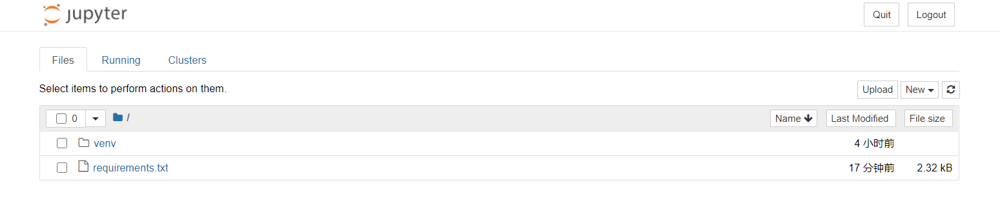
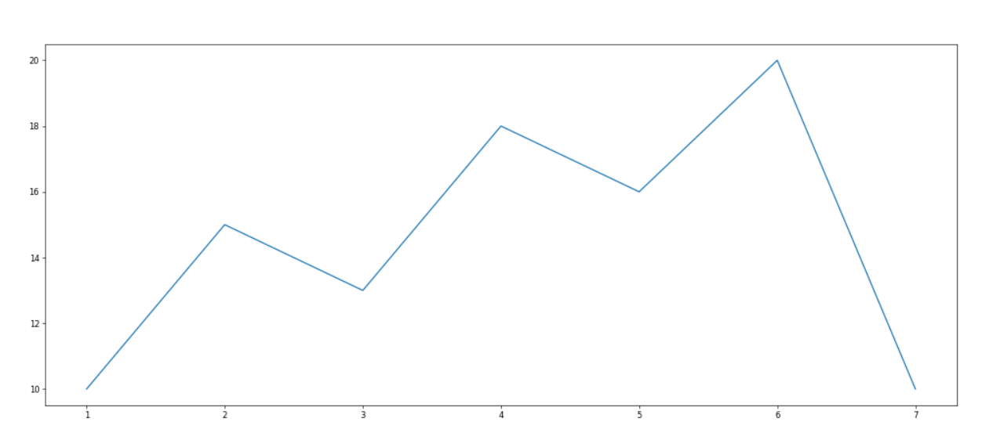

# 人工智能

[TOC]

## 1. 机器学习概述

### 1.1 机器学习的工作流程

1. 获取数据
2. 数据基本处理
3. 特征工程
4. 机器学习(模型训练)
5. 模型评估
   - 结果达到要求，上线服务
   - 没有达到要求，重新上面步骤

### 1.2 Azure搭建实验

`Azure Machine Learning`是微软在其共有云`Azure`上推出的基于`web`使用的一项机器学习服务，机器学习属于人工智能的一个分支，它借助算法让电脑对大量流动数据进行识别。这种方式能够通过历史数据来预测未来事件和行为，其实现方式明显优于传统的商业智能形式。

微软的目标是简化使用机器学习的过程，以便于开发人员，业务分析师和数据可续建进行广泛、便捷地应用。

这狂服务的目的在于"将机器学习动力与云计算的简单性相结合"。

`AML`在微软的[Global Azure](https://azure.microsoft.com/zh-cn/)云服务平台提供服务，可以申请免费试用

### 1.3 深度学习

深度学习`Deep Learning`也称为深度结构学习`Deep Structured Learning`、层次学习`Hierarchical Learning`或者深度机器学习`Deep Machine Learning`是一类算法集合，是机器学习的一个分支。

深度学习方法近年来，在会话识别、图像识别和对象侦测等领域表现出了惊人的准确性。

但是，"深度学习"这个词语很古老，它在1986年由`Dechter`在机器学习领域提出，然后在`2000`年有`Aizenberg`等人引入到人工神经网络中。而现在，由于`Alex Krizhevsky`在2012年使用卷网络结构赢得了`ImageNet`比赛后受到大家的瞩目

## 2. 环境配置

### 2.1 库的安装

整个机器学习阶段会用到`Matplotlib`、`Numpy`、`Pandas`等库，为了统一版本号在环境中使用，将所有的库及其版本放到了文件`requirements.txt`中，然后统一安装

1. 新建一个虚拟环境

   ```
   python -m venv D:\code\python\ai
   ```

2. 新建`requirements.txt`，粘贴一下内容

   ```
   matplotlib==2.2.2
   numpy==1.14.2
   pandas==0.20.3
   tables==3.4.2
   jupyter==1.0.0
   ```

3. 安装所需库

   ```
   pip3 install -r requirements.txt
   ```

### 2.2 Jupyter Notebook使用

#### 2.2.1 Jupyter Notebook介绍

`Jupyter`项目是一个非盈利的开源项目，源于2014年的`ipython`项目，因为它逐渐发展为支持跨所有编程语言的交互式数据科学和科学计算

- `Jupyter Notebook`原名`IPython Notebook`，是`IPython`的加强网页版，一个开源`Web`应用程序
- 名字源自于`Julia`、`Python`和`R`（数据科学的三种开源语言）
- 是一款程序员和科学工作者的编程、文档、笔记和展示软件
- `.ipynb`文件格式是用于计算型叙述的`JSON`文档格式的正式规范

`Jupyter`项目旨在开发跨几十种编程语言的开源软件，开放标准和用于交互式计算的服务

#### 2.2.2 为什么使用Jupyter Notebook

- 传统软件开发：工程/目标明确
  - 需求分析，设计架构，开发模块，测试
- 数据挖掘：艺术/目标不明确
  - 目的是具体的洞察目标，而不是机械的完成任务
  - 通过执行代码来理解问题
  - 迭代式地改进代码来改进解决办法

实时运行的代码、叙事性的文本和可视化被整合在一起，方便使用代码和数据来讲述故事

#### 2.2.3 快速入门

1. 进入虚拟环境

2. 启动`Jupyter Notebook`

   ```
   jupyter notebook
   ```

   

#### 2.2.4 cell操作

1. 什么是`cell`
   - `cell`：一对`In Out`会话被视作一个代码单元，称为`cell`
   - `cell`行号前的`*`，代表代码正在运行
2. `Jupyter`支持两种模式

- 编辑模式`Enter`
  - 命令行模式下`回车Enter`或`鼠标双击cell`进入编辑模式
  - 可以操作`cell`内文本或代码，剪切/复制/粘贴/移动等操作
- 命令行模式`Esc`
  - 按`Esc`退出编辑，进入命令模式
  - 可以操作`cell`单元本身进行剪切/复制/粘贴/移动等操作

#### 2.2.5 Jupyter功能拓展

1. 安装`jupyter_contrib_nbextensions`库

   ```
   python -m pip install jupyter_contrib_nbextensions
   ```

2. 执行

   ```
   jupyter contrib nbextension install --user --skip-running-check
   ```

## 3. Matplotlib

### 3.1 概述

#### 3.1.1 什么是Matplotlib

- 是专门用于开发`2D`图表(包括`3D`图表)
- 以渐进、交互方式实现数据可视化

#### 3.1.2 为什么要学习Matplotlib

可视化是在整个数据挖掘的关键辅助工具，可以清晰的理解数据，从而调整我们的分析方法

- 能将数据进行可视化，更直观的呈现
- 使数据更加客观、更具说服力

### 3.2 简单绘制

#### 3.2.1 matplotlib.pyplot模块

`matplotlib.pyplot`包含了一系列类似于`matlab`的画图函数

```python
import matplotlib.pyplot as plt
```

#### 3.2.2 图形绘制流程

1. 创建画布

   ```python
   plt.figure(figsize=(), dpi=)
   
   # figsize指定图的长度
   # dpi图像的清晰度
   # 返回fig对象
   ```

2. 绘制图像

   ```
   plt.plot(x, y)
   ```

3. 显示图像

   ```
   plt.show()
   ```

#### 3.2.3 折线图的绘制

```python
import matplotlib.pyplot as plt

# 1.创建画布
plt.figure(figsize=(20, 8), dpi=60)

# 2. 绘制图像
plt.plot([1, 2, 3, 4, 5, 6, 7], [10, 15, 13, 18, 16, 20, 10])

# 3.图像显示
plt.show()
```



#### 3.2.4 中文乱码

**解决方案一：**

下载中文字体(黑体，看准系统版本)

1. 下载`SimHei`(支持中文均可)