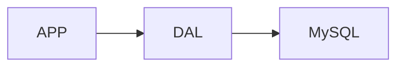
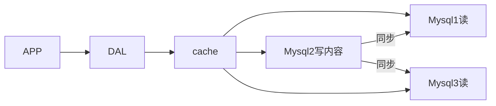
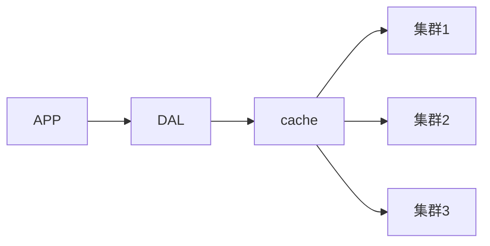

# Redis

[1. Nosql概述](#1. Nosql概述)

​	[1.1 单机`MySQL`的年代](#1.1 单机`MySQL`的年代)

​	[1.2 Memcached(缓存)+MySQL+垂直拆分](#1.2 Memcached(缓存)+MySQL+垂直拆分)

​	[1.3 分库分表+水平拆分+MySQL集群](#1.3 分库分表+水平拆分+MySQL集群)

​	[1.4 为什么要用NoSQL](#1.4 为什么要用NoSQL)

​	[1.5 什么是NoSQL](#1.5 什么是NoSQL)

​	[1.6 NoSQL的四大分类](#1.6 NoSQL的四大分类)

[2. Redis 入门](#2. Redis 入门)

​	[2.1 Redis概述](#2.1 Redis概述)

## 1. Nosql概述

### 1.1 单机`MySQL`的年代



一个基本的网站访问量不会太大，单个数据库完全够用。那个时候，更多的是使用静态页面，服务器没有太大的压力。

这是的网站瓶颈：

1. 数据量太大，一个机器放不下
2. 数据的索引(B+ Tree)，一个机器内存也放不下
3. 访问量(读写混合),一个服务器承受不了

### 1.2 Memcached(缓存)+MySQL+垂直拆分

网站80%的情况都是在读，每次都要去查询数据库就十分麻烦，为了减轻数据库的压力，使用缓存来保证效率。

发展过程：优化数据结构和索引 --> 文件缓存(IO) --> Memcached



### 1.3 分库分表+水平拆分+MySQL集群



### 1.4 为什么要用NoSQL

用户的个人信息，社交网络，地理位置。用户自己产生的数据，用户日志等等爆发式增长。关系型数据库不足以处理庞大的数据量

### 1.5 什么是NoSQL

**NoSQL的定义**

- `NoSQL = Not Only SQL`
- 泛指非关系型数据库，随着`web2.0`互联网的诞生！传统的关系型数据库很难对付`web2.0`时代，尤其是超大规模的高并发的社区！暴露出很多难以克服的问题。`NoSQL`在当今大数据环境下的发展十分的迅速，`Redis`是发展最快的
- 很多的数据类型用户的个人信息，社交网络，地理位置。这些数据类型的存储不需要一个固定的格式。不需要多余的操作就可以横向扩展，使用键值对来扩展

**NoSQL的特点**

- 方便扩展

- 大数据量高性能(Redis一秒写8万次，读取11万，NoSQL的缓存记录级，是一种细粒度的缓存，性能比较高)

- 数据类型是多样型的(不需要事先设计数据库)

- 传统`RDBMS`和`NoSQL`

  ```
  传统的 RDBMS
  	结构化组织
  	SQL
  	数据和关系都存在单独的表中
  	操作，数据定义语言
  	严格的一致性
  	基础的事物
  ```

  ```
  NoSQL
  	不仅仅是数据
  	没有固定的查询语言
  	键值对存储，列存储，文档存储，图形数据库
  	最终一致性
  	CAP定理和BASE
  	高性能，高可用，高可扩
  ```

**3V加3高**

大数据时代的3V：主要是描述问题的

1. 海量Volume
2. 多样Variety
3. 实时Velocity

大数据时代的3高：主要对程序的要求

1. 高并发
2. 高可拓
3. 高性能

### 1.6 NoSQL的四大分类

**KV键值对**

- 新浪：Redis
- 美团：Redis + Tair
- 阿里、百度：Redis + memecache

**文档型数据库(bson)**

- MongoDB：一个基于分布式文件存储的数据库，`C++`编写，主要用来处理大量的文档；`MongoDB`是一个介于关系型数据库和非关系型数据库中间的产品，`MongoDB`是非关系型数据库中功能最丰富，最像关系型数据库的数据库
- `ConthDB`

**列存储数据库**

- HBase
- 分布式文件系统

**图关系数据库**

- 它存的不是图形，而是关系，比如：朋友圈社交网络，广告推荐
- Neo4j，infoGrid

## 2. Redis 入门

### 2.1 Redis概述

- `Redis`(Remote Dictionary Server),远程字典服务，是一个开源的使用`ANSI C`编写、支持网络、可基于内存亦持久化的日志型、`Key-Value`数据库，并提供多种语言的`API`，也称之为结构化数据库

- `Redis`可以进行内存存储、持久化；效率高，可以用于高速缓存；发布订阅系统；地图信息分析......

- 特性：多样的数据类型、持久化、集群、事物

- [官网](https://redis.io/)

- `Redis`的默认安装路径在

  ```shell
  /usr/local/bin
  ```

### 2.2 基本命令

启动

```
redis-server redis.conf
```

连接

```
redis-cli -p 6379
```

关闭服务

```
shutdown
```

