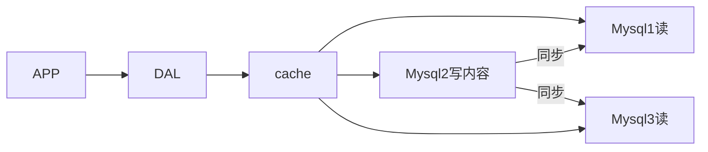

# Redis

[1. Nosql概述](#1. Nosql概述)

​	[1.1 单机`MySQL`的年代](#1.1 单机`MySQL`的年代)

​	[1.2 Memcached(缓存)+MySQL+垂直拆分](#1.2 Memcached(缓存)+MySQL+垂直拆分)

## 1. Nosql概述

### 1.1 单机`MySQL`的年代

一个基本的网站访问量不会太大，单个数据库完全够用。那个时候，更多的是使用静态页面，服务器没有太大的压力。

这是的网站瓶颈：

1. 数据量太大，一个机器放不下
2. 数据的索引(B+ Tree)，一个机器内存也放不下
3. 访问量(读写混合),一个服务器承受不了

### 1.2 Memcached(缓存)+MySQL+垂直拆分

网站80%的情况都是在读，每次都要去查询数据库就十分麻烦，为了减轻数据库的压力，使用缓存来保证效率。

发展过程：优化数据结构和索引 --> 文件缓存(IO) --> Memcached

### 1.3 分库分表