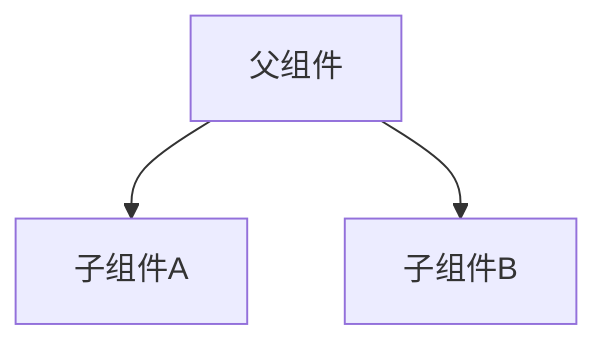
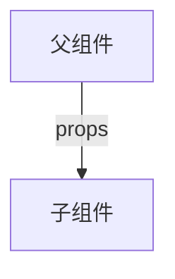
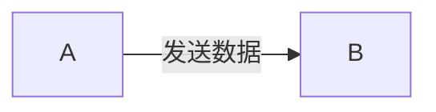
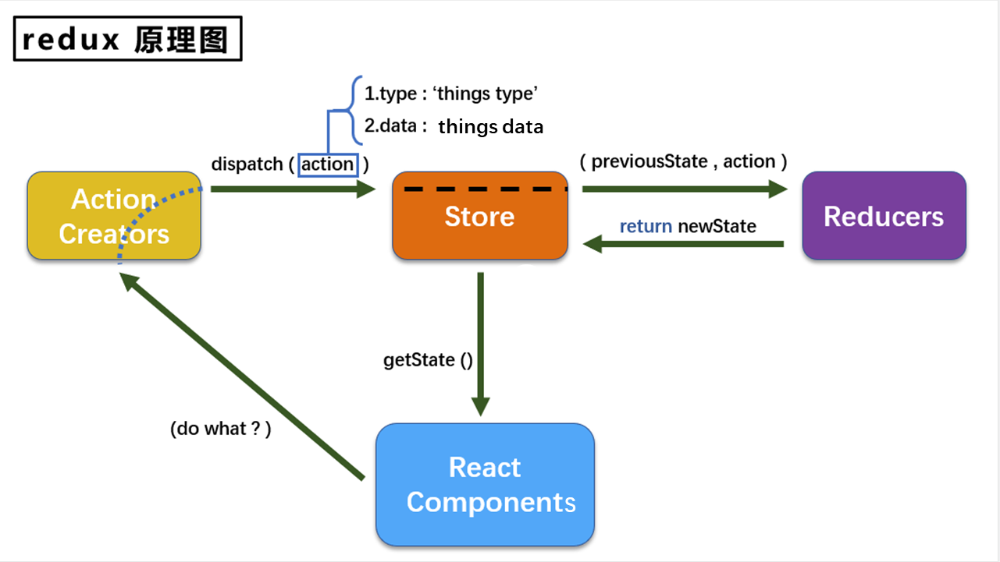
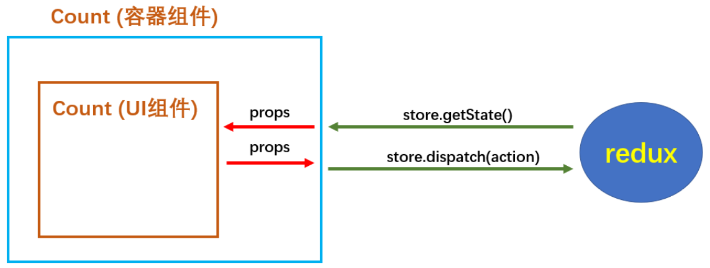

# React

[TOC]

## 1. React入门

- `React`使用虚拟`DOM`，不总是直接操作页面的真实`DOM`，以至于会比较高效
- 使用`DOM Diffing`算法，最小化页面重绘

### 1.1 React的基本使用

#### 1.1.1 相关js库

1. `react.js`：`React`核心库
2. `react-dom.js`：提供操作`DOM`的`react`扩展库
3. `babel.min.js`：解析`JSX`语法转换为`JS`代码的库

#### 1.1.2 创建虚拟DOM

**jsx创建虚拟DOM**:star:

1. 创建`index.html`并准备“容器”

   ```
   <div id="test"></div>
   ```

2. 引入`react`依赖库

   ```html
   <!-- 引入react和核心库 -->
   <script type="text/javascript" src="../js/16.x/react.development.js"></script>
   <!-- 引入react-dom，用于支持react操作DOM -->
   <script type="text/javascript" src="../js/16.x/react-dom.development.js"></script>
   <!-- 引入babel，用于将jsx转化为js -->
   <script type="text/javascript" src="../js/16.x/babel.min.js"></script>
   ```

3. 编写`jsx`

   ```html
   <script type="text/babel">
       // 1. 创建虚拟DOM
       const VDOM = <h1>Hello React</h1> // jsx不需要加引号
   
       // 2. 渲染虚拟DOM到页面 
       ReactDOM.render(VDOM, document.getElementById("test"))
   </script>
   ```

   `render`默认为覆盖不是追加

**js创建虚拟DOM**

```html
<script type="text/javascript">
    const VDOM = React.createElement("h1", {id: "title"}, "Hello React") 

    ReactDOM.render(VDOM, document.getElementById("test"))
</script>
```

对于多层级的虚拟`DOM`，`js`就会显得十分繁琐，`jsx`挺身而出

#### 1.1.3 虚拟DOM与真实DOM

1. `React`提供了一些`API`来创建一种 “特别” 的一般js对象

   ```jsx
   const VDOM = (
       <h1 id="test">
       <span>Hello React</span>
       </h1>
   )
   ```

   上面创建的就是一个简单的虚拟`DOM`对象

   虚拟`DOM`的本质是`Object`类型的对象

   虚拟`DOM`相比真实`DOM`属性会少很多

2. 虚拟`DOM`对象最终都会被`React`转换为真实的`DOM`

3. 我们编码时基本只需要操作`react`的虚拟`DOM`相关数据, `react`会转换为真实`DOM`变化而更新界。

### 1.2 React Jsx

#### 1.2.1 简介

1. `jsx`全称`JavaScript XML`

2. `react`定义的一种类似于`XML`的`JS`扩展语法

3. 本质是`React.createElement(Component, props, ...children)`方法的语法糖

4. 作用：用来简化创建虚拟`DOM`

   写法

   ```jax
   var ele = <h1>Hello JSX</h1>
   ```

   它不是字符串，也不是`HTML/XML`标签

   它最终产生的就是一个`js`对象

5. 标签名任意：`HTML`标签或其他标签

#### 1.2.2 基本语法

1. 定义`DOM`是，不要写引号

2. 如果说标签内的内容是一个变量则需要`{}`进行取值

   ```html
   <script type="text/babel">
       // 1. 创建虚拟DOM
       const id = "haha"
       const data = "Hello React"
       const VDOM = (
           <h2 id={id}>
           	<span>{data}</span>
           </h2>
       )
   
       // 2.渲染虚拟DOM到页面
       ReactDOM.render(VDOM, document.getElementById("test"))
   </script>
   ```

3. 样式的类名指定不能用`class`，要用`className`

   ```html
   <style>
       .title{
           background-color: orange;
           width: 200px;
       }
   </style>
   <script type="text/babel">
       const VDOM = (
           <h2 className="title">
           	<span>"Hello React"</span>
           </h2>
       )
   
       ReactDOM.render(VDOM, document.getElementById("test"))
   </script>
   ```

4. 内敛样式需要使用`{{}}`，且如果是`font-size`这样有两个单词组成的需要用驼峰命名法

   ```html
   <script type="text/babel">
       const VDOM = (
           <h2>
           	<span style={{color: 'red', fontSize: '30px'}}>"Hello React"</span>
           </h2>
       )
   
       ReactDOM.render(VDOM, document.getElementById("test"))
   </script>
   ```

5. `jsx`只能有一个根标签

6. 标签必须闭合

   ```html
   <script type="text/babel">
       const VDOM = (
           <h2>
           	<input type="text" />
           </h2>
       )
   
       ReactDOM.render(VDOM, document.getElementById("test"))
   </script>
   ```

7. 首字符小写标签仅能为`html`的标准标签，首字符大写是一个自定义的组件

#### 1.2.3 练习

`jsx`动态渲染数据

- 表达式：一个表达式会产生一个值，可以放在任何一个需要值的地方

  变量

  函数。。。

- 语句(代码)：

  `if`语句，`for`语句

- 对于`jsx`内部的`{}`只能为表达式

```html
<div id="test"></div>
<script type="text/babel">
// 模拟后端数据
const data = ["Angular", "React", "Vue"]
const VDOM = (
	<div>
		<h1>前端js框架列表</h1>    
		<ul>
			{
				data.map((item, index) => {
					return <li key={index}>{item}</li>
				})
			}   
    	</ul>
    </div>
    )
	ReactDOM.render(VDOM, document.getElementById("test"))
</script>
```

每一个虚拟`DOM`节点，都需要一个`key`用来作为唯一标识

### 1.3 模块与组件、模块化与组件化

#### 1.3.1 模块

1. 理解：向外部提供特定功能的`js`程序，一般就是一个`js`文件
2. 为什么要拆分模块：随着业务逻辑的增加，代码越来越多且复杂
3. 作用：复用`js`，简化`js`的编写，提高`js`运行效率

#### 1.3.2 组件

1. 理解：用来实现局部功能效果的代码和资源的集合`html/css/js/image`等等
2. 为什么需要组件：一个界面的功能太过复杂
3. 作用：复用编码，简化项目编码，提高运行效率

#### 1.3.3 模块化

当应用的`js`都已模块来编写的，这个应用就是一个模块化的应用

#### 1.3.4 组件化

当应用是以多组件的方式实现的，这个应用就是一个组件化的应用

## 2. React面向组件开发

### 2.1 基本理解和使用

#### 2.1.1 使用React开发者工具调试

安装插件`React Developer Tools`

#### 2.1.2 组件的创建方式

**函数式组件**

```html
<div id="test"></div>
<script type="text/babel">
    // 1. 创建函数式组件
    function MyComponent() {
        return (
            <h1>函数式组件，适用于简单组件的定义</h1>
        )
    }

    // 2. 渲染组件到页面
    ReactDOM.render(<MyComponent />, document.getElementById("test"))
</script>
```

函数内部的`this`是`ubderfined`，因为`babel`编译后开启了严格模式

`render`之后的过程

1. `React`解析组件标签，找到了`MyComponent`组件
2. 返现组件是使用函数定义的，随后调用该函数，将返回的虚拟`DOM`转为真实`DOM`，随后呈现在页面中

**类式组件**

```
<div id="test"></div>
<script type="text/babel">
// 1. 创建类式组件
class MyComponent extends React.Component{
    render() {
        return (
            <h2>我是用类定义的组件</h2>
        )
    }
}

// 2. 渲染组件到页面
ReactDOM.render(<MyComponent />, document.getElementById("test"))
```

`render`是放在了原型对象上，供实例使用

`render()`函数内部的`this`指向`MyComponent`的实例对象

`ReactDOM.render`之后的过程

1. `React`解析组件标签，找到了`MyComponent`组件
2. 发现组件是类定义的，随后创建该类的实例，并通过该实例代用原型上的`render`方法
3. 将`render`返回的虚拟`DOM`转换为真实`DOM`，随后呈现在页面中

**总结**

函数式组件适用于简单组件

类式组件适用于复杂组件

### 2.2 三大核心属性

三大核心属性仅仅针对类式组件

#### 2.2.1 state

**理解**

1. `state`是组件对象最重要的属性，值是对象(可以包含多个`key-value`的组合)
2. 组件被称为''状态机“，通过更新组件的`state`来更新对应的页面显示(重新渲染组件)

**强烈注意**

1. 组件中的`render`方法中的`this`为组件实例对象

2. 组件自定义的方法中`this`为`undefined`

   强制绑定`this`通过函数对象的`bind()`

   箭头函数

3. 状态数据，不能直接修改或更新

**动态渲染数据**

```jsx
<div id="test"></div>
<script type="text/babel">
    // 1. 创建类式组件
    class Weather extends React.Component{

        // 初始化状态
        state = {
            isHot: true
        }
        render() {
            return (
                <h2 id="title" onClick={this.changeWeather}>今天天气很{this.state.isHot ? "炎热" : "凉爽"}</h2>
            )
        }

        // 自动以方法要用赋值语句的形式+箭头函数
        changeWeather = () => {
            this.setState({isHot: !this.state.isHot})
        }
    }

    // 2. 渲染组件到页面
    ReactDOM.render(<Weather />, document.getElementById("test"))
</script>
```

#### 2.2.2 props

需求：自定义用来显示一个人员信息的组件

- 名字必须指定，且为字符串类型
- 性别为字符串类型，如果性别没有指定，默认为男
- 年龄必须指定，且为数字类型

对`props`的属性进行限制，属性的限制需要引入`prop-types.js`

```javascript
// 对Person属性的类型进行限制
static propTypes = {
    // string类型为字符串，isRequired必须有值
    name: PropTypes.string.isRequired,
    sex: PropTypes.string,
    age: PropTypes.number,
    speak: PropTypes.func
}  

// 设置属性的默认值
static defaultProps = {
    sex: "待鉴定",
    age: 18
}
```

渲染组件

```jsx
render() {
    return (
        <ul>
            <li>姓名：{this.props.name}</li>
            <li>性别：{this.props.age + 1}</li>
            <li>年龄：{this.props.sex}</li>
        </ul>
    )
}
```

传递`props`的两种方式

1. 直接传递

   ```jsx
   ReactDOM.render(<Person name="Tom" age={18} sex="男"/>, document.getElementById("test"))
   ```

2. `...`传递

   ```jsx
   const p = {name: "老刘", age: 19}
   ReactDOM.render(<Person {...p}/>, document.getElementById("test"))
   ```

**理解**

1. 每个组件对象都会有`props(properties)`属性
2. 组件标签的所有属性都保存在`props`中

**注意**

`props`的属性是只读的

函数式组件使用`props`

```jsx
function Person(props) {
    return (
        <ul>
            <li>姓名：{props.name}</li>
            <li>性别：{props.age + 1}</li>
            <li>年龄：{props.sex}</li>
        </ul>
    )
}

ReactDOM.render(<Person name="Alcie" age={18} sex="女" />, document.getElementById("test"))
```

对于属性限制，限制只能写在函数的外部

#### 2.2.3 refs

组件内的标签可以定义`ref`属性来标识自己，相当于`id`属性，`ref`指定的值都会被收集到`refs`属性中

1. 字符串形式的`ref`：不推荐使用

   `render`

   ```jsx
   <input type="text" ref="input1" placeholder="点击按钮提示数据"/>
   <button onClick={this.showData} >点我提示左侧的数据</button>
   ```

   方法

   ```jsx
   showData = () => {
   	alert(this.refs.input1.value)
   }
   ```

2. 回调函数形式的`ref`

   `render`，`c`为当前节点对象

   ```jsx
   <input type="text" ref={(c) => {this.input1 = c}} placeholder="点击按钮提示数据"/>
   <button onClick={this.showData} ref="btn">点我提示左侧的数据</button>&nbsp;
   <input onBlur={this.showData2} type="text" ref={c => this.input2 = c} placeholder="失去焦点提示"/>
   ```

   方法

   ```jsx
   showData = () => {
   	alert(this.input1.value)
   }
   
   showData2 = () => {
   	alert(this.input2.value)
   }
   ```

   对于内敛的`ref`会在组件更新时调用两次，第一的参数为`null`，第二次的参数为当前节点，如果不想要调用两次，需要将方法绑定在类上

   ```jsx
   <div>
       <h2>今天天气很{this.state.isHot ? "炎热" : "凉爽"}</h2>
       <button onClick={this.showData}>点我获取天气</button>&nbsp;
   </div>
   ```

   方法

   ```jsx
   state ={
   	isHot: false
   }
   showData = (c) => {
   	this.setState({isHot: !this.state.isHot})
   }
   ```

3. `createRef`

   首先创建容器

   ```
   myRef = React.createRef()
   ```

   `React.createRef`调用后可以返回一个容器，该容器可以存储被ref所标识的节点，一个容器只能存储一个节点

   创建`jsx`结构

   ```jsx
   <div>
       <input type="text" ref={this.myRef} placeholder="点击按钮提示数据"/>
       <button onClick={this.showData} ref="btn">点我提示左侧的数据</button>&nbsp;
   </div>
   ```

   创建方法

   ```javascript
   showData = () => {
   	alert(this.myRef.current.value)
   }
   ```

#### 2.2.4 三大属性与事件处理

1. 通过`onXxx`属性来指定事件处理函数

   `React`使用的是自定义(合成)事件，而不是使用原生的`DOM`事件----为了更好的兼容性

   `React`中的事件是通过事件委托方式处理的(委托给组件最外层的元素)-----为了高效

2. 当发生事件的`DOM`与要操作的`DOM`相同时，可以省略`ref`通过`event.target`得到发生事件的`DOM`元素对象

   ```jsx
   <input onBlur={this.showData} type="text" placeholder="失去焦点提示数据"/>
   showData = (event) => {
   	alert(event.target.value)
   }
   ```

### 2.3 收集表单数据

包含表单组件的分类

1. 非受控组件

   现用现取

   ```jsx
   class Login extends React.Component{
   
       handleSubmit = (event) => {
       	event.prevenDefault() // 阻止表单提交
       	const {username, password} = this
       	alert(`用户名：${username.value}，密码：${password.value}`)
       }
   
       render() {
           return (
               <form action="http://www.baidu.com" onSubmit={this.handleSubmit}>
                   用户名：<input ref={c => this.username = c} type="text" name="username"/>
                   密码：<input ref={c => this.password = c} type="password" name="password" />
                   	<button>登录</button>
               </form>
           )
       }
   }
   ```

2. 受控组件：推荐使用

   将需要的信息存储在`state`中

   ```jsx
   class Login extends React.Component{
   
       // 初始化状态
       state = {
           username: "",
           password: ""
       }
   
       handleSubmit = (event) => {
           event.prevenDefault() // 阻止表单提交
   
           const {username, password} = this.state
           alert(`用户名：${username}，密码：${password}`)
       }
   
       // 保存用户名密码到状态中
       saveFormData = (dataType) => {
           return (event) => {
               this.setState({[dataType]: event.target.value})
           }
       }
       render() {
           return (
               <form onSubmit={this.handleSubmit}>
                   用户名：<input onChange={this.saveFormData("username")} type="text" name="username"/>
                   密码：<input onChange={this.saveFormData("password")} type="password" name="password" />
                   <button>登录</button>
               </form>
           )
       }
   }
   ```

   对于`saveFormData`就是一个高阶函数

   高阶函数：

   - 若`A`函数，接受的参数是一个函数，那么`A`就可以成为高阶函数
   - 若`A`函数，调用的返回值依然是一个函数，那么`A`就可以称之为高阶函数
   - 常见的高阶函数：`Promise`、`setTimeout`、`arr.map()`

   函数的柯里化：

   - 通过函数调用继续返回函数的方式，实现多次接受参数最后统一处理的函数编码形式

### 2.4 组件的生命周期

组件分为挂载和卸载

- 当组件被渲染到页面上时，称为挂载

- 当组件被从页面中移除时，称为卸载

  ```javascript
  // 参数为指定的容器
  ReactDOM.unmountComponentAtNode(document.getElementById("test"))
  ```

  

#### 2.4.1 生命周期理解

1. 组件从创建到死亡它会经历一些特定的阶段
2. `React`中包含了一系列钩子函数(生命周期回调函数)，会在特定的时刻调用
3. 我们定义组件时，会在特定的生命周期回调函数中做特定的工作

#### 2.4.1 生命周期钩子

1. 旧版本的钩子


- 初始化阶段：由`ReactDOM.render()`触发

  `constructor` 

  `componentWillMount` 

   :star:`render` 

   :star:`compoonentDidMount`：一般用于初始化的操作，订阅消息，会接受`preProps`和`preState`作为参数，新版本中还会接受`getSnapshotBeforeUpdate`的快照值

- 更新阶段：由组件内部`this.setState()`或者父组件重新`render`触发

  `shouldConponentUpdate`：仅当返回值为`true`是，组件允许更新，如果是`forceUpdate()`将会跳过验证

  `componentWillUpdate`

  `render`

  `componentDidUpdate`

- 卸载组件：由`ReactDOM.unmountComponentAtNode:()`触发

  :star:`componentWillUnmount`：一般用于收尾工作，取消订阅

2. 新版本的钩子


对于新版的钩子，由于以下三个钩子经常被误用，所以`componentWillMount`、`componentWillReceiveProps`、`componentWillUpdate`需要加上前缀`UNSAFE_`

- 初始化阶段：由`ReactDOM.render`触发

  `constructor`

  `getDerivedStateFromProps`

  `render`

  `componentDidMount()`

- 更新阶段

  `getDerivedStateFromProps`

  `shouldComponentUpdate`

  `render`

  `getSnapshotBeforeUpdate`

  `componentDidUpdate`

- 卸载组件：由`ReactDOM.umountComponentAtNode`触发

  `componentWillUnmount`

### 2.5 Diffing算法

`Diffing`算法的最小力度是标签

#### 2.5.1 key的作用

1. 虚拟`DOM`中`key`的作用

   - 简单来说：`key`是虚拟`DOM`对象的标识，在更新显示时`key`起着极其重要的作用

   - 详细的说：当状态中的数据发生变化时，`react`会根据【新数据】生成【新的虚拟`DOM`】,随后`React`进行了【新虚拟`DOM`】与【旧虚拟`DOM`】的`diff`比较，比较规则如下：

     旧虚拟`DOM`中找到了与新虚拟`DOM`相同的`key`

     - 若虚拟`DOM`内容没变，直接使用之前的真实`DOM`
     - 若虚拟`DOM`内容变了，则生成新的真实`DOM`，随后替换掉页面之前的真实`DOM`

     旧虚拟`DOM`中未找到与新虚拟`DOM`相同的`key`，根据数据创建新的真实`DOM`，随后渲染到页面

2. 用`index`作用作为`key`可能会引发的问题

   - 若对数据进行：逆序添加、逆序删除等破坏顺序操作：会产生没有必要的真实`DOM`更新 ==> 界面效果没问题，但效率低
   - 如果结构中还包含输入类的`DOM`：会产生错误`DOM`更新 ==> 界面有问题
   - 如果不存在对数据的逆序添加、逆序删除等破坏顺序的操作，仅用于渲染列表用于展示，使用`index`作为`key`是没有问题的

3. 开发中如何选择`key`

   - 最好使用每条数据的唯一标识作为`key`、比如`id`、手机号、身份证号、学号等唯一值
   - 如果确定只是简单的展示数据，用`idnex`也是可以的

## 3. React脚手架

### 3.1 react脚手架

1. `xxx`脚手架: 用来帮助程序员快速创建一个基于`xxx`库的模板项目

   包含了所有需要的配置（语法检查、`jsx`编译、`devServer`…）

   下载好了所有相关的依赖

   可以直接运行一个简单效果

2. `react`提供了一个用于创建react项目的脚手架库: `create-react-app`

3. 项目的整体技术架构为:  `react` + `webpack`+ ``es6` + `eslint`

4. 使用脚手架开发的项目的特点: 模块化, 组件化, 工程化

### 3.2 创建项目并启动

1. 全局安装

   ```bash
   npm install -g create-react-app
   ```

2. 切换到想创项目的目录，使用命令

   ```bash
   create-react-app hello-react
   ```

3. 进入项目文件夹

   ```bash
   cd hello-react
   ```

4. 启动项目

   ```bash
   npm start
   ```

5. 常用命令

   ```bash
   npm start # 启动项目
   npm build # 编译打包项目
   npm test # 测试
   npm eject # 显示配置文件
   ```

### 3.3 react脚手架项目结构

```
public ---- 静态资源文件夹
    favicon.icon ------ 网站页签图标
    index.html -------- 主页面 --重要
    logo192.png ------- logo图
    logo512.png ------- logo图
    manifest.json ----- 应用加壳的配置文件
    robots.txt -------- 爬虫协议文件
src ---- 源码文件夹
    App.css -------- App组件的样式
    App.js --------- App组件 --重要
    App.test.js ---- 用于给App做测试
    index.css ------ 样式
    index.js ------- 入口文件 --重要
    logo.svg ------- logo图
    reportWebVitals.js
    	--- 页面性能分析文件(需要web-vitals库的支持)
    setupTests.js
    	---- 组件单元测试的文件(需要jest-dom库的支持)
```

### 3.4 功能界面的组件化编码流程

1. 拆分组件：拆分界面抽组件

2. 实现静态组件：使用组件实现静态页面效果

3. 实现动态组件

   - 动态显示初始化数据

     数据类型

     数据名称

     保存在哪个组价

   - 交互(从绑定事件监听开始)

### 3.5 常用库

1. 唯一id

   安装

   ```bash
   npm i uuid
   ```

   使用

   ```js
   import {nanoid} from 'nanoid'
   
   // 返回一个字符串类型的id
   id = nanoid()
   ```

2. 类型限制

   安装

   ```bash
   npm i prop-types
   ```

   使用

   ```js
   import PropTypes from 'prop-types'
   
   static propTypes = {
       id: PropTypes.string.isRequired,
       name: PropTypes.string.isRequired,
       done: PropTypes.bool.isRequired,
       updateTodo: PropTypes.func.isRequired
   }
   ```


### 3.6 状态提升

如果对于A、B两兄弟组件，状态数据需要共享，那就需要把他们的状态统一放到其父组件中，通过父组件向其传递状态



1. 父组件向子组件传递数据，通过`props`



2. 子组件向父组件传递数据

   如果是子组件向父组件传递数据，就需要在父组件创建函数，然后将其传递给子组件，子组件进行调用时，将数据传递给父组件

   ```mermaid
   graph TD
   子组件 --> |函数|父组件
   ```

## 4. React ajax

### 4.1 理解

#### 4.1.1 前置说明

1. `React`本身只关注界面，并不包含发送`ajax`请求的代码
2. 前端应用需要通过`ajax`请求与后台进行交互(`json`数据)
3. `react`应用中需要集成第三方`ajax`库(或自己封装)

#### 4.1.2 常用的`ajax`请求库

1. `jQuery`比较重，如果需要另外引用不建议使用
2. `axios`轻量级，建议使用
   - 封装`XmlHttpRequest`对象的`ajax`
   - `promis`风格
   - 可以用在浏览器端和`node`服务器端

### 4.2 axios

#### 4.2.1 安装使用

1. 安装

   ```
   npm add axios
   ```

2. 使用

   ```jsx
   import React, { Component } from 'react'
   import axios from 'axios'
   
   export default class App extends Component {
       getStudentData = () => {
           axios.get('www.baidu.com')
           .then(
               res => {
                   console.log(res.data)
               },
               error => {
                   console.log(error)
               }
           )
       }
   
       render() {
           return (
               <div>
                   <button onClick={this.getStudentData}>点我获取数据</button>
               </div>
           )
       }
   }
   ```


### 4.3 配置代理解决跨域

#### 4.3.1 方法一

> 在package.json中追加如下配置

```json
"proxy":"http://localhost:8080"
```

说明：

1. 优点：配置简单，前端请求资源时可以不加任何前缀。
2. 缺点：不能配置多个代理。
3. 工作方式：上述方式配置代理，当请求了3000不存在的资源时，那么该请求会转发给8080（优先匹配前端资源）

#### 4.3.2 方法二

1. 第一步：创建代理配置文件

   ```
   在src下创建配置文件：src/setupProxy.js
   ```

2. 编写`setupProxy.js`配置具体代理规则：

   ```js
   const proxy = require('http-proxy-middleware')
   
   module.exports = function(app) {
     app.use(
       proxy('/api1', {  //api1是需要转发的请求(所有带有/api1前缀的请求都会转发给8080)
         target: 'http://localhost:8080', //配置转发目标地址(能返回数据的服务器地址)
         changeOrigin: true, //控制服务器接收到的请求头中host字段的值
         /*
         	changeOrigin设置为true时，服务器收到的请求头中的host为：localhost:8080
         	changeOrigin设置为false时，服务器收到的请求头中的host为：localhost:8080
         	changeOrigin默认值为false，但我们一般将changeOrigin值设为true
         */
         pathRewrite: {'^/api1': ''} //去除请求前缀，保证交给后台服务器的是正常请求地址(必须配置)
       }),
       proxy('/api2', { 
         target: 'http://localhost:8080',
         changeOrigin: true,
         pathRewrite: {'^/api2': ''}
       })
     )
   }
   ```

说明：

1. 优点：可以配置多个代理，可以灵活的控制请求是否走代理。
2. 缺点：配置繁琐，前端请求资源时必须加前缀。

### 4.4 消息订阅-发布机制

用于解决兄弟组件传参的问题，当然也适用于所有的组件的传参

1. 工具库`PubSubJs`

2. 安装

   ```bash
   npm install pubsub-js
   ```

3. 使用

   ```js
   import PubSub from 'pubsub-js' //引入
   PubSub.subscribe('delete', function(data){ }); //订阅
   PubSub.publish('delete', data) //发布消息
   ```

假设有A组件想要向B组件发送数据，A组件与B组件为兄弟组件



1. 在`B`中订阅消息

   ```js
   import PubSub from 'pubsub-js'
   
   // 订阅消息并保存token
   this.token = PubSub.subscribe('messageName', (msg, data) => {
   	console.log('收到数据')
   })
   ```

2. 在`A`中发布消息

   ```js
   import PubSub from 'pubsub-js'
   
   // 发布消息
   PubSub.publish('messageName', {data: 123})
   ```

3. 在`B`组件卸载之前应该取消订阅

   ```js
   componentWillUnmount() {
       // 取消消息订阅
       PubSub.unsubscribe(this.token)
   }
   ```


### 4.5 fetch

属于`javascript`的内置库，与`xhr`同级的内置对象

#### 4.5.1 文档

1. https://github.github.io/fetch/

2. https://segmentfault.com/a/1190000003810652

#### 4.5.2 特点

1. `fetch`: 原生函数，不再使用`XmlHttpRequest`对象提交`ajax`请求

2. 老版本浏览器可能不支持

#### 4.5.3 相关API

1. `GET`请求

   ```js
   fetch(url).then(function(response) {
       return response.json()
   }).then(function(data) {
       console.log(data)
   }).catch(function(e) {
       console.log(e)
   });
   ```

2. `POST`请求

   ```js
   fetch(url, {
       method: "POST",
       body: JSON.stringify(data),
   }).then(function(data) {
   	console.log(data)
   }).catch(function(e) {
   	console.log(e)
   })
   ```


## 5. React路由

### 5.1 相关理解

#### 5.1.1 SPA的理解

1. 单页`Web`应用`single page web application SPA`
2. 整个应用只有一个完整的页面
3. 点击页面中的链接不会刷新页面，只会做页面的局部更新
4. 数据都需要通过`ajax`请求获取，并在前端异步展现

#### 5.1.2 路由的理解

1. 什么是路由

   一个路由就是一个映射关系(`key: value`)

   `key`为路径，`value`可能是`function`或者`component`

2. 路由分类

   后端路由

   - 理解：`value`是`function`，用来处理客户端提交的请求
   
   - 注册路由：`router.get(path, function(req, res))`
   
   - 工作过程中：当`node`接受到一个请求时，根据请求路径找到匹配的路由，调用路由中的函数来处理请求，返回响应数据
   
   前端路由：
   
   - 浏览器端路由，`value`是`component`，用于战术页面内容
   - 注册路由：`<Route path="/test" component={Test}>`
   - 工作过程：当浏览器的`path`变为`/test`，当前路由组件就会变为`Test`组件

#### 5.1.3 react-router

1. `react`的一个插件库
2. 专业用来实现一个`SPA`应用
3. 基于`react`的项目基本都会用到此库

### 5.2 react-router-dom相关API

安装

```
npm install react-router-dom
```

#### 5.2.1 内置组件

1. `BrowserRouter`：`h5`特有
2. `HashRouter`
3. `Route`
4. `Redirect`
5. `Link`
6. `NavLink`：相比`Link`有一个`activeClassName`属性，即当`NavLink`被点击时会追加一个类名，比如说让标签高亮的样式类名
7. `Switch`

#### 5.2.2 其他

1. `history`对象
2. `match`对象
3. `withRouter`函数

### 5.3 快速入门

1. 明确好界面中的导航区、展示区
2. 导航区的a标签Link标签
3. `<Link to='/xxx> Demo </Link>'`
4. 展示区写`Route`标签路径的匹配`<Route path='/xxx' component={Demo} />`
5. `<App />`的最外层包裹一个`<BrowserRouter>`或`<HashRouter>`

```jsx
import {Link, BrowserRouter, Route} from "react-router-dom"


<BrowserRouter>
    <div>
        {/* react路由链接切换组件 ---编写路由链接 */}
        <Link className="list-group-item" to="/about">About</Link>
        <Link className="list-group-item" to="/home">Home</Link>
    </div>
    <div className="panel-body">
    {/* 注册路由 */}
        <Route path="/about" component={About}/>
        <Route path="/home" component={Home}/>
    </div>
</BrowserRouter>
```

#### 5.3.1 路由组件和一般组件

路由组件：注册路由中引用的组件，一般放在`pages`文件夹下

路由组件在渲染时会接受到的`props`

```json
{
  "history": {
    "push": "ƒ push() {}",
    "replace": "ƒ replace() {}",
    "go": "ƒ go() {}",
    "goBack": "ƒ goBack() {}",
    "goForward": "ƒ goForward() {}",
  },
  "location": {
    "pathname": "/home",
    "search": "",
  },
  "match": {
    "path": "/home",
    "url": "/home",
    "params": "{}"
  }
}
```

#### 5.3.2 标签体

对于组件的标签体被收集在`children`属性中

#### 5.3.3 解决样式丢失

当路由的层级为多级时，此时去刷新页面样式就会丢失，解决办法如下

1. 修改样式引入的链接

   ```html
   <link rel="stylesheet" href="./css/bootstrap.css">
   
   <!-- 删除点 -->
   <link rel="stylesheet" href="/css/bootstrap.css">
   ```

2. 修改样式引入链接

   ```HTML
   <link rel="stylesheet" href="./css/bootstrap.css">
   
   <!-- 将点修改为%PUBLIC_URL% -->
   <link rel="stylesheet" href="%PUBLIC_URL%/css/bootstrap.css">
   ```

3. 修改`BrowserRouter`为`HashRouter`

#### 5.3.4 路由匹配

**模糊匹配**

可以匹配成功

```html
<NavLink to="/home/test">Home</NavLink>
<Route path="/home" component={Home}/>
```

不能匹配成功

```html
<NavLink to="/home/test">Home</NavLink>
<Route path="/home/test" component={Home}/>
```

**精准匹配**

```
<Route path="/home/test" component={Home}/>
```

**总结**

1. 模式使用的是模糊匹配
2. 开启严格匹配使用`exact={true}`
3. 严格匹配不要随便开启，需要时开启。有时开启会导致无法继续匹配二级路由

### 5.4 路由组件的使用

路由组件包括两种，`react-dom-router`提供的组件和`Route`属性中`component`指定的组件

#### 5.4.1 NavLink

1. `NavLink`可以实现路由链接的高亮，通过`activeClassName`指定样式名
2. 标签体的内容是一个特殊的标签属性
3. 通过`this.props.children`可以获取标签体内容

#### 5.4.2  Switch

被`Switch`包裹的`Route`可以实现只匹配第一个成功的路由

```jsx
<Switch>
    {/* 注册路由 */}
    <Route path="/about" component={About}/>
    <Route path="/home" component={Home}/>
    <Route path="/home" component={Test}/>
</Switch>
```

#### 5.4.3 Redirect

指定路由不匹配时，所要使用的路由

```html
<Route path="/about" component={About}/>
<Route path="/home" component={Home}/>
<Redirect to="/about" />
```

### 5.5 二级路由和向路由组件传递参数

#### 5.5.1 二级路由

路由的匹配都是从第一个注册的路由开始，因为路由的匹配都是模糊匹配，所以二级路由一定要带上父路由的前缀

#### 5.5.2 路由组件传递参数

1. `params`传递参数

   路由路径使用`:xxx`来传递参数

   ```jsx
   render() {
       return (
           <div>
               <ul>
               {
                   this.state.messageArr.map((msg) => {
                   return <li key={msg.id}>
                   	{/* 向路由组件传递params参数 */}
                   	<Link to={`/home/message/detail/${msg.id}/${msg.title}`} href="xxx">{msg.title}</Link>&nbsp;&nbsp;
                   </li>
                   })
               }
               </ul>
               <hr/>
               <Switch>
                   {/* 声明接受params参数 */}
               	<Route path="/home/message/detail/:id/:title" component={Detail} />
               </Switch>
           </div>
       )
   }
   ```
   
    在路由组件的`this.props.match.params`中会接到传递的参数
   
   ```js
   const {id, title} = this.props.match.params
   ```
2. `search`参数

   `search`参数就相当于`query`参数，以`?`开始，`&`符分割

   ```jsx
   <Link to={`/home/message/detail/?id=${msg.id}&title=${msg.title}`}>{msg.title}</Link>
   
   {/* search参数无需声明接受 */}
   <Route path="/home/message/detail" component={Detail} />
   ```

   传递的参数被保存为`this.props.location.search`字符串，使用`querystring`库的`parse`解析为对象

   ```js
   import qs from 'querystring'
   
   const {id, title} = qs.parse(this.props.location.search.slice(1))
   ```

3. `state`参数

   `state`参数不会展示在地址栏中

   ```jsx
   <Link to={{pathname: '/home/message/detail', state: {id: msg.id, title: msg.title}}}>{msg.title}</Link>
   
   {/* state参数无需声明接受 */}
   <Route path="/home/message/detail" component={Detail} />
   ```

   传递的参数会被保存到`this.props.location.state`中

   ```js
   const {id, title} = this.props.location.state
   ```


### 5.6 push与replace

`react-router-dom`利用的是浏览器的`history`的`push`与`replace`默认为`push`，`Link`中提供属性`replace={true}`来进行切换到`replace`模式

```jsx
<Link replace={true} to='xxx'>xxx</Link>
```

### 5.7 编程式路由导航

#### 5.7.1 push与replace导航

1. `replace`手动导航

   ```jsx
   <button onClick={this.replaceShow(msg.id, msg.title)}>replace查看</button>
   replaceShow = (id, title) => {
       // 实现跳转到Detail组件，且为replace跳转
       return () => {
           this.props.history.replace(`/home/message/detail/${id}/${title}`)
       }
   }
   ```

2. `push`手动导航

   ```jsx
   <button onClick={this.pushShow(msg.id, msg.title)}>push查看</button>
   pushShow = (id, title) => {
       // 实现跳转到Detail组件，且为push跳转
       return () => {
       	this.props.history.push(`/home/message/detail/${id}/${title}`)
       }
   }
   ```

对于`params`和`search`不同的参数传递，使用不同的路径即可，`state`参数需要在`replace`或`push`的第二个参数中传递

```jsx
<button onClick={this.pushShow(msg.id, msg.title)}>push查看</button>
pushShow = (id, title) => {
    // push跳转，携带params参数
    return () => {
    	this.props.history.push(`/home/message/detail`, {id: id, title: title})
    }
}
```

#### 5.7.2 goBack和goForward

1. `goBack`回退

   ```jsx
   <button onClick={this.back}>回退</button>
   back = () => {
   	this.props.history.goBack()
   }
   ```

2. `goForward`前进

   ```jsx
   <button onClick={this.forward}>前进</button>
   forward = () => {
   	this.props.history.goForward()
   }
   ```

3. `go`根据传递的参数的值来进行回退或前进

   ```jsx
   <button onClick={this.go}>go</button>
   go =() => {
       // 回退两步
   	this.props.history.go(-2)
   }
   ```

#### 5.7.3 withRouter

对于路由组件`this.props`上的属性`history`、`location`、`match`属性只能在路由组件上使用，因为一般组件没有这些属性

`withRouter`是`react-dom-router`提供的一个函数，通过`withRouter`包裹的一般组件称为路由组件

```jsx
import {withRouter} from 'react-router-dom'

class Header extends Component {

    back = () => {
        this.props.history.goBack()
    }
    
    render() {
        return (
            <div className="page-header">
                <button onClick={this.back}>回退</button>
            </div>
        )
    }
}
export default withRouter(Header)
```

### 5.8 history与hash

`hsitory`与`hash`的区别即是`BrowserRouter`与`HashRouter`的区别

1. 底层原理不一样

   `BrowserRouter`使用的是`H5`的`hsiroty API`，不兼容`IE9`及以下的版本，`HashRouter`使用的是`URL`的哈希值

2. `path`表现形式不一致

   `BrowserRouter`的路径中没有`#`，例如：`localhost:3000/demo/test`

   `HashRouter`的路径包含`#`，例如：`localhost:3000/#/demo/test`

3. 刷新后对路由`state`参数的影响

   `BrowserRouter`没有任何影响，因为`state`保存在`history`对象中

   `HashRouter`刷新后会导致路由`state`参数的丢失

4. `HashRouter`可以用于解决一些路径错误的问题，例如：样式丢失

## 6. ant-design组件

国内蚂蚁金服的开源`react`组件库

### 6.1 基本使用

1. 安装

   ```
   npm install antd
   ```

2. 使用

   ```jsx
   import React, { Component } from 'react'
   
   // 导入需要的组件
   import { Button } from 'antd'
   import { WechatOutlined } from '@ant-design/icons'
   
   // 导入组件的样式
   import 'antd/dist/antd.css'
   export default class App extends Component {
       render() {
           return (
               <div>
                   <Button type="primary">Primary Button</Button>
   
                   <WechatOutlined />
               </div>
           )
       }
   }
   ```
   

### 6.2 按需引入样式

1. 安装`react-app-rewired`和`customize-cra`

   ```
   npm install react-app-rewired customize-cra
   ```

2. 安装`babel-plugin-import`

   ```
   npm install babel-plugin-import
   ```

3. 修改`package.json`

   ```json
   "scripts": {
   -   "start": "react-scripts start",
   -   "build": "react-scripts build",
   -   "test": "react-scripts test",
   +   "start": "craco start",
   +   "build": "craco build",
   +   "test": "craco test",
   }
   ```

4. 根目录新建`config-overrides.js`

   ```js
   const { override, fixBabelImports } = require('customize-cra');
   
   module.exports = override(
   	fixBabelImports('import', {
   		libraryName: 'antd',
   		libraryDirectory: 'es',
   		style: 'css',
   	}),
   );
   ```

5. 配置完成之后，组件不需要再引入样式

### 6.3 自定义样式

1. 由于`antd`官方使用`less`编写样式，要想修改样式需要安装`less`和`less-loader`

   ```
   npm install less less-loader
   ```

2. 修改`config-overrides.js`配置文件

   ```js
   const { override, fixBabelImports, addLessLoader  } = require('customize-cra');
   
   module.exports = override(
   	fixBabelImports('import', {
   		libraryName: 'antd',
   		libraryDirectory: 'es',
   		style: true,
   	}),
   	addLessLoader({
   		lessOptions: {
   			javascriptEnabled: true, // 允许使用js修改主题颜色
   			modifyVars: { '@primary-color': 'orange' }, // 修改主题的颜色
   		}
   	}),
   );
   ```

## 7. redux

### 7.1 redux理解

1. `redux`是一个专门用于做状态管理的`JS`库(不是`react`插件库)
2. 它可以用在`react`，`angular`，`vue`等项目中，但基本与`react`配合使用
3. 作用：集中式管理`react`应用中多个组件共享的状态

#### 7.1.1 使用redux的情况

1. 某个组件的状态，需要让其他组件可以随时拿到
2. 一个组件需要改变另一个组件的状态
3. 总体原则：能不用就不用，如果不用比较吃力才考虑使用

#### 7.1.2 redux工作流程



### 7.2 redux的三个核心概念

#### 7.2.1 action

1. 动作的对象

2. 包含2个属性

   - `type`：标识属性，值为字符串，唯一，必要属性
   - `data`：数据属性，值类型任意，可选属性

3. 例子

   ```js
   {type: 'ADD_STUDENT', data: {name: 'tom', age: 18}}
   ```

#### 7.2.2 reducer

1. 用于初始化状态、加工状态
2. 加工时，根据旧的`state`和`action`，产生新的`state`的纯函数

#### 7.2.3 store

1. 将`state`、`action`、`reducer`联系在一起的对象

2. 如何得到此对象

   安装

   ```
   npm install redux
   ```

   使用

   ```jsx
   import {createStore} from 'redux'
   import reducer from './reducers'
   const store = createStore(reducer)
   ```

3. 此对象的功能?

   - `getState()`: 得到`state`

   - `dispatch(action)`: 分发`action`, 触发`reducer`调用, 产生新的`state`

   - `subscribe(listener)`: 注册监听, 当产生了新的`state`时, 自动调用

### 7.3 基本使用

#### 7.3.1 redux精简版

1. 去除`Count`组件的自身状态

2. `src`下建立

   ```
   - src
   	- redux
   		- store.js
   		- count_reducer.js
   ```

3. `store.js`

   1. 引入`redux`中的`createStore`函数，创建一个`store`

      ```js
      import { createStore } from 'redux'
      import countReducer from './count_reducer'
      ```

   2. `createStore`调用时要传入一个为其服务的`reducer`，并将返回的结果暴露出去

      ```js
      export default createStore(countReducer)
      ```

4. `count_reducer.js`

   1. `reducer`的本质是一个函数，接受`preState`、`action`返回加工后的状态

   2. `reducer`有两个作用：初始化状态，加工状态

   3. `reducer`被第一次调用时，是`store`自动触发的，传递的`preState`是`undefinded`

   4. 完整代码

      ```js
      export default function countReducer(preState, action) {
      
          // 从action对象中获取：type, data
          const {type, data} = action
      
          // 根据type决定如何加工数据
          switch(type) {
              // 加
              case 'increment':
                  return preState + data
      
              // 减
              case 'decrement':
                  return preState - data
      
              // 程序初始化时preState为undefined，赋初值为0
              default:
                  return 0
          }
      }
      ```

5. 在`index.js`中检测`store`中状态的改变，一旦发生改变重新渲染`<App />`

   ```jsx
   import React from 'react'
   import ReactDOM from 'react-dom'
   
   import store from './redux/store'
   import App from './App'
   
   ReactDOM.render(<App />, document.getElementById('root'))
   
   store.subscribe(() => {
       // 由于虚拟DOM的性质，状态发生改变的组件，才会重新调用render渲染
       ReactDOM.render(<App />, document.getElementById('root'))
   })
   ```

   `redux`只负责管理状态，至于状态的改变驱动着页面的展示，要自己通知`react`调用`render`
   
6. `Count`组件

   ```jsx
   export default class Count extends Component {
   
       // 加操作
       increment = () => {
           const {value} = this.selectNumber
           store.dispatch(createIncrementAction(value * 1))
       }
   
       // 减操作
       decrement = () => {
           const {value} = this.selectNumber
           store.dispatch(createDecrementAction(value * 1))
       }
   
       // 奇数加
       incrementIfOdd = () => {
           const count = store.getState()
           if(count % 2 !== 0) {
               const {value} = this.selectNumber
               store.dispatch(createIncrementAction(value * 1))
           }
       }
   
       // 异步加
       incrementAsync = () => {
           const {value} = this.selectNumber
           setTimeout(() => {
               store.dispatch(createIncrementAction(value * 1))
           }, 2000)
       }
       render() {
           return (
               <div>
                   <h1>当前求和为：{store.getState()}</h1>
                   <select ref={c => this.selectNumber = c}>
                       <option value="1">1</option>
                       <option value="2">2</option>
                       <option value="3">3</option>
                   </select>&nbsp;
                   <button onClick={this.increment}>+</button>&nbsp;
                   <button onClick={this.decrement}>-</button>&nbsp;
                   <button onClick={this.incrementIfOdd}>当前和为奇数再+</button>&nbsp;
                   <button onClick={this.incrementAsync}>异步+</button>
               </div>
           )
       }
   }
   ```

#### 7.3.2 redux完整版

相对于精简版增加两个文件

1. `constant.js`放置由于编码疏忽写错`action`中的`type`

   ```js
   export const INCREMENT = 'increment'
   export const DECREMENT = 'decrement'
```
   
2. `count_action.js`专门用于创建`action`对象

   ```js
   import {INCREMENT, DECREMENT} from './constant'
   
export const createIncrementAction = (data) => {
       return {type: INCREMENT, data: data}
   }
   
   export const createDecrementAction = (data) => {
       return {type: DECREMENT, data: data}
   }
   ```
   

#### 7.3.3 同步和异步action

如果一个`action`返回的是一个普通对象，则为同步`action`；如果返回一个函数，则为异步`action`

对于异步`action`需要中间件`redux-thunk`的支持

1. 明确：延迟的动作不想交给组件自身，想交给`action`

2. 何时需要异步`action`：想要对状态进行操作，但是具体的数据靠异步任务返回

3. 具体编码：

   安装`redux-thunk`

   ```
   npm install redux-thunk
   ```

   `store.js`中使用`redux-thunk`处理异步任务

   ```js
   // 引入createStore，用于创建redux中最为核心的store对象
   import { createStore, applyMiddleware } from 'redux'
   
   // 引入redux-thunk，用于支持异步action
   import thunk from 'redux-thunk'
   
   import countReducer from './count_reducer'
   
   export default createStore(countReducer, applyMiddleware(thunk))
   ```

   创建`action`的函数不再返回一个一般对象，而是返回一个函数，该函数中写异步任务`count_action.js`

   ```js
   export const createIncrementAsyncAction = (data, time) => {
       return (dispatch) => {
           setTimeout(() => {
               // 通知redux修改状态
               dispatch(createIncrementAction(data))
           }, time)
       }
   }
   ```

   组件调用

   ```js
   incrementAsync = () => {
       const {value} = this.selectNumber
       store.dispatch(createIncrementAsyncAction(value * 1, 500))
   }
   ```

   等到异步任务有结果时，分发一个同步的`action`去真正操作数据

4. 异步`action`不是必须的，完全可以自己等待异步任务的结果，再去分发同步`action`

### 7.4 react-redux

`react-redux`是`react`官方出的一个类似于`redux`的状态管理插件



#### 7.4.1 基本理解

1. 所有的`UI`组件都应该包裹在一个容器组件，它们是父子关系
2. 容器组件是真正和`redux`打交道的，里面可以随意的使用`redux`的`api`
3. `UI`组件中不能使用任何`redux`的`api`
4. 容器组件会传递给`UI`组件：
   - `redux`中所保存的状态
   - 用于操作状态的方法
5. 容器给`UI`传递：状态、操作状态的方法，均通过`props`传递