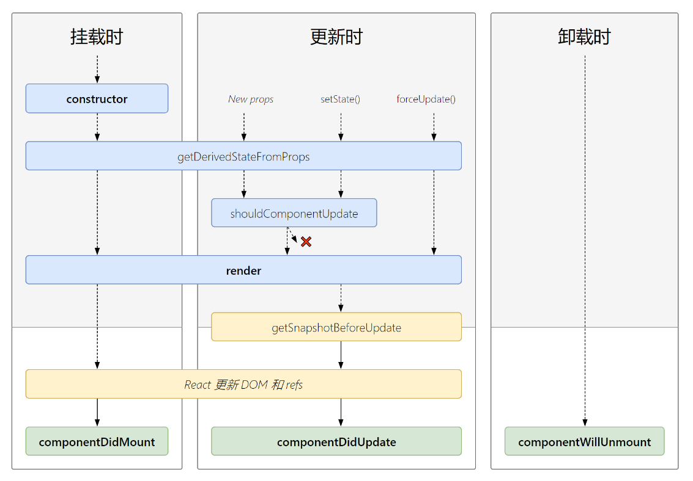

# React

[TOC]

## 1. React入门

- `React`使用虚拟`DOM`，不总是直接操作页面的真实`DOM`，以至于会比较高效
- 使用`DOM Diffing`算法，最小化页面重绘

### 1.1 React的基本使用

#### 1.1.1 相关js库

1. `react.js`：`React`核心库
2. `react-dom.js`：提供操作`DOM`的`react`扩展库
3. `babel.min.js`：解析`JSX`语法转换为`JS`代码的库

#### 1.1.2 创建虚拟DOM

**jsx创建虚拟DOM**:star:

1. 创建`index.html`并准备“容器”

   ```
   <div id="test"></div>
   ```

2. 引入`react`依赖库

   ```html
   <!-- 引入react和核心库 -->
   <script type="text/javascript" src="../js/16.x/react.development.js"></script>
   <!-- 引入react-dom，用于支持react操作DOM -->
   <script type="text/javascript" src="../js/16.x/react-dom.development.js"></script>
   <!-- 引入babel，用于将jsx转化为js -->
   <script type="text/javascript" src="../js/16.x/babel.min.js"></script>
   ```

3. 编写`jsx`

   ```html
   <script type="text/babel">
       // 1. 创建虚拟DOM
       const VDOM = <h1>Hello React</h1> // jsx不需要加引号
   
       // 2. 渲染虚拟DOM到页面 
       ReactDOM.render(VDOM, document.getElementById("test"))
   </script>
   ```

   `render`默认为覆盖不是追加

**js创建虚拟DOM**

```html
<script type="text/javascript">
    const VDOM = React.createElement("h1", {id: "title"}, "Hello React") 

    ReactDOM.render(VDOM, document.getElementById("test"))
</script>
```

对于多层级的虚拟`DOM`，`js`就会显得十分繁琐，`jsx`挺身而出

#### 1.1.3 虚拟DOM与真实DOM

1. `React`提供了一些`API`来创建一种 “特别” 的一般js对象

   ```jsx
   const VDOM = (
       <h1 id="test">
       <span>Hello React</span>
       </h1>
   )
   ```

   上面创建的就是一个简单的虚拟`DOM`对象

   虚拟`DOM`的本质是`Object`类型的对象

   虚拟`DOM`相比真实`DOM`属性会少很多

2. 虚拟`DOM`对象最终都会被`React`转换为真实的`DOM`

3. 我们编码时基本只需要操作`react`的虚拟`DOM`相关数据, `react`会转换为真实`DOM`变化而更新界。

### 1.2 React Jsx

#### 1.2.1 简介

1. `jsx`全称`JavaScript XML`

2. `react`定义的一种类似于`XML`的`JS`扩展语法

3. 本质是`React.createElement(Component, props, ...children)`方法的语法糖

4. 作用：用来简化创建虚拟`DOM`

   写法

   ```jax
   var ele = <h1>Hello JSX</h1>
   ```

   它不是字符串，也不是`HTML/XML`标签

   它最终产生的就是一个`js`对象

5. 标签名任意：`HTML`标签或其他标签

#### 1.2.2 基本语法

1. 定义`DOM`是，不要写引号

2. 如果说标签内的内容是一个变量则需要`{}`进行取值

   ```html
   <script type="text/babel">
       // 1. 创建虚拟DOM
       const id = "haha"
       const data = "Hello React"
       const VDOM = (
           <h2 id={id}>
           	<span>{data}</span>
           </h2>
       )
   
       // 2.渲染虚拟DOM到页面
       ReactDOM.render(VDOM, document.getElementById("test"))
   </script>
   ```

3. 样式的类名指定不能用`class`，要用`className`

   ```html
   <style>
       .title{
           background-color: orange;
           width: 200px;
       }
   </style>
   <script type="text/babel">
       const VDOM = (
           <h2 className="title">
           	<span>"Hello React"</span>
           </h2>
       )
   
       ReactDOM.render(VDOM, document.getElementById("test"))
   </script>
   ```

4. 内敛样式需要使用`{{}}`，且如果是`font-size`这样有两个单词组成的需要用驼峰命名法

   ```html
   <script type="text/babel">
       const VDOM = (
           <h2>
           	<span style={{color: 'red', fontSize: '30px'}}>"Hello React"</span>
           </h2>
       )
   
       ReactDOM.render(VDOM, document.getElementById("test"))
   </script>
   ```

5. `jsx`只能有一个根标签

6. 标签必须闭合

   ```html
   <script type="text/babel">
       const VDOM = (
           <h2>
           	<input type="text" />
           </h2>
       )
   
       ReactDOM.render(VDOM, document.getElementById("test"))
   </script>
   ```

7. 首字符小写标签仅能为`html`的标准标签，首字符大写是一个自定义的组件

#### 1.2.3 练习

`jsx`动态渲染数据

- 表达式：一个表达式会产生一个值，可以放在任何一个需要值的地方

  变量

  函数。。。

- 语句(代码)：

  `if`语句，`for`语句

- 对于`jsx`内部的`{}`只能为表达式

```html
<div id="test"></div>
<script type="text/babel">
// 模拟后端数据
const data = ["Angular", "React", "Vue"]
const VDOM = (
	<div>
		<h1>前端js框架列表</h1>    
		<ul>
			{
				data.map((item, index) => {
					return <li key={index}>{item}</li>
				})
			}   
    	</ul>
    </div>
    )
	ReactDOM.render(VDOM, document.getElementById("test"))
</script>
```

每一个虚拟`DOM`节点，都需要一个`key`用来作为唯一标识

### 1.3 模块与组件、模块化与组件化

#### 1.3.1 模块

1. 理解：向外部提供特定功能的`js`程序，一般就是一个`js`文件
2. 为什么要拆分模块：随着业务逻辑的增加，代码越来越多且复杂
3. 作用：复用`js`，简化`js`的编写，提高`js`运行效率

#### 1.3.2 组件

1. 理解：用来实现局部功能效果的代码和资源的集合`html/css/js/image`等等
2. 为什么需要组件：一个界面的功能太过复杂
3. 作用：复用编码，简化项目编码，提高运行效率

#### 1.3.3 模块化

当应用的`js`都已模块来编写的，这个应用就是一个模块化的应用

#### 1.3.4 组件化

当应用是以多组件的方式实现的，这个应用就是一个组件化的应用

## 2. React面向组件开发

### 2.1 基本理解和使用

#### 2.1.1 使用React开发者工具调试

安装插件`React Developer Tools`

#### 2.1.2 组件的创建方式

**函数式组件**

```html
<div id="test"></div>
<script type="text/babel">
    // 1. 创建函数式组件
    function MyComponent() {
        return (
            <h1>函数式组件，适用于简单组件的定义</h1>
        )
    }

    // 2. 渲染组件到页面
    ReactDOM.render(<MyComponent />, document.getElementById("test"))
</script>
```

函数内部的`this`是`ubderfined`，因为`babel`编译后开启了严格模式

`render`之后的过程

1. `React`解析组件标签，找到了`MyComponent`组件
2. 返现组件是使用函数定义的，随后调用该函数，将返回的虚拟`DOM`转为真实`DOM`，随后呈现在页面中

**类式组件**

```
<div id="test"></div>
<script type="text/babel">
// 1. 创建类式组件
class MyComponent extends React.Component{
    render() {
        return (
            <h2>我是用类定义的组件</h2>
        )
    }
}

// 2. 渲染组件到页面
ReactDOM.render(<MyComponent />, document.getElementById("test"))
```

`render`是放在了原型对象上，供实例使用

`render()`函数内部的`this`指向`MyComponent`的实例对象

`ReactDOM.render`之后的过程

1. `React`解析组件标签，找到了`MyComponent`组件
2. 发现组件是类定义的，随后创建该类的实例，并通过该实例代用原型上的`render`方法
3. 将`render`返回的虚拟`DOM`转换为真实`DOM`，随后呈现在页面中

**总结**

函数式组件适用于简单组件

类式组件适用于复杂组件

### 2.2 三大核心属性

三大核心属性仅仅针对类式组件

#### 2.2.1 state

**理解**

1. `state`是组件对象最重要的属性，值是对象(可以包含多个`key-value`的组合)
2. 组件被称为''状态机“，通过更新组件的`state`来更新对应的页面显示(重新渲染组件)

**强烈注意**

1. 组件中的`render`方法中的`this`为组件实例对象

2. 组件自定义的方法中`this`为`undefined`

   强制绑定`this`通过函数对象的`bind()`

   箭头函数

3. 状态数据，不能直接修改或更新

**动态渲染数据**

```jsx
<div id="test"></div>
<script type="text/babel">
    // 1. 创建类式组件
    class Weather extends React.Component{

        // 初始化状态
        state = {
            isHot: true
        }
        render() {
            return (
                <h2 id="title" onClick={this.changeWeather}>今天天气很{this.state.isHot ? "炎热" : "凉爽"}</h2>
            )
        }

        // 自动以方法要用赋值语句的形式+箭头函数
        changeWeather = () => {
            this.setState({isHot: !this.state.isHot})
        }
    }

    // 2. 渲染组件到页面
    ReactDOM.render(<Weather />, document.getElementById("test"))
</script>
```

#### 2.2.2 props

需求：自定义用来显示一个人员信息的组件

- 名字必须指定，且为字符串类型
- 性别为字符串类型，如果性别没有指定，默认为男
- 年龄必须指定，且为数字类型

对`props`的属性进行限制，属性的限制需要引入`prop-types.js`

```javascript
// 对Person属性的类型进行限制
static propTypes = {
    // string类型为字符串，isRequired必须有值
    name: PropTypes.string.isRequired,
    sex: PropTypes.string,
    age: PropTypes.number,
    speak: PropTypes.func
}  

// 设置属性的默认值
static defaultProps = {
    sex: "待鉴定",
    age: 18
}
```

渲染组件

```jsx
render() {
    return (
        <ul>
            <li>姓名：{this.props.name}</li>
            <li>性别：{this.props.age + 1}</li>
            <li>年龄：{this.props.sex}</li>
        </ul>
    )
}
```

传递`props`的两种方式

1. 直接传递

   ```jsx
   ReactDOM.render(<Person name="Tom" age={18} sex="男"/>, document.getElementById("test"))
   ```

2. `...`传递

   ```jsx
   const p = {name: "老刘", age: 19}
   ReactDOM.render(<Person {...p}/>, document.getElementById("test"))
   ```

**理解**

1. 每个组件对象都会有`props(properties)`属性
2. 组件标签的所有属性都保存在`props`中

**注意**

`props`的属性是只读的

函数式组件使用`props`

```jsx
function Person(props) {
    return (
        <ul>
            <li>姓名：{props.name}</li>
            <li>性别：{props.age + 1}</li>
            <li>年龄：{props.sex}</li>
        </ul>
    )
}

ReactDOM.render(<Person name="Alcie" age={18} sex="女" />, document.getElementById("test"))
```

对于属性限制，限制只能写在函数的外部

#### 2.2.3 refs

组件内的标签可以定义`ref`属性来标识自己，相当于`id`属性，`ref`指定的值都会被收集到`refs`属性中

1. 字符串形式的`ref`：不推荐使用

   `render`

   ```jsx
   <input type="text" ref="input1" placeholder="点击按钮提示数据"/>
   <button onClick={this.showData} >点我提示左侧的数据</button>
   ```

   方法

   ```jsx
   showData = () => {
   	alert(this.refs.input1.value)
   }
   ```

2. 回调函数形式的`ref`

   `render`，`c`为当前节点对象

   ```jsx
   <input type="text" ref={(c) => {this.input1 = c}} placeholder="点击按钮提示数据"/>
   <button onClick={this.showData} ref="btn">点我提示左侧的数据</button>&nbsp;
   <input onBlur={this.showData2} type="text" ref={c => this.input2 = c} placeholder="失去焦点提示"/>
   ```

   方法

   ```jsx
   showData = () => {
   	alert(this.input1.value)
   }
   
   showData2 = () => {
   	alert(this.input2.value)
   }
   ```

   对于内敛的`ref`会在组件更新时调用两次，第一的参数为`null`，第二次的参数为当前节点，如果不想要调用两次，需要将方法绑定在类上

   ```jsx
   <div>
       <h2>今天天气很{this.state.isHot ? "炎热" : "凉爽"}</h2>
       <button onClick={this.showData}>点我获取天气</button>&nbsp;
   </div>
   ```

   方法

   ```jsx
   state ={
   	isHot: false
   }
   showData = (c) => {
   	this.setState({isHot: !this.state.isHot})
   }
   ```

3. `createRef`

   首先创建容器

   ```
   myRef = React.createRef()
   ```

   `React.createRef`调用后可以返回一个容器，该容器可以存储被ref所标识的节点，一个容器只能存储一个节点

   创建`jsx`结构

   ```jsx
   <div>
       <input type="text" ref={this.myRef} placeholder="点击按钮提示数据"/>
       <button onClick={this.showData} ref="btn">点我提示左侧的数据</button>&nbsp;
   </div>
   ```

   创建方法

   ```javascript
   showData = () => {
   	alert(this.myRef.current.value)
   }
   ```

#### 2.2.4 三大属性与事件处理

1. 通过`onXxx`属性来指定事件处理函数

   `React`使用的是自定义(合成)事件，而不是使用原生的`DOM`事件----为了更好的兼容性

   `React`中的事件是通过事件委托方式处理的(委托给组件最外层的元素)-----为了高效

2. 当发生事件的`DOM`与要操作的`DOM`相同时，可以省略`ref`通过`event.target`得到发生事件的`DOM`元素对象

   ```jsx
   <input onBlur={this.showData} type="text" placeholder="失去焦点提示数据"/>
   showData = (event) => {
   	alert(event.target.value)
   }
   ```

### 2.3 收集表单数据

包含表单组件的分类

1. 非受控组件

   现用现取

   ```jsx
   class Login extends React.Component{
   
       handleSubmit = (event) => {
       	event.prevenDefault() // 阻止表单提交
       	const {username, password} = this
       	alert(`用户名：${username.value}，密码：${password.value}`)
       }
   
       render() {
           return (
               <form action="http://www.baidu.com" onSubmit={this.handleSubmit}>
                   用户名：<input ref={c => this.username = c} type="text" name="username"/>
                   密码：<input ref={c => this.password = c} type="password" name="password" />
                   	<button>登录</button>
               </form>
           )
       }
   }
   ```

2. 受控组件：推荐使用

   将需要的信息存储在`state`中

   ```jsx
   class Login extends React.Component{
   
       // 初始化状态
       state = {
           username: "",
           password: ""
       }
   
       handleSubmit = (event) => {
           event.prevenDefault() // 阻止表单提交
   
           const {username, password} = this.state
           alert(`用户名：${username}，密码：${password}`)
       }
   
       // 保存用户名密码到状态中
       saveFormData = (dataType) => {
           return (event) => {
               this.setState({[dataType]: event.target.value})
           }
       }
       render() {
           return (
               <form onSubmit={this.handleSubmit}>
                   用户名：<input onChange={this.saveFormData("username")} type="text" name="username"/>
                   密码：<input onChange={this.saveFormData("password")} type="password" name="password" />
                   <button>登录</button>
               </form>
           )
       }
   }
   ```

   对于`saveFormData`就是一个高阶函数

   高阶函数：

   - 若`A`函数，接受的参数是一个函数，那么`A`就可以成为高阶函数
   - 若`A`函数，调用的返回值依然是一个函数，那么`A`就可以称之为高阶函数
   - 常见的高阶函数：`Promise`、`setTimeout`、`arr.map()`

   函数的柯里化：

   - 通过函数调用继续返回函数的方式，实现多次接受参数最后统一处理的函数编码形式

### 2.4 组件的生命周期

组件分为挂载和卸载

- 当组件被渲染到页面上时，称为挂载

- 当组件被从页面中移除时，称为卸载

  ```javascript
  // 参数为指定的容器
  ReactDOM.unmountComponentAtNode(document.getElementById("test"))
  ```

  

#### 2.4.1 生命周期理解

1. 组件从创建到死亡它会经历一些特定的阶段
2. `React`中包含了一系列钩子函数(生命周期回调函数)，会在特定的时刻调用
3. 我们定义组件时，会在特定的生命周期回调函数中做特定的工作

#### 2.4.1 生命周期钩子

1. 旧版本的钩子


- 初始化阶段：由`ReactDOM.render()`触发

  `constructor` 

  `componentWillMount` 

   :star:`render` 

   :star:`compoonentDidMount`：一般用于初始化的操作，订阅消息，会接受`preProps`和`preState`作为参数，新版本中还会接受`getSnapshotBeforeUpdate`的快照值

- 更新阶段：由组件内部`this.setState()`或者父组件重新`render`触发

  `shouldConponentUpdate`：仅当返回值为`true`是，组件允许更新，如果是`forceUpdate()`将会跳过验证

  `componentWillUpdate`

  `render`

  `componentDidUpdate`

- 卸载组件：由`ReactDOM.unmountComponentAtNode:()`触发

  :star:`componentWillUnmount`：一般用于收尾工作，取消订阅

2. 新版本的钩子



对于新版的钩子，由于以下三个钩子经常被误用，所以`componentWillMount`、`componentWillReceiveProps`、`componentWillUpdate`需要加上前缀`UNSAFE_`

- 初始化阶段：由`ReactDOM.render`触发

  `constructor`

  `getDerivedStateFromProps`

  `render`

  `componentDidMount()`

- 更新阶段

  `getDerivedStateFromProps`

  `shouldComponentUpdate`

  `render`

  `getSnapshotBeforeUpdate`

  `componentDidUpdate`

- 卸载组件：由`ReactDOM.umountComponentAtNode`触发

  `componentWillUnmount`

### 2.5 Diffing算法

`Diffing`算法的最小力度是标签

#### 2.5.1 key的作用

1. 虚拟`DOM`中`key`的作用

   - 简单来说：`key`是虚拟`DOM`对象的标识，在更新显示时`key`起着极其重要的作用

   - 详细的说：当状态中的数据发生变化时，`react`会根据【新数据】生成【新的虚拟`DOM`】,随后`React`进行了【新虚拟`DOM`】与【旧虚拟`DOM`】的`diff`比较，比较规则如下：

     旧虚拟`DOM`中找到了与新虚拟`DOM`相同的`key`

     - 若虚拟`DOM`内容没变，直接使用之前的真实`DOM`
     - 若虚拟`DOM`内容变了，则生成新的真实`DOM`，随后替换掉页面之前的真实`DOM`

     旧虚拟`DOM`中未找到与新虚拟`DOM`相同的`key`，根据数据创建新的真实`DOM`，随后渲染到页面

2. 用`index`作用作为`key`可能会引发的问题

   - 若对数据进行：逆序添加、逆序删除等破坏顺序操作：会产生没有必要的真实`DOM`更新 ==> 界面效果没问题，但效率低
   - 如果结构中还包含输入类的`DOM`：会产生错误`DOM`更新 ==> 界面有问题
   - 如果不存在对数据的逆序添加、逆序删除等破坏顺序的操作，仅用于渲染列表用于展示，使用`index`作为`key`是没有问题的

3. 开发中如何选择`key`

   - 最好使用每条数据的唯一标识作为`key`、比如`id`、手机号、身份证号、学号等唯一值
   - 如果确定只是简单的展示数据，用`idnex`也是可以的

## 3. React脚手架

### 3.1 react脚手架

1. `xxx`脚手架: 用来帮助程序员快速创建一个基于`xxx`库的模板项目

   包含了所有需要的配置（语法检查、`jsx`编译、`devServer`…）

   下载好了所有相关的依赖

   可以直接运行一个简单效果

2. `react`提供了一个用于创建react项目的脚手架库: `create-react-app`

3. 项目的整体技术架构为:  `react` + `webpack`+ ``es6` + `eslint`

4. 使用脚手架开发的项目的特点: 模块化, 组件化, 工程化

### 3.2 创建项目并启动

1. 全局安装

   ```bash
   npm install -g create-react-app
   ```

2. 切换到想创项目的目录，使用命令

   ```bash
   create-react-app hello-react
   ```

3. 进入项目文件夹

   ```bash
   cd hello-react
   ```

4. 启动项目

   ```bash
   npm start
   ```

5. 常用命令

   ```bash
   npm start # 启动项目
   npm build # 编译打包项目
   npm test # 测试
   npm eject # 显示配置文件
   ```

### 3.3 react脚手架项目结构

```
public ---- 静态资源文件夹
    favicon.icon ------ 网站页签图标
    index.html -------- 主页面 --重要
    logo192.png ------- logo图
    logo512.png ------- logo图
    manifest.json ----- 应用加壳的配置文件
    robots.txt -------- 爬虫协议文件
src ---- 源码文件夹
    App.css -------- App组件的样式
    App.js --------- App组件 --重要
    App.test.js ---- 用于给App做测试
    index.css ------ 样式
    index.js ------- 入口文件 --重要
    logo.svg ------- logo图
    reportWebVitals.js
    	--- 页面性能分析文件(需要web-vitals库的支持)
    setupTests.js
    	---- 组件单元测试的文件(需要jest-dom库的支持)
```

### 3.4 功能界面的组件化编码流程

1. 拆分组件：拆分界面抽组件

2. 实现静态组件：使用组件实现静态页面效果

3. 实现动态组件

   - 动态显示初始化数据

     数据类型

     数据名称

     保存在哪个组价

   - 交互(从绑定事件监听开始)

### 3.5 常用库

1. 唯一id

   安装

   ```bash
   npm i uuid
   ```

   使用

   ```js
   import {nanoid} from 'nanoid'
   
   // 返回一个字符串类型的id
   id = nanoid()
   ```

2. 类型限制

   安装

   ```bash
   npm i prop-types
   ```

   使用

   ```js
   import PropTypes from 'prop-types'
   
   static propTypes = {
       id: PropTypes.string.isRequired,
       name: PropTypes.string.isRequired,
       done: PropTypes.bool.isRequired,
       updateTodo: PropTypes.func.isRequired
   }
   ```


### 3.6 状态提升

如果对于A、B两兄弟组件，状态数据需要共享，那就需要把他们的状态统一放到其父组件中，通过父组件向其传递状态


1. 父组件向子组件传递数据，通过`props`


2. 子组件向父组件传递数据

   如果是子组件向父组件传递数据，就需要在父组件创建函数，然后将其传递给子组件，子组件进行调用时，将数据传递给父组件

   ```mermaid
   graph TD
   子组件 --> |函数|父组件
   ```

## 4. React ajax

### 4.1 理解

#### 4.1.1 前置说明

1. `React`本身只关注界面，并不包含发送`ajax`请求的代码
2. 前端应用需要通过`ajax`请求与后台进行交互(`json`数据)
3. `react`应用中需要集成第三方`ajax`库(或自己封装)

#### 4.1.2 常用的`ajax`请求库

1. `jQuery`比较重，如果需要另外引用不建议使用
2. `axios`轻量级，建议使用
   - 封装`XmlHttpRequest`对象的`ajax`
   - `promis`风格
   - 可以用在浏览器端和`node`服务器端

### 4.2 axios

#### 4.2.1 安装使用

1. 安装

   ```
   npm add axios
   ```

2. 使用

   ```jsx
   import React, { Component } from 'react'
   import axios from 'axios'
   
   export default class App extends Component {
       getStudentData = () => {
           axios.get('www.baidu.com')
           .then(
               res => {
                   console.log(res.data)
               },
               error => {
                   console.log(error)
               }
           )
           
       }
   
       render() {
           return (
               <div>
                   <button onClick={this.getStudentData}>点我获取数据</button>
               </div>
           )
       }
   }
   ```

   