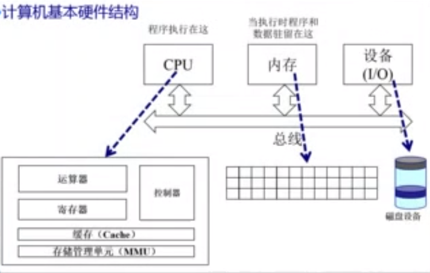
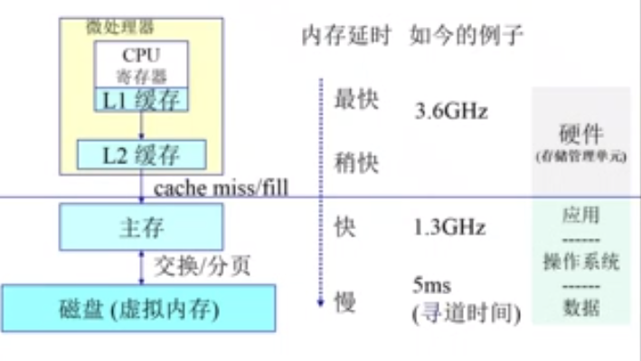

# 操作系统

[TOC]

## 1. 操作系统的启动

### 1.1 启动

操作系统本质也是一个程序，放置在硬盘中(DISK)

`BIOS`(基本I/O处理系统)用于计算机通电之后检测外设

`Bootloader`：加载`OS`，一般放在硬盘的第一个主引导扇区，大小为`512`字节，由`BIOS`加载至内存，将`os`加载至内存后，`bootloader`让出`CPU`的控制权至操作系统(即跳转至操作系统的起始内存地址)

### 1.2 os与设备程序的交互

对于外部设备，操作系统通过`I/O`和中断进行交互

对于应用程序，操作系统通过系统调用和异常来进行交互

- 系统调用：应用程序主动向操作系统发出服务请求
- 异常：非法指令或者其他坏的处理状态(如：内存出错)
- 中断：来自不同的硬件设备的计时器和网络的中断

**操作系统存在的意义**

对于计算机硬件而言，操作系统是被信任的第三方，而其他应用程序则是不可信任的，可能会造成恶意破坏

操作系统能够屏蔽硬件的复杂性和差异性，提供统一的接口来供应用程序进行调用

#### 1.2.1 系统调用、中断、异常三者的差异

1. 源头

   中断：外设

   异常：应用程序意想不到的行为

   系统调用：应用程序请求操作提供服务

2. 处理时间

   中断：异步

   异常：同步

   系统调用：异步或同步

3. 响应状态

   中断：持续，对用户应用程序是透明的

   异常：杀死或者重新执行意想不到的应用程序指令

   系统调用：等待和持续

#### 1.2.2 中断和异常处理机制

对于中断硬件和软件都需要提供相应的支持

**硬件**

1. 设置中断标记[`CPU`初始化]即中断号
2. 将内部、外部事件设置中断标记
3. 中断事件的`ID`

**软件**

1. 保存当前处理状态(保存`CPU`寄存器的数据)
2. 中断服务程序处理
3. 清除中断标记
4. 恢复之前保存的处理状态

**异常**

异常不同于中断的情况在于异常处理，

1. 保存现场

2. 异常处理

   杀死了产生了异常的程序

   重新执行异常指令

3. 恢复现场

**系统调用**

程序访问主要是通过高层次的`API`接口而不是直接进行系统调用

- `Win32 API`用于`Windows`
- `POSIX API`用于`POSIX-based systems`包括`UNIX`、`LINUX`、`Mac OS`的所有版本
- `Java API`用于`JAVA`虚拟机`JVM`

应用程序进行系统调用时会触发**用户态**到**内核态**的转换

用户态不能直接访问`I/O`以及某些特殊的机器指令，内核态反之

#### 1.2.3 跨越操作系统边界的开销

在执行时间上的开销超过程序调用

主要开销

- 建立中断/异常/系统调用号与对应服务历程映射关系的初始化开销
- 建立内核堆栈
- 验证参数
- 内核态映射到用户态的地址空间更新页面映射权限
- 内核态独立地址空间`TLB`

## 2. 内存管理

### 2.1 计算机体系结构/内存分层体系

抽象：逻辑地址空间

保护：独立地址空间

共享：访问相同内存

虚拟化：更多的地址空间

操作系统管理内存的不同方法

- 程序重定位
- 分段
- 分页
- 虚拟内存
- 按需分页虚拟内存

操作系统管理内存的实现高度依赖于硬件，通过`MMU`(内存管理单元)：硬件组件负责处理`CPU`的内存访问请求

### 2.2 地址空间&地址生成

### 2.3 连续内存分配