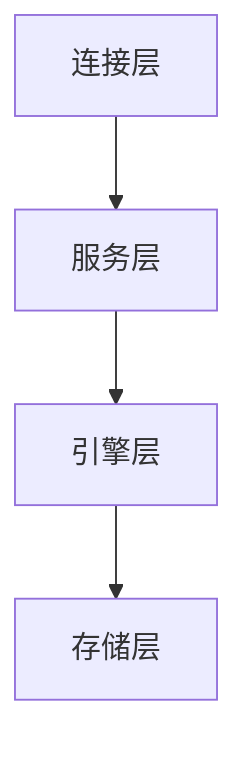

# MySQL高级

[TOC]

## 1. 概述

### 1.1 安装目录

| 路径              | 解释                      | 备注                       |
| ----------------- | ------------------------- | -------------------------- |
| /var/lib/mysql/   | mysql数据库文件的存放路径 | /var/lib/mysql/test.pid    |
| /usr/share/mysql  | 配置文件目录              | mysql.server命令及配置文件 |
| /usr/bin          | 相关命令目录              | mysqladmin mysqldump等命令 |
| /etc/init.d/mysql | 启停相关脚本              |                            |

### 1.2 配置文件

`log-bin`：二进制日志文件用于主从复制

`log-error`：错误日志，默认是关闭的。记录严重的警告和错误信息，记录每次启动和关闭的详细信息等

`log`：查询日志，默认关闭，记录查询的`sql`语句，如果开启会降低`mysql`的整体性能，因为记录日志也是需要消耗系统资源的

数据文件

- 数据库文件：`/var/lib/mysql`
- `frm`文件：存放表结构
- `myd`文件：存取表数据
- `myi`文件：存放表结构

### 1.3 逻辑架构



1. 连接层

   最上层是一些客户端和连接服务，包含本地`sock`通信和大多数基于客户端/服务端工具实现的类似于`tcp/ip`的通信。主要完成一些类似于连接处理、授权认证、及相关的安全方案。在该层上引入了线程池的概念，为通过认证安全接入的客户端提供线程。同样在该层上可以实现基于`SSL`的安全连接。服务器也会为安全接入的每个客户端验证它所具有的操作权限

2. 服务层

   第二层架构主要完成大多少的核心服务功能呢，如`SQL`接口，并完成缓存的查询，`SQL`的分析和优化及部分内置函数的执行。所有跨存储引擎的功能也在这一层实现，如过程、函数等。在该层，服务器会解析查询并创建相应的内部解析树，并对其完成相应的优化如确定查询表的顺序，是否利用索引等，最后生成相应的执行操作。如果是`select`语句，服务器还会查询内部的缓存。如果缓存空间足够大，这样在解决大量读操作的环境中能够很好的提升系统的性能

3. 引擎层

   存储引擎层，存储引擎真正的负责了`MySQL`中数据的存储和提取，服务器通过`API`与存储引擎进行通信。不同的存储引擎具有的功能不同，这样我们可以根据自己的实际需要进行选取

4. 存储层

   数据存储层，主要讲数据存储在运行于裸设备的文件系统之上，并完成与存储引擎的交互

### 1.4 存储引擎

1. 查看当前`mysql`提供的存储引擎

   ```sql
   SHOW ENGINES;
   ```

2. 查看默认引擎以及当前引擎

   ```
   
   ```

   

