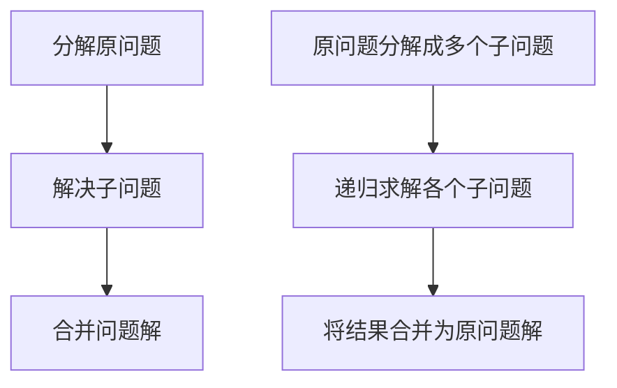
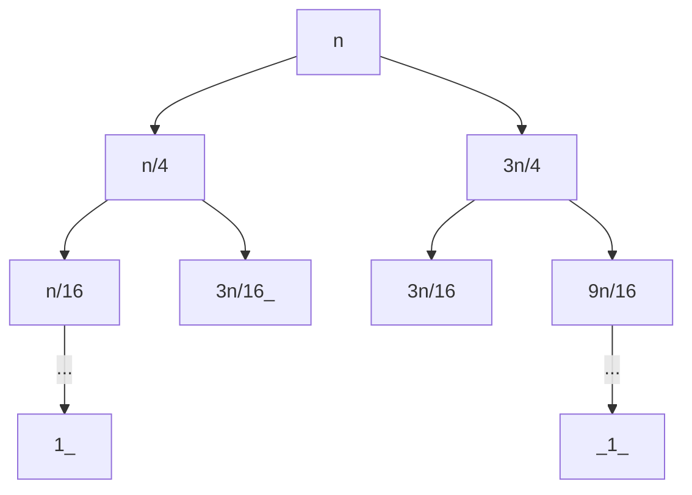

# 算法设计与分析

[TOC]

## 1. 算法绪论

### 1.1 定义

**计算问题**

定义：给定数据的输入，计算满足某种性质输出的问题

**算法**

给定计算问题，算法是一系列良定义(没有歧义)的计算步骤(计算机可实现的指令)

**算法的性质**

- 有穷性：算法必须在有限个计算步骤后终止
- 确定性：算法必须是没有歧义的
- 可行性：算法可一步一步地执行

### 1.2 算法的表示

- 自然语言

  算法的设计者依靠自然语言交流和表达，描述可能会有歧义以及冗余

- 编程语言

  使用不同的编程语言来描述算法，但是不同的编程语言之间存在差异性

- 伪代码

  能够简洁表达算法的本质，不拘泥于具体实现细节

  能够准确反映算法过程，不产生矛盾和歧义

选择排序

```伪代码
输入：数组A[a1, a2, ..., an]
输出：升序数组A'[a1', a2', ..., a3']
for i ← 1 to n -1 do
	cur_min ← A[i]
	cur_min_pos ← i
	for j ← i + 1 to n do
		if A[j] < cur_min then
			// 记录当前最小值及其位置
			cur_min ← A[j]
			cur_min_pos ← j
		end
	end
	交换A[i]和A[cur_min_pos]
end
```

### 1.3 算法分析

渐进分析：忽略时间复杂度`T(n)`的系数和低阶项，仅仅关注高阶项，用记号`Θ`来表示

| 渐进记号     | 名称       |
| ------------ | ---------- |
| T(n)=Θ(g(n)) | 渐进紧确界 |
| T(n)=O(g(n)) | 渐进上界   |
| T(n)=Ω(g(n)) | 渐进下界   |

**Θ：渐进紧确界**

对于给定的函数`g(n)`，`Θ(g(n))`表示为以下函数的集合
$$
Θ(g(n))=\{T(n):∃c1,c2,n_0>0,使得∀n≥n_0,c_1g(n)≤T(n)≤c_2g(n)\}
$$
**O：渐进上界**

对于给定的函数`g(n)`，`O(g(n))`表示以下函数的集合
$$
Θ(g(n))=\{T(n):∃c,n_0>0,使得∀n≥n_0,0≤T(n)≤cg(n)\}
$$
**Ω：渐进下界**

对于给定的函数`g(n),Ω(g(n))`表示以下函数的集合
$$
Θ(g(n))=\{T(n):∃c,n_0>0,使得∀n≥n_0,0≤cg(n)≤T(n)\}
$$

## 2. 分而治之

一般步骤



### 2.1 归并排序

1. 将数组`A[1, n]`排序问题分解为`A[1, n/2]`和`A[n/2 + 1, n]`的排序问题	分解原问题
2. 递归解决子问题得到两个有序的子数组    解决子问题
3. 将两个有序子数组合并为一个有序数组    合并问题解

伪代码

```伪代码
输入：数组A[1...n],数组下标left,right
输出：递增数组A[left...right]
if left ≥ right then
	return A[left...right]
end
mid ← (left+right)/2
mergeSort(A, left, mid)
mergeSort(A, mid + 1, right)
merge(A, left, mid, right)
return A[left...right]

输入：数组A[1...n]，数组下标left,mid,right
数组：递增数组A[left...right]
A‘[left...right] ← A[left...right]
i ← left,j ← mid + 1, k ← 0
while i ≤ mid and j ≤ right do
	if A'[i] ≤ A’[j] then
		A[left + k] ← A'[i]
		k ← k + 1, i ← i + 1
	end
	else
		A[left + k] ← A'[j]
		k ← k + 1, j ← j + 1
if i ≤ mid then
    A[left + k ... right] ← A'[i ... mid]
end
else
    A[left + k ... right] ← A'[j ... right]
end
return A[left ... right]
```

时间复杂度
$$
2T(n/2) + O(n), n>1
$$

$$
O(1),n=1
$$

代码实现

```java
/*
* 归并排序
* */

import java.util.Arrays;

public class MergeSortTest {
    public static void main(String[] args) {
        int[] arr = {9, 5, 0, 3, 2, 7, 4, 1, 9};
        mergeSort(arr, 0, arr.length - 1);
        System.out.println(Arrays.toString(arr));
    }
    public static void mergeSort(int[] arr, int begin, int end) {
        if(begin >= end) return;
        int mid = (begin + end) >> 1;
        mergeSort(arr, begin, mid);
        mergeSort(arr, mid + 1, end);
        merge(arr, begin, mid, end);
        System.out.println(Arrays.toString(arr));
    }

    public static void merge(int[] arr, int begin, int mid, int end) {
        int[] temp = new int[end - begin + 1];

        int i = begin, j = mid + 1, k = 0;
        while(i <= mid && j <= end) {
            if(arr[i] <= arr[j]) {
                temp[k] = arr[i];
                i++;
            } else {
                temp[k] = arr[j];
                j++;
            }
            k++;
        }
        while(i <= mid) {
            temp[k] = arr[i];
            k++;
            i++;
        }
        while(j <= end) {
            temp[k] = arr[j];
            k++;
            j++;
        }

        for(i = 0; i < temp.length; i++) {
            arr[begin + i] = temp[i];
        }
    }
}
```

### 2.1 递归式求解

$$
T(n)=T(n/4)+T(3n/4)+n, n >= 4
$$

$$
T(n)=1, n < 4
$$

#### 2.1.1 递归树法



对于递归树的每层的所需要的时间复杂度为`n`，对于叶子节点由于二叉树的一侧的递减速度大于另一侧，最后一层的时间复杂度为一定小于`n`，考虑最坏的情况
$$
T(n) = O(nlog(3/4)n)=O(nlog_n)
$$

#### 2.1.2 代入法

猜测：
$$
T(n)=Θ(nlog_n)
$$
即证明
$$
Θ(g(n))=\{T(n):∃c_1,c_2,n_0>0,使得∀n≥n_0,c_1*nlog_n≤T(n)≤c_2*nlog_n\}
$$
使用数学归纳法容易证明此猜测成立

#### 2.1.3 主定理法

- 第一种情况
  $$
  T(n)=aT(n/b)+f(n)，常数a>=1，b>=1
  $$
  