# 红黑树(Red Black Tree)

[TOC]

## 1. B树

B树是一种平衡的多路搜索树，多用于文件系统，数据库的实现

### 1.1 B树的特点

1. 1个节点可以存储超过2个元素，可以拥有超过2个子节点
2. 拥有二叉搜索树的性质
3. 平衡、每个节点的所有子树高度一致
4. 高度较矮

### 1.2 B树的性质

1. m阶B树：即每个子节点最多拥有三个子节点
2. 假设一个节点存储的元素为`x`：根节点`1<= x<= m-1`，非根节点：`ceil(m/2) -1 <= x <= m-1`
3. 如果有子节点，子节点个数`y = x + 1`
4. 如果是根节点`2 <= y <= m`
5. 如果是非根节点：`ceiling(m/2) <= y <= m`

如果`m = 2`，那`B`树是一棵二叉树搜索树

如果是数据库的话，一般为`200 ~ 300`阶的B树

### 1.3 B树与二叉搜索树

**合并**

对于二叉搜索树多代合并，会得到一个超级节点

- 2代合并的超级节点最多有4个子节点(至少是4阶B树)
- 3代合并的超级节点最多有8个子节点(至少是8阶B树)
- n代合并的超级节点最多有`2^n`个子节点

**B树搜索查找**

跟二叉搜索树树的搜索类似

- 先在节点内部从小到大开始搜索元素
- 如果命中，搜索结束
- 如果命中，再去对应的子节点中搜索元素，重复步骤1

**添加**

- 新添加的元素必定是添加到叶子节点
- 对于某一个元素添加到叶子节点时，发现叶子节点内的元素数量小于`m-1`，直接放入此节点即可
- 如果添加到的叶子节点的元素数量已经等于`m-1`，则会产生**上溢**的情况

**上溢解决**

- 将当前节点插入到叶子节点
- 求出上溢节点最中间元素的位置`k`
- 将`k`位置的元素向上与父节点合并
- 将`[0, k-1]`和`[k+1, m-1]`位置的元素分裂成`2`个子节点
- 一次分裂完毕后，有可能导致父节点上溢，依然按照上述方法解决
- 最极端的情况，有可能一致分裂到根节点

**删除**

- 如果需要删除的元素在叶子节点中，直接删除
- 如果删除非叶子节点
  1. 先找到前驱或者后继，覆盖所需要删除元素的值
  2. 再把前驱或后继元素删除
- 非叶子节点的前驱或后继元素，必定在叶子节点中

**下溢**

- 叶子节点被删除一个元素后，元素个数可能会低于最低限制`ceil(m/2) -1 <= x <= m-1`，称之为下溢

- 下溢节点的元素数量必然等于`ceil(m/2) - 2`

- 如果下溢节点临近的兄弟节点，有至少`ceil(m/2)`个元素，可以向其接一个元素

  假设父节点中指向当前下溢节点的元素为`b`，兄弟节点的最大元素为`a`

  可以用兄弟节点的元素`a`替换父节点的元素`b`，再将`b`元素放入下溢的节点的首位

- 如果下溢节点临近的兄弟节点，只有`ceil(m/2) - 1`个元素

  将父节点的元素`b`跟左右子节点进行合并

  合并后的节点元素个数等于`ceil(m / 2) + ceil(m / 2) - 2`，不超过`m - 1`

  这个操作可能会导致父节点下溢，依然按照上述方法解决，极端情况根节点也会下溢

**二叉搜索树**

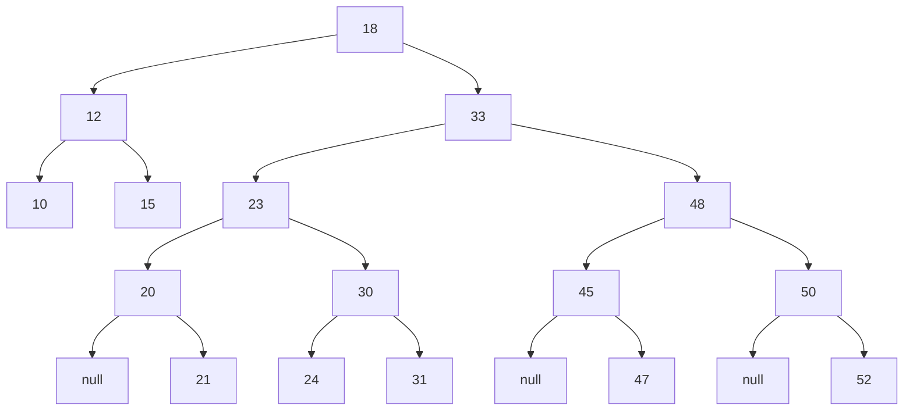

**3阶B树**

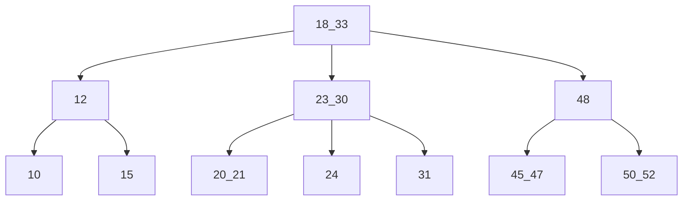

红黑树也是一种自平衡二叉搜索树

红黑树必须满足一下5条性质

1. 节点`RED`或者`BLACK`
2. 根节点是`BLACK`
3. 叶子节点(外部节点、空节点)都是`BLACK`
4. `RED`节点的子节点都是`BLACK`，即`RED`节点的`parent`都是`BLACK`

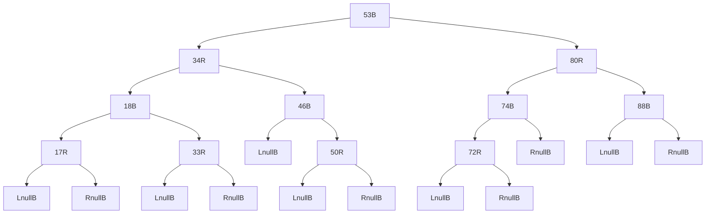

5. 从任一节点到叶子节点的所有路径都包含相同数目的`BLACK`节点

## 2.  红黑树

1. 红黑树和`4`阶`B`树具有等价性

2. `BLACK`节点与它的`RED`子节点融合在一起，形成一个`B`树节点
3. 红黑树的`BLACK`节点个数与`4`阶`B`树的节点总个数相等

### 2.1 红黑树与4阶B树

1. 红黑红

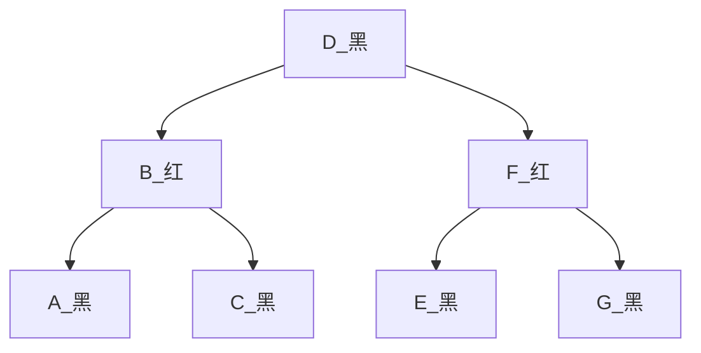

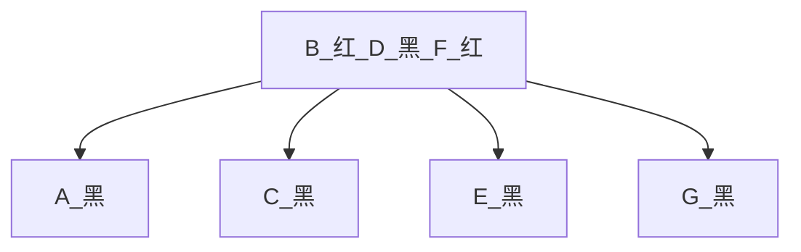

2. 黑红

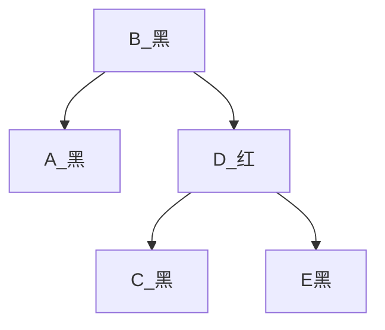

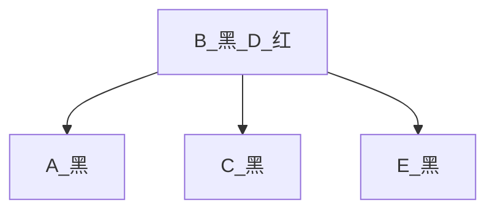

3. 红黑

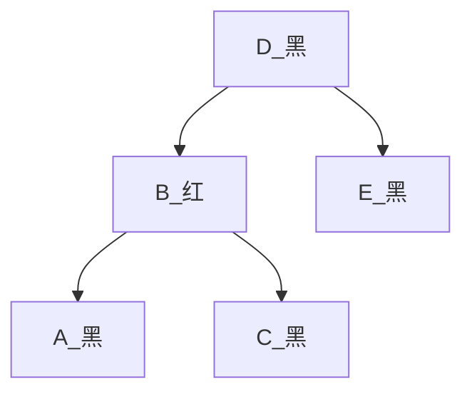

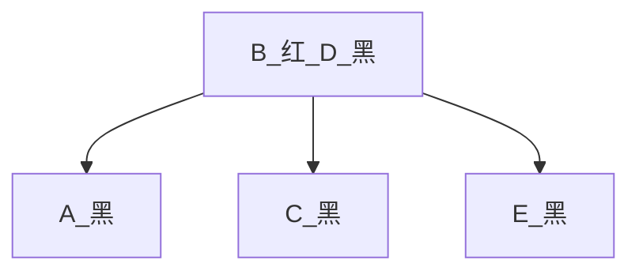

4. 黑

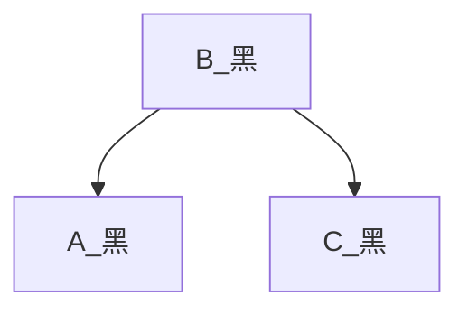

上述四种红黑树如果去除最底层的黑色节点，则对应的`B`树只会生成一个根节点

### 2.2 添加

- `B`树中，新元素必定是添加到叶子节点中
- `4`阶`B`树所有节点的元素个数`x`都符合`1<=x<=3`
- 新添加的节点默认为`RED`，这样能够让红黑树的性质尽快满足

#### 2.2.1 分析

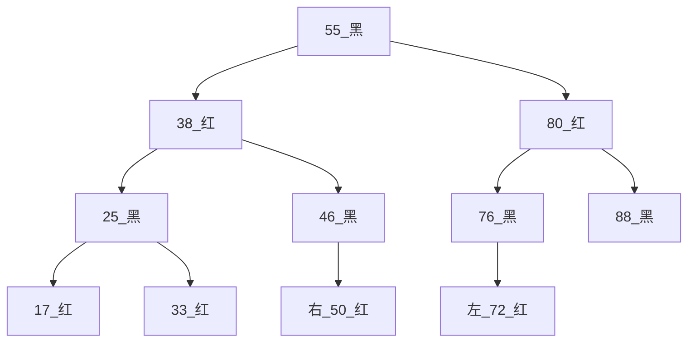

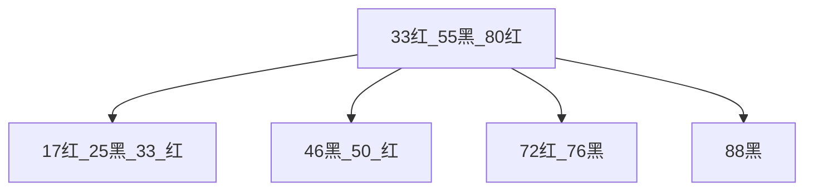

因为`B`树中新添加的节点必定是添加叶子节点，所以分析出所有叶子节点的情况以上四种

则在红黑树中新添加的节点的只有`12`种情况

**为红色节点**

- `17`的左右
- `33`的左右
- `50`的左右
- `72`的左右

**为黑色节点**

- `46`的左
- `76`的右
- `88`的左右

第一种情况添加的节点的`parent`为`BLACK`：`46, 76, 88`红黑树的节点默认为`RED`不需要做任何调整

第二种情况添加的节点的`parent`为`RED`：`17,33,50,72`红黑树的节点需要调整

#### 2.2.2 调整

**情况一LL和RR共二种情况**

添加在`50`的右`52`和`72`的左`60`，对于`B`树而言父节点永远为黑色

46 --> 红，50 --> 黑，38 指向 50

76 --> 红，72 --> 黑，55 指向 72

以上的变换顺序相当于`AVL`树中的`LL/RR`情况，相当于染色之后将`46`左旋转，`76`右旋转

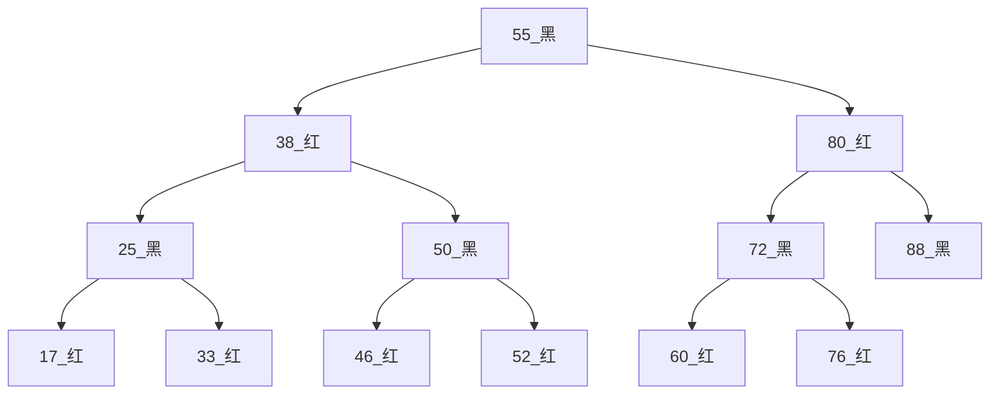

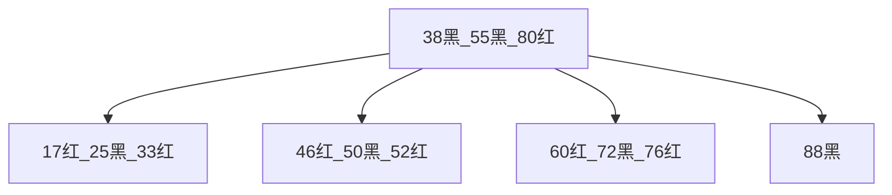

总结：

1. 判定条件：`uncle`不是`RED`
2. `parent`染成`BLACK`，`grand`染成`RED`
3. `grand`进行单旋操作

**情况二LR/RL共8种情况**

添加在`50`的左`48`，添加在`72`的右`74`

48 --> 黑，46 --> 红，38 指向 48，48 指向 46 和 50，同理在`72`的左边添加元素

74 --> 黑，76 --> 红，55 指向 74，74 指向 72 和 76，同理在`50`的右边添加元素

以上的两种情况相当于`AVL`树中`LR/RL`情况

- 相当于染色之后将`50`右旋转，再将`46`左旋转
- 相当于染色之后将`72`左旋转，再将`76`右旋转

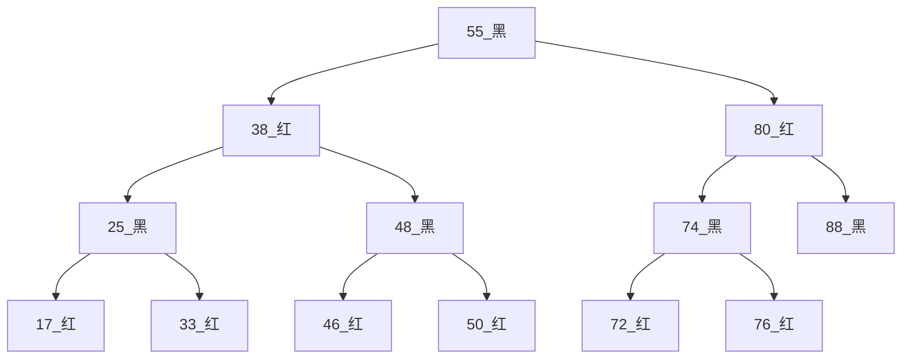

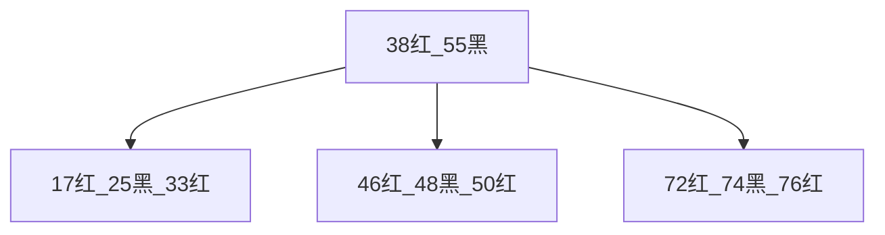

总结：

1. 叔父节点不是`RED`
2. 新添加的节点染成`BLACK`，`grand`染成`RED`
3. 进行双旋操作

`LR`：`parent`左旋转，`grand`右旋转

`RL`：`parent`右旋转，`grand`左旋转

**情况三上溢**

添加一个元素在`17`、`33`的左右，会导致上溢。
假设在`17`的左添加`10`

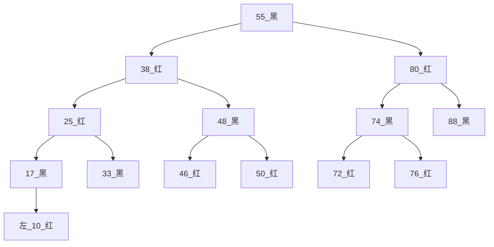

判定条件：`uncle`是`RED`

- `parent`、`uncle`染成`BLACK`
- `grand`向上合并，即将`grand`染成`RED`，当做新添加的节点进行处理
- `grand`向上合并时，可能继续发生上溢
- 若上溢持续到根节点，只需将根节点染成`BLACK`